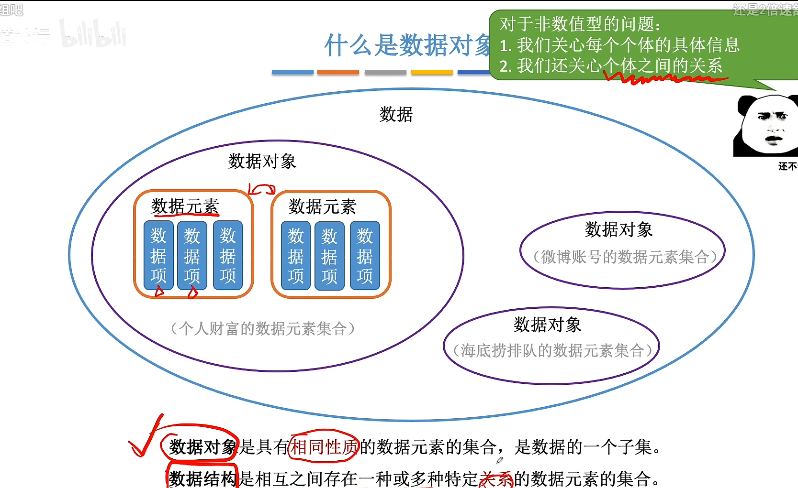
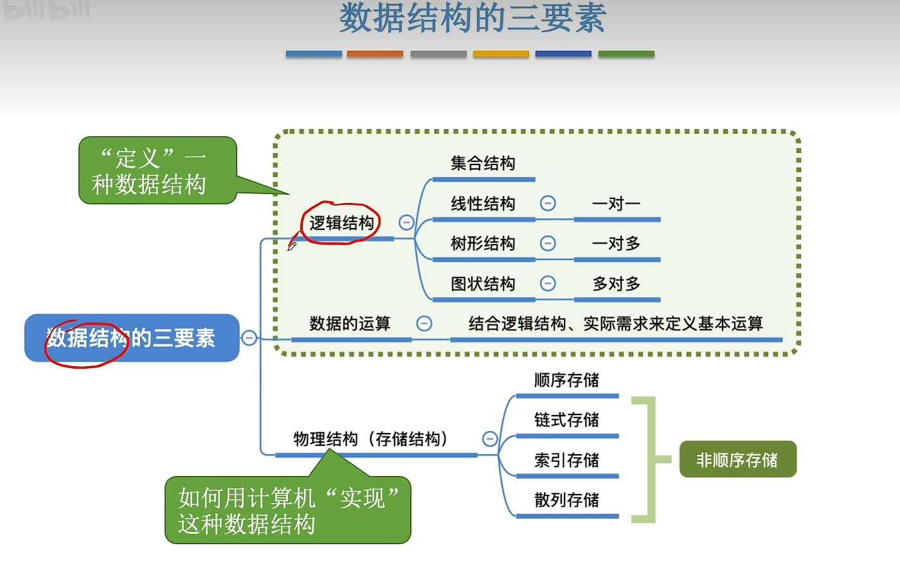
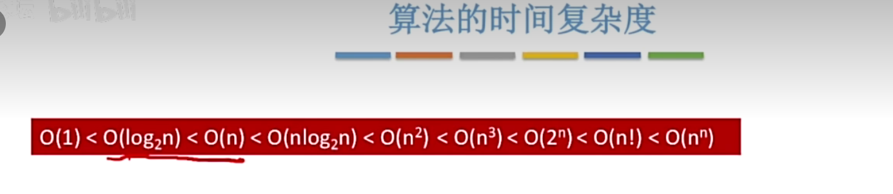
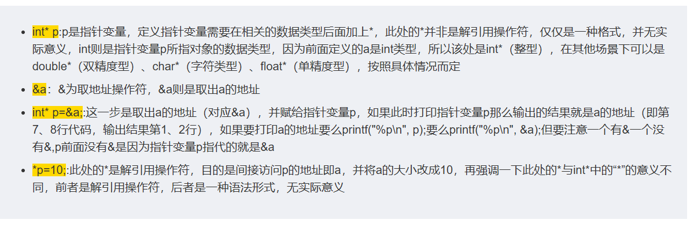
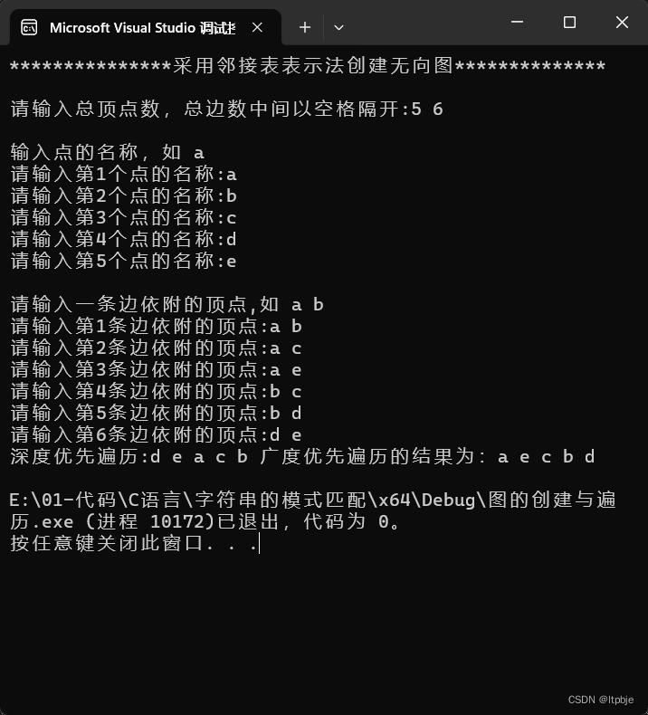

`第二章练习题 2----- (1) 合并两个有序链表(不允许有重复的元素)`

```cpp
#define _CRT_SECURE_NO_WARNINGS 1 
#include<stdio.h> // EOF(=^Z或F6),NULL
#include<stdlib.h> // srand( ) ,rand( ),exit(n)
#include<malloc.h> // malloc( ),alloc( ),realloc( )等
#include<limits.h> // INT_MAX等
#include<string.h>
#include<ctype.h>
#include<math.h> // floor(),ceil( ),abs( )
#include<iostream> // cout,cin
#include<time.h> // clock( )
#define    TRUE          1
#define     FALSE       0 
#define     OK              1
#define     ERROR      0
#define     INFEASIBLE     -1
#define     OVERFLOW     -2 
typedef      int         Status;
typedef      int   ElemType;
#define  MAXSIZE 100     //最大长度
//单链表的存储结构
typedef struct LNode {
	int data;
	struct LNode* next;
}LNode,*LinkList;
//单链表的初始化
Status InitList(LinkList &L) {
	L = new LNode;
	L->next = NULL;
	return OK;
};
//单链表的创建
void CreateList_R(LinkList& L, int n) {
	L = new LNode;
	L->next = NULL;
	LinkList r = L;
	for (int i = 0; i < n; ++i) {
		LinkList p = new LNode;
		printf("输入元素:");
		scanf("%d", &p->data);
		p->next = NULL;
		r->next = p;
		r = p;
	}
};
//查找元素
LNode* LocateElem(LinkList L, ElemType e) {
	LinkList p = L->next;
	while (p && p->data != e) {
		p = p->next;
	};
	return p;
};
//2 --- (1)
void mergeLinkList(LinkList &La,LinkList &Lb, LinkList &Lc) {
		LNode* pa = La->next;
		LNode* pb = Lb->next;
		Lc = La;
		LNode* pc = Lc;
		while (pa&&pb) {
			if (pa->data < pb->data) {
				pc->next = pa;
				pc = pa;
				pa = pa->next;
			}
			else if (pa->data > pb->data) {
				pc->next = pb;
				pc = pb;
				pb = pb->next;
			}
			else {
				pc->next = pa;
				pc = pa;
				pa = pa->next;
				LNode* q = pb->next;
				delete pb;
				pb = q;
			};
		};
		pc->next = pa ? pa : pb;
		delete Lb;
};
void printLinkList(LinkList L) {
	LNode* p = L->next;
	while (p && p->data) {
		printf("%d ",p->data);
		p = p->next;
	};
	printf("\n");
}

int main() {
	LinkList La,Lb,Lc;
	int Na,Nb;
	printf("输入La表的长度");
	scanf("%d", &Na);
	CreateList_R(La, Na);
	printLinkList(La);
	printf("输入Lb表的长度");
	scanf("%d", &Nb);
	CreateList_R(Lb, Nb);
	printLinkList(Lb);
	mergeLinkList(La,Lb,Lc);
	printLinkList(Lc);
}
```
`2  -------(2)合并两个有序链表(保留相同的元素)`

```cpp
#define _CRT_SECURE_NO_WARNINGS 1 
#include<stdio.h> // EOF(=^Z或F6),NULL
#include<stdlib.h> // srand( ) ,rand( ),exit(n)
#include<malloc.h> // malloc( ),alloc( ),realloc( )等
#include<limits.h> // INT_MAX等
#include<string.h>
#include<ctype.h>
#include<math.h> // floor(),ceil( ),abs( )
#include<iostream> // cout,cin
#include<time.h> // clock( )
#define    TRUE          1
#define     FALSE       0 
#define     OK              1
#define     ERROR      0
#define     INFEASIBLE     -1
#define     OVERFLOW     -2 
typedef      int         Status;
typedef      int   ElemType;
#define  MAXSIZE 100     //最大长度
//单链表的存储结构
typedef struct LNode {
	int data;
	struct LNode* next;
}LNode,*LinkList;
//单链表的初始化
Status InitList(LinkList &L) {
	L = new LNode;
	L->next = NULL;
	return OK;
};
//单链表的创建
void CreateList_R(LinkList& L, int n) {
	L = new LNode;
	L->next = NULL;
	LinkList r = L;
	for (int i = 0; i < n; ++i) {
		LinkList p = new LNode;
		printf("输入元素:");
		scanf("%d", &p->data);
		p->next = NULL;
		r->next = p;
		r = p;
	}
};
//查找元素
LNode* LocateElem(LinkList L, ElemType e) {
	LinkList p = L->next;
	while (p && p->data != e) {
		p = p->next;
	};
	return p;
};
//2 -----(2)
void mergeLinkList(LinkList& La, LinkList& Lb, LinkList& Lc) {
	LNode* pa = La->next;
	LNode* pb = Lb->next;
	Lc = La;
	LNode* pc = Lc;
	while (pa && pb) {
		if (pa->data <= pb->data) {
			pc->next = pa;
			pc = pa;
			pa = pa->next;
		}
		else if (pa->data > pb->data) {
			pc->next = pb;
			pc = pb;
			pb = pb->next;
		}
	};
	pc->next = pa ? pa : pb;
	delete Lb;
};
void printLinkList(LinkList L) {
	LNode* p = L->next;
	while (p && p->data) {
		printf("%d ",p->data);
		p = p->next;
	};
	printf("\n");
}

int main() {
	LinkList La,Lb,Lc;
	int Na,Nb;
	printf("输入La表的长度");
	scanf("%d", &Na);
	CreateList_R(La, Na);
	printLinkList(La);
	printf("输入Lb表的长度");
	scanf("%d", &Nb);
	CreateList_R(Lb, Nb);
	printLinkList(Lb);
	mergeLinkList(La,Lb,Lc);
	printLinkList(Lc);
}
```
`2----------(3)保留两个有序链表中相同的元素`
```cpp
#define _CRT_SECURE_NO_WARNINGS 1 
#include<stdio.h> // EOF(=^Z或F6),NULL
#include<stdlib.h> // srand( ) ,rand( ),exit(n)
#include<malloc.h> // malloc( ),alloc( ),realloc( )等
#include<limits.h> // INT_MAX等
#include<string.h>
#include<ctype.h>
#include<math.h> // floor(),ceil( ),abs( )
#include<iostream> // cout,cin
#include<time.h> // clock( )
#define    TRUE          1
#define     FALSE       0 
#define     OK              1
#define     ERROR      0
#define     INFEASIBLE     -1
#define     OVERFLOW     -2 
typedef      int         Status;
typedef      int   ElemType;
#define  MAXSIZE 100     //最大长度
//单链表的存储结构
typedef struct LNode {
	int data;
	struct LNode* next;
}LNode,*LinkList;
//单链表的初始化
Status InitList(LinkList &L) {
	L = new LNode;
	L->next = NULL;
	return OK;
};
//单链表的创建
void CreateList_R(LinkList& L, int n) {
	L = new LNode;
	L->next = NULL;
	LinkList r = L;
	for (int i = 0; i < n; ++i) {
		LinkList p = new LNode;
		printf("输入元素:");
		scanf("%d", &p->data);
		p->next = NULL;
		r->next = p;
		r = p;
	}
};
//查找元素
LNode* LocateElem(LinkList L, ElemType e) {
	LinkList p = L->next;
	while (p && p->data != e) {
		p = p->next;
	};
	return p;
};

//保留两个有序链表中相同的元素
//2----(3)
void findCommon(LinkList&La,LinkList&Lb) {
	LNode* pa = La->next;
	LNode* q;
	LNode* pb = Lb->next;
	LinkList Lc = La;
	LNode* pc = Lc;
	while (pa&&pb)//只要一条链到尾就跳出 
	{
		if (pa->data == pb->data) 
		{
			pc->next = pa;
			pc = pa;
			pa = pa->next;
			q = pb;
			pb = pb->next;
			delete q;
		}
		else if(pa->data < pb->data)
		{
			q = pa;
			pa = pa->next;
			delete q;
		}
		else 
		{
			q = pb;
			pb = pb->next;
			delete q;
		}
	};
	while (pa)
	{
		q = pa;
		pa = pa->next;
		delete q;
	}
	while (pb)
	{
		q = pb;
		pb = pb->next;
		delete q;
	}
	pc->next = NULL;//把新链尾巴置NULL，一定要有，不然在其他操作中报错
};
void printLinkList(LinkList L) {
	LNode* p = L->next;
	while (p && p->data) {
		printf("%d ",p->data);
		p = p->next;
	};
	printf("\n");
}

int main() {
	LinkList La,Lb,Lc;
	int Na,Nb;
	printf("输入La表的长度");
	scanf("%d", &Na);
	CreateList_R(La, Na);
	printLinkList(La);
	printf("输入Lb表的长度");
	scanf("%d", &Nb);
	CreateList_R(Lb, Nb);
	printLinkList(Lb);
	//合并两个有序链表
	//mergeLinkList(La,Lb,Lc);
	findCommon(La, Lb);
	printLinkList(La);
}
```
`--------------(4)仅由在A中出现而不在B中出现的元素所构成的集合`
```cpp
#define _CRT_SECURE_NO_WARNINGS 1 
#include<stdio.h> // EOF(=^Z或F6),NULL
#include<stdlib.h> // srand( ) ,rand( ),exit(n)
#include<malloc.h> // malloc( ),alloc( ),realloc( )等
#include<limits.h> // INT_MAX等
#include<string.h>
#include<ctype.h>
#include<math.h> // floor(),ceil( ),abs( )
#include<iostream> // cout,cin
#include<time.h> // clock( )
#define    TRUE          1
#define     FALSE       0 
#define     OK              1
#define     ERROR      0
#define     INFEASIBLE     -1
#define     OVERFLOW     -2 
typedef      int         Status;
typedef      int   ElemType;
#define  MAXSIZE 100     //最大长度
//单链表的存储结构
typedef struct LNode {
	int data;
	struct LNode* next;
}LNode,*LinkList;
//单链表的初始化
Status InitList(LinkList &L) {
	L = new LNode;
	L->next = NULL;
	return OK;
};
//单链表的创建
void CreateList_R(LinkList& L, int n) {
	L = new LNode;
	L->next = NULL;
	LinkList r = L;
	for (int i = 0; i < n; ++i) {
		LinkList p = new LNode;
		printf("输入元素:");
		scanf("%d", &p->data);
		p->next = NULL;
		r->next = p;
		r = p;
	}
};
//查找元素
LNode* LocateElem(LinkList L, ElemType e) {
	LinkList p = L->next;
	while (p && p->data != e) {
		p = p->next;
	};
	return p;
};
//-----(4)仅由在A中出现而不在B中出现的元素所构成的集合
void difference(LinkList& La, LinkList& Lb) {
	LNode* pa = La->next;  //pa是链表La的工作指针，初始化为首元结点
	LNode* pb = Lb->next;  //pb是链表Lb的工作指针，初始化为首元结点
	LinkList pre = La;	   //pre为La中pa所指结点的前驱结点的指针
	while (pa && pb)//只要一条链到尾就跳出 
	{
		if (pa->data == pb->data)
		{
			pre->next = pa->next;
			LNode* u = pa;
			pa = pa->next;
			delete u;                          //删除结点 
		/*	LNode* q = pa;
			pa = pa->next;
			delete q;
			q = pb;
			pb = pb->next;
			delete q;*/
		
		}else if (pa->data < pb->data)
		{
			pre = pa;
			pa = pa->next;
			/*pc->next = pa;
			pc = pa;
			pa = pa->next;
			LNode* q = pb;
			pb = pb->next;
			delete q;*/
		}else if(pa->data>pb->data)
		{
			pb = pb->next;
			/*LNode* q = pb;
			pb = pb->next;
			delete q;*/
		}
	}
}
	void printLinkList(LinkList L) {
		LNode* p = L->next;
		while (p && p->data) {
			printf("%d ", p->data);
			p = p->next;
		};
		printf("\n");
	};
 
int main() {
	LinkList La,Lb,Lc;
	int Na,Nb;
	printf("输入La表的长度");
	scanf("%d", &Na);
	CreateList_R(La, Na);
	printLinkList(La);
	printf("输入Lb表的长度");
	scanf("%d", &Nb);
	CreateList_R(Lb, Nb);
	printLinkList(Lb);
	//(1)(2)合并两个有序链表
	//mergeLinkList(La,Lb,Lc);
	//(3)保留两个有序链表中相同的元素
	//findCommon(La, Lb);
	//(4)仅由在A中出现而不在B中出现的元素所构成的集合
	difference(La, Lb);
	printLinkList(La);
}
```
`---(5)单链表A分解为两个具有相同结构的链表B和C`
```cpp
#define _CRT_SECURE_NO_WARNINGS 1 
#include<stdio.h> // EOF(=^Z或F6),NULL
#include<stdlib.h> // srand( ) ,rand( ),exit(n)
#include<malloc.h> // malloc( ),alloc( ),realloc( )等
#include<limits.h> // INT_MAX等
#include<string.h>
#include<ctype.h>
#include<math.h> // floor(),ceil( ),abs( )
#include<iostream> // cout,cin
#include<time.h> // clock( )
#define    TRUE          1
#define     FALSE       0 
#define     OK              1
#define     ERROR      0
#define     INFEASIBLE     -1
#define     OVERFLOW     -2 
typedef      int         Status;
typedef      int   ElemType;
#define  MAXSIZE 100     //最大长度
//单链表的存储结构
typedef struct LNode {
	ElemType data;
	struct LNode* next;
}LNode,*LinkList;
//单链表的初始化
Status InitList(LinkList &L) {
	L = new LNode;
	L->next = NULL;
	return OK;
};
//单链表的创建
void CreateList_R(LinkList& L, int n) {
	L = new LNode;
	L->next = NULL;
	LinkList r = L;
	for (int i = 0; i < n; ++i) {
		LinkList p = new LNode;
		printf("输入元素:");
		scanf("%d", &p->data);
		p->next = NULL;
		r->next = p;
		r = p;
	}
};
//查找元素
LNode* LocateElem(LinkList L, ElemType e) {
	LinkList p = L->next;
	while (p && p->data != e) {
		p = p->next;
	};
	return p;
};

//-------------(5)单链表A分解为两个具有相同结构的链表B和C
void splitLinkList(LinkList &La,LinkList &Lb,LinkList &Lc) {
	LinkList pa, pb, pc, q, r;
	Lb = La;
	Lb->next = NULL;//Lb 表初始化
	Lc = new LNode;//为Lc申请结点空间
	Lc->next = NULL;//Lc初始化为空表
	pa = La->next;
	while (pa)
	{
		r = pa->next;
		if (pa->data < 0)
		{
			pa->next = Lb->next;//将小于0的结点链入 Lb 表,前插法
			Lb->next = pa;
		}
		else
		{
			pa->next = Lc->next;//将大于0的结点链入 Lc 表,前插法
			Lc->next = pa;
		}
		pa = r;
	}
	
	
};
	void printLinkList(LinkList L) {
		LNode* p = L->next;
		while (p && p->data) {
			printf("%d ", p->data);
			p = p->next;
		};
		printf("\n");
	};
 
int main() {
	LinkList La,Lb,Lc;
	int Na,Nb;
	
	printf("输入La表的长度");
	scanf("%d", &Na);
	CreateList_R(La, Na);
	printLinkList(La);
	/*printf("输入Lb表的长度");
	scanf("%d", &Nb);
	CreateList_R(Lb, Nb);
	printLinkList(Lb);*/

	//(1)(2)合并两个有序链表
	//mergeLinkList(La,Lb,Lc);
	
	//(3)保留两个有序链表中相同的元素
	//findCommon(La, Lb);
	
	//(4)仅由在A中出现而不在B中出现的元素所构成的集合
	//difference(La, Lb);

	splitLinkList(La, Lb, Lc);
	//printLinkList(La);
	printLinkList(Lb);
	//printLinkList(Lc);
}
```

`(6)确定单链表中值最大的结点`

```cpp
#define _CRT_SECURE_NO_WARNINGS 1 
#include<stdio.h> // EOF(=^Z或F6),NULL
#include<stdlib.h> // srand( ) ,rand( ),exit(n)
#include<malloc.h> // malloc( ),alloc( ),realloc( )等
#include<limits.h> // INT_MAX等
#include<string.h>
#include<ctype.h>
#include<math.h> // floor(),ceil( ),abs( )
#include<iostream> // cout,cin
#include<time.h> // clock( )
#define    TRUE          1
#define     FALSE       0 
#define     OK              1
#define     ERROR      0
#define     INFEASIBLE     -1
#define     OVERFLOW     -2 
typedef      int         Status;
typedef      int   ElemType;
#define  MAXSIZE 100     //最大长度
//单链表的存储结构
typedef struct LNode {
	ElemType data;
	struct LNode* next;
}LNode,*LinkList;
//单链表的初始化
Status InitList(LinkList &L) {
	L = new LNode;
	L->next = NULL;
	return OK;
};
//单链表的创建
void CreateList_R(LinkList& L, int n) {
	L = new LNode;
	L->next = NULL;
	LinkList r = L;
	for (int i = 0; i < n; ++i) {
		LinkList p = new LNode;
		printf("输入元素:");
		scanf("%d", &p->data);
		p->next = NULL;
		r->next = p;
		r = p;
	}
};
//查找元素
LNode* LocateElem(LinkList L, ElemType e) {
	LinkList p = L->next;
	while (p && p->data != e) {
		p = p->next;
	};
	return p;
};
//-------------(6)确定单链表中值最大的结点
ElemType Max(LinkList L) {
	if (L->next == NULL)
		return NULL;
	LNode* pmax = L->next;
	LNode* p = L->next->next;
	LNode* q;
	while (p)
	{
		if (pmax->data < p->data)
		{
			pmax = p; // pmax指向数值大的结点
		}
		p = p->next;//p指向下一个结点，继续遍历
	}
	return pmax->data;
}

void printLinkList(LinkList L) {
	LNode* p = L->next;
	while (p && p->data) {
		printf("%d ", p->data);
		p = p->next;
	};
	printf("\n");
};
 
int main() {
	LinkList La,Lb,Lc;
	int Na,Nb;
	printf("输入La表的长度");
	scanf("%d", &Na);
	CreateList_R(La, Na);
	printLinkList(La);
	/*printf("输入Lb表的长度");
	scanf("%d", &Nb);
	CreateList_R(Lb, Nb);
	printLinkList(Lb);*/

	//(1)(2)合并两个有序链表
	//mergeLinkList(La,Lb,Lc);
	
	//(3)保留两个有序链表中相同的元素
	//findCommon(La, Lb);
	
	//(4)仅由在A中出现而不在B中出现的元素所构成的集合
	//difference(La, Lb);

	//(5)单链表A分解为两个具有相同结构的链表B和C
	//splitLinkList(La, Lb, Lc);
	//printLinkList(La);
	//printLinkList(Lb);
	//printLinkList(Lc);

	//(6)确定单链表中值最大的结点
	ElemType max;
	max = Max(La);
	printf("%d \n",max);
}
```

`(7)逆置带头结点的单链表L(头插法)`

```cpp
#define _CRT_SECURE_NO_WARNINGS 1 
#include<stdio.h> // EOF(=^Z或F6),NULL
#include<stdlib.h> // srand( ) ,rand( ),exit(n)
#include<malloc.h> // malloc( ),alloc( ),realloc( )等
#include<limits.h> // INT_MAX等
#include<string.h>
#include<ctype.h>
#include<math.h> // floor(),ceil( ),abs( )
#include<iostream> // cout,cin
#include<time.h> // clock( )
#define    TRUE          1
#define     FALSE       0 
#define     OK              1
#define     ERROR      0
#define     INFEASIBLE     -1
#define     OVERFLOW     -2 
typedef      int         Status;
typedef      int   ElemType;
#define  MAXSIZE 100     //最大长度
//单链表的存储结构
typedef struct LNode {
	ElemType data;
	struct LNode* next;
}LNode,*LinkList;
//单链表的初始化
Status InitList(LinkList &L) {
	L = new LNode;
	L->next = NULL;
	return OK;
};
//单链表的创建
void CreateList_R(LinkList& L, int n) {
	L = new LNode;
	L->next = NULL;
	LinkList r = L;
	for (int i = 0; i < n; ++i) {
		LinkList p = new LNode;
		printf("输入元素:");
		scanf("%d", &p->data);
		p->next = NULL;
		r->next = p;
		r = p;
	}
};
//查找元素
LNode* LocateElem(LinkList L, ElemType e) {
	LinkList p = L->next;
	while (p && p->data != e) {
		p = p->next;
	};
	return p;
};
//(7)逆置带头结点的单链表L(头插法)
void inverse(LinkList& L)
{
	LNode* q;
	LNode* p = L->next ;//p 指向首元结点
	L->next = NULL; //头结点的指针域置为空
	while (p)
	{
		q = p->next;
		p->next = L->next;
		L->next = p;
		p = q;
	}
}

void printLinkList(LinkList L) {
	LNode* p = L->next;
	while (p && p->data) {
		printf("%d ", p->data);
		p = p->next;
	};
	printf("\n");
};
 
int main() {
	LinkList La,Lb,Lc;
	int Na,Nb;
	printf("输入La表的长度");
	scanf("%d", &Na);
	CreateList_R(La, Na);
	printLinkList(La);
	//(7)逆转链表
	inverse(La);
	printLinkList(La);
}
```

`(8)删除递增有序链表L中值大于mink 且小于maxk的所有元素`

```cpp
#define _CRT_SECURE_NO_WARNINGS 1 
#include<stdio.h> // EOF(=^Z或F6),NULL
#include<stdlib.h> // srand( ) ,rand( ),exit(n)
#include<malloc.h> // malloc( ),alloc( ),realloc( )等
#include<limits.h> // INT_MAX等
#include<string.h>
#include<ctype.h>
#include<math.h> // floor(),ceil( ),abs( )
#include<iostream> // cout,cin
#include<time.h> // clock( )
#define    TRUE          1
#define     FALSE       0 
#define     OK              1
#define     ERROR      0
#define     INFEASIBLE     -1
#define     OVERFLOW     -2 
typedef      int         Status;
typedef      int   ElemType;
#define  MAXSIZE 100     //最大长度
//单链表的存储结构
typedef struct LNode {
	ElemType data;
	struct LNode* next;
}LNode,*LinkList;
//单链表的初始化
Status InitList(LinkList &L) {
	L = new LNode;
	L->next = NULL;
	return OK;
};
//单链表的创建
void CreateList_R(LinkList& L, int n) {
	L = new LNode;
	L->next = NULL;
	LinkList r = L;
	for (int i = 0; i < n; ++i) {
		LinkList p = new LNode;
		printf("输入元素:");
		scanf("%d", &p->data);
		p->next = NULL;
		r->next = p;
		r = p;
	}
};
//查找元素
LNode* LocateElem(LinkList L, ElemType e) {
	LinkList p = L->next;
	while (p && p->data != e) {
		p = p->next;
	};
	return p;
};
//(8)删除递增有序链表L中值大于mink 且小于maxk的所有元素
void deleteMinMax(LinkList &L,ElemType mink,ElemType maxk)
{
	LNode* p = L->next;
	LNode* pre = p;
	while (p && p->data <= mink)
	{
		pre = p;
		p = p->next;
	};
	while (p && p->data < maxk)//查找第一个值大于等于maxk 的结点
	{
		p = p->next;
	};
	LNode* q = pre->next;
	pre->next = p;//修改待删除结点的指针
	while (q != p) //依次释放待删除结点的空间
	{
		LNode* s = q->next;
		delete q;
		q = s;
	};
}
void printLinkList(LinkList L) {
	LNode* p = L->next;
	while (p && p->data) {
		printf("%d ", p->data);
		p = p->next;
	};
	printf("\n");
};
 
int main() {
	LinkList La,Lb,Lc;
	int Na,Nb;
	printf("输入La表的长度");
	scanf("%d", &Na);
	CreateList_R(La, Na);
	printLinkList(La);
	//(8)删除递增有序链表L中值大于mink 且小于maxk的所有元素
	deleteMinMax(La, 2, 4);
	printLinkList(La);
}
```

`(9)在双向循环链表，交换 p 所指向的结点及其前驱结点的顺序`

```cpp
#define _CRT_SECURE_NO_WARNINGS 1 
#include<stdio.h> // EOF(=^Z或F6),NULL
#include<stdlib.h> // srand( ) ,rand( ),exit(n)
#include<malloc.h> // malloc( ),alloc( ),realloc( )等
#include<limits.h> // INT_MAX等
#include<string.h>
#include<ctype.h>
#include<math.h> // floor(),ceil( ),abs( )
#include<iostream> // cout,cin
#include<time.h> // clock( )
#define    TRUE          1
#define     FALSE       0 
#define     OK              1
#define     ERROR      0
#define     INFEASIBLE     -1
#define     OVERFLOW     -2 
typedef      int         Status;
typedef      int   ElemType;
#define  MAXSIZE 100     //最大长度
//单链表的存储结构
typedef struct LNode {
	ElemType data;
	struct LNode* next;
}LNode,*LinkList;
typedef struct DuLNode
{
	ElemType data;				//数据域
	struct DuLNode* prior;		//指向直接前驱
	struct DuLNode* next;		//指向直接后继
}DuLNode,*DuLinkList;
Status InitDiLinkList(DuLinkList& L)
{
	L = new DuLNode;
	L->next = NULL;
	L->prior = NULL;
	return OK;
}
//单链表的初始化
Status InitList(LinkList &L) {
	L = new LNode;
	L->next = NULL;
	return OK;
};
//单链表的创建
void CreateList_R(LinkList& L, int n) {
	L = new LNode;
	L->next = NULL;
	LinkList r = L;
	for (int i = 0; i < n; ++i) {
		LinkList p = new LNode;
		printf("输入元素:");
		scanf("%d", &p->data);
		p->next = NULL;
		r->next = p;
		r = p;
	}
};
//查找元素
LNode* LocateElem(LinkList L, ElemType e) {
	LinkList p = L->next;
	while (p && p->data != e) {
		p = p->next;
	};
	return p;
};
//(9)在双向循环链表，交换 p 所指向的结点及其前驱结点的顺序
void Exchange(DuLinkList p)
{
	DuLNode* q = p->prior;
	q->prior->next = p;
	p->prior = q->prior;
	q->next = p->next;
	q->prior = p; 
	p->next->prior = q;
	p->next = q;
}
void printLinkList(LinkList L) {
	LNode* p = L->next;
	while (p && p->data) {
		printf("%d ", p->data);
		p = p->next;
	};
	printf("\n");
};
 
int main() {
	LinkList La,Lb,Lc;
	DuLinkList DLa;
	int Na,Nb;
	printf("输入La表的长度");
	scanf("%d", &Na);
	CreateList_R(La, Na);
	printLinkList(La);
	//(9)在双向循环链表，交换 p 所指向的结点及其前驱结点的顺序
	Exchange(DLa);
}
```

`(10)删除顺序表A 中所有值为 item 的元素`

```cpp
#define _CRT_SECURE_NO_WARNINGS 1 
#include<stdio.h> // EOF(=^Z或F6),NULL
#include<stdlib.h> // srand( ) ,rand( ),exit(n)
#include<malloc.h> // malloc( ),alloc( ),realloc( )等
#include<limits.h> // INT_MAX等
#include<string.h>
#include<ctype.h>
#include<math.h> // floor(),ceil( ),abs( )
#include<iostream> // cout,cin
#include<time.h> // clock( )
#define    TRUE          1
#define     FALSE       0 
#define     OK              1
#define     ERROR      0
#define     INFEASIBLE     -1
#define     OVERFLOW     -2 
typedef      int         Status;
typedef      int   ElemType;
#define  MAXSIZE 100     //最大长度
typedef  struct
{
	ElemType* elem;     //指向数据元素的基地址
	int  length;          //线性表的当前长度                                                      
}SqList;
Status InitList_Sq(SqList& L)
{    //构造一个空的顺序表L
	L.elem = new ElemType[MAXSIZE];  //为顺序表分配空间
	if (!L.elem) exit(OVERFLOW);       //存储分配失败
	L.length = 0;				 //空表长度为0
	return OK;
};

//单链表的存储结构
typedef struct LNode {
	ElemType data;
	struct LNode* next;
}LNode,*LinkList;
typedef struct DuLNode
{
	ElemType data;				//数据域
	struct DuLNode* prior;		//指向直接前驱
	struct DuLNode* next;		//指向直接后继
}DuLNode,*DuLinkList;
Status InitDiLinkList(DuLinkList& L)
{
	L = new DuLNode;
	L->next = NULL;
	L->prior = NULL;
	return OK;
}
//单链表的初始化
Status InitList(LinkList &L) {
	L = new LNode;
	L->next = NULL;
	return OK;
};
//单链表的创建
void CreateList_R(LinkList& L, int n) {
	L = new LNode;
	L->next = NULL;
	LinkList r = L;
	for (int i = 0; i < n; ++i) {
		LinkList p = new LNode;
		printf("输入元素:");
		scanf("%d", &p->data);
		p->next = NULL;
		r->next = p;
		r = p;
	}
};
//查找元素
LNode* LocateElem(LinkList L, ElemType e) {
	LinkList p = L->next;
	while (p && p->data != e) {
		p = p->next;
	};
	return p;
};
//(10)删除顺序表A 中所有值为 item 的元素
void DeleteItem(SqList &A,ElemType item)
{
	int k = 0;
	for (int i = 0; i < A.length; i++)
	{
		if (A.elem[i] != item)
		{
			A.elem[k] = A.elem[i];
			k++;
		}
	}
	A.length = k;
};
void printLinkList(LinkList L) {
	LNode* p = L->next;
	while (p && p->data) {
		printf("%d ", p->data);
		p = p->next;
	};
	printf("\n");
};
 
int main() {
	SqList A;
	LinkList La,Lb,Lc;
	DuLinkList DLa;
	int Na,Nb;
	printf("输入La表的长度");
	scanf("%d", &Na);
	CreateList_R(La, Na);
	printLinkList(La);
	//(10)删除顺序表A 中所有值为 item 的元素
	DeleteItem(A,10);
}
```

*S.Top++=e;虽然++[优先级](https://so.csdn.net/so/search?q=优先级&spm=1001.2101.3001.7020)比*高，但是它是后置自加，所以它是先把e存储到栈顶，然后指针上移； e=*--S.Top;这儿是前置，那么和*比较优先级，自然是--高，那么先下移指针，再把指针指向的东西赋给e；

<table border="1">
<caption>
表2 运算符优先级和结合律</caption>
<tbody>
<tr>
<th>
优先级</th>
<th colspan="2" rowspan="1">
运算符</th>
<th rowspan="1">
结合律</th>
</tr>
<tr>
<th>
1</th>
<td colspan="2" rowspan="1">
后缀运算符：[] &nbsp; &nbsp;() &nbsp; &nbsp;· &nbsp; &nbsp;-&gt; &nbsp; &nbsp;++ &nbsp; &nbsp;--(类型名称){列表}</td>
<td rowspan="1">
从左到右</td>
</tr>
<tr>
<th>
2</th>
<td colspan="2" rowspan="1">
一元运算符：<sub>++ &nbsp; &nbsp;-- &nbsp;&nbsp;</sub>&nbsp;! &nbsp; &nbsp;~ &nbsp; &nbsp;+ &nbsp; &nbsp;- &nbsp; &nbsp;* &nbsp; &nbsp;&amp; &nbsp; &nbsp;sizeof_Alignof</td>
<td rowspan="1">
从右到左</td>
</tr>
<tr>
<th>
3</th>
<td colspan="2" rowspan="1">
类型转换运算符：(类型名称)</td>
<td rowspan="1">
从右到左</td>
</tr>
<tr>
<th>
4</th>
<td colspan="2" rowspan="1">
乘除法运算符：* &nbsp; &nbsp;/ &nbsp; &nbsp;%</td>
<td rowspan="1">
从左到右</td>
</tr>
<tr>
<th>
5</th>
<td colspan="2" rowspan="1">
加减法运算符：+ &nbsp; &nbsp;-</td>
<td rowspan="1">
从左到右</td>
</tr>
<tr>
<th>
6</th>
<td colspan="2" rowspan="1">
移位运算符：&lt;&lt; &nbsp; &nbsp;&gt;&gt;</td>
<td rowspan="1">
从左到右</td>
</tr>
<tr>
<th>
7</th>
<td colspan="2" rowspan="1">
关系运算符：&lt;&lt;= &nbsp; &nbsp;&gt;&gt;=</td>
<td rowspan="1">
从左到右</td>
</tr>
<tr>
<th>
8</th>
<td colspan="2" rowspan="1">
相等运算符：== &nbsp; &nbsp;!=</td>
<td rowspan="1">
从左到右</td>
</tr>
<tr>
<th>
9</th>
<td colspan="2" rowspan="1">
位运算符 AND：&amp;</td>
<td rowspan="1">
从左到右</td>
</tr>
<tr>
<th>
10</th>
<td colspan="2" rowspan="1">
位运算符 XOR：^</td>
<td rowspan="1">
从左到右</td>
</tr>
<tr>
<th>
11</th>
<td colspan="2" rowspan="1">
位运算符 OR：|</td>
<td rowspan="1">
从左到右</td>
</tr>
<tr>
<th>
12</th>
<td colspan="2" rowspan="1">
逻辑运算符 AND：&amp;&amp;</td>
<td rowspan="1">
从左到右</td>
</tr>
<tr>
<th>
13</th>
<td colspan="2" rowspan="1">
逻辑运算符 OR：||</td>
<td rowspan="1">
从左到右</td>
</tr>
<tr>
<th>
14</th>
<td colspan="2" rowspan="1">
条件运算符：?:</td>
<td rowspan="1">
从右到左</td>
</tr>
<tr>
<th>
15</th>
<td colspan="2" rowspan="1">
赋值运算符：<br>
&nbsp; &nbsp; &nbsp;= &nbsp; &nbsp; &nbsp; &nbsp; += &nbsp; &nbsp; &nbsp; &nbsp;-= &nbsp; &nbsp; &nbsp; *= &nbsp; &nbsp; &nbsp; /= &nbsp; &nbsp; &nbsp;%= &nbsp; &nbsp; &nbsp; &amp;= &nbsp; &nbsp; &nbsp; ^= &nbsp; &nbsp; &nbsp;|= &nbsp;&nbsp;<br>
&nbsp; &nbsp;&lt;&lt;= &nbsp; &nbsp; &nbsp;&gt;&gt;=</td>
<td rowspan="1">
从右到左</td>
</tr>
<tr>
<th>
16</th>
<td colspan="2" rowspan="1">
逗号运算符：，</td>
<td rowspan="1">
从左到右</td>
</tr>
</tbody>
</table>


int* p:p是指针变量，定义指针变量需要在相关的数据类型后面加上*，此处的*并非是解引用操作符，仅仅是一种格式，并无实际意义，int则是指针变量p所指对象的数据类型，因为前面定义的a是int类型，所以该处是int*（整型），在其他场景下可以是double*（双精度型）、char*（字符类型）、float*（单精度型），按照具体情况而定
————————————————
版权声明：本文为CSDN博主「PH_modest」的原创文章，遵循CC 4.0 BY-SA版权协议，转载请附上原文出处链接及本声明。
原文链接：https://blog.csdn.net/PH_modest/article/details/126533412

- &a：&为取地址操作符，&a则是取出a的地址

int* p=&a;:这一步是取出a的地址（对应&a），并赋给指针变量p，如果此时打印指针变量p那么输出的结果就是a的地址（即第7、8行代码，输出结果第1、2行），如果要打印a的地址要么printf("%p\n", p);要么printf("%p\n", &a);但要注意一个有&一个没有&,p前面没有&是因为指针变量p指代的就是&a


————————————————
版权声明：本文为CSDN博主「PH_modest」的原创文章，遵循CC 4.0 BY-SA版权协议，转载请附上原文出处链接及本声明。
[原文链接](https://blog.csdn.net/PH_modest/article/details/126533412)




## 一、	线性表的顺序、链式存储结构的实现（4学时，验证性实验）
### 1．线性表的顺序存储结构
```cpp
#define _CRT_SECURE_NO_WARNINGS 1 
#include<stdio.h> // EOF(=^Z或F6),NULL
#include<stdlib.h> // srand( ) ,rand( ),exit(n)
#include<malloc.h> // malloc( ),alloc( ),realloc( )等
#include<limits.h> // INT_MAX等
#include<string.h>
#include<ctype.h>
#include<math.h> // floor(),ceil( ),abs( )
#include<iostream> // cout,cin
#include<time.h> // clock( )
#define    TRUE          1
#define     FALSE       0 
#define     OK              1
#define     ERROR      0
#define     INFEASIBLE     -1
#define     OVERFLOW     -2 
typedef      int         Status; 
typedef      int   ElemType;
#define  MAXSIZE 100     //最大长度
typedef  struct
{  
	ElemType  *elem;     //指向数据元素的基地址
    int  length;          //线性表的当前长度                                                      
}SqList;
Status InitList_Sq(SqList &L)
{    //构造一个空的顺序表L
    L.elem=new ElemType[MAXSIZE];  //为顺序表分配空间
    if(!L.elem) exit(OVERFLOW);       //存储分配失败
    L.length=0;				 //空表长度为0
    return OK;
};

Status GetElem(SqList L, int i)
{  if (i<1||i>L.length) return ERROR;   
   //判断i值是否合理，若不合理，返回ERROR
   int e;
   e=L.elem[i-1];//第i-1的单元存储着第i个数据
   printf("\n%d\n",e);
   return OK;
};


int LocateELem(SqList L,ElemType e)
{   int i;
	for (i=0;i< L.length;i++)
         if (L.elem[i]==e) return i+1;                
    return 0;
};

Status ListInsert_Sq(SqList &L,int i ,ElemType e)
{   int j;
	if(i<1 || i>L.length+1) return ERROR;	         //i值不合法
    if(L.length==MAXSIZE) return ERROR;    //当前存储空间已满     
    for(j=L.length-1;j>=i-1;j--) 
          L.elem[j+1]=L.elem[j];    //插入位置及之后的元素后移
    L.elem[i-1]=e;                        //将新元素e放入第i个位置
    ++L.length;		     	//表长增1
    return OK;
};
Status print_Sq(SqList L)
{ 
  int i;
  printf("\n线性表表中元素如下： ");
  for(i=0;i<L.length;i++) printf("%d ",L.elem[i]);
  printf("\n");
  return OK;
};


Status create_Sq(SqList &L,int n)
{ int i,e;
  for(i=0;i<n;i++)
     { printf("输入表中元素：");
	   scanf("%d",&e);
       ListInsert_Sq(L,i+1,e);
      }
  return OK;
 };
Status ListDelete_Sq(SqList& L, int i)
{
    int j;
    if ((i < 1) || (i > L.length)) return ERROR;//i值不合法
    int get = L.elem[i - 1];
    for (j = i; j < L.length; j++) {
        L.elem[j - 1] = L.elem[j];
    };
    --L.length; //表长减1
    print_Sq(L);
    printf("\n");
    printf("%d", get);
    return OK;
}
void GetElemFn(SqList L) {
    int i;
    printf("查找那个位置的元素:");
    scanf("%d", &i);
    GetElem(L, i);
};
//（3）插入元素功能
void insertItem(SqList &L) {
    int i;
    int x;
    printf("插入数字插入到第几个元素前:");
    scanf("%d", &i);
    printf("\n插入的数字:");
    scanf("%d", &x);
    ListInsert_Sq(L, i, x);
    print_Sq(L);
};
//（4）删除元素功能
void delItem(SqList &L) {
    int del_i;
    printf("删除第几个元素");
    scanf("%d", &del_i);
    ListDelete_Sq(L, del_i);
    /*print_Sq(L);
    printf("\n");
    printf("%d", get);*/
};
//（5）查找指定元素e是否在线性表中存在，若存在返回此元素的位序，否则返回0；
void checkItemFn(SqList L) {
    int checkItem;
    printf("输入要查找的元素:");
    scanf("%d", &checkItem);
    int locateIndex = LocateELem(L, checkItem);
    if (locateIndex) {
        printf("%d\n", locateIndex);
    }
    else {
        printf("找不到该元素\n");
    };
};
void printMenu(int &i) {
    printf("1.创建线性表请输入---1\n2.插入元素请输入---2\n3.删除元素请输入---3\n4.查找元素并返回查找元素位置请输入---4\n5.查找元素并返回查找元素请输入---5\n6.输出线性表中的所有元素请输入---6\n7.退出程序输入---7\n");
    scanf("%d",&i);
};
int main()
{
    SqList L;
    int n;
    int i = 0;
    /*int i;
    int x;
    int del_i;
    int get;*/
    //（1）初始化一个线性表
    InitList_Sq(L);
    printf("输入线性表的表长:");
    scanf("%d", &n);
    create_Sq(L, n);
    print_Sq(L);
    while (1) {
    printMenu(i);
    if (i == 7) {
        return 0;
    };
        switch (i)
        {
        case 1: //（2）创建一个包含n个正整数值的线性表（线性表的长度n和表中元素的值随机输入）；
            //InitList_Sq(L);
            //create_Sq(L, n);
            print_Sq(L);
            break;
            //（3）将一个数x插在第i个元素前（x和i在程序运行时输入）
        case 2:
            insertItem(L);
            break;
        case 3:
            //（4）删除第i个元素（i在程序运行时输入），并在删除结束后输出删除元素的值
            delItem(L);
           /* int del_i;
            printf("删除第几个元素");
            scanf("%d", &del_i);
            ListDelete_Sq(L, del_i);*/
            break;
        case 4:
            //（5）查找指定元素e是否在线性表中存在，若存在返回此元素的位序，否则返回0；
            checkItemFn(L);
            break;
        case 5:
            //（6）查找指定位置元素的值并输出；
            GetElemFn(L);
            break;
        case 6:
            //（7）输出线性表中所有元素。
            print_Sq(L);
            break;
        }
    }
}
```

### 2．线性表的链式存储结构
```c
#define _CRT_SECURE_NO_WARNINGS 1 
#include<stdio.h> // EOF(=^Z或F6),NULL
#include<stdlib.h> // srand( ) ,rand( ),exit(n)
#include<malloc.h> // malloc( ),alloc( ),realloc( )等
#include<limits.h> // INT_MAX等
#include<string.h>
#include<ctype.h>
#include<math.h> // floor(),ceil( ),abs( )
#include<iostream> // cout,cin
#include<time.h> // clock( )
#define    TRUE          1
#define     FALSE       0 
#define     OK              1
#define     ERROR      0
#define     INFEASIBLE     -1
#define     OVERFLOW     -2 
typedef      int         Status;
typedef      int   ElemType;
#define  MAXSIZE 100     //最大长度
//单链表的存储结构
typedef struct LNode {
	int data;
	struct LNode* next;
}LNode, * LinkList;
//单链表的初始化（1）初始化一个线性表
Status InitList(LinkList& L) {
	L = new LNode;
	L->next = NULL;
	return OK;
};
//单链表的创建（2）创建一个包含n个正整数值的线性表（线性表的长度n和表中元素的值随机输入）；
void CreateList_R(LinkList& L, int n) {
	L = new LNode;
	L->next = NULL;
	LinkList r = L;
	for (int i = 0; i < n; ++i) {
		LinkList p = new LNode;
		printf("输入元素:");
		scanf("%d", &p->data);
		p->next = NULL;
		r->next = p;
		r = p;
	}
};
//（3）将一个数x插在第i个元素前(x和i在程序运行时随机输入);
void insertElem(LinkList& L, ElemType x, ElemType i) {
	LNode* p = L->next;// p为工作结点
	LNode* q = L;      //q为p的前驱结点
	int n = 1; //记录长度
	while (p && n < i)
	{
		q = p;
		p = p->next;
		n++;
	};
	LNode* r = new LNode;//创建 r结点 
	r->data = x;//为 r 结点数据域赋值
	r->next = p;
	q->next = r;
}
//（4）删除第i个元素（i在程序运行时输入），并在删除结束后输出删除元素的值；
void delItem(LinkList& L, ElemType i, ElemType& e)
{
	LNode* p = L->next;// p为工作结点
	LNode* q = L;      //q为p的前驱结点
	int n = 1; //记录长度
	while (p && n < i)
	{
		q = p;
		p = p->next;
		n++;
	};
	e = p->data;
	LNode* d = p;
	q->next = p->next;
	delete d;
};
//（5）查找指定元素e是否在线性表中存在，若存在返回此元素的位序，否则返回0；
int FindElem(LinkList L, ElemType e) {
	LinkList p = L->next;
	int n = 1;
	while (p && p->data != e) {
		p = p->next;
		n++;
	};
	if (!p) return 0;
	return n;
};
//（6）查找指定位置元素的值并输出；
void getItem(LinkList L, ElemType i)
{
	LinkList p = L->next;
	int n = 1;
	while (p && n < i) {
		p = p->next;
		n++;
	};
	if (p)
	{
		printf("该元素为:%d\n", p->data);
	}
	else {
		printf("输入位置错误\n");
	}
}

//查找元素
LNode* LocateElem(LinkList L, ElemType e) {
	LinkList p = L->next;
	while (p && p->data != e) {
		p = p->next;
	};
	return p;
};
void printLinkList(LinkList L) {
	LNode* p = L->next;
	while (p && p->data) {
		printf("%d ", p->data);
		p = p->next;
	};
	printf("\n");
}

int main() {
	LinkList La, Lb, Lc;
	int Na, Nb;
	int sel;
	printf("输入La表的长度");
	scanf("%d", &Na);
	CreateList_R(La, Na);
	printLinkList(La);
	printf(" (1).初始化一个线性表\n (2).创建一个包含n个正整数值的线性表（线性表的长度n和表中元素的值随机输入）\n（3）将一个数x插在第i个元素前（x和i在程序运行时随机输入）；\n（4）删除第i个元素（i在程序运行时输入），并在删除结束后输出删除元素的值；\n（5）查找指定元素e是否在线性表中存在，若存在返回此元素的位序，否则返回0；\n（6）查找指定位置元素的值并输出；\n（7）输出线性表中所有元素。\n请选择:");
	scanf("%d",&sel);
	switch (sel)
	{
	case 1:
	{
		InitList(La);
		break;
	}
	case 2:
	{
		LinkList L;
		int n;
		printf("输入La表的长度");
		scanf("%d", &n);
		CreateList_R(L, n);
		break;
	}
	case 3:
	{
		//（3）将一个数x插在第i个元素前（x和i在程序运行时随机输入）；
		int x = 0, i = 0;
		printf("将一个数x插在第i个元素前 x i:");
		scanf("%d %d", &x, &i);
		insertElem(La, x, i);
		printLinkList(La);
		break;
	}
	case 4:
	{
		//（4）删除第i个元素（i在程序运行时输入），并在删除结束后输出删除元素的值；
		int e = 0;
		printf("删除第几个元素：");
		int i;
		scanf("%d", &i);
		delItem(La, i, e);
		printLinkList(La);
		printf("删除元素的值为:%d\n", e);
		break;
	}
	case 5:
	{
		//（5）查找指定元素e是否在线性表中存在，若存在返回此元素的位序，否则返回0；
		int i;
		printf("输入要查找的元素:");
		scanf("%d", &i);
		int res = FindElem(La, i);
		if (res)printf("此元素的位序为:%d\n", res);
		else  printf("未找到该元素\n");
		break;
	}
	case 6:
	{
		//（6）查找指定位置元素的值并输出；
		int i;
		printf("输入要查找的元素的位置:");
		scanf("%d", &i);
		getItem(La, i);
		break;
	}
	case 7:
	{
		//（7）输出线性表中所有元素。
		printLinkList(La);
		break;
	}
	}
}
```

## 二、	顺序栈、链队列存储结构的实现（4学时，验证性实验）
### 2. 栈的顺序存储结构的实现
```cpp
#define _CRT_SECURE_NO_WARNINGS 1 
#include<stdio.h> // EOF(=^Z或F6),NULL
#include<stdlib.h> // srand( ) ,rand( ),exit(n)
#include<malloc.h> // malloc( ),alloc( ),realloc( )等
#include<limits.h> // INT_MAX等
#include<string.h>
#include<ctype.h>
#include<math.h> // floor(),ceil( ),abs( )
#include<iostream> // cout,cin
#include<time.h> // clock( )
#define LENGTH(array) (sizeof(array) / sizeof(array[0]))
#define    TRUE          1
#define     FALSE       0 
#define     OK              1
#define     ERROR      0
#define     INFEASIBLE     -1
#define     OVERFLOW     -2 
typedef      int         Status;
typedef      int   ElemType;
typedef      int   SElemType;
#define  MAXSIZE 100     //最大长度
#define STACK_INIT_SIZE 100 // 存储空间初始分配量
typedef struct {
	SElemType* base; // base的初值为NULL
	SElemType* top; // 栈顶指针
	int      stacksize; //当前已分配的存储空间，以元素为单位
} SqStack;
//（1）初始化一个空栈；
Status InitStack(SqStack& S) {
	S.base = new SElemType[MAXSIZE];
	if (!S.base) exit(OVERFLOW);
	S.top = S.base;//top初始为base,空栈
	S.stacksize = MAXSIZE;
	return OK;
}
//（2）随机创建一个包含正整数值的栈（当输入-1时创建结束）；
Status createStack(SqStack& S) 
{
	int e=0;
	while (1) {
		printf("输入元素(输入-1结束):");
		scanf("%d", &e);
		if (e == -1) {
			break;
		}
		if (S.top - S.base == S.stacksize) return ERROR;//栈满
		*S.top++ = e;//将元素e压入栈顶,栈顶指针加1
		/**S.Top++ = e; 虽然++优先级比* 高，但是它是后置自加，所以它是先把e存储到栈顶，然后指针上移； e = *--S.Top; 这儿
		是前置，那么和* 比较优先级，自然是--高，那么先下移指针，再把指针指向的东西赋给e；*/
		//return OK;
	}
}
//(3)将一个数x插在栈顶(x在程序运行时输入)
void Push(SqStack &s) {
	int x;
	printf("将一个数x插在栈顶:");
	scanf("%d",&x);
	//*s.top++ = x;
	*s.top = *s.top + 1;
	*s.top = x;
}
//(5)输出栈顶元素的值
void printTop(SqStack s) {
	int e = *(s.top-1);
	printf("栈顶元素的值:%d\n", e);
}
//(6)求栈的长度；
void getStackLength(SqStack &s) {
	if (s.top == s.base)
	{
		printf("栈已空\n");
		return;
	}
	int n = 0;
	while (s.top != s.base)
	{
		*s.top--;
		n++;
	};
	printf("栈的长度为:%d\n", n);
}
//(7)输出从栈底到栈顶的所有元素。
void printAllItem(SqStack& s) {
	printf("栈底到栈顶的所有元素为:");
	if (s.top == s.base) printf("栈已空\n");
	while (s.top != s.base)
	{
		
		printf("%d ",*s.base);
		*s.base++;
	}
	printf("\n");
}
//(4)将栈顶元素弹出，并在弹出结束后输出弹出元素的值：
void Pop(SqStack &s,SElemType &e) {
	if (s.top == s.base) printf("栈已空");
	e = *--s.top;
}
int main() 
{
	SqStack s;
	InitStack(s);
	int n = 0;
	do
	{
	printf("(1）初始化一个空栈；\n(2）随机创建一个包含正整数值的栈（当输入-1时创建结束）；\n(3)将一个数x插在栈顶(x在程序运行时输入)\n(4)将栈顶元素弹出，并在弹出结束后输出弹出元素的值：\n(5)输出栈顶元素的值：\n(6)求栈的长度\n(7)输出从栈底到栈顶的所有元素\n");
	printf("请选择(输入0结束):");
	scanf("%d", &n);
		switch (n)
		{
		case 1:
		{
			//(1）初始化一个空栈；
			InitStack(s);
			break;
		}
		case 2:
		{
			//(2）随机创建一个包含正整数值的栈（当输入-1时创建结束）；
			createStack(s);
			break;
		}
		case 3:
		{
			//(3)将一个数x插在栈顶(x在程序运行时输入)
			Push(s);
			break;
		}
		case 4:
		{
			//(4)将栈顶元素弹出，并在弹出结束后输出弹出元素的值：
			int e = 0;
			Pop(s, e);
			printf("弹出元素的值：%d\n", e);
			break;
		}
		case 5:
		{
			//(5)输出栈顶元素的值
			printTop(s);
			break;
		}
		case 6:
		{
			//(6)求栈的长度；
			getStackLength(s);
			break;
		}
		case 7:
		{
			//(7)输出从栈底到栈顶的所有元素。
			printAllItem(s);
			break;
		}
		default:
		{
			printf("输入错误,请重新输入\n");
			break;
		}
		}
		printf("\n\n");
		printf("-------------------------------------------------\n");
	}while (n != 0);
	return 0;
}


```
### 2．队列的链式存储结构的实现
```cpp
#define _CRT_SECURE_NO_WARNINGS 1 
#include<stdio.h> // EOF(=^Z或F6),NULL
#include<stdlib.h> // srand( ) ,rand( ),exit(n)
#include<malloc.h> // malloc( ),alloc( ),realloc( )等
#include<limits.h> // INT_MAX等
#include<string.h>
#include<ctype.h>
#include<math.h> // floor(),ceil( ),abs( )
#include<iostream> // cout,cin
#include<time.h> // clock( )
#define LENGTH(array) (sizeof(array) / sizeof(array[0]))
#define    TRUE          1
#define     FALSE       0 
#define     OK              1
#define     ERROR      0
#define     INFEASIBLE     -1
#define     OVERFLOW     -2 
typedef      int         Status;
typedef      int   ElemType;
typedef      int   SElemType;
typedef      int   QElemType;
#define  MAXSIZE 100     //最大长度
#define STACK_INIT_SIZE 100 // 存储空间初始分配量
typedef struct    QNode { // 结点类型
    QElemType      data;
    struct QNode* next;
} QNode, * QueuePtr;
typedef struct { // 链队列类型
    QueuePtr  front;  // 队头指针
    QueuePtr  rear;   // 队尾指针
} LinkQueue;
Status InitQueue(LinkQueue& Q)
{//构造一个空队列Q
    Q.front = Q.rear = new QNode; //生成新结点作为头结点
    Q.front->next = NULL;
    return OK;
}
void CreateQueue(LinkQueue& Q)
{//构造一个空队列Q
    Q.front = Q.rear = new QNode; //生成新结点作为头结点
    Q.front->next = NULL;
    int l, e;
    int n = 0;
    printf("输入的队列长度: ");
    scanf("%d",&l);
    while (n < l)
    {   
        n++;
        printf("\n队列中整数型数据元素的值:");
        scanf("%d",&e);
        QNode* p = new QNode;
        p->data = e;
        p->next = NULL;
        Q.rear->next = p;
        Q.rear = p;
    }
    printf("创建完成\n");
};
//（3）将一个数x插到队尾（x在程序运行时随机输入）；
void EnQueue(LinkQueue &Q)
{
    int e;
    printf("输入要插入队尾的元素:");
    scanf("%d",&e);
    QNode* p = new QNode;
    p->data = e;
    p->next = NULL;
    Q.rear->next = p;
    Q.rear = p;
}
//（4）删除队头元素，并在删除结束后输出删除元素的值；
Status DeQueue(LinkQueue& Q) 
{
    int e;
    if (Q.front == Q.rear) return ERROR;     //若队列为空，则返回ERROR
    QNode* p = Q.front->next;                //p指向队头元素
    e = p->data;                             //e保存队头元素的值
    Q.front->next = p->next;                 //修改头结点的指针域
    if (Q.rear == p) Q.rear = Q.front;       //最后一个元素被删，队尾指针指向头结点
    delete p;                                //释放原队头元素的空间
    printf("被删除的元素的值为:%d\n",e);
}
//（5）判定队列是否为空，若不空输出队头元素；
void GetHead(LinkQueue Q)
{// 返回Q的队头元素，不修改队头指针
    if (Q.front != Q.rear)                                        //队列非空
        printf("队头元素是:%d\n", Q.front->next->data);            //返回队头元素的值，队头指针不变
}
void printAllItem(LinkQueue Q)
{
    QNode* p = Q.front->next;
    while (p != Q.rear->next)
    {
        printf("%d ", p->data);
        p = p->next;
    };
    printf("\n");
}
int main() {
    LinkQueue q;
    int n =1;
    while(n)
    {
        printf("（1）初始化一个带头结点的空队列；\n");
        printf("（2）根据随机输入的队列长度和队列中整数型数据元素的值，创建一个非空链队列；\n");
        printf("（3）将一个数x插到队尾（x在程序运行时随机输入）；\n");
        printf("（4）删除队头元素，并在删除结束后输出删除元素的值；\n");
        printf("（5）判定队列是否为空，若不空输出队头元素；\n");
        printf("（6）输出队列中所有元素。\n");
        printf("请选择(输入0退出):");
        scanf("%d", &n);
        switch (n)
        {
            case 1:
            {
            //(1)初始化一个带头结点的空队列；
               InitQueue(q);
               break;
            }
            case 2:
            {
                //（2）根据随机输入的队列长度和队列中整数型数据元素的值，创建一个非空链队列；
                CreateQueue(q);
                break;
            }
            case 3:
            {
                //（3）将一个数x插到队尾（x在程序运行时随机输入）；
                EnQueue(q);
                break;
            }
            case 4:
            {
                //（4）删除队头元素，并在删除结束后输出删除元素的值；
                DeQueue(q);
                break;
            }
            case 5:
            {
                //（5）判定队列是否为空，若不空输出队头元素；
                GetHead(q);
                break;
            }
            case 6:
            {
                //（6）输出队列中所有元素。
                printAllItem(q);
                break;
            }
        }
    }
}
```
## 舞伴问题
```cpp
#define _CRT_SECURE_NO_WARNINGS 1 
#include<stdio.h> // EOF(=^Z或F6),NULL
#include<stdlib.h> // srand( ) ,rand( ),exit(n)
#include<malloc.h> // malloc( ),alloc( ),realloc( )等
#include<limits.h> // INT_MAX等
#include<string.h>
#include<ctype.h>
#include<math.h> // floor(),ceil( ),abs( )
#include<iostream> // cout,cin
#include<time.h> // clock( )
#define LENGTH(array) (sizeof(array) / sizeof(array[0]))
#define    TRUE          1
#define     FALSE       0 
#define     OK              1
#define     ERROR      0
#define     INFEASIBLE     -1
#define     OVERFLOW     -2 
typedef      int         Status;
typedef      int   ElemType;
typedef      int   SElemType;
typedef      int   QElemType;
#define  MAXSIZE 100     //最大长度
#define STACK_INIT_SIZE 100 // 存储空间初始分配量
//----------跳舞者个人信息-----------
typedef struct
{
	char name[20];			//姓名
	char sex;				//性别，F表示女性,M表示男性
}Person;
//----------队列的顺序存储结构---------
#define MAXQSIZE 100          //队列可能达到的最大长度
typedef struct
{
	Person* base;			  //队列中数据元素类型为Person
	int front;				  //头指针
	int rear;				  //尾指针
}SqQueue;
Status InitQueue(SqQueue& Q)
{//构造一个空队列Q
	Q.base = new Person[MAXQSIZE];
	if (!Q.base) exit(OVERFLOW);
	Q.front = Q.rear = 0;
	return OK;
}
Status EnQueue(SqQueue& Q, Person e)
{
	if ((Q.rear + 1) % MAXSIZE == Q.front)
		return ERROR;
	Q.base[Q.rear] = e;
	Q.rear = (Q.rear + 1) % MAXQSIZE;
	return OK;
};
int QueueEmpty(SqQueue Q)
{
	if (Q.front == Q.rear)
	{
		return 1;
	}
	else
	{
		return 0;
	}
};
Status DeQueue(SqQueue& Q, Person& e)
{//删除Q的队头元素,用e返回其值
	if (Q.front == Q.rear) return ERROR;  //队空
	e = Q.base[Q.front];
	Q.front = (Q.front + 1) % MAXSIZE;
	return OK;
}

Person GetHead(SqQueue Q) 
{	
	if (Q.front != Q.rear)
		return Q.base[Q.front];
}
void DancePartner(Person dancer[], int num)
{
	int n = 0;
	printf("要进行的轮数:");
	scanf("%d",&n);
	SqQueue Mdancers, Fdancers;	 //分别存放男士和女士入队者
	InitQueue(Mdancers);
	InitQueue(Fdancers);
	Person p;
	for(int j =0;j<n;j++)
	{
		printf("-------第%d轮--------\n",j+1);
		//结构数组dancer中存放跳舞的男女姓名和性别，num是跳舞的人数
		for (int i = 0; i < num; i++)
		{
			p = dancer[i];
			if (p.sex == 'F') EnQueue(Fdancers, p);
			else EnQueue(Mdancers, p);
		};
		printf("舞伴是:\n");
		while (!QueueEmpty(Fdancers) && !QueueEmpty(Mdancers))
		{
			DeQueue(Fdancers, p); //女性出队
			printf("%s ", p.name);//输出女性的姓名
			DeQueue(Mdancers, p); //男性出队
			printf("%s\n", p.name);//输出男性的姓名
		};
		if (!QueueEmpty(Fdancers))
		{
			p = GetHead(Fdancers);
			printf("第一个得到舞伴的女性: %s\n\n", p.name);
		}
		else if (!QueueEmpty(Mdancers))
		{
			p = GetHead(Mdancers);
			printf("第一个得到舞伴的男性: %s\n\n", p.name);
		}
	}
};
int main() {
	Person dancer[MAXSIZE]; int i, num;
	printf("请输入跳舞总人数：");
	scanf("%d", &num);
	printf("请输入各个跳舞人的姓名和性别（'F'表示女性，'M'表示男性）：\n");
	for (i = 0; i < num; i++)
	{
		printf("请输入第%d个跳舞人的姓名和性别（用空格隔开）：", i + 1);
		scanf("%s %c", &dancer[i].name, &dancer[i].sex);
	};
	
	DancePartner(dancer, num);
	return 0;
}

```
## 字符串的模式匹配（验证性实验）
```cpp
#define _CRT_SECURE_NO_WARNINGS 1 
#include<stdio.h> // EOF(=^Z或F6),NULL
#include<stdlib.h> // srand( ) ,rand( ),exit(n)
#include<malloc.h> // malloc( ),alloc( ),realloc( )等
#include<limits.h> // INT_MAX等
#include<string.h>
#include<ctype.h>
#include<math.h> // floor(),ceil( ),abs( )
#include<iostream> // cout,cin
#include<time.h> // clock( )
#define LENGTH(array) (sizeof(array) / sizeof(array[0]))
#define    TRUE          1
#define     FALSE       0 
#define     OK              1
#define     ERROR      0
#define     INFEASIBLE     -1
#define     OVERFLOW     -2 
typedef      int         Status;
typedef      int   ElemType;
typedef      int   SElemType;
typedef      int   QElemType;
#define  MAXSIZE 100     //最大长度
#define STACK_INIT_SIZE 100 // 存储空间初始分配量
#define MAXLEN 255    //串最大长度

typedef struct
{ 
	char  ch[MAXLEN+1];         //存储串的一维数组,0号单元空着
	int   length;             //串的当前长度
}SString;               
//（1）创建一个串
void CreateString(SString &s)
{
	char cstr[100]=" ";
	printf("请输入字符串:");
	gets(cstr);
	int len = strlen(cstr); //获取cstr的长度
    for(int i = 0; i < len; i++){
        s.ch[i+1] = cstr[i]; //将cstr中的字符逐个赋值给串
    }
    s.length = len; //更新串的长度
	printf("%d\n",s.length);
};
void printString(SString s){
	for(int i = 0 ; i <s.length; i++){
		printf("%c ",s.ch[i+1]);		
	}	
	printf("\n");
}
//(2)BF算法
int Index_BF(SString S,SString T,int pos)
{
	int i=pos;
	int j=1;
	while (i <= S.length && j<= T.length)
	{
		if(S.ch[i]=T.ch[j]){i++;j++;}
		else{i =i-j+2;i=1;}
	};
	if(j>T.length) return i-T.length;//匹配成功
	else return 0;//匹配失败
}
int main(){
SString s,t;
CreateString(s);
printString(s);
CreateString(t);
printString(t);
//(2)BF
int res = Index_BF(s,t,1);
printf("BF算法匹配结果:%d\n",res);

}


```

## 字符串的模式匹配
```cpp
//#define _CRT_SECURE_NO_WARNINGS 1 
#include<stdio.h> // EOF(=^Z或F6),NULL
#include<stdlib.h> // srand( ) ,rand( ),exit(n)
#include<malloc.h> // malloc( ),alloc( ),realloc( )等
#include<limits.h> // INT_MAX等
#include<string.h>
#include<ctype.h>
#include<math.h> // floor(),ceil( ),abs( )
#include<iostream> // cout,cin
#include<time.h> // clock( )
#define LENGTH(array) (sizeof(array) / sizeof(array[0]))
#define    TRUE          1
#define     FALSE       0 
#define     OK              1
#define     ERROR      0
#define     INFEASIBLE     -1
#define     OVERFLOW     -2 
typedef      int         Status;
typedef      int   ElemType;
typedef      int   SElemType;
typedef      int   QElemType;
#define  MAXSIZE 100     //最大长度
#define STACK_INIT_SIZE 100 // 存储空间初始分配量
#define MAXLEN 255    //串最大长度

typedef struct
{
	char  ch[MAXLEN + 1];         //存储串的一维数组,0号单元空着
	int   length;             //串的当前长度
}SString;
//（1）创建一个串
void CreateString(SString& s)
{
	char cstr[100] = " ";
	printf("请输入字符串:");
	gets_s(cstr);
	int len = strlen(cstr); //获取cstr的长度
	for (int i = 0; i < len; i++) {
		s.ch[i + 1] = cstr[i]; //将cstr中的字符逐个赋值给串
	}
	s.length = len; //更新串的长度
	printf("%d\n", s.length);
};
void printString(SString s) {
	for (int i = 0; i < s.length; i++) {
		printf("%c ", s.ch[i + 1]);
	}
	printf("\n");
}
//(2)BF算法
int Index_BF(SString S, SString T, int pos)
{
	int i = pos;
	int j = 1;
	while (i <= S.length && j <= T.length)
	{
		if (S.ch[i] == T.ch[j])
		{
			++i;
			++j;
		}
		else
		{
			i = i - j + 2;
			j = 1;
		}
	};
	if (j > T.length) return i - T.length;//匹配成功
	else return 0;//匹配失败
}
void get_next(SString T, int next[]) {
	int i = 1; next[1] = 0; int j = 0;
	while (i<T.length)
	{
		if (j == 0 || T.ch[i] == T.ch[j]) { ++i; ++j; next[i] = j; }
		else j = next[j];
	}
}
//(3)KMP算法
int Index_KMP(SString S,SString T ,int pos,int next[]) {
	int i = pos;
	int j = 1;
	while (i <= S.length && j <= T.length)
	{
		if (j == 0 || S.ch[i] == T.ch[j]) { ++i; ++j; }
		else
		{
			j = next[j];
		}
	};
	if (i > T.length) return i - T.length;
	else return 0;
}
int main() {
	SString s, t;
	CreateString(s);
	printString(s);
	CreateString(t);
	printString(t);
	//(2)BF
	printf("BF算法\n");
	int pos = 1;
	int res_BF = Index_BF(s, t, pos);
	printf("BF算法匹配结果:%d\n", res_BF);
	printf("------------------\n");
	//(3)KMP
	printf("KMP算法\n");
	int next[100];
	get_next(t,next);
	int res_KMP = Index_KMP(s, t, pos,next);
	printf("KMP算法匹配结果:%d\n", res_KMP);
}


```
## 二叉树的二叉链表存储结构的建立及遍历操作的实现（4学时，验证性实验）
```cpp
#define _CRT_SECURE_NO_WARNINGS 1 
#include<stdio.h> // EOF(=^Z或F6),NULL
#include<stdlib.h> // srand( ) ,rand( ),exit(n)
#include<malloc.h> // malloc( ),alloc( ),realloc( )等
#include<limits.h> // INT_MAX等
#include<string.h>
#include<ctype.h>
#include<math.h> // floor(),ceil( ),abs( )
#include<iostream> // cout,cin
#include<time.h> // clock( )
#define LENGTH(array) (sizeof(array) / sizeof(array[0]))
#define    TRUE          1
#define     FALSE       0 
#define     OK              1
#define     ERROR      0
#define     INFEASIBLE     -1
#define     OVERFLOW     -2 
typedef      int         Status;
typedef      int   ElemType;
typedef      int   SElemType;
typedef      int   QElemType;
typedef      char   TElemType;
#define  MAXSIZE 100     //最大长度
#define STACK_INIT_SIZE 100 // 存储空间初始分配量
#define MAXLEN 255    //串最大长度


//二叉树
typedef struct BiTNode { // 结点结构
	TElemType      data;
	struct BiTNode* lchild, * rchild;   // 左右孩子指针
} BiTNode, * BiTree;
//（1）构建二叉树的二叉链表；(按照先序遍历的顺序建立)
void CreateBiTree(BiTree& T) {
	char ch;
	//printf("输入元素:");
	scanf("%c", &ch);
	if (ch == '#') T = NULL;
	else
	{
		T = new BiTNode;
		T->data = ch;
		CreateBiTree(T->lchild);
		CreateBiTree(T->rchild);
	}
}
//（2）先序遍历二叉树中所有结点；
void PreOrderTraverse(BiTree& T) {
	if (T) {
		printf("%c ", T->data);
		PreOrderTraverse(T->lchild);
		PreOrderTraverse(T->rchild);
	}
}

//（3）中序遍历二叉树中所有结点；	·
void InOrderTraverse(BiTree& T) {
	if (T) {
		InOrderTraverse(T->lchild);
		printf("%c ", T->data);
		InOrderTraverse(T->rchild);
	}
}
//（4）后序遍历二叉树中所有结点；
void PostOrderTraverse(BiTree& T) {
	if (T) {
		PostOrderTraverse(T->lchild);
		PostOrderTraverse(T->rchild);
		printf("%c ", T->data);
	}
}


//队列的顺序存储
typedef struct    QNode { // 结点类型
	//char   data;
	BiTree Tree;
	struct QNode* next;
} QNode, * QueuePtr;
typedef struct { // 链队列类型
	QueuePtr front;  // 队头指针
	QueuePtr rear;   // 队尾指针
} LinkQueue;


//（1）初始化一个带头结点的空队列
Status InitQueue(LinkQueue& Q)
{
	Q.front = Q.rear = new QNode;   //生成头节点，队头队尾指针指向头节点
	Q.front->next = NULL;
	//printf("初始化成功\n");
	return OK;
}

//（4）删除队头元素，并在删除结束后输出删除元素的值
Status DeQueue(LinkQueue& Q, BiTree& P) {
	if (Q.front == Q.rear) return ERROR;
	QNode* p = Q.front->next;  //p指向首元节点
	P = p->Tree;   //保存对头节点的值
	Q.front->next = p->next; //将Q节点的指针域
	if (Q.rear == p) Q.rear = Q.front; //删除最后一个元素，队尾指针指向头节点
	delete p;
	return OK;
}

//（5）判定队列是否为空，若不空输出队头元素
int QueueEmpty(LinkQueue Q) {
	if (Q.front != Q.rear)
		return 0;
	else
	{
		return 1;
	}
}


//（2）根据随机输入的队列长度和队列中整数型数据元素的值，创建一个非空链队列
Status EnQueue(LinkQueue& Q, BiTree P) {
	QueuePtr p = new QNode;
	//printf("请输入待插入元素的值：");
	//scanf_s("%d", &p->data);
	p->Tree = P;
	p->next = NULL;
	Q.rear->next = p;  //将新节点插入队列
	Q.rear = p;   //修改尾指针
	//printf("123");
	return OK;
}
void LevelOrderTraverse(BiTree T)
{//按层次遍历二叉链表存储的二叉树
	BiTree P;
	LinkQueue Q;
	if (T)
	{
		InitQueue(Q);//初始化一个队列
		EnQueue(Q, T);//根进队列
		while (!QueueEmpty(Q))
		{
			//printf("123");
			DeQueue(Q, P);
			printf("%c ", P->data);
			//cout << P->data; //访问
			if (P->lchild) EnQueue(Q, P->lchild); //左孩子进队列
			if (P->rchild) EnQueue(Q, P->rchild); //右孩子进队列
		}// while
	}//if
}// LevelOrderTraverse


int main() {
	BiTree T;
	CreateBiTree(T);

	printf("先序遍历:");
	PreOrderTraverse(T);
	printf("\n");

	printf("中序遍历:");
	InOrderTraverse(T);
	printf("\n");

	printf("后序遍历:");
	PostOrderTraverse(T);
	printf("\n");

	printf("层次遍历:");
	LevelOrderTraverse(T);
	printf("\n");
}


```
## 哈夫曼编/译码系统的设计与实现
```cpp
//#define _CRT_SECURE_NO_WARNINGS 1 
#include<stdio.h> // EOF(=^Z或F6),NULL
#include<stdlib.h> // srand( ) ,rand( ),exit(n)
#include<malloc.h> // malloc( ),alloc( ),realloc( )等
#include<limits.h> // INT_MAX等
#include<string.h>
#include<ctype.h>
#include<math.h> // floor(),ceil( ),abs( )
#include<iostream> // cout,cin
#include<time.h> // clock( )
#define LENGTH(array) (sizeof(array) / sizeof(array[0]))
#define    TRUE          1
#define     FALSE       0 
#define     OK              1
#define     ERROR      0
#define     INFEASIBLE     -1
#define     OVERFLOW     -2 
typedef      int         Status;
typedef      int   ElemType;
typedef      int   SElemType;
typedef      int   QElemType;
typedef      char   TElemType;
#define  MAXSIZE 100     //最大长度
#define STACK_INIT_SIZE 100 // 存储空间初始分配量
#define MAXLEN 255    //串最大长度
typedef double DataType; //结点权值的数据类型

// 哈夫曼树的存储表示
typedef struct
{
	DataType weight;
	int parent, lchild, rchild;
}HTNode, * HuffmanTree;
typedef char** HuffmanCode; //字符指针数组中存储的元素类型
//在下标为1到i-1的范围找到权值最小的两个值的下标，其中s1的权值小于s2的权值
void Select(HuffmanTree& HT, int n, int& s1, int& s2)
{
	int min;
	//找第一个最小值
	for (int i = 1; i <= n; i++)
	{
		if (HT[i].parent == 0)
		{
			min = i;
			break;
		}
	}
	for (int i = min + 1; i <= n; i++)
	{
		if (HT[i].parent == 0 && HT[i].weight < HT[min].weight)
			min = i;
	}
	s1 = min; //第一个最小值给s1
	//找第二个最小值
	for (int i = 1; i <= n; i++)
	{
		if (HT[i].parent == 0 && i != s1)
		{
			min = i;
			break;
		}
	}
	for (int i = min + 1; i <= n; i++)
	{
		if (HT[i].parent == 0 && HT[i].weight < HT[min].weight && i != s1)
			min = i;
	}
	s2 = min; //第二个最小值给s2
}
//void CreateHuffmanTree(HuffmanTree& HT, DataType* w, int n) {
//	if (n <= 1) return;
//	int m = 2 * n - 1;
//	HT = new HTNode[m + 1];
//	for (int i = 1; i <= m; ++i) {
//		HT[i].parent = 0;
//		HT[i].lchild = 0;
//		HT[i].rchild = 0;
//	}
//	for (int i = 1; i <= n; ++i)
//	{
//		scanf("%d", HT[i].weight);
//	}
//	for (int i = 1; i <= m; ++i) {
//		int s1, s2;
//		Select(HT, i - 1, s1, s2);
//		HT[s1].parent = i;
//		HT[s2].parent = i;
//		HT[i].lchild = s1;
//		HT[i].rchild = s2;
//		HT[i].weight = HT[s1].weight + HT[s2].weight;
//	}
//}

//构建哈夫曼树
void CreateHuff(HuffmanTree& HT, DataType* w, int n)
{
	int m = 2 * n - 1; //哈夫曼树总结点数
	HT = (HuffmanTree)calloc(m + 1, sizeof(HTNode)); //开m+1个HTNode，因为下标为0的HTNode不存储数据
	for (int i = 1; i <= n; i++)
	{
		HT[i].weight = w[i - 1]; //赋权值给n个叶子结点
	}
	for (int i = n + 1; i <= m; i++) //构建哈夫曼树
	{
		//选择权值最小的s1和s2，生成它们的父结点
		int s1, s2;
		Select(HT, i - 1, s1, s2); //在下标为1到i-1的范围找到权值最小的两个值的下标，其中s1的权值小于s2的权值
		HT[i].weight = HT[s1].weight + HT[s2].weight; //i的权重是s1和s2的权重之和
		HT[s1].parent = i; //s1的父亲是i
		HT[s2].parent = i; //s2的父亲是i
		HT[i].lchild = s1; //左孩子是s1
		HT[i].rchild = s2; //右孩子是s2
	}
	//打印哈夫曼树中各结点之间的关系
	printf("哈夫曼树为:>\n");
	printf("下标   权值     父结点   左孩子   右孩子\n");
	printf("0                                  \n");
	for (int i = 1; i <= m; i++)
	{
		printf("%-4d   %-6.2lf   %-6d   %-6d   %-6d\n", i, HT[i].weight, HT[i].parent, HT[i].lchild, HT[i].rchild);
	}
	printf("\n");
}
//生成哈夫曼编码
void HuffCoding(HuffmanTree& HT, HuffmanCode& HC, int n) {
	int m = 2 * n - 1;//哈夫曼树总结点树
	HC = (HuffmanCode)malloc(sizeof(char*) * (n + 1));
	char* code = (char*)malloc(sizeof(char) * n);
	code[n - 1] = '\0';
	for (int i = 1; i <= n; i++)
	{
		int start = n - 1; //每次生成数据的哈夫曼编码之前，先将start指针指向'\0'
		int c = i; //正在进行的第i个数据的编码
		int p = HT[c].parent; //找到该数据的父结点
		while (p) //直到父结点为0，即父结点为根结点时，停止
		{
			if (HT[p].lchild == c) //如果该结点是其父结点的左孩子，则编码为0，否则为1
				code[--start] = '0';
			else
				code[--start] = '1';
			c = p; //继续往上进行编码
			p = HT[c].parent; //c的父结点
		}
		HC[i] = (char*)malloc(sizeof(char) * (n - start)); //开辟用于存储编码的内存空间
		strcpy(HC[i], &code[start]); //将编码拷贝到字符指针数组中的相应位置
	}
	free(code); //释放辅助空间
}
int main() {
	int n = 0;
	printf("请输入数据个数:>");
	scanf("%d", &n);
	DataType* w = (DataType*)malloc(sizeof(DataType) * n);
	if (w == NULL)
	{
		printf("malloc fail\n");
		exit(-1);
	}
	for (int i = 0; i < n; i++)
	{
		printf("请输入数据:>");
		scanf("%lf", &w[i]);
	}
	HuffmanTree HT;
	CreateHuff(HT, w, n); //构建哈夫曼树

	HuffmanCode HC;
	HuffCoding(HT, HC, n); //构建哈夫曼编码4

	for (int i = 1; i <= n; i++) //打印哈夫曼编码
	{
		printf("数据%.2lf的编码为:%s\n", HT[i].weight, HC[i]);
	}
	free(w);
	return 0;
}


```


图的创建与遍历
[答案](http://t.csdnimg.cn/wngz9)
```cpp
////#define _CRT_SECURE_NO_WARNINGS 1 
//#include <iostream>
//using namespace std;
//#include<stdio.h> // EOF(=^Z或F6),NULL
//#include<stdlib.h> // srand( ) ,rand( ),exit(n)
//#include<malloc.h> // malloc( ),alloc( ),realloc( )等
//#include<limits.h> // INT_MAX等
//#include<string.h>
//#include<ctype.h>
//#include<math.h> // floor(),ceil( ),abs( )
//#include<iostream> // cout,cin
//#include<time.h> // clock( )
//#define LENGTH(array) (sizeof(array) / sizeof(array[0]))
//#define    TRUE          1
//#define     FALSE       0 
//#define     OK              1
//#define     ERROR      0
//#define     INFEASIBLE     -1
//#define     OVERFLOW     -2 
//typedef      int         Status;
//typedef      int   ElemType;
//typedef      int   SElemType;
//typedef      int   QElemType;
//typedef      char   TElemType;
//#define  MAXSIZE 100     //最大长度
//#define STACK_INIT_SIZE 100 // 存储空间初始分配量
//#define MAXLEN 255    //串最大长度
//typedef double DataType; //结点权值的数据类型
//typedef char InfoType;
//typedef int VertexType;
//#define  MAX_VERTEX_NUM    20    //最大顶点个数
//// 边结点定义
//typedef struct ArcNode {  // 边结点定义
//	int        adjvex;   // 该弧所指向的顶点的位置
//	struct ArcNode* nextarc;  // 指向下一条弧的指针
//	InfoType* info;   // 该弧相关信息的指针
//} ArcNode;
//// 表头结点定义
//typedef struct VNode { //表头结点定义
//	VertexType  data;   // 顶点信息
//	ArcNode* firstarc; // 指向第一条依附该顶点的弧的指针
//}  VNode, AdjList[MAX_VERTEX_NUM];
//typedef struct {  //图结构定义
//	AdjList  vertices;
//	int  vexnum, arcnum; //图中顶点数和弧数
//} ALGraph;
//
//int LocateVex(ALGraph G, VertexType v) {
//	//确定点v在G中的位置
//	for (int i = 0; i < G.vexnum; ++i)
//		if (G.vertices[i].data == v)
//			return i;
//	return -1;
//}//LocateVex
//
//void CreateUDG(ALGraph& G) {
//	//采用邻接表表示法，创建无向图G
//	int i, k;
//
//	cout << "请输入总顶点数，总边数中间以空格隔开:";
//	cin >> G.vexnum >> G.arcnum;				//输入总顶点数，总边数 
//	cout << endl;
//
//	cout << "输入点的名称，如 a " << endl;
//	for (i = 0; i < G.vexnum; ++i) {          	//输入各点，构造表头结点表
//		cout << "请输入第" << (i + 1) << "个点的名称:";
//		cin >> G.vertices[i].data;           	//输入顶点值 
//		G.vertices[i].firstarc = NULL;			//初始化表头结点的指针域为NULL 
//	}//for
//	cout << endl;
//
//	cout << "请输入一条边依附的顶点,如 a b" << endl;
//	for (k = 0; k < G.arcnum; ++k) {        		//输入各边，构造邻接表
//		VertexType v1, v2;
//		int i, j;
//		cout << "请输入第" << (k + 1) << "条边依附的顶点:";
//		cin >> v1 >> v2;                 		//输入一条边依附的两个顶点
//		i = LocateVex(G, v1);  j = LocateVex(G, v2);
//		//确定v1和v2在G中位置，即顶点在G.vertices中的序号 
//
//		ArcNode* p1 = new ArcNode;               	//生成一个新的边结点*p1 
//		p1->adjvex = j;                   		//邻接点序号为j 
//		p1->nextarc = G.vertices[i].firstarc;  G.vertices[i].firstarc = p1;
//		//将新结点*p1插入顶点vi的边表头部
//
//		ArcNode* p2 = new ArcNode;                //生成另一个对称的新的边结点*p2 
//		p2->adjvex = i;                   		//邻接点序号为i 
//		p2->nextarc = G.vertices[j].firstarc;  G.vertices[j].firstarc = p2;
//		//将新结点*p2插入顶点vj的边表头部 
//	}//for 
//	//return OK; 
//}//CreateUDG
//bool visited[MAXLEN];
//void DFS(ALGraph G,int v) {
//	cout << v; visited[v] = true;
//	for( w = FirstAdj )
//	
//}


//采用邻接表表示法创建无向图

#include <iostream>
using namespace std;

#define MVNum 100                        	//最大顶点数 
#define OK 1

typedef char VerTexType;					//-==顶点信息
typedef int OtherInfo;						//和边相关的信息 

//- - - - -图的邻接表存储表示- - - - - 
typedef struct ArcNode {                		//边结点 
	int adjvex;                          	//该边所指向的顶点的位置 
	struct ArcNode* nextarc;          		//指向下一条边的指针 
	OtherInfo info;                      	//和边相关的信息 
}ArcNode;

typedef struct VNode {
	VerTexType data;                    	//顶点信息 
	ArcNode* firstarc;                		//指向第一条依附该顶点的边的指针 
}VNode, AdjList[MVNum];               		//AdjList表示邻接表类型 

typedef struct {
	AdjList vertices;                 		//邻接表 
	int vexnum, arcnum;              		//图的当前顶点数和边数 
}ALGraph;


int LocateVex(ALGraph G, VerTexType v) {
	//确定点v在G中的位置
	for (int i = 0; i < G.vexnum; ++i)
		if (G.vertices[i].data == v)
			return i;
	return -1;
}//LocateVex
int FirstAdjVex(ALGraph G, int v) {
	return G.vertices[v].firstarc->adjvex;
}
int NextAdjVex(ALGraph G, int v, int w) {
	return G.vertices[v].firstarc->nextarc->adjvex;
}
int CreateUDG(ALGraph& G) {
	//采用邻接表表示法，创建无向图G
	int i, k;

	cout << "请输入总顶点数，总边数中间以空格隔开:";
	cin >> G.vexnum >> G.arcnum;				//输入总顶点数，总边数 
	cout << endl;

	cout << "输入点的名称，如 a " << endl;
	for (i = 0; i < G.vexnum; ++i) {          	//输入各点，构造表头结点表
		cout << "请输入第" << (i + 1) << "个点的名称:";
		cin >> G.vertices[i].data;           	//输入顶点值 
		G.vertices[i].firstarc = NULL;			//初始化表头结点的指针域为NULL 
	}//for
	cout << endl;

	cout << "请输入一条边依附的顶点,如 a b" << endl;
	for (k = 0; k < G.arcnum; ++k) {        		//输入各边，构造邻接表
		VerTexType v1, v2;
		int i, j;
		cout << "请输入第" << (k + 1) << "条边依附的顶点:";
		cin >> v1 >> v2;                 		//输入一条边依附的两个顶点
		i = LocateVex(G, v1);  j = LocateVex(G, v2);
		//确定v1和v2在G中位置，即顶点在G.vertices中的序号 

		ArcNode* p1 = new ArcNode;               	//生成一个新的边结点*p1 
		p1->adjvex = j;                   		//邻接点序号为j 
		p1->nextarc = G.vertices[i].firstarc;  G.vertices[i].firstarc = p1;
		//将新结点*p1插入顶点vi的边表头部

		ArcNode* p2 = new ArcNode;                //生成另一个对称的新的边结点*p2 
		p2->adjvex = i;                   		//邻接点序号为i 
		p2->nextarc = G.vertices[j].firstarc;  G.vertices[j].firstarc = p2;
		//将新结点*p2插入顶点vj的边表头部 
	}//for 
	return OK;
}//CreateUDG
bool visited[MVNum];
////深度优先遍历
//void DFS(ALGraph G, int v) {
//	cout << v; visited[v] = true;
//	for (int w = FirstAdjVex(G, v); w >= 0; w = NextAdjVex(G, v, w))
//		// 依次检查v的所有邻接点w, FirstAdjVex(G, v)表示 v 的第一个邻接点
//		// NextAdjVex(G, v, W)表示v相对于w的下一个邻接点，w≥0表示存在邻接点
//		if (!visited[w]) DFS(G, w);
//};
 //深度优先遍历
void DFS(ALGraph* G, int v, bool* visited) {
	visited[v] = true; //
	printf("%c ", G->vertices[v].data);

	ArcNode* p = G->vertices[v].firstarc;
	while (p != NULL) {
		if (!visited[p->adjvex]) {
			DFS(G, p->adjvex, visited);
		}
		p = p->nextarc;
	}
}
// 广度度优先遍历
void BFSTraverse(ALGraph* G) {
	bool visited[MVNum];
	for (int i = 0; i < G->vexnum; i++) {
		visited[i] = false;
	}

	printf("广度优先遍历的结果为：");
	int queue[MVNum];
	int front = 0, rear = 0;

	for (int i = 0; i < G->vexnum; i++) {
		if (!visited[i]) {
			visited[i] = true;
			printf("%c ", G->vertices[i].data);
			queue[rear++] = i;

			while (front != rear) {
				int v = queue[front++];
				ArcNode* p = G->vertices[v].firstarc;
				while (p != NULL) {
					if (!visited[p->adjvex]) {
						visited[p->adjvex] = true;
						printf("%c ", G->vertices[p->adjvex].data);
						queue[rear++] = p->adjvex;
					}
					p = p->nextarc;
				}
			}
		}
	}
	printf("\n");
}
int main() {
	cout << "***************采用邻接表表示法创建无向图**************" << endl << endl;
	ALGraph G;
	CreateUDG(G);
	printf("深度优先遍历:");
	DFS(&G, 3, &visited[MVNum]);
	//DFS(G, 3);
	//printf("广度优先遍历:");
	BFSTraverse(&G);

};


```

