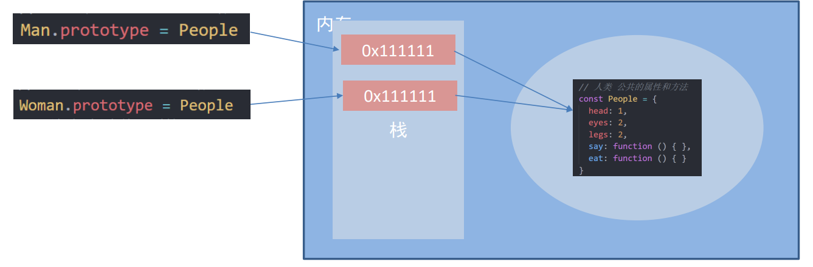
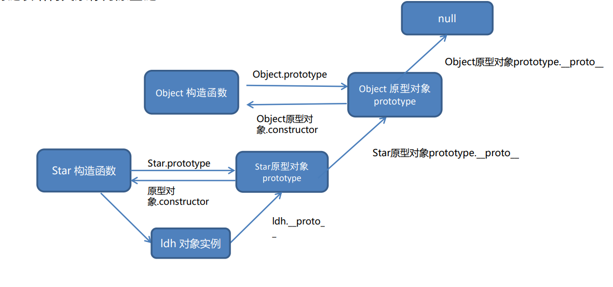

---

---

# JS进阶

## 作用域


### 局部作用域

局部作用域分为函数作用域和块作用域。

#### 函数作用域


#### 块作用域


### 全局作用域


总结

1.全局作用域有哪些？

<script>标签内部
js文件

2.全局作用域声明的变量其他作用域能使用吗？
相当能
JavaScript中的作用域是程序被执行时的底层机制，了解这一机制有
助于规范代码书写习惯，避免因作用域导致的语法错误。

### 作用域链

作用域链本质上是底层的变量查找机制。

> 在函数被执行时，会优先查找当前函数作用域中查找变量
>
> 如果当前作用域查找不到则会依次逐级查找父级作用域直到全局作用域


### JS垃圾回收机制


内存的生命周期


总结


拓展JS垃圾回收机制-算法说明


引用计数法

IE采用的引用计数算法，定义“内存不再使用”，就是看一个对象是否有指向它的引用，没有引用了就回收对象
算法：

1.跟踪记录被引用的次数
2.如果被引用了一次，那么就记录次数1，多次引用会累加++
3.如果减少一个引用就减1

4.如果引用次数是0，则释放内存

但它却存在一个致命的问题：嵌套用（循环引用）
如果两个对象相互引用，尽管他们已不再使用，垃圾回收器不会进行回收，导致内存泄露


标记清除法


标记清除法原理


### ==闭包==

简单理解：闭包=内层函数+外层函数的变量

可以在内层函数中访问到其外层函数的作用域


闭包作用：封闭数据，提供操作，外部也可以访问函数内部的变量

闭包的基本格式：


>==总结==
>
>1.怎么理解闭包？
>
>闭包=内层函数+外层函数的变量
>2.闭包的作用？
>封闭数据，实现数据私有，外部也可以访问函数内部的变量
>闭包很有用，因为它允许将函数与其所操作的某些数据（环境）关联起来
>3.闭包可能引起的问题？
>内存泄漏

### 变量提升

它允许在变量声明之前即被访问（仅存在于var声明变量）


日标：了解什么是变量提升
说明：JS初学者经常花很多时间才能习惯变量提升，还经常出现一些意想不到的bug,正因为如此，ES6引入了块级作用域，用1et或者const声明变量，让代码写法更加规范和人性化。

总结

>1.用哪个关键字声明变量会有变量提升？ var
>2.变量提升是什么流程？
>==先把Var变量提升到当前作用域于最前面
>只提升变量声明，不提升变量赋值==
>然后依次执行代码
>我们不建议使用var声明变量

## 函数进阶

### 函数提升

函数提升与变量提升比较类似，是==指函数在声明之前即可被调用==。

函数表达式不存在提升的现象

函数提升出现在相同作用域当中最前面的位置


### 函数参数

函数参数的使用细节，能够提升函数应用的灵活度。
学习路径：1.动态参数2.剩余参数

#### 动态参数

arguments是函数内部内置的==伪数组变量==，它包含了调用函数时传入的所有实参

arguments是一个伪数组，只存在于函数中


>1.当不确定传递多少个实参的时候，我们怎么办？ arguments动态参数
>2.arguments是什么？ 伪数组 它只存在函数中

`arguments`对象不是一个 [`Array`](https://developer.mozilla.org/zh-CN/docs/Web/JavaScript/Reference/Global_Objects/Array) 。它类似于`Array`，但除了 length 属性和索引元素之外没有任何`Array`属性。例如，它没有 [pop](https://developer.mozilla.org/zh-CN/docs/Web/JavaScript/Reference/Global_Objects/Array/pop) 方法。但是它可以被转换为一个真正的`Array`：

#### 剩余参数

新定义的函数会覆盖原来定义的函数

目标：能够使用剩余参数
剩余参数允许我们将一个不定数量的参数表示为一个==数组==

得到的是一个真数组

```
 //剩余参数 
        function getSum(...arr) {
            console.log(arr);
            // console.log(sum);
        };
```

开发中，还是提倡多使用剩余参数。

>==总结==
>
>1.剩余参数主要的使用场景是？用于获取多余的实参
>2.剩余参数和动态参数区别是什么？开发中提倡使用哪一个？动态参数是伪数组剩余参数是真数组
>开发中使用刺余参数想必也是极好的

### 展开运算符

展开运算符和剩余参数  一个在函数外使用  一个在函数内使用


### 展开运算符or剩余参数

剩余参数：函数参数使用，得到==真数组==
展开运算符：数组中使用，数组展开


### ==箭头函数(重要)==


#### 语法

##### 语法1：基本写法


##### 语法2：只有一个参数可以省略小括号


##### 语法3：如果函数体只有一行代码，可以写到一行上，并且无需写return直接返回值


##### 语法4：加括号的函数体返回对象字面量表达式


#### 箭头函数参数

1.普通函数有arguments动态参数
2.箭头函数没有arguments动态参数，但是有剩余参数...args

箭头函数里面有arguments:动态参数吗？可以使用什么参数？

>没有arguments动态参数
>可以使用剩余参数

#### 箭头函数this

箭头函数不会创建自己的this,它只会从自己的作用域链的上一层沿用this。


在开发中【使用箭头函数前需要考虑函数中this的值】，事件回调函数使用箭头函数时，this为全局的window,因此
==DOM事件回调函数为了简便，还是不太推荐使用箭头函数==

```
// // 语法1.基本写法
        // const fn1 = () => {
        //     console.log('我是箭头函数');
        // };
        // fn1();
        // //语法2. 只有一个参数可以省略小括号
        // const fn2 = x => {
        //     return x + x;
        // };
        // console.log(fn2(2));
        // //语法3. 如果函数体只有一行代码，可以写到一行上，并且无需写return直接返回值
        // const fn3 = (x, y) => x + y;
        // console.log(fn3(1, 2));
        // // 语法4：加括号的函数体返回对象字面量表达式
        // const fn4 = uname => ({ uname: uname });
        // console.log(fn4('pink老师'));
        // 箭头函数 不会自己创建 this 只会从自己的作用域链的上一层沿用this。
        // const fn1 = () => this;
        // console.log(fn1());//window
        function outer() {
            const fn2 = () => console.log(this);
            fn2();
        };
        // window.outer window调用的outer所以this指向window
        console.log(outer());//window
```

总结


# 解构赋值

目标：知道解构的语法及分类，使用解构简洁语法快速为变量赋值

**左侧**的 [ ] 用于批量声明变量    **右侧**数组的单元值将被赋值给左侧的变量

## 数组解构


```
// // 变量少，单元值多
        // const [a, b, c] = ['小米', '苹果', '华为', '格力'];
        // console.log(a);//小米
        // console.log(b); //苹果
        // console.log(c); //华为
        // 利用剩余参数变量少，单元值多
        // const [a, b, ...tel] = ['小米', '苹果', '华为', '格力', 'vivo'];
        // console.log(a);//小米
        // console.log(b);//苹果
        // console.log(tel);//['华为', '格力', 'vivo']
        // // 防止有undefined传递单元值的情况，可以设置默认值：
        // const [a = '手机', b = '华为'] = ['小米'];
        // console.log(a);//小米
        // console.log(b);//华为
        // // 按需导入，忽略某些值
        // const [a, , c, d] = ['小米', '苹果', '华为', '格力', 'vivo'];
        // console.log(a);//小米
        // console.log(c);//华为
        // console.log(d);//格力
        // //支持多维数组的解构
        // const [a, b] = ['苹果', ['小米', '华为']];
        // console.log(a);//苹果
        // console.log(b);//['小米','华为']
        const [a, [b, c]] = ['苹果', ['小米', '华为']];
        console.log(a);//苹果
        console.log(b);//小米
        console.log(c);//华为

```


1.变量的数量大于单元值数量时，多余的变量将被赋值为？
undefined
2.变量的数量小于单元值数量时，可以通过什么剩余获取所有的值？

剩余参数...获取剩余单元值，但只能置于最末位

## 对象解构

对象解构是将对象属性和方法快速批量赋值给一系列变量的简洁语法

### 基本语法：

1.赋值运算符=左侧的 {  } 用于批量声明变量，右侧对象的属性值将被赋值给左侧的变量

2.对象属性的值将被赋值给与==属性名相同的变量==

3.注意解构的变量名不要和外面的变量名冲突否则报错

4.对象中找不到与变量名一致的属性时变量值为undefined

### 给新的变量名赋值用 ：

可以从一个对象中提取变量并同时修改新的变量名

```
 // const pig = { name: '佩奇', age: 6 };
        // const { name: uname, age } = pig;
        // console.log(uname);//佩奇
        // console.log(age);//6
```

冒号表示“什么值 : 赋值给谁”

### 数组对象解构

```
const [{ goodsName, price }] = goods;
        console.log(goodsName);//小米
        console.log(price);//1999
```

### 多级对象解构


```
  // 需求1： 请将以上msg对象  采用对象解构的方式 只选出  data 方面后面使用渲染页面
    const { data } = msg;
    console.log(data);
 // 需求2： 上面msg是后台传递过来的数据，我们需要把data选出当做参数传递给 函数

    function render({ data }) {
      // 我们只要 data 数据
      // 内部处理
      console.log(data);
    }
    render(msg)
     // 需求3， 为了防止msg里面的data名字混淆，要求渲染函数里面的数据名改为 myData
    function render({ data: myData }) {
      // 要求将 获取过来的 data数据 更名为 myData
      // 内部处理
      console.log(myData);
    }
```

## ==遍历数组forEach方法（重点）==

foreach( )没有返回值


```
 const arr = ['小米', '华为', 'vivo'];
        //forEach()不会像map()方法那样返回数组
        const a = arr.forEach((item, index) => {
            console.log(item);//数组中的元素
            console.log(index);//索引号
        });
        console.log(a);//undefined
```


## filter ( )筛选过滤数组方法

```
 const arr = [100, 200, 300, 10, 2];
        // 筛选大于等于200的元素
        const newArr = arr.filter(item => item >= 200);
        console.log(newArr);// [200,300]
```


1) 筛选数组

2) 返回值：返回数组，包含了符合条件的所有元素。如果没有符合条件的元素则返回空数组

3) 参数：currentValue必须写，index可选

4) ## 因为返回新数组，所以不会影响原数组


# 深入对象

## 创建对象三种方式


构造函数在技术上是常规函数。 不过有两个约定： 1. 它们的命名以大写字母开头。 2. 它们只能由 "new" 操作符来执行。

## 构造函数实例化执行过程

1) 利用new创建新的空对象
2) this指向新的对象
3) 执行构造函数代码,添加新的属性
4) 返回新的对象


## 实例成员


## 静态成员


## 内置构造函数


引用类型

Object,Array,RegExp,Date

包装类型

String,Number,Boolean

### Object


#### 三个常用静态方法（静态方法就是只有构造函数0 bject可以调用的）

作用：Object.keys静态方法获取对象中所有属性 (键)

```
 const person = { name: 'pink', age: 18 };
 console.log(Object.keys(person));//['name', 'age']
```

作用：Object..values静态方法获取对象中所有属性值 (值)

```
console.log(Object.values(person));//['pink', 18]
```

作用：Object. assign 静态方法常用于对象拷贝

```
const o = {};
console.log(Object.assign(o, person));//{name: 'pink', age: 18}
```

使用：经常使用的场景给对象添加属性

```
Object.assign(o, { gender: '女' });
console.log(o);//{name: 'pink', age: 18, gender: '女'}
```


### Array

forEach filter map reduce


reduce方法

作用：reduce返回函数累计处理的结果，经常用于求和等
使用场景：求和运算


```
//    1.无起始值
        // const total = arr.reduce(function (prev, current) {
        //     return prev + current;
        // });
        // console.log(total);//60
        // 2.有起始值
        // const total = arr.reduce(function (prev, current) { return prev + current }, 6);
        // console.log(total);//66
        // 3.箭头函数
        const total = arr.reduce((prev, current) => prev + current, 6);
        console.log(total);//66
        
        
        
          const arr = [{
            name: '张三',
            salary: 10000
        }, {
            name: '李四',
            salary: 10000
        }, {
            name: '王五',
            salary: 20000
        },
        ];
        let total = 0;
        total = arr.reduce((prev, current) => prev + current.salary, 0);
        console.log(total);
        // 涨薪30%
        total = arr.reduce((prev, current) => prev + current.salary * 1.3, 0);
        console.log(total);
```


### String


### Number


# 两种编程思想

## 面向过程编程


## 面向对象编程


1.2 面向对象编程 (oop) 

 在面向对象程序开发思想中，每一个对象都是功能中心，具有明确分工。 

面向对象编程具有灵活、代码可复用、容易维护和开发的优点，更适合多人合作的大型软件项目。

  面向对象的特性： 

1) 封装性 
2) 继承性 
3) 多态性


面向过程编程 

优点：性能比面向对象高，适合跟硬件联系很紧密 的东西，例如单片机就采用的面向过程编程。

 缺点：没有面向对象易维护、易复用、易扩展 

面向对象编程 

优点：易维护、易复用、易扩展，由于面向对象有封装 、继承、多态性的特性，可以设计出低耦合的系统，使 系统 更加灵活、更加易于维护

 缺点：性能比面向过程低

==生活离不开蛋炒饭，也离不开盖浇饭，选择不同而已，只不过前端不同于其他语言，面向过程更多==

# ==构造函数==

# ==是原型对象和实例对象的爸爸==

1) 封装是面向对象思想中比较重要的一部分，js面向对象可以通过构造函数实现的封装。

2) 同样的将变量和函数组合到了一起并能通过 this 实现数据的共享，所不同的是==借助构造函数创建出来的实例对象之 间是彼此不影响的==new出来的实例对象是相互独立互不影响的

总结： 

1) 构造函数体现了面向对象的封装特性 

2) 构造函数实例创建的对象彼此独立、互不影响

构造函数的缺点

1) 封装是面向对象思想中比较重要的一部分，js面向对象可以通过构造函数实现的封装。

2) 前面我们学过的构造函数方法很好用，但是 存在==浪费内存==的问题（相同的方法它会重复生成占用空间）


1.JS 实现面向对象需要借助于谁来实现？ 

​	 构造函数

2.构造函数存在什么问题？

​	 浪费内存

# ==**原型对象**==

目标：能够利用原型对象实现方法共享 

构造函数通过原型分配的函数是所有对象所 共享的。 

JavaScript 规定，每一个构造函数都有一个 prototype 属性，指向另一个对象，所以我们也称为原型对象

 这个对象可以挂载函数，对象实例化不会多次创建原型上函数，节约内存 

==我们可以把那些不变的方法，直接定义在 prototype 对象上，这样所有对象的实例就可以共享这些方法。==

==构造函数和原型对象中的this 都指向 实例化的对象==


1) 原型是什么 ？

> 一个对象，我们也称为 prototype 为原型对象 

2) 原型的作用是什么 ？ 

> 共享方法 
>
> 可以把那些不变的方法，直接定义在 prototype 对象上

3. 构造函数和原型里面的this指向谁 ？ 

> 实例化的对象

## constructor

##  属性指向自己的爸爸

在哪里？每个原型对象里面都有个`constructor` 属性（constructor 构造函数） 

==作用：该属性指向该原型对象的构造函数， 简单理解，就是指向我的爸爸，我是有爸爸的孩子==


==使用场景==： 如果有多个对象的方法，我们可以给原型对象采取对象形式赋值. 但是这样就会覆盖构造函数原型对象原来的内容，这样修改后的原型对象 constructor 就不再指向当前构造函数了 此时，我们可以在修改后的原型对象中，添加一个 constructor 指向原来的构造函数。

```js
  function Star(uname, age) {
            that = this;
            this.uname = uname;
            this.age = age;
        }
        Star.prototype = {
            // 手动使原型对象指向构造函数
            constructor: Star,
            sing: () => {
                console.log('唱歌');
            },
            dance: () => {
                console.log('跳舞');
            }
        }
        const ldh = new Star('刘德华', '55');
        const zxy = new Star('张学友', '58');
        console.log(Star.prototype.constructor);//f Object()
        console.log(Star.prototype.constructor);//f Star()
```

构造函数可以创建实例对象，构造函数还有一个原型对象，一些公共的属性或者方法放到这个原型对象身上 但是 为啥实例对象可以访问原型对象里面的属性和方法呢？

`对象都会有一个属性__proto__ `指向`构造函数的 prototype 原型对象`，之所以我们对象可以使用构造函数 prototype 原型对象的属性和方法，就是因为对象有 `__proto__ 原型`的存在。


1. prototype是什么？哪里来的？

   > 原型（原型对象）
   >
   > 构造函数都自动有原型 

  2. constructor属性在哪里？作用干啥的？ 

> prototype原型和对象原型`__proto__`里面都有 
>
>  都指向创建实例对象/原型的构造函数 

3. `__proto__`属性在哪里？指向谁？  

   > 在实例对象里面  指向原型 prototype


```js
<script>
function Person(name) {
	this.name = name;
};
const peppa = new Person('佩奇');
Person.prototype.sayHi = function () {
	console.log('Hi');
}
console.log(Person);
console.log(peppa);
console.log(peppa.constructor);//           实例对象.constructor  指向=>  构造函数
console.log(Person.prototype.constructor);//原型对象.constructor  指向=>  构造函数
// 对象原型是随着实例对象产生而自动创造的
console.log(peppa.__proto__);//             对象原型              指向=>  原型对象
</script>
```

## ==原型继承==

原型继承 

继承是面向对象编程的另一个特征，通过继承进一步提升代码封装的程度，JavaScript 中大多是借助原型对象实现继承 的特性。 龙生龙、凤生凤、老鼠的儿子会打洞描述的正是继承的含义。

1. 封装-抽取公共部分 把男人和女人公共的部分抽取出来放到人类里面

   ```js
   function People() {
        this.eyes = 2;
        this.head = 1;
        this.sayHi = function () {
            console.log('Hi');
        }``
    };
   ```

   

2. 继承-让男人和女人都能继承人类的一些属性和方法  把男人女人公共的属性和方法抽取出来 People  然后赋值给Man的原型对象，可以共享这些属性和方法  注意让constructor指回Man这个构造函数

3. 问题： 如果我们给男人添加了一个吸烟的方法，发现女人自动也添加这个方法

​     --原因 男人和女人都同时使用了同一个对象，根据引用类型的特点，他们指向同一个对象，修改一个就会都影响



4. 解决： 需求：男人和女人不要使用同一个对象，但是不同对象里面包含相同的属性和方法 答案：

构造函数 new 每次都会创建一个新的对象

5. 继承写法完善

```js
 function Person() {
            this.eyes = 2;
            this.head = 1;
            this.sayHi = function () {
                console.log('Hi');
            }
        };
        function Woman() {
            this.baby = function () {
                console.log('宝贝');
            };
        };
        function Man() {

        };
        console.log(new Person());
        // 利用原型对象添加公共的属性和方法
        Woman.prototype = new Person();
        // 手动将原型对象指向构造函数
        Woman.prototype.constructor = Woman;
        const red = new Woman();
        console.log(red);
        console.log(red.eyes);

        Man.prototype = new Person();
        Man.prototype.constructor = Man;
        const pink = new Man();
        console.log(pink);
        console.log(pink.eyes);
        console.log(pink.sayHi());
```

### ==思路==

真正做这个案例，我们的思路应该是先考虑大的，后考虑小的

1. 人类共有的属性和方法有那些，然后做个构造函数，进行封装，一般公共属性写到构造函数内部，公共方法，挂载 到构造函数原型身上。
2.  男人继承人类的属性和方法，之后创建自己独有的属性和方法 
3. 女人同理

## ==原型链==

只要是`原型对象`就有`constructor`

只要是`对象`就有`__proto__`对象原型

基于原型对象的继承使得不同构造函数的原型对象关联在一起，并且这种关联的关系是一种链状的结构，我们将原型对 象的链状结构关系称为原型链

 ==原型链其实就是一个查找规则== 

① 当访问一个对象的属性（包括方法）时，首先查找这个对象自身有没有该属性。

② 如果没有就查找它的原型（也就是`__proto__`指向的 prototype 原型对象） 

③ 如果还没有就查找原型对象的原型（Object的原型对象）

④ 依此类推一直找到 Object 为止（null） 

⑤` __proto__`对象原型的意义就在于为对象成员查找机制提供一个方向，或者说一条路线 

⑥ 可以使用` instanceof `运算符用于检测构造函数的 `prototype `属性是否出现在某个实例对象的原型链上


