11

# 1.AJAX 

## 1.1 AJAX 简介

简介 AJAX 全称为 Asynchronous JavaScript And XML，就是==异步的 JS 和XML==。通过 AJAX 可以在浏览器中向服务器发送异步请求，最大的优势：==无刷新==获取数据。AJAX 不是新的编程语言，而是一种将现有的标准组合在一起使用的新方式。

## 1.2 XML简介

XML 简介 XML 可扩展标记语言。 XML 被设计用来传输和存储数据。 XML 和 HTML 类似，不同的是 HTML 中都是预定义标签，而 XML 中没有预定义标签，全都是自定义标签，用来表示一些数据。

```
比如说我有一个学生数据：
name = "孙悟空" ; age = 18 ; gender = "男" ;
用 XML 表示：
    <student>
    <name>孙悟空</name>
    <age>18</age>
    <gender>男</gender>
    </student>
```

现在已经被 JSON 取代了。

```
用 JSON 表示：
	{"name":"孙悟空","age":18,"gender":"男"}
```

## 1.3 AJAX 的特点 

### 1.3.1 AJAX 的优点 

可以无需刷新页面而与服务器端进行通信。 

允许你根据用户事件来更新部分页面内容。

### 1.3.2 AJAX 的缺点 

1.没有浏览历史，不能回退 

2.存在跨域问题(同源) 

3.SEO 不友好

## 1.4 AJAX 的使用

###  1.4.1 核心对象 XMLHttpRequest

AJAX 的所有操作都是通过该对象进行的。

### 1.4.2 使用步骤

```
//获取button元素
        const btn = document.getElementsByTagName('button')[0];
        const result = document.getElementById("result");
        //绑定事件
        btn.onclick = function(){
            //1. 创建对象
            const xhr = new XMLHttpRequest();
            //2. 初始化 设置请求方法和 url
            xhr.open('GET', 'http://127.0.0.1:8000/server?a=100&b=200&c=300');
            //3. 发送
            xhr.send();
            //4. 事件绑定 处理服务端返回的结果
            // on  when 当....时候
            // readystate 是 xhr 对象中的属性, 表示状态 0 1 2 3 4
            // change  改变
            xhr.onreadystatechange = function(){
                //判断 (服务端返回了所有的结果)
                if(xhr.readyState === 4){
                    //判断响应状态码 200  404  403 401 500
                    // 2xx 成功
                    if(xhr.status >= 200 && xhr.status < 300){
                        //处理结果  行 头 空行 体
                        //响应 
                        // console.log(xhr.status);//状态码
                        // console.log(xhr.statusText);//状态字符串
                        // console.log(xhr.getAllResponseHeaders());//所有响应头
                        // console.log(xhr.response);//响应体
                        //设置 result 的文本
                        result.innerHTML = xhr.response;
                    }else{

                    }
                }
            }


        }
```

1) 创建 XMLHttpRequest 对象 var xhr = new XMLHttpRequest();

2) 设置请求信息 xhr.open(method, url);//可以设置请求头，一般不设置
3) 发送请求 xhr.send(body) //get 请求不传 body 参数，只有 post 请求使用
4) 接收响应 //xhr.responseXML 接收 xml 格式的响应数据 //xhr.responseText 接收文本格式的响应数据

```
 xhr.onreadystatechange = function () {
                if (xhr.readyState === 4) {
                    if (xhr.status >= 200 && xhr.status < 300) {
                        // 处理服务端返回的结果
                        result.innerHTML = xhr.response;
                    }
                }
```

# Day1-AJAX入门

## AJAX 概念和 axios 使用

定义


概念：AJAX 是浏览器与服务器进行数据通信的技术

怎么用 AJAX ？

1. 先使用 axios [æk‘sioʊs] 库，与服务器进行数据通信 

   ⚫ 基于 XMLHttpRequest 封装、代码简单、月下载量在 14 亿次 

   ⚫ Vue、React 项目中都会用到 axios 2. 再学习 XMLHttpRequest 对象的使用，了解 AJAX 底层原理


axios 使用 语法： 

1. 引入 axios.js：https://cdn.jsdelivr.net/npm/axios/dist/axios.min.js 

2. 使用 axios 函数 

   ✓ 传入配置对象 

   ✓ 再用 .then 回调函数接收结果，并做后续处理


1. AJAX 有什么用？ 

➢ 浏览器和服务器之间通信，动态数据交互 

2. AJAX 如何学： 

➢ 先掌握 axios 使用 ➢ 再了解 XMLHttpRequest 原理 

3. 这一节 axios 体验步骤？ 

➢ 引入 axios 库 ➢ 使用 axios 语法

## 认识 URL 

原因：知道作用和组成，方便与后端人员沟通


概念：URL 就是**统一资源定位符**，简称**网址**，用于访问网络上的资源

组成


**协议** 

**http 协议**：超文本传输协议，规定浏览器和服务器之间传输数据的格式

**域名**

 域名：标记服务器在互联网中方位

**资源路径** 

资源路径：标记资源在服务器下的具体位置

1. URL 是什么：

   ➢ 统一资源定位符，网址，用于访问服务器上资源 

2. 请解释这个 URL，每个部分作用？ 

   ➢ http://hmajax.itheima.net/api/news 

   ➢ 协议://域名/资源路径

## URL 查询参数 

定义：浏览器提供给服务器的额外信息，让服务器返回浏览器想要的数据

 语法：http://xxxx.com/xxx/xxx`?`参数名1=值1&参数名2=值2


语法：使用 axios 提供的 params 选项 

注意：axios 在运行时把参数名和值，会拼接到 url?参数名=值

城市列表：http://hmajax.itheima.net/api/city?pname=河北省

1. URL 查询参数有什么作用？ 

   ➢ 浏览器提供给服务器额外信息，获取对应的数据 

2. axios 要如何携带查询参数？ 

   ➢ 使用 params 选项，携带参数名和值

## 案例-地区查询 

需求：根据输入的省份名字和城市名字，查询地区并渲染列表

地区查询 

首先：确定 URL 网址和参数说明 • 查询某个省内某个城市的所有地区: http://hmajax.itheima.net/api/area • 参数名： pname：省份名字或直辖市名字，比如北京、福建省、辽宁省... cname：城市名字，比如北京市、厦门市、大连市... 完整：http://hmajax.itheima.net/api/area?pname=北京&cname=北京市

### 常用请求方法

请求方法：对服务器资源，要执行的操作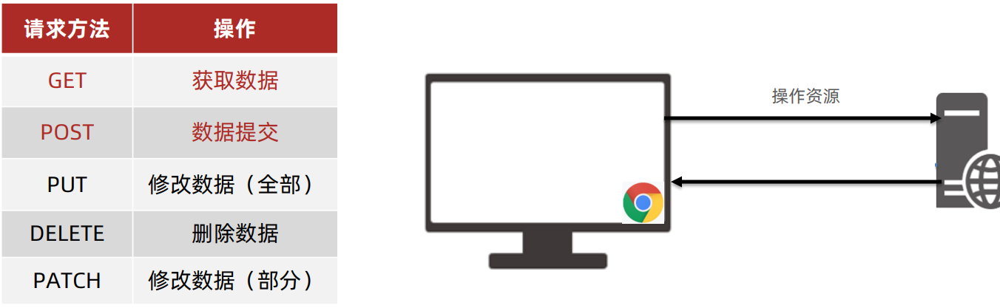

### 数据提交 

场景：当数据需要在服务器上保存

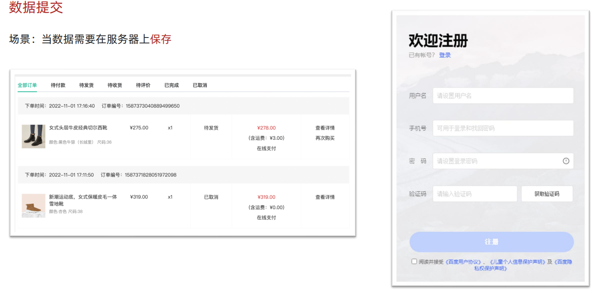

### axios 请求配置

url：请求的 URL 网址 

method：请求的方法，GET可以省略（不区分大小写） 

data：提交数据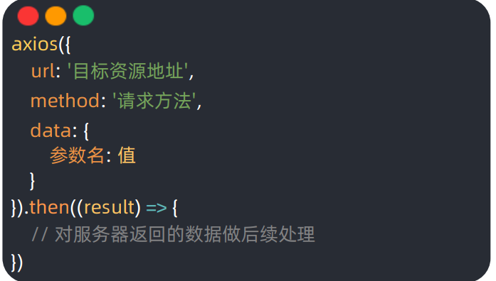

### 数据提交－注册账号

需求：通过 axios 提交用户名和密码，完成注册功能 

注册用户 URL 地址：http://hmajax.itheima.net/api/register 

请求方法：POST 

参数名： username 用户名（中英文和数字组成，最少 8 位） 

​			password 密码（最少 6 位）


# Day03-AJAX原理

## 01.XMLHttpRequest - 基础使用


AJAX原理 - XMLHttpRequest

关系：axios 内部采用 XMLHttpRequest 与服务器交互

### 使用 XMLHttpRequest (发送 - 请求 接收 - 响应)

 步骤：

1. 创建 XMLHttpRequest 对象 

2. 配置请求方法和请求 url 地址 

3. 监听 loadend 事件，接收响应结果 
4. 发起请求


1. AJAX 原理是什么？

➢ XMLHttpRequest 对象 

2. 为什么学习 XHR？ 

➢ 有更多与服务器数据通信方式
➢ 了解 axios 内部原理 

3. XHR 使用步骤？ 

➢ 创建 XHR 对象
➢ 调用 open 方法，设置 url 和请求方法
➢ 监听 loadend 事件，接收结果 
➢ 调用 send 方法，发起请求

### XMLHttpRequest - 查询参数 

定义：浏览器提供给服务器的额外信息，让服务器返回浏览器想要的数据

 语法：http://xxxx.com/xxx/xxx?**参数名1=值1&参数名2=值2**

### XMLHttpRequest - 数据提交

 需求：通过 XHR 提交用户名和密码，完成注册功能 

核心： 请求头设置 `Content-Type：application/json` 请求体携带 JSON 字符串

## Promise（承诺）

### 定义


好处： 1. 逻辑更清晰 2. 了解 axios 函数内部运作机制 3. 能解决回调函数地狱问题

1. 什么是 Promise？

➢ 表示（管理）一个异步操作最终状态和结果值的对象 

2. 为什么学习 Promise？ 

➢ 成功和失败状态，可以关联对应处理程序 
		 ➢ 了解 axios 内部原理 

### Promise - 三种状态 

作用：了解Promise对象如何关联的处理函数，以及代码执行顺序

 概念：一个Promise对象，必然处于以下几种状态之一 

✓ 待定（pending） ：初始状态，既没有被兑现，也没有被拒绝 

✓ 已兑现（fulfilled） ：意味着，操作成功完成 

✓ 已拒绝（rejected） ：意味着，操作失败

注意：Promise对象一旦被兑现/拒绝 .catch(回调函数) 就是已敲定了，状态无法再被改变


### 总结

1. Promise 对象有哪 3 种状态？ 
   ➢ 待定 pending
   ➢ 已兑现 fulfilled 
   ➢ 已拒绝 rejected

1. Promise 状态有什么用？
   ➢ 状态改变后，调用关联的处理函数

## 封装_简易axios

需求：基于 Promise + XHR 封装 myAxios 函数，**获取省份列表**展示 步骤：

1. 定义 myAxios 函数，接收配置对象，返回 Promise 对象 
2. 发起 XHR 请求，默认请求方法为 GET 
3. 调用成功/失败的处理程序 
4. 使用 myAxios 函数，获取省份列表展示

需求：修改 myAxios 函数支持传递查询参数，获取"辽宁省"，"大连市"**对应地区列表展示** 步骤：

1. myAxios 函数调用后，判断 params 选项 
2. 基于 URLSearchParams 转换查询参数字符串
3. 使用自己封装的 myAxios 函数展示地区列表

需求：修改 myAxios 函数支持传递请求体数据，**完成注册用户功能** 步骤：

1. myAxios 函数调用后，判断 data 选项
2. 转换数据类型，在 send 方法中发送 
3. 使用自己封装的 myAxios 函数完成注册用户功能

##  案例 - 天气预报

需求：根据关键字，展示匹配城市列表 步骤： 

1. 绑定 input 事件，获取关键字 
2. 获取展示城市列表数据

需求：展示用户搜索查看的城市天气 步骤：

1. 检测搜索列表点击事件，获取城市 code 值 
2. 复用获取展示城市天气函数

# Day04-AJAX进阶

## 同步代码和异步代码

同步代码：逐行执行，需原地等待结果后，才继续向下执行 

异步代码：调用后耗时，不阻塞代码继续执行（不必原地等待），在将来完成后触发一个回调函数

1. 什么是同步代码？ 
   ➢ 逐行执行，原地等待结果后，才继续向下执行 
2. 什么是异步代码？
   ➢ 调用后耗时，不阻塞代码执行，将来完成后触发回调函数 
3. JS 中有哪些异步代码？
   ➢ setTimeout / setInterval
   ➢ 事件
   ➢ AJAX 
4. 异步代码如何接收结果?
   ➢ 依靠回调函数来接收

## 回调函数地狱

需求：展示默认第一个省，第一个城市，第一个地区在下拉菜单中 

概念：在回调函数中嵌套回调函数，一直嵌套下去就形成了回调函数地狱 

缺点：可读性差，异常无法捕获，耦合性严重，牵一发动全身

```
 /**
     * 目标：演示回调函数地狱
     * 需求：获取默认第一个省，第一个市，第一个地区并展示在下拉菜单中
     * 概念：在回调函数中嵌套回调函数，一直嵌套下去就形成了回调函数地狱
     * 缺点：可读性差，异常无法获取，耦合性严重，牵一发动全身
    */
    axios({ url: 'http://hmajax.itheima.net/api/province' }).then(result => {
      document.querySelector('.province').innerHTML = result.data.list[0];
      const pname = result.data.list[0];
      axios({ url: 'http://hmajax.itheima.net/api/city', params: { pname } }).then(result => {
        console.log(result);
        const cname = result.data.list[0];
        document.querySelector('.city').innerHTML = cname;
        axios({ url: 'http://hmajax.itheima.net/api/area', params: { pname, cname } }).then(result => {
          console.log(result);
          const area = result.data.list[0];
          document.querySelector('.area').innerHTML = area;
        })
      })
    })
```

1. 什么是回调函数地狱？

➢ 在回调函数一直向下嵌套回调函数，形成回调函数地狱 

2. 回调函数地狱问题？

➢ 可读性差 

➢ 异常捕获困难 

➢ 耦合性严重

## Promise - 链式调用

概念：依靠 then() 方法会返回一个**新生成的 Promise 对象**特性，继续串联下一环任务，直到结束 

细节：then() 回调函数中的返回值，会影响新生成的 Promise 对象最终状态和结果 

好处：通过链式调用，**解决回调函数嵌套问题**


1. 什么是 Promise 的链式调用？ 
   ➢ 使用 then 方法返回新 Promise 对象特性，一直串联下去 
2. then 回调函数中，return 的值会传给哪里？
   ➢ 传给 then 方法生成的新 Promise 对象 
3. Promise 链式调用有什么用？ 

​	➢ 解决回调函数嵌套问题

```js
 /**
     * 目标：把回调函数嵌套代码，改成Promise链式调用结构
     * 需求：获取默认第一个省，第一个市，第一个地区并展示在下拉菜单中
    */
    let pname = '';
    axios({ url: 'http://hmajax.itheima.net/api/province' }).then(result => {
      pname = result.data.list[0];
      document.querySelector('.province').innerHTML = result.data.list[0];
      return axios({ url: "http://hmajax.itheima.net/api/city", params: { pname } })
    }).then(result => {
      document.querySelector('.city').innerHTML = result.data.list[0];
      const cname = result.data.list[0];
      return axios({ url: 'http://hmajax.itheima.net/api/area', params: { pname, cname } });
    }).then(result => {
      document.querySelector('.area').innerHTML = result.data.list[0];
    })
```


# 项目

## 黑马头条-数据管理平台

### 项目介绍 

黑马头条-数据管理平台：对IT资讯移动网站的数据，进行数据管理 

数据管理平台-演示：配套代码在本地运行 

移动网站-演示： http://geek.itheima.net/

功能： 

1. 登录和权限判断 2. 查看文章内容列
2. 表（筛选，分页） 
3. 编辑文章（数据回显） 
4. 删除文章 
5. 发布文章（图片上传，富文本编辑器）


1. 黑马头条-数据管理平台，是什么样网站，要完成哪些功能？ 

✓ 数据管理网站，登录后对数据进行增删改查 

1. 数据管理平台，未登录能否管理数据？ 

✓ 不能，数据是公司内部的，需账号登录后管理

### 项目准备 

技术：

 • 基于 Bootstrap 搭建网站标签和样式 

• 集成 wangEditor 插件实现富文本编辑器 • 使用原生 JS 完成增删改查等业务 

• 基于 axios 与黑马头条线上接口交互 

• 使用 axios 拦截器进行权限判断

准备配套的素材代码

 包含：html，css，js，静态图片，第三方插件等等 目录管理：建议这样管理，方便查找 

• assets：资源文件夹（图片，字体等） 

• lib：资料文件夹（第三方插件，例如：form-serialize） 

• page：页面文件夹 

• utils：实用程序文件夹（工具插件）

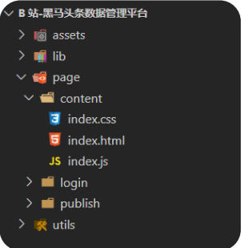

1. 为什么要按照一定的结构，管理代码文件？ ✓ 方便以后的查找和扩展

### 验证码登录

 目标：完成验证码登录，后端设置验证码默认为 246810

 原因：因为短信接口不是免费的，防止攻击者恶意盗刷 

步骤：

1. 在 utils/request.js 配置 axios 请求基地址 作用：提取公共前缀地址，配置后 axios 请求时都会 baseURL + url 

2. 收集手机号和验证码数据 
3. 基于 axios 调用验证码登录接口 
4. 使用 Bootstrap 的 Alert 警告框反馈结果给用户

#### 验证码登录-流程 

手机号+验证码，登录流程：

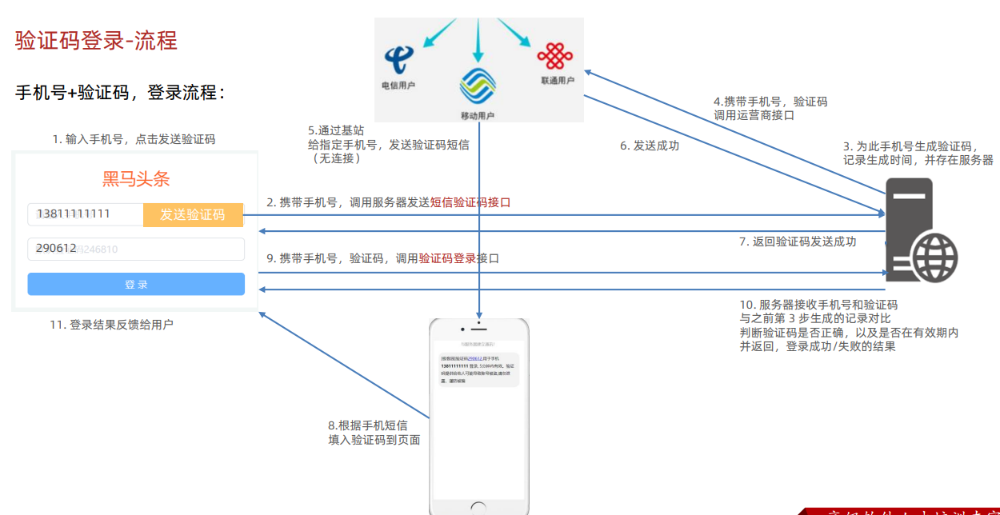

#### token 的介绍

概念：访问权限的令牌，本质上是一串字符串 

创建：正确登录后，由后端签发并返回

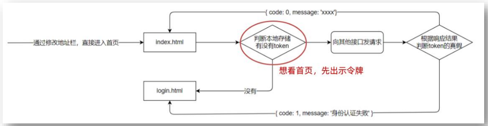

注意：前端只能判断 `token 有无`，而后端才能判断 `token 的有效性`

#### token 的使用

目标：只有登录状态，才可以访问内容页面 步骤： 

1. 在 utils/auth.js 中判断无 token 令牌字符串，则强制跳转到登录页（手动修改地址栏测试） 

2. 在登录成功后，保存 token 令牌字符串到本地，再跳转到首页（手动修改地址栏测试）

```js
const token localstorage.getItem('token')
//没有token令牌字符串，则强制跳转登录页
if (!token){
	location.href '../login/index.html
}
```

1. token 的作用？

 ✓ 判断用户是否有登录状态等 

2. token 的注意：

✓ 前端只能判断 token 的有无 

✓ 后端通过解密可以提取 token 字符串的原始信息，判断有效性

### 个人信息设置和 axios 请求拦截器

需求：设置用户昵称 
		 语法：axios 可以在 headers 选项传递请求头参数

问题：很多接口，都需要携带 token 令牌字符串 

解决：在请求拦截器统一设置公共 headers 选项

```js
// 添加请求拦截器
axios.interceptors.request.use(function (config) {
    // 在发送请求之前做些什么
    const token = localStorage.getItem('token');
    token && (config.headers.Authorization = `Bearer ${token}`);
    return config;
}, function (error) {
    // 对请求错误做些什么
    return Promise.reject(error);
});
```

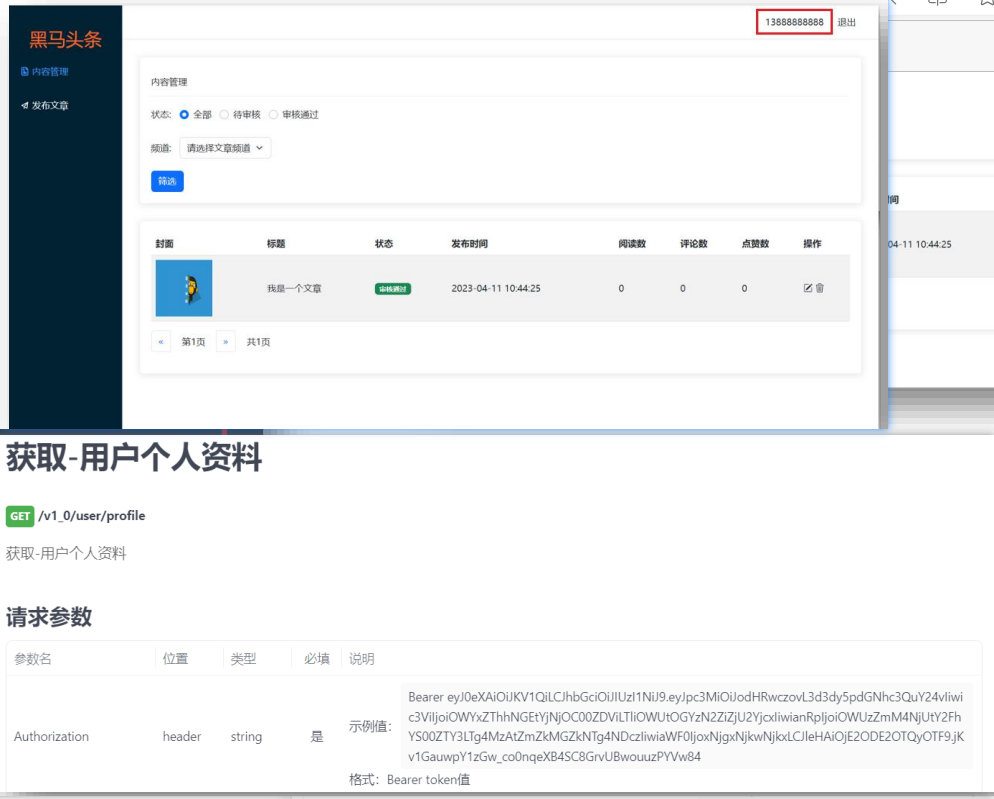

axios 请求拦截器：发起请求之前，触发的配置函数，对**请求参数**进行额外配置

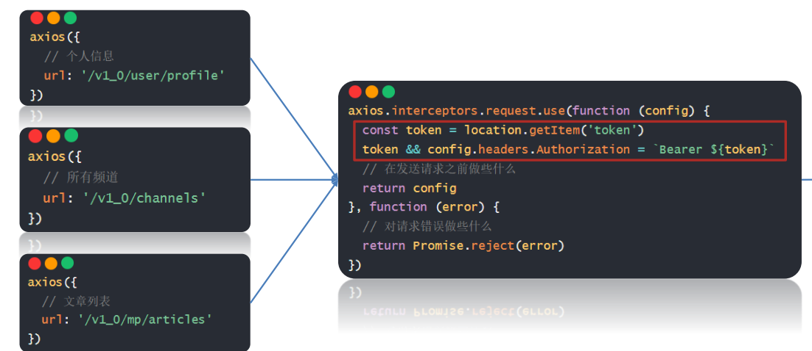

1. 什么是 axios 请求拦截器？ 

✓ 发起请求之前，调用的一个函数，对请求参数进行设置 

2. axios 请求拦截器，什么时候使用？ 

✓ 有公共配置和设置时，统一设置在请求拦截器中

axios 响应拦截器和身份验证失败 axios 响应拦截器：响应回到 then/catch 之前，触发的拦截函数，对响应结果统一处理 例如：身份验证失败，统一判断并做处理

### axios 响应拦截器和身份验证失败

axios 响应拦截器：响应回到 then/catch 之前，触发的拦截函数，对响应结果统一处理 例如：身份验证失败，统一判断并做处理

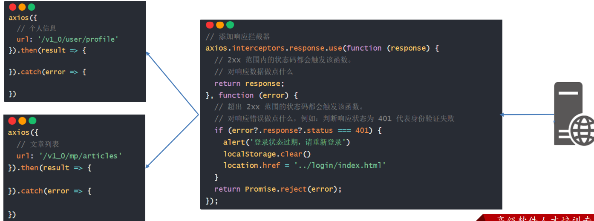

1. 什么是 axios 响应拦截器？

 ✓ 响应回到 then/catch 之前，触发的拦截函数，对响应结果统一处理 

2. axios 响应拦截器，什么时候触发成功/失败的回调函数？ 

✓ 状态为 2xx 触发成功回调，其他则触发失败的回调函数

### 优化-axios 响应结果

目标：axios 直接接收服务器返回的响应结果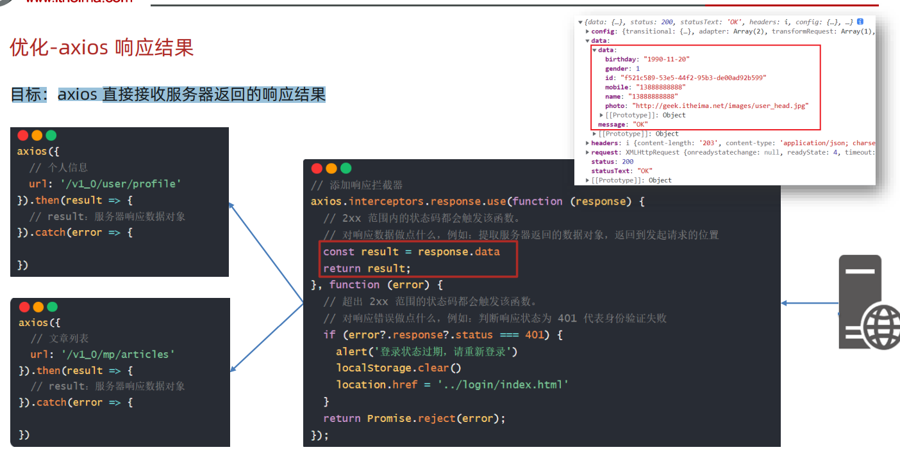

发布文章-富文本编辑器 

富文本：带样式，多格式的文本，在前端一般使用标签配合内联样式实现

富文本编辑器：用于编写富文本内容的容器

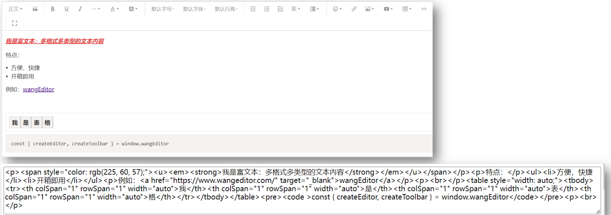

发布文章-富文本编辑器 目标：发布文章页，富文本编辑器的集成 使用：**wangEditor 插件** 

步骤：参考文档

1. 引入 CSS 定义样式 
2. 定义 HTML 结构 
3. 引入 JS 创建编辑器

4. 监听内容改变，保存在隐藏文本域（便于后期收集）

### 发布文章

#### 发布文章-频道列表 

目标：展示频道列表，供用户选择 

步骤： 

1. 获取频道列表数据 

2. 展示到下拉菜单中

#### 发布文章-封面设置

目标：文章封面的设置 步骤： 

1. 准备标签结构和样式 

2. 选择文件并保存在 **FormData** 

3. 单独上传图片并得到图片 URL 地址

4. 回显并切换 img 标签展示（隐藏 + 号上传标签） 

**注意：图片地址临时存储在 img 标签上，并未和文章关联保存**


#### 发布文章-收集并保存 

目标：收集文章内容，并提交保存 

步骤：

1. 基于 form-serialize 插件收集表单数据对象 
2. 基于 axios 提交到服务器保存 
3. 调用 Alert 警告框反馈结果给用户 
4. 重置表单并跳转到列表页

### 内容管理

#### 内容管理-文章列表展示 

目标：获取文章列表并展示 

步骤： 

1. 准备查询参数对象 
2. 获取文章列表数据 
3. 展示到指定的标签结构中

#### 内容管理-筛选功能 

目标：根据筛选条件，获取匹配数据展示 

步骤： 

1. 设置频道列表数据 

2. 监听筛选条件改变，保存查询信息到查询参数对象 
3. 点击筛选时，传递查询参数对象到服务器 
4. 获取匹配数据，覆盖到页面展示

#### 内容管理-分页功能 

目标：完成文章列表，分页管理功能 

步骤：

1. 保存并设置文章总条数 

2. 点击下一页，做临界值判断，并切换页码参数请求最新数据
3. 点击上一页，做临界值判断，并切换页码参数请求最新数据

#### 内容管理-删除功能 

目标：完成删除文章功能 

步骤： 

1. 关联文章 id 到删除图标 
2. 点击删除时，获取文章 id 
3. 调用删除接口，传递文章 id 到服务器 
4. 重新获取文章列表，并覆盖展示

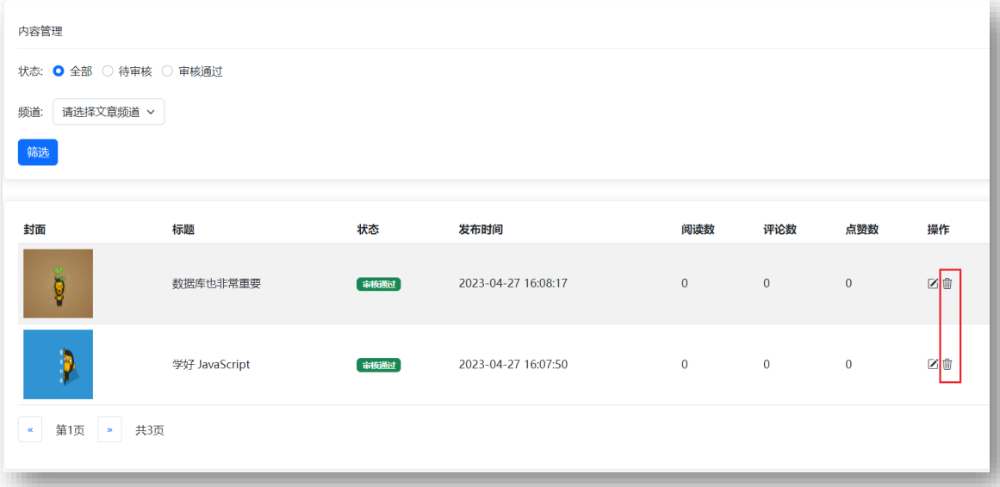

#### 内容管理-删除最后一条

目标：在删除最后一页，最后一条时有 Bug 解决： 

1. 删除成功时，判断 DOM 元素只剩一条，让当前页码 page--
2. 注意，当前页码为 1 时不能继续向前翻页 
3. 重新设置页码数，获取最新列表展示

#### 内容管理-编辑文章-回显 

目标：编辑文章时，回显数据到表单 

步骤： 

1. 页面跳转传参（URL 查询参数方式） 
2. 发布文章页面接收参数判断（共用同一套表单） 
3. 修改标题和按钮文字 
4. 获取文章详情数据并回显表单

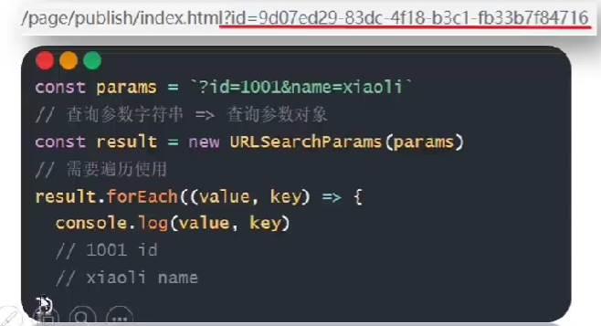

#### 内容管理-编辑文章-保存 

目标：确认修改，保存文章到服务器 

步骤：

1. 判断按钮文字，区分业务（因为共用一套表单） 

2. 调用编辑文章接口，保存信息到服务器 

3. 基于 Alert 反馈结果消息给用户

### 退出登录 

目标：完成退出登录效果

 步骤： 1. 绑定点击事件 2. 清空本地缓存，跳转到登录页面
