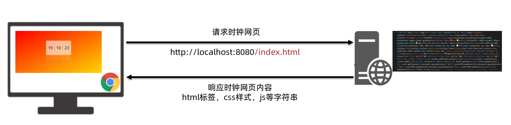

# Node.js 入门

 JavaScript 运行时环境

定义:


作用：使用 Node.js 编写服务器端程序

 ✓ 编写数据接口，提供网页资源浏览功能等等 

✓ `前端工程化`：为后续学习 Vue 和 React 等框架做铺垫 

## 什么是前端工程化？

前端工程化：开发项目直到上线，过程中集成的所有工具和技术 Node.js 是前端工程化的基础（因为 Node.js 可以主动读取前端代码内容）

## Node.js 为何能执行 JS？

首先：浏览器能执行 JS 代码，依靠的是内核中的 V8 引擎（C++ 程序）

 其次：Node.js 是基于 Chrome V8 引擎进行封装（运行环境） 

区别：都支持 ECMAScript 标准语法，Node.js 有独立的 API

==注意：Node.js 环境没有 DOM 和 BOM 等==

## Node.js的使用

### Node.js 安装

要求：下载 node-v16.19.0.msi 安装程序（指定版本：兼容 vue-admin-template 模板） 

安装过程：默认下一步即可 注释事项： 

1. 安装在非中文路径下

2.  无需勾选自动安装其他配套软件

成功验证： 

1. 打开 cmd 终端，输入 node -v 命令查看版本号 

2. 如果有显示，则代表安装成功


### 使用 Node.js

需求：新建 JS 文件，并编写代码后，在 node 环境下执行 

命令：在 VSCode 集成终端中，输入 node xxx.js，回车即可执行

1. Node.js 是什么？ 
➢ 基于 Chrome 的 V8 引擎封装，独立执行 JavaScript 代码的环境 
2. Node.js 与浏览器环境的 JS 最大区别？ 
➢ Node.js 环境中没有 BOM 和 DOM
3. Node.js 有什么用？ 
➢ 编写后端程序：提供数据和网页资源等
➢ 前端工程化：集成各种开发中使用的工具和技术 
4. Node.js 如何执行代码？
➢ 在 VSCode 终端中输入：node xxx.js 回车即可执行（注意路径）

### fs 模块 - 读写文件

模块：类似插件，封装了方法/属性 

fs模块：封装了与本机文件系统进行交互的，方法/属性 

语法： 

1. 加载 fs 模块对象 
2. 写入文件内容 
3. 读取文件内容

### path 模块 - 路径处理

问题：Node.js 代码中，相对路径是根据终端所在路径来查找的，可能无法找到你想要的文件 p

建议：在 Node.js 代码中，使用==绝对路径== 

补充：`__dirname` 内置变量**（获取当前模块目录-绝对路径）** 

✓ windows： D:\备课代码\3-B站课程\03_Node.js与Webpack\03-code\03

 ✓ mac： /Users/xxx/Desktop/备课代码/3-B站课程/03_Node.js与Webpack/03-code/03 注意：path.join() 会使用特定于平台的分隔符，作为定界符，将所有给定的路径片段连接在一起

 语法：

1. 加载 path 模块 `const path require('path')`

2. 使用 path.join 方法，拼接路径`path.join('路径1'，'路径2'，..)`

## 案例

### 案例 - 压缩前端 html

需求：把 回车符（\r）和换行符（\n）去掉后，写入到新 html 文件中 

步骤： 

1. 读取源 html 文件内容 

2. 正则替换字符串 
3. 写入到新的 html 文件中

URL 中的端口号

 URL：统一资源定位符，简称网址，用于访问服务器里的资源 

端口号：标记服务器里不同功能的服务程序

端口号范围：0-65535 之间的任意整数 


注意：http 协议，默认访问 80 端口 http://hmajax.itheima.net:80/api/province

## 常见的服务程序

 **Web 服务程序**：用于提供网上信息浏览功能 

注意：0-1023t 和一些特定端口号被占用，我们自己编写服务程序请避开使用


1. 端口号的作用？

 ➢ 标记区分服务器里不同的服务程序 

2. 什么是 Web 服务程序？ 

➢ 提供网上信息浏览的程序代码

## http 模块-创建 Web 服务

需求：创建 Web 服务并响应内容给浏览器 

步骤：

1. 加载` http 模块`，创建 Web 服务对象 

2. 监听` request 请求事件`，设置响应头和响应体 3
3. 配置`端口号`并启动 Web 服务 

4. 浏览器请求 `http://localhost:3000 `测试 （localhost：固定代表本机的域名）
 ```js
   // 目标：基于http模块创建Web服务程序
   //1.4浏览器请求(http:/loca1host:3000)测试
  //1.1加载http模块，创建Web服务对象
   const http = require('http');
   const server = http.createServer();
   //1.2监听request请求事件，设置响应头和响应体
   server.on('request', (req, res) => {
       res.setHeader('Content-Type', 'text/plain;charset=utf-8');
       res.end('欢迎使用 Node.js 和 Http模块创建的Web服务');
   });
   //1.3配置端口号并启动Web服务
   server.listen(3000, () => {
       console.log('Web服务启动成功');
   });
 ```

### 案例

需求：基于 Web 服务，开发提供网页资源的功能 浏览时钟   



步骤： 

1. 基于 http 模块，创建 Web 服务 

2. 使用 req.url 获取请求资源路径，判断并读取 index.html 里字符串内容返回给请求方 

3. 其他路径，暂时返回不存在的提示 

4. 运行 Web 服务，用浏览器发起请求测试


## Node.js 模块化

概念：项目是由很多个模块文件组成的 

好处：提高代码复用性，按需加载，独立作用域 

使用：需要标准语法导出和导入进行使用

### `CommonJS 标准`

需求：定义 utils.js 模块，封装基地址和求数组总和的函数 

使用： 

1. `导出：module.exports = {} `

2. `导入：require('模块名或路径') `

模块名或路径：
  ✓ 内置模块：直接写名字（例如：fs，path，http）
  ✓ 自定义模块：写模块文件路径（例如：./utils.js）

1. Node.js 中什么是模块化？ 

➢ `每个文件都是独立的模块`

2. 模块之间如何联系呢？ 

➢ 使用特定语法，导出和导入使用 

3. CommonJS 标准规定如何导出和导入模块呢？ 

➢ 导出：module.exports = {} 

➢ 导入：require('模块名或路径')

4. 模块名/路径如何选择？ 

➢ `内置模块`，直接写`名字`。例如：fs，path，http等

 ➢ `自定义模块`，写`模块文件路径`。例如：./utils.js

### ECMAScript 标准 

#### ==默认导出和导入==

需求：封装并导出基地址和求数组元素和的函数

默认标准使用： 

1. 导出：export default {} 

2. 导入：import 变量名 from '模块名或路径' 

`注意：Node.js 默认支持 CommonJS 标准语法 如需使用 ECMAScript 标准语法，在运行模块所在文件夹新建 package.json 文件，并设置 { "type" : "module" }`

1. ECMAScript 标准规定如何默认导出和导入模块呢？

 `➢ 导出：export default {}`

 `➢ 导入：import 变量名 from '模块名或路径' `

2. 如何让 Node.js 切换模块标准为 ECMAScript？ 

➢ 运行模块所在文件夹，新建 package.json 并设置 

➢ { "type" : "module" }

#### ==命名导出和导入==

需求：封装并导出基地址和求数组元素和的函数

命名标准使用： 

1. 导出：export 修饰定义语句 

2. 导入：import { 同名变量 } from '模块名或路径‘

 如何选择： 

按需加载，使用命名导出和导入 

全部加载，使用默认导出和导入

## 包的概念

包：将模块，代码，其他资料聚合成一个文件夹 

包分类：

 ✓ 项目包：主要用于编写项目和业务逻辑 

✓ 软件包：`封装工具和方法`进行使用

要求：根目录中，必须有 package.json 文件（记录包的清单信息） 

注意：导入软件包时，引入的默认是 index.js 模块文件 / main 属性指定的模块文件 

需求：封装数组求和函数的模块，判断用户名和密码长度函数的模块，形成成一个软件包 

1. 什么是包？ 

➢ 将模块，代码，其他资料聚合成的文件夹 

2. 包分为哪 2 类呢？ 

➢ 项目包：编写项目代码的文件夹 ➢ 软件包：封装工具和方法供开发者使用 

3. package.json 文件的作用？ 

➢ 记录软件包的名字，作者，入口文件等信息 

4. 导入一个包文件夹的时候，导入的是哪个文件？ 

➢ 默认 index.js 文件，或者 main 属性指定的文件

## npm - 软件包管理器


使用： 

1. 初始化清单文件 ：npm init -y（得到 package.json 文件，有则略过此命令） 

2. 下载软件包 ：`npm i 软件包名称` 

3. 使用软件包

需求：使用 dayjs 软件包，来格式化日期时间

1 图解：

1. npm 软件包管理器作用？

 ➢ 下载软件包以及管理版本 

2. 初始化项目清单文件 package.json 命令？ 

➢ npm init -y 

3. 下载软件包的命令？ 

➢ npm i 软件包名字 

4. 下载的包会存放在哪里？

 ➢ 当前项目下的 node_modules 中，并记录在 package.json 中

### npm - 安装所有依赖

问题：项目中不包含 node_modules，能否正常运行？ 

答案：不能，缺少依赖的本地软件包 

原因：因为，自己用 npm 下载依赖比磁盘传递拷贝要快得多 

解决：项目终端输入命令：npm i 下载 package.json 中记录的所有软件包

1. 当项目中只有 package.json 没有 node_modules 怎么办？ 

➢ 当前项目下，执行 npm i 安装所有依赖软件包 

2. 为什么 node_modules 不进行传递？ 

➢ 因为用 npm 下载比磁盘传递要快

### npm - 全局软件包 nodemon

软件包区别： 

➢ 本地软件包：当前项目内使用，封装属性和方法，存在于 node_modules 

➢ 全局软件包：本机所有项目使用，封装命令和工具，存在于系统设置的位置 

nodemon 

作用：替代 node 命令，检测代码更改，`自动重启程序 `

使用： 

1. 安装：`npm i nodemon -g`（-g 代表安装到全局环境中） 

2. 运行：`nodemon 待执行的目标 js 文件` 

需求：启动准备好的项目，修改代码保存后，观察自动重启应用程序

1. 本地软件包和全局软件包区别？ 

➢ 本地软件包，作用在当前项目，封装属性和方法 

➢ 全局软件包，本机所有项目使用，封装命令和工具 

2. nodemon 作用？ 

➢ 替代 node 命令，检测代码更改，自动重启程序 

3. nodemon 怎么用？ 

➢ 先确保安装 `npm i nodemon -g` 

➢ 使用 nodemon 执行目标 js 文件

## Node.js 总结

Node.js 模块化： 

概念：每个文件当做一个模块，独立作用域，按需加载 

使用：采用特定的标准语法导出和导入进行使用


CommonJS 标准：一般应用在 Node.js 项目环境中 

ECMAScript 标准：一般应用在前端工程化项目中

Node.js 包：

 概念：把模块文件，代码文件，其他资料聚合成一个文件夹 

项目包：编写项目需求和业务逻辑的文件夹 

软件包：封装工具和方法进行使用的文件夹（一般使用 npm 管理） 

​		✓ 本地软件包：作用在当前项目，一般封装的属性/方法，供项目调用编写业务需求 

​		✓ 全局软件包：作用在所有项目，一般封装的命令/工具，支撑项目运行


常用命令：


# Webpack 

定义：本质上，**webpack** 是一个用于现代 JavaScript 应用程序的 *静态模块打包工具*。当 webpack 处理应用程序时，它会在内部从一个或多个入口点构建一个 [依赖图(dependency graph)](https://webpack.docschina.org/concepts/dependency-graph/)，然后将你项目中所需的每一个模块组合成一个或多个 *bundles*，它们均为静态资源，用于展示你的内容。 

静态模块：指的是编写代码过程中的，html，css，js，图片等固定内容的文件 

打包：把静态模块内容，压缩，整合，转译等（前端工程化） 

✓ 把 less / sass 转成 css 代码 

✓ 把 ES6+ 降级成 ES5

 ✓ 支持多种模块标准语法 

问题：为何不学 vite ？ 

因为：很多项目还是基于 Webpack 构建，并为 Vue React 脚手架使用做铺垫！


## 使用 Webpack

需求：封装 utils 包，校验手机号长度和验证码长度，在 src/index.js 中使用并打包观察 

步骤： 

1. 新建并初始化项目，编写业务源代码 

2. 下载 webpack webpack-cli 到当前项目中（版本独立），并配置局部自定义命令 

3. 运行打包命令，自动产生 dist 分发文件夹（压缩和优化后，用于最终运行的代码）


### 修改 Webpack 打包入口和出口

Webpack 配置：影响 Webpack 打包过程和结果 

步骤： 

1. 项目根目录，新建 webpack.config.js 配置文件 

2. 导出配置对象，配置入口，出口文件的路径 

3. 重新打包观察 

注意：只有和入口产生直接/间接的引入关系，才会被打包


### 案例 用户登录 - 长度判断 

需求：点击登录按钮，判断手机号和验证码长度

 步骤： 

1. 准备用户登录页面 

2. 编写核心 JS 逻辑代码 

3. 打包并手动复制网页到 dist 下，引入打包后的 js，运行 

核心：Webpack 打包后的代码，作用在前端网页中使用