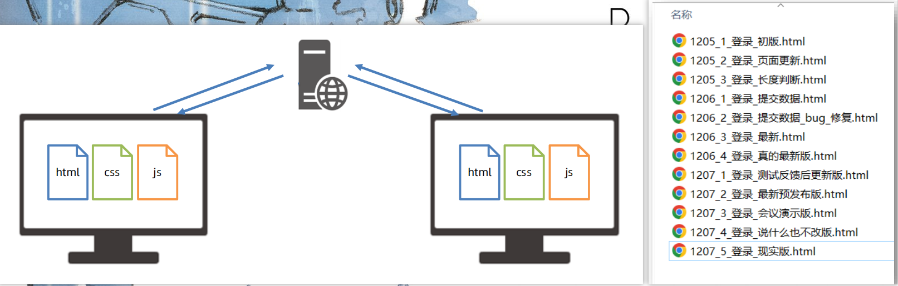

# Git 初识

[概念](https://developer.mozilla.org/zh-CN/docs/Glossary/Git)：一个免费开源，==分布式的代码版本控制系统==，帮助开发团队维护代码

作用：记录代码内容，切换代码版本，多人开发时高效合并代码内容

如何学：

个人本机使用：Git 基础命令和概念

多人共享使用：团队开发同一个项目的代码版本管理



# Git 安装

[Windows系统](https://git-scm.com/)：exe 程序，默认下一步即可

Mac系统：dmg 程序，默认下一步即可

检验成功：

1. 打开 bash 终端（git 专用）
2. 命令：==git -v==（查看版本号）


# Git 配置用户信息

配置：用户名和邮箱，应用在每次提交代码版本时表明自己身份

命令：

`git config --global user.name "itheima"` 

`git config --global user.email "itheima@itcast.cn"`

1. 为何学习 Git ？

✓ ==管理代码版本==，记录，切换，合并代码

2. Git 学习：

✓ 现在本机自己使用

✓ 再学习多人共享使用

3. 如何安装使用？

✓ 程序双击安装

✓ 在 `VSCode `中使用 bash 终端以及 git 命令

# 掌握 Git 仓库

Git 仓库（repository）：记录文件==状态==内容的地方，存储着`修改的历史记录`

创建：

1. 把本地文件夹转换成 Git 仓库：命令`git init`
2. 从其他服务器上克隆 Git 仓库

需求：创建一个空白的 Git 仓库

1. 什么是 Git 仓库 ？

✓ 记录文件状态内容和历史记录的地方（.git 文件夹）

2. 如何创建 Git 仓库？

✓ 把本地文件夹转换成 Git 仓库：命令 `git init`

✓ 从其他服务器上克隆 Git 仓库

# Git 的三个区域

Git 使用时：

==工作区==：实际开发时操作的文件夹

==暂存区==：保存之前的准备区域（暂存改动过的文件）

==版本库==：提交并保存暂存区中的内容，产生一个版本快照

需求：把登录页面新增后，暂存并提交


1. Git 使用时有哪些区域 ？

✓ 工作区，暂存区，版本库

2. 工作区的内容，最终要如何保存在版本库中？

✓ git add 添加到暂存区

✓ 等待时机后 git commit 提交保存到版本库，产生一次版本快照记录

# Git 文件状态

Git 文件 2 种状态：

✓ ==未跟踪==：新文件，从未被 Git 管理过

✓ ==已跟踪==：Git 已经知道和管理的文件

使用：修改文件，暂存，提交保存记录，如此反复

需求：新增` css` 文件，并使用 git status -s 查看文件状态，并最终提交

第一列是暂存区状态

第二列是工作区状态 


1. Git 文件状态分为哪 2 种 ？

✓ 未跟踪和已跟踪（新添加，未修改，已修改）

2. 如何查看暂存区和工作区文件状态？

✓ git status -s

# Git 暂存区使用

暂存区：暂时存储，可以临时恢复代码内容，与版本库解耦

暂存区 -> 覆盖 -> 工作区，命令：git restore 目标文件（==注意：完全确认覆盖时使用==）

从暂存区移除文件，命令：`git rm --cached `目标文件


1. 如何移除暂存区已暂存的文件？

✓ ==git rm --cached== 目标文件

## 练习-登录页面

需求：新增 JS 代码并暂存提交产生新的版本快照

步骤

1. 新增 `js` 文件和内容
2. 临时存放在暂存区
3. 提交保存到版本库


# Git 回退版本

概念：把版本库某个版本对应的内容快照，恢复到工作区/暂存区

查看提交历史：`git log --oneline`

回退命令：

git reset --soft 版本号（其他文件未跟踪）

==git reset --hard 版本号==

git reset --mixed 版本号 （与 git reset 等价）

注意1：只有记录在版本库的提交记录才能恢复

注意2：回退后，继续修改->暂存->提交操作即可（产生新的提交记录过程）


1. 什么是 Git 回退版本？

✓ 把版本库某个版本对应的内容快照，恢复到工作区/暂存区

2. 强制覆盖暂存区和工作区的命令？

✓ `git reset --hard 版本号`

3. 如何查看提交历史？

✓ `git log --oneline `

✓ `git reflog --oneline`

`git ls-files 查看暂存区文件列表 `

# 删除文件

需求：删除 editor.js 文件，并产生一次版本记录

步骤：

1. 手动删除工作区文件
2. 暂存变更/手动删除暂存区文件造成变更
3. 提交保存

总结：

工作区只要改变，都可以暂存提交产生新记录


# 忽略文件

概念：`.gitignore` 文件可以让 git 彻底==忽略跟踪==指定文件

目的：让 git 仓库更小更快，避免重复无意义的文件管理

例如：

1. 系统或软件自动生成的文件
2. 编译产生的结果文件
3. 运行时生成的日志文件，缓存文件，临时文件等
4. 涉密文件，密码，秘钥等文件

创建：

1. 项目根目录新建 `.gitignore `文件
2. 填入相应配置来忽略指定文件

注意：如果文件已经被暂存区跟踪过，可以从暂存区移除即可

```c
# 忽略npm下载的第三方包
node_modules
# 忽略分发文件夹
dist
# 忽略VSCode配置文件
.vscode
# 忽略秘钥文件
*.pem
*.cer
# 忽略日志文件
*.log
#忽略密码文件
password.txt

```

