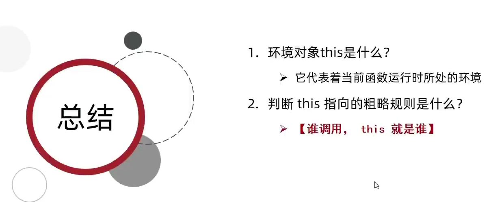
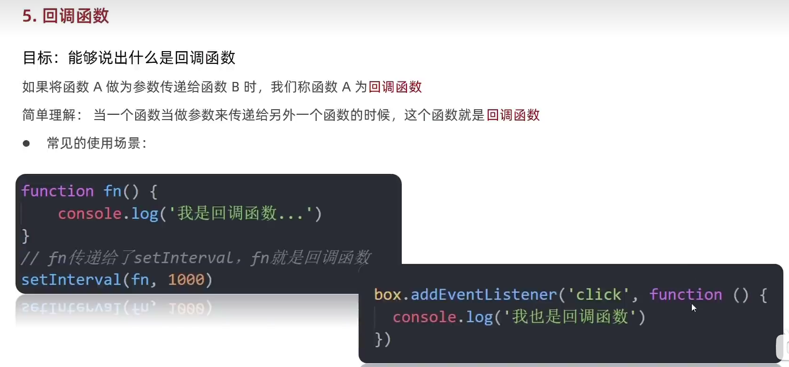
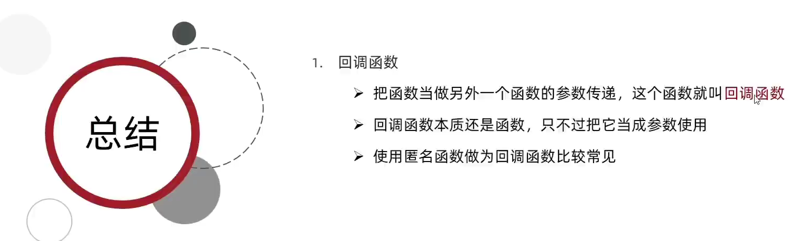

# JS基础-ECMAScript

## 对象

### 使用原型(prototype">创建对象

当我们创建一个函数时，函数就会自动拥有一个`prototype`属性，这个属性的值是一个对象，这个对象被称为该函数的原型对象。也可以叫做原型。

```
function Store("> {};
Store.prototype.name = "SF Express";
Store.prototype.locaion = "Hong Kong";
Store.prototype.salesVolume = 1200000000;
// 创建对象
var myStore = new Store()
// 创建一个新的对象
var hisStore = new Store()
hisStore.name = "STO Express";    // 覆盖了原来的name属性
```

### 属性的检测

属性的检测指检查对象是否有某个属性或者方法，需要使用运算符`in`，`in`的左侧是属性或者方法名，右侧是检查对象，对象有该属性或者方法则返回

```
var school = {
    name:"SJTU",
    location:"ShangHai",
    studentNum:40000,
    display:function("> {
          console.log(this.name)
    }
};
// 检测属性
console.log("name" in school)    // 输出true
console.log("sales" in school)    // 输出false
// 检测方法
console.log("display" in school)    // 输出true
console.log("print" in school)    // 输出false
```

`true`，否则返回`false`

### Date对象

```
展示了用来创建一个日期对象的多种方法
var today = new Date()
var birthday = new Date('December 17, 1995 03:24:00')
var birthday = new Date('1995-12-17T03:24:00')
var birthday = new Date(1995, 11, 17)
var birthday = new Date(1995, 11, 17, 3, 24, 0)
```

### 内置对象

#### Math对象

##### Math对象生成随机数

```
// 生成一个0到10的随机数
        let getRandom = Math.floor(Math.random()11)
        // 生成一个3到10的随机数
        // let b = Math.floor(Math.random()(10 - 3 + 1"> + 3)
        let b = Math.floor(Math.random()(10 - 3 + 1">"> + 3;
        // 生成一个N到M的随机数
        // let c = Math.floor(Math.random()(M - N + 1"> + N)
        // let c = Math.floor(Math.random()(M - N + 1"> "> + N;
        console.log(b)
```


![image-20230427191540227**

### 数据类型

**==值类型== 存储的值的本身**

**==引用类型== 存储的仅是地址**

![image-20230427191324737

#### 堆和栈

**引用数据类型的值实际存储在堆中**


# Web-APIs

## 变量的声明

**const优先**


## 总结 

**数组和对象建议用const来声明**


## 1.DOM


**DOM树**


### DOM对象


```
 //浏览器根据HTML标签自动生成了DOM对象
        // 显示选中的第一个标签 query查询 Selector选择器
        let div = document.querySelector('div')
        // 在控制台显示DOM对象
        console.dir(div)
```


### ==获取DOM元素==

****


**根据CSS选择器来获取DOM元素**


**修改元素内容·**


```js
// 获取元素
        const box = document.querySelector('.box')
        // 修改元素内容
        // box.innerText = '我是盒子'//修改文字内容
        // console.log(box.innerText)//获取文字内容
        // box.innerText = '<b>我是盒子</b>';//innerText 不能解析HTML标签元素
        // box.innerHTML = '<b>我是盒子</b> '//innerHTML可以解析HTML标签元素
```

### 操作元素常用属性

```js
const img = document.querySelector('img')
        img.src = './images/2.webp';
        img.title = 'pink老师的艺术照'
```


### 操作元素样式属性

**小驼峰命名法**


### 操作类名来操作css


```
// 获取元素
        const div = document.querySelector('div')
        // 添加类名
        div.className = 'box nav';
```


### ==通过classlist修改样式==


```
 const div = document.querySelector('div')
        // 追加类add(">
        // div.classList.add('nav')
        //删除类名
        // div.classList.remove('box')
        // 切换类toggle 有则删除无则添加
        // div.classList.toggle('box')
        div.classList.toggle('nav')
```


### 随机轮播图

```
/* 生成随机数 */
    const random = Math.floor(Math.random()sliderData.length)
    /* 1.获取图片元素 */
    const img = document.querySelector('.slider-wrapper img')
    img.src = sliderData[random].url;
    /*  2.获取标题元素 */
    const p = document.querySelector('.slider-footer p')
    p.innerHTML = sliderData[random].title;
    /* 3.获取slider-footer元素 */
    const footer = document.querySelector('.slider-footer')
    /* 修改背景颜色 */
    footer.style.backgroundColor = sliderData[random].color;
    /* 获取对应的小圆点 */
    const li = document.querySelector(`.slider ul li:nth-child(${random + 1}">`)
    /* 为获取的li添加active 类名 */
    li.classList.add('active')
```

### 操作表单元素的属性


### 自定义属性


### 定时器函数

```
 // setInterval(函数,间隔时间">时间单位是毫秒
        setInterval(function ("> {
            console.log('计时')
        }, 1000)
        // 函数会自动调用不必再次调用否则会出错
        function fn("> {
            console.log('计时1')
        }
        // setInterval(fn(">, 1000)
        // setInterval(函数, 间隔时间">返回的是一个数字代表的是第几个计时器
        let m = setInterval(fn, 1000)
        console.log(m)
        // 停止定时器
        clearInterval(m)
```


### 轮播图定时器版


## 2.DOM 

### 事件监听


**事件监听的实质: 就是让程序检测是否有事件产生，一旦有事件触发就立即调用一个函数做出响应，也称为注册事件**

**三要素:事件源 事件类型 事件调用的函数**


### 随机点名案例


### 事件监听关于const的小问题

```
 const btn = document.querySelector('button')
        btn.addEventListener('click', function () {
            // js 有垃圾回收机制该函数执行完之后该函数产生的数据会被清除
            const random = Math.random()
            console.log(random)
        })
```

### 事件监听版本(了解即可">


### 事件类型


```
  const div = document.querySelector('div')
        // 鼠标移入事件源 触发事件
        div.addEventListener('mouseenter', function ("> {
            console.log(`轻轻的我来了`)
        }">
        // 鼠标离开事件源 触发事件
        div.addEventListener('mouseleave', function ("> {
            console.log(`轻轻的我走了`)
        }">

```

### 事件对象


#### 获取事件对象


**trim()方法清除字符串两侧的空格**

```
// trim(">方法清除字符串两侧的空格
        if (tx.value.trim("> !== ''"> {
          item.style.display = 'block';
          text.innerHTML = tx.value;
        }
```

### 环境对象

目标:能够分析判断函数运行在不同环境中this所指代的对象

环境对象:指的是函数内部特殊的变量 **this**，它代表着当

前函数运行时所处的环境作用:弄清楚this的指向，可以让我们代码更简洁

函数的调用方式不同，this指代的对象也不同

> **==【谁调用, this就是谁】==是判断this指向的粗略规则   代表当前函数运行时所处的环境** 


### 回调函数



>
>
>
>
>

### tab栏切换案例

```
   // 1.导航栏
    const as = document.querySelectorAll('.tab-nav a');
    //2.为导航栏中的a添加事件监听 
    for (let i = 0; i < as.length; i++) {
      as[i].addEventListener('mouseenter', function () {
        document.querySelector('.tab-nav .active').classList.remove('active');
        this.classList.add('active');
     // 3.内容的切换 干掉其他的添加新的
        document.querySelector('.tab-content .active').classList.remove('active');
        document.querySelector(`.tab-content .item:nth-child(${i + 1})`).classList.add('active');
      })
    }
     
```

### 表单全反选案例

```
// 一. 业务一 全选控制小按钮功能
    // 获取全选框
    const checkAll = document.querySelector("#checkAll");
    const cks = document.querySelectorAll(".ck");
    // 添加事件监听
    checkAll.addEventListener('click', function () {
      for (i = 0; i < cks.length; i++) {
      //遍历所有小复选框 使其小复选框的checked = 全选框的checked
        cks[i].checked = checkAll.checked;
      }
    })
```


#### CSS伪类选择器

```
 /* 选择被勾选的复选框 */
        .ck:checked {
            height: 20px;
            width: 20px;
        }
           <input type="checkbox" name="" class="ck">
    <input type="checkbox" name="" class="ck">
    <input type="checkbox" name="" class="ck">
```

