# JS进阶

## 作用域

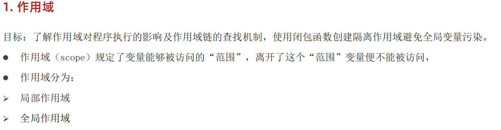

### 局部作用域

局部作用域分为函数作用域和块作用域。

#### 函数作用域

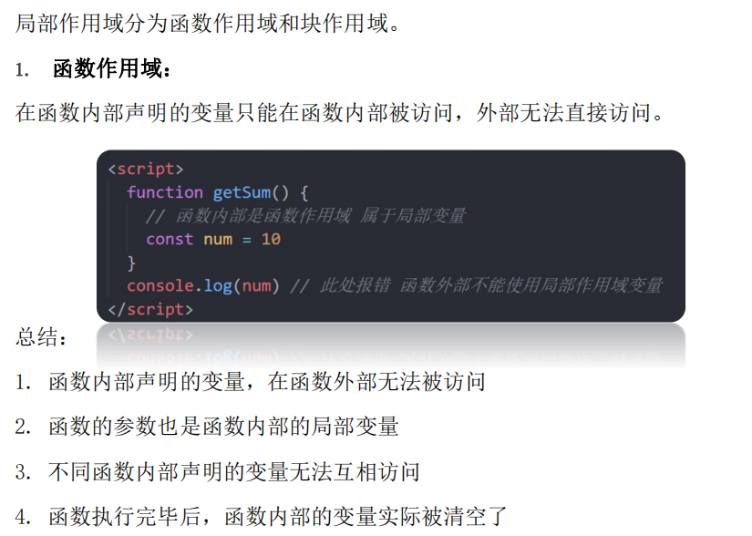

#### 块作用域

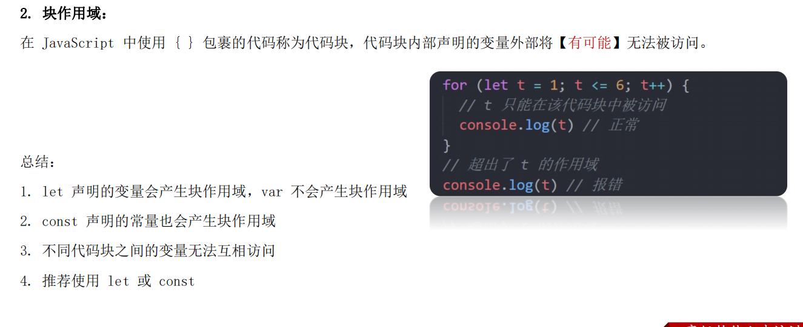

### 全局作用域

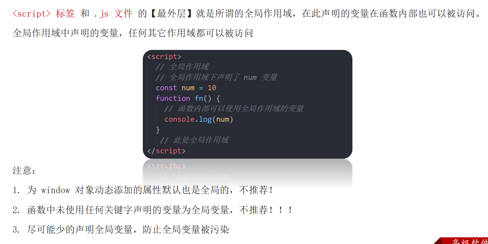

### 总结

1.全局作用域有哪些？

<script>标签内部
js文件

2.全局作用域声明的变量其他作用域能使用吗？
相当能
JavaScript中的作用域是程序被执行时的底层机制，了解这一机制有
助于规范代码书写习惯，避免因作用域导致的语法错误。

### 作用域链

作用域链本质上是底层的变量查找机制。

> 在函数被执行时，会优先查找当前函数作用域中查找变量
>
> 如果当前作用域查找不到则会依次逐级查找父级作用域直到全局作用域

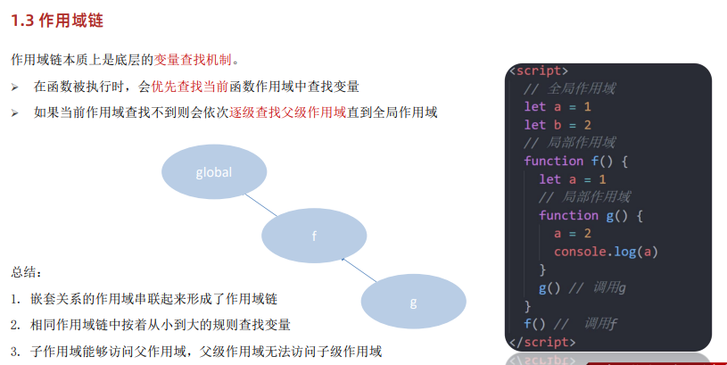

### JS垃圾回收机制

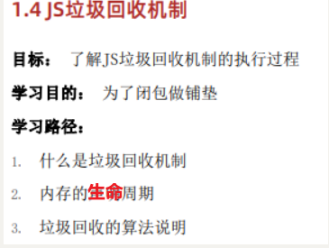

内存的生命周期

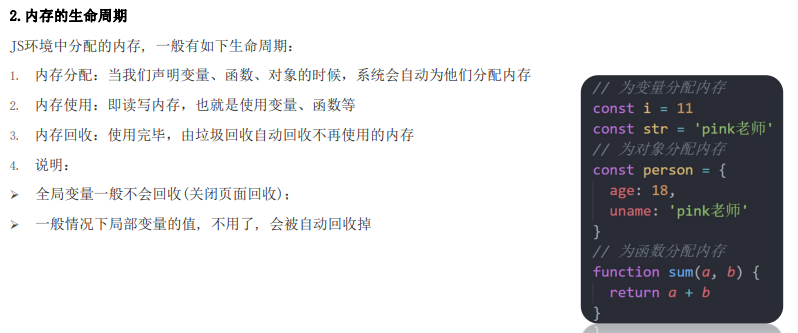

总结

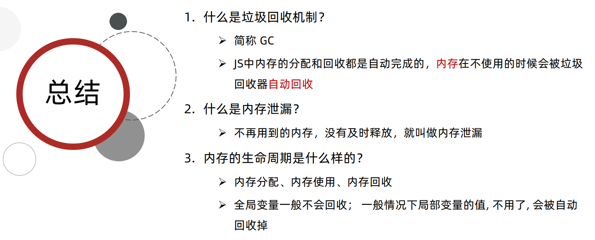

拓展JS垃圾回收机制-算法说明

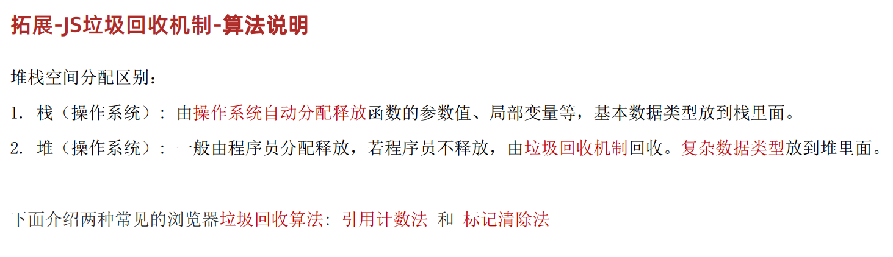

引用计数法

IE采用的引用计数算法，定义“内存不再使用”，就是看一个对象是否有指向它的引用，没有引用了就回收对象
算法：

1.跟踪记录被引用的次数
2.如果被引用了一次，那么就记录次数1，多次引用会累加++
3.如果减少一个引用就减1

4.如果引用次数是0，则释放内存

但它却存在一个致命的问题：嵌套用（循环引用）
如果两个对象相互引用，尽管他们已不再使用，垃圾回收器不会进行回收，导致内存泄露

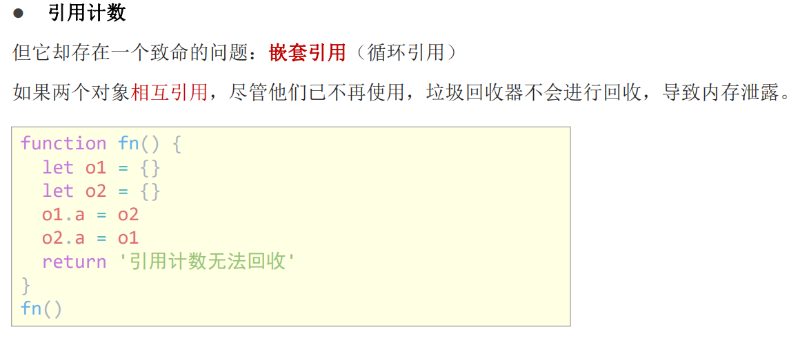

标记清除法

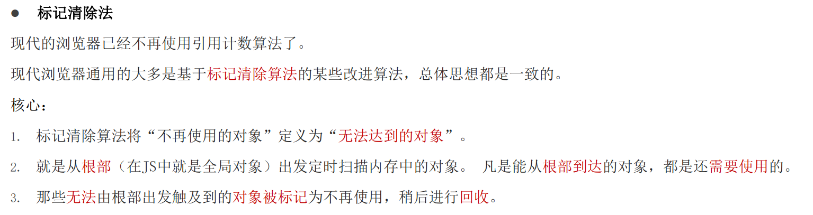

标记清除法原理

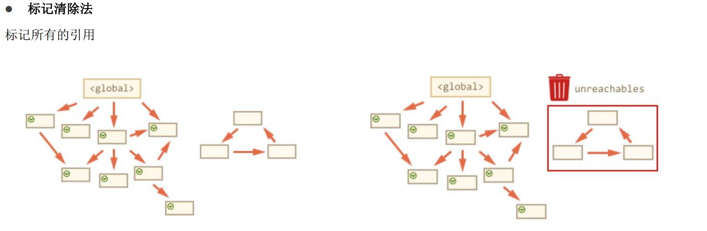
