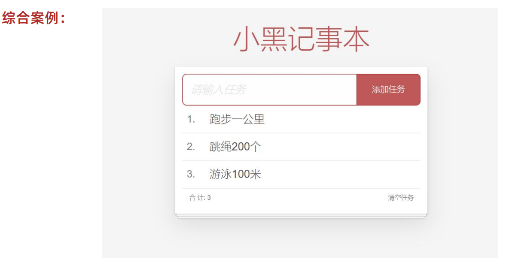
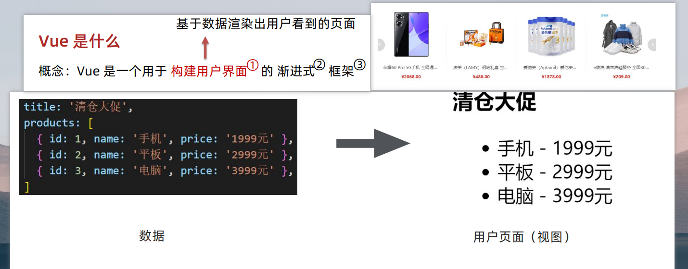
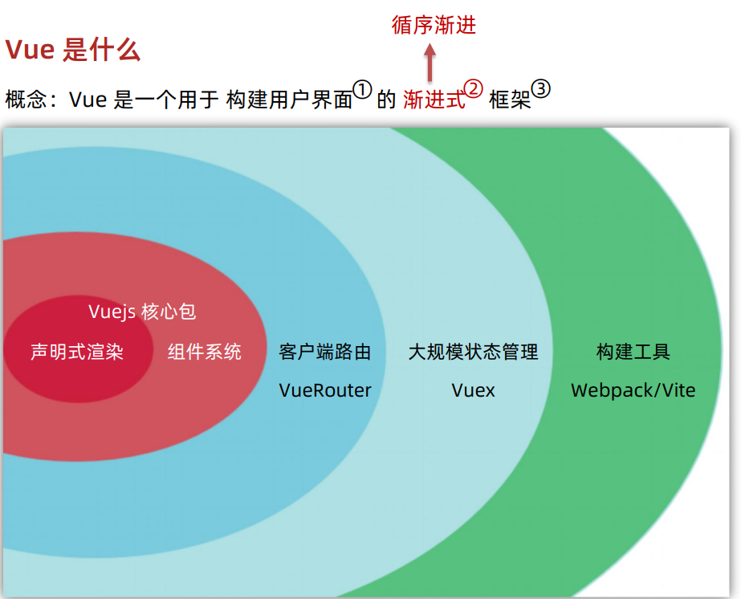
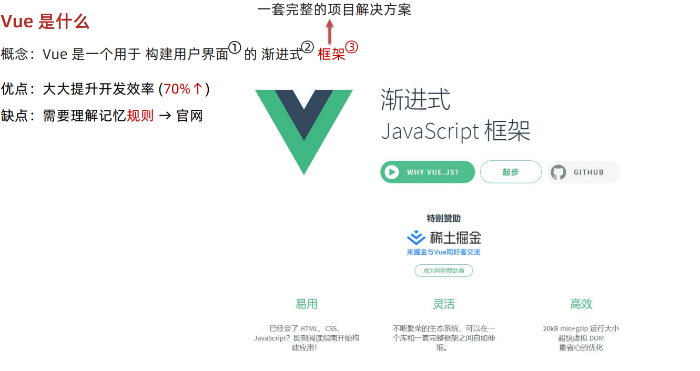
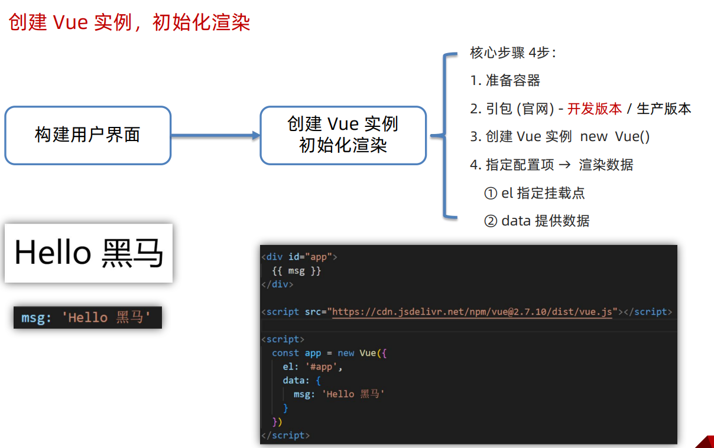
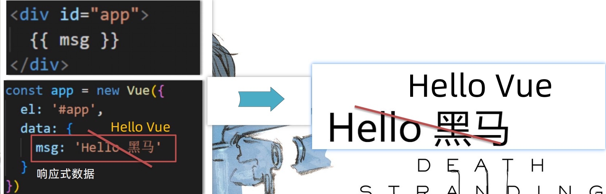
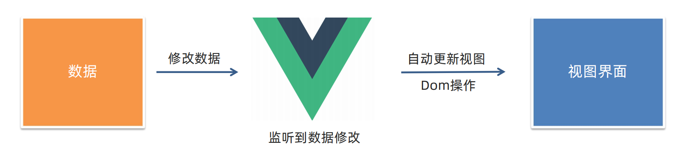
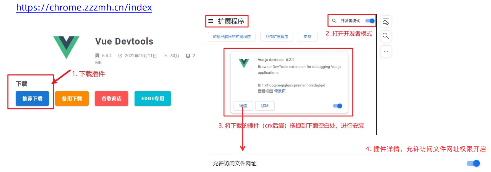
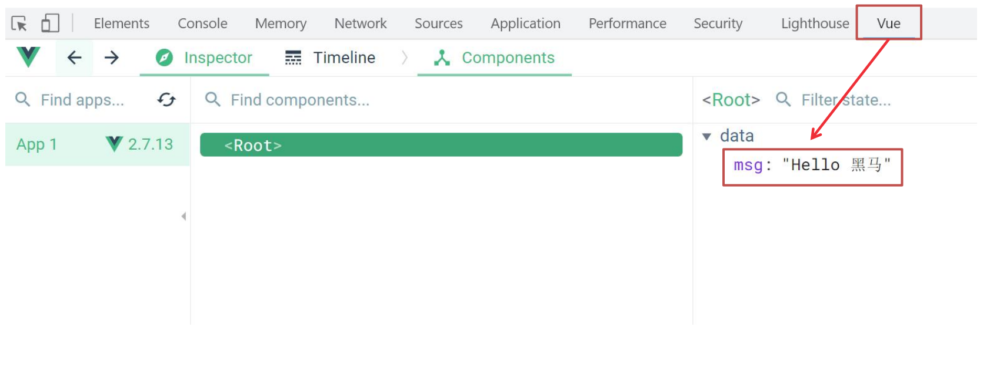
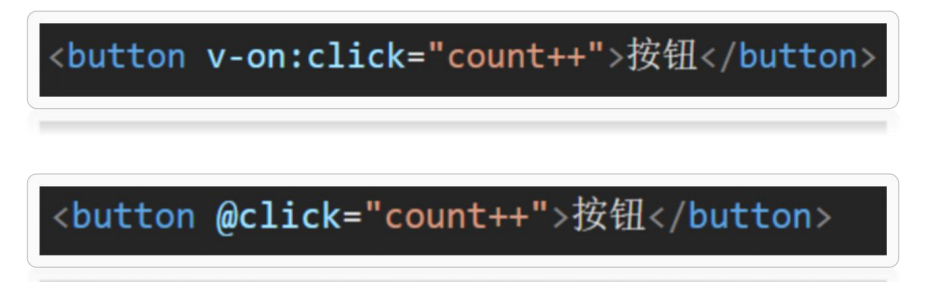

[Vue阶段作业地址 ](https://gitee.com/jepsonpp/vue-homework/blob/master/Vue%E5%9F%BA%E7%A1%80.md)

# Vue 核心技术与实战 day01

Vue 快速上手 

Vue 概念 / 创建实例 / 插值表达式 / 响应式特性 / 开发者工具  

Vue 指令 

v-html / v-show / v-if / v-else / v-on / v-bind / v-for / v-model

综合案例 - 小黑记事本 

列表渲染 / 删除功能 / 添加功能 / 底部统计 / 清空



## Vue快速上手

### Vue 是什么 

 概念：Vue 是一个用于 **构建用户界面** 的 渐进式 框架

​                            基于数据渲染出用户看到的页面



Vue 的两种使用方式： 

① Vue 核心包开发 

场景：局部 模块改造 

② Vue 核心包 & Vue 插件 工程化开发 

场景：整站 开发





Vue是什么？

 Vue 是一个用于 构建用户界面 的 渐进式 框架 

1. 构建用户界面：基于 数据 动态 渲染 页面 

2. 渐进式：循序渐进的学习 

3. 框架：一套完整的项目解决方案，`提升开发效率↑ (理解记忆规则)` 

​                                                                              规则→ 官网

### 创建 Vue 实例，初始化



创建 Vue 实例，初始化渲染的核心步骤：

1. 准备容器 

2. 引包 (官网) - 开发版本 / 生产版本 

3. 创建 Vue 实例 new Vue() 

4. 指定配置项 el data => 渲染数据 

① el 指定挂载点，选择器指定控制的是哪个盒子 

② data 提供数据

### 插值表达式 {{ }}

插值表达式是一种 Vue 的模板语法


**1. 作用:** 利用表达式进行插值，渲染到页面中

表达式：是可以被求值的代码，JS引擎会将其计算出一个结果

**2. 语法：**{{ 表达式 }}

```html
<p>{{nickname.toUpperCase()}}</p>
<p>{{age+'是成年人'}}</p>
<p>{{age>=18? '成年' :'未成年'}}</p>
<p>{{friend.name}}</p>
<p>{{friend.desc}}</p>
```

**3. 注意点：**

（1）使用的数据必须存在 （data）

````html
<p>{{hobby}}</p>
````

（2）支持的是表达式，而非语句，比如：if for ... 

````html
<p>{{if}}</p>
````

（3）不能在标签属性中使用 {{ }} 插值

`````html
<p name="{{nickname}}"></p>
`````

1. 插值表达式的作用是什么？

利用表达式进行插值，将数据渲染页面中

2. 语法格式？

{{ 表达式 }}

3. 插值表达式的注意点：

① 使用的数据要存在 （data）

② 支持的是表达式，而非语句 if ... for

③ 不能在标签属性里面使用

### Vue 核心特性：响应式

我们已经掌握了基础的模板渲染，其实除了基本的模板渲染，Vue背后还做了大量工作。

比如：数据的响应式处理→ 响应式：数据变化，视图自动更新

如何访问 or 修改？data中的数据, 最终会被添加到实例上

① 访问数据： "实例.属性名"

② 修改数据： "实例.属性名" = "值"





数据改变，视图会自动更新

聚焦于数据 → 数据驱动视图

使用 Vue 开发，关注业务的核心逻辑，根据业务修改数据即可

1. 什么是响应式呢？

数据改变，视图自动更新

使用 Vue 开发 → 专注于业务核心逻辑 即可

2. 如何访问或修改数据呢？

data中的数据, 最终会被添加到实例上

① 访问数据： "实例.属性名"

② 修改数据： "实例.属性名" = "值"

### 安装 Vue 开发者工具：装插件调试 Vue 应用

（1）通过谷歌应用商店安装 （国外网站）

（2）极简插件: 下载 → 开发者模式 → 拖拽安装 → 插件详情允许访问文件

https://chrome.zzzmh.cn/index




打开 Vue 运行的页面，调试工具中 Vue 栏，即可查看修改数据，进行调试。



## Vue 指令

Vue 会根据不同的【指令】，针对标签实现不同的【功能】

指令：带有 v- 前缀 的 特殊 标签属性

### v-html

作用：设置元素的 innerHTML

语法：v-html = "表达式 "

1. 什么是 Vue 指令呢？

指令就是带有 v- 前缀 的特殊 属性，不同属性 对应 不同的功能

学习不同指令 → 解决不同业务场景需求

2. 如果需要动态解析标签，可以用哪个指令？语法？

v-html = "表达式 " → 动态设置元素 innerHTML

### **v-show**

1. 作用： 控制元素显示隐藏
2. 语法： v-show = "表达式" 表达式值 true 显示， false 隐藏
3. 原理： 切换 display:none 控制显示隐藏
4. 场景： 频繁切换显示隐藏的场景

### **v-if**

1. 作用： 控制元素显示隐藏（条件渲染）
2. 语法： v-if = "表达式" 表达式值 true 显示， false 隐藏
3. 原理： 基于条件判断，是否 创建 或 移除 元素节点
4. 场景： 要么显示，要么隐藏，不频繁切换的场景

### v-else v-else-if

**1. 作用：** 辅助 v-if 进行判断渲染

**2. 语法：** v-else v-else-if = "表达式"

**3. 注意：** 需要紧挨着 v-if 一起使用

### v-on

**1. 作用：** 注册事件 = 添加监听 + 提供处理逻辑

**2. 语法：**

① v-on:事件名 = "内联语句"

② ==v-on:事件名 = "methods中的函数名"==

**3. 简写：**@事件名



1. 作用： 注册事件 = 添加监听 + 提供处理逻辑
2. 语法：
① v-on:事件名 = "内联语句"
② v-on:事件名 = "methods中的函数名"
3. 简写：@事件名
4. 注意：methods函数内的 ==**this** 指向 Vue 实例==  