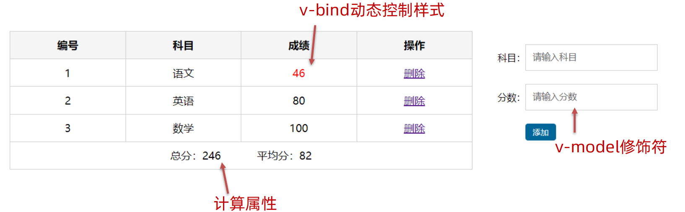
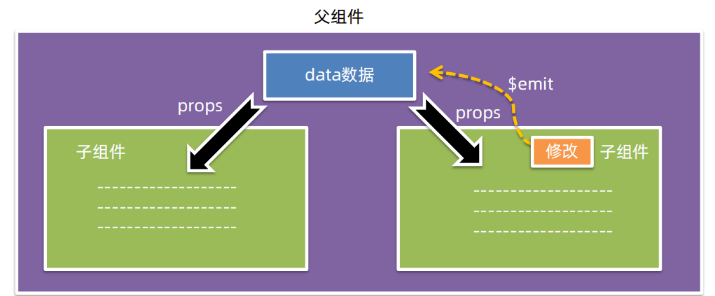

[Vue阶段作业地址 ](https://gitee.com/jepsonpp/vue-homework/blob/master/Vue%E5%9F%BA%E7%A1%80.md)

# Vue 核心技术与实战 day01

Vue 快速上手 

Vue 概念 / 创建实例 / 插值表达式 / 响应式特性 / 开发者工具  

Vue 指令 

v-html / v-show / v-if / v-else / v-on / v-bind / v-for / v-model

综合案例 - 小黑记事本 

列表渲染 / 删除功能 / 添加功能 / 底部统计 / 清空


## Vue快速上手

### Vue 是什么 

 概念：Vue 是一个用于 **构建用户界面** 的 渐进式 框架

​                            基于数据渲染出用户看到的页面


Vue 的两种使用方式： 

① Vue 核心包开发 

场景：局部 模块改造 

② Vue 核心包 & Vue 插件 工程化开发 

场景：整站 开发


Vue是什么？

 Vue 是一个用于 构建用户界面 的 渐进式 框架 

1. 构建用户界面：基于 数据 动态 渲染 页面 

2. 渐进式：循序渐进的学习 

3. 框架：一套完整的项目解决方案，`提升开发效率↑ (理解记忆规则)` 

​                                                                              规则→ 官网

### 创建 Vue 实例，初始化


创建 Vue 实例，初始化渲染的核心步骤：

1. 准备容器 

2. 引包 (官网) - 开发版本 / 生产版本 

3. 创建 Vue 实例 new Vue() 

4. 指定配置项 el data => 渲染数据 

① el 指定挂载点，选择器指定控制的是哪个盒子 

② data 提供数据

### 插值表达式 {{ }}

插值表达式是一种 Vue 的模板语法


**1. 作用:** 利用表达式进行插值，渲染到页面中

表达式：是可以被求值的代码，JS引擎会将其计算出一个结果

**2. 语法：**{{ 表达式 }}

```html
<p>{{nickname.toUpperCase()}}</p>
<p>{{age+'是成年人'}}</p>
<p>{{age>=18? '成年' :'未成年'}}</p>
<p>{{friend.name}}</p>
<p>{{friend.desc}}</p>
```

**3. 注意点：**

（1）使用的数据必须存在 （data）

````html
<p>{{hobby}}</p>
````

（2）支持的是表达式，而非语句，比如：if for ... 

````html
<p>{{if}}</p>
````

（3）不能在标签属性中使用 {{ }} 插值

`````html
<p name="{{nickname}}"></p>
`````

1. 插值表达式的作用是什么？

利用表达式进行插值，将数据渲染页面中

2. 语法格式？

{{ 表达式 }}

3. 插值表达式的注意点：

① 使用的数据要存在 （data）

② 支持的是表达式，而非语句 if ... for

③ 不能在标签属性里面使用

### Vue 核心特性：响应式

我们已经掌握了基础的模板渲染，其实除了基本的模板渲染，Vue背后还做了大量工作。

比如：数据的响应式处理→ 响应式：数据变化，视图自动更新

如何访问 or 修改？data中的数据, 最终会被添加到实例上

① 访问数据： "实例.属性名"

② 修改数据： "实例.属性名" = "值"


数据改变，视图会自动更新

聚焦于数据 → 数据驱动视图

使用 Vue 开发，关注业务的核心逻辑，根据业务修改数据即可

1. 什么是响应式呢？

数据改变，视图自动更新

使用 Vue 开发 → 专注于业务核心逻辑 即可

2. 如何访问或修改数据呢？

data中的数据, 最终会被添加到实例上

① 访问数据： "实例.属性名"

② 修改数据： "实例.属性名" = "值"

### 安装 Vue 开发者工具：装插件调试 Vue 应用

（1）通过谷歌应用商店安装 （国外网站）

（2）极简插件: 下载 → 开发者模式 → 拖拽安装 → 插件详情允许访问文件

https://chrome.zzzmh.cn/index


打开 Vue 运行的页面，调试工具中 Vue 栏，即可查看修改数据，进行调试。


## Vue 指令

Vue 会根据不同的【指令】，针对标签实现不同的【功能】

指令：带有 v- 前缀 的 特殊 标签属性

### v-html

作用：设置元素的 innerHTML

语法：v-html = "表达式 "

1. 什么是 Vue 指令呢？

指令就是带有 v- 前缀 的特殊 属性，不同属性 对应 不同的功能

学习不同指令 → 解决不同业务场景需求

2. 如果需要动态解析标签，可以用哪个指令？语法？

v-html = "表达式 " → 动态设置元素 innerHTML

### **v-show**

1. 作用： 控制元素显示隐藏
2. 语法： v-show = "表达式" 表达式值 true 显示， false 隐藏
3. 原理： 切换 display:none 控制显示隐藏
4. 场景： 频繁切换显示隐藏的场景

### **v-if**

1. 作用： 控制元素显示隐藏（条件渲染）
2. 语法： v-if = "表达式" 表达式值 true 显示， false 隐藏
3. 原理： 基于条件判断，是否 创建 或 移除 元素节点
4. 场景： 要么显示，要么隐藏，不频繁切换的场景

### v-else v-else-if

**1. 作用：** 辅助 v-if 进行判断渲染

**2. 语法：** v-else v-else-if = "表达式"

**3. 注意：** 需要紧挨着 v-if 一起使用

### v-on

**1. 作用：** 注册事件 = 添加监听 + 提供处理逻辑

**2. 语法：**

① v-on:事件名 = "内联语句"

② ==v-on:事件名 = "methods中的函数名"==

**3. 简写：**@事件名


1. 作用： 注册事件 = 添加监听 + 提供处理逻辑
2. 语法：
① v-on:事件名 = "内联语句"
② v-on:事件名 = "methods中的函数名"
3. 简写：@事件名
4. 注意：methods函数内的 ==**this** 指向 Vue 实例==  

### v-on 调用传参 @


### Vue 指令 v-bind :

**1. 作用：** 动态的设置html的标签属性 → src url title ... 

**2. 语法：** v-bind:属性名="表达式"

**3. 注意：** 简写形式 :属性名="表达式"

### 图片切换案例-波仔学习之旅


核心思路分析：

① 数组存储图片路径 → [ 图片1， 图片2， 图片3， ... ]

② 准备下标 index，数组[下标] → v-bind 设置 src 展示图片 → 修改下标切换图片

### Vue 指令 v-for

**1. 作用：** 基于数据循环， 多次渲染整个元素 → 数组、对象、数字... 

``<p v-for="...">我是一个内容</p>``

**2. 遍历数组语法：**

v-for = "(item, index) in 数组"

Ø ==item== 每一项， ==index== 下标

Ø 省略 index: v-for = "==item in 数组=="

### 图书管理案例 - 小黑的书架

**明确需求：**

① 基本渲染 → ==v-for==

② 删除功能 → 用 ==filter== 根据 id 从数组中删除对应项


### v-for 中的 key

**语法：**==key属性 = "唯一标识"==

**作用：**给列表项添加的唯一标识。便于Vue进行列表项的正确排序复用。

```html
<ul>
    <li v-for="(item, index) in booksList" :key="item.id">
        <span>{{ item.name }}</span>
        <span>{{ item.author }}</span>
        <button @click="del(item.id)">删除</button>
    </li>
</ul>
```

key作用：给元素添加的==唯一标识==。

### Vue 指令 v-model

**1. 作用:** 给 ==表单元素== 使用, ==双向数据绑定== → 可以快速 ==获取== 或 ==设置== 表单元素内容

① 数据变化 → 视图自动更新

② ==视图==变化 → ==数据==自动更新

**2. 语法:** v-model = '变量'


### 综合案例 - 小黑记事本

功能需求:

① 列表渲染

② 删除功能

③ 添加功能

④ 底部统计 和 清空

**功能总结：**

① 列表渲染：      

==v-for== ==key== 的设置 {{ }} 插值表达式

② 删除功能

==v-on== 调用传参 ==filter== 过滤 覆盖修改原数组

③ 添加功能

==v-model== 绑定 ==unshift== 修改原数组添加

④ 底部统计 和 清空

数组.length累计长度

覆盖数组清空列表

==v-show== 控制隐藏

# Vue 核心技术与实战day02

## 指令补充

### 指令修饰符

通过 "." 指明一些指令 ==后缀==，不同 ==后缀== 封装了不同的处理操作 → 简化代码

① 按键修饰符

`@keyup.enter` → 键盘回车监听

② v-model修饰符

`v-model.trim `→ 去除首尾空格

`v-model.number` → 转数字

③ 事件修饰符

@事件名.stop → 阻止冒泡

@事件名.prevent → 阻止默认行为

### v-bind 对于样式控制的增强

为了方便开发者进行==样式控制==， Vue 扩展了 ==v-bind== 的语法，可以针对 ==class 类名== 和 ==style 行内样式== 进行控制 。

### v-bind 对于样式控制的增强 - 操作class

语法` :class = "对象/数组"`

① `对象` → 键就是类名，值是布尔值。如果值为` true`，有这个类，否则没有这个类

适用场景：一个类名，来回切换

② `数组 `→ 数组中所有的类，都会添加到盒子上，本质就是一个 `class 列表`

适用场景：批量添加或删除类

### 案例：京东秒杀 tab 导航高亮

核心思路：

1. 基于数据动态渲染 tab                      → ==v-for==
2. 准备下标记录高亮的是哪一个 tab  → ==activeIndex==
3. 基于下标，动态控制 class 类名      → ==v-bind:class==

==所谓切换高亮，其实就是改下标==


### v-bind 对于样式控制的增强 - 操作style

语法 ==:style = "样式对象"==

`<div class="box" :style="{ CSS属性名1: CSS属性值, CSS属性名2: CSS属性值 }"></div>`

适用场景：某个具体属性的动态设置

## computed 计算属性

### 计算属性

**概念：**基于==现有的数据==，计算出来的==新属性==。 ==依赖==的数据变化，==自动==重新计算。

**语法：**

① 声明在 ==computed 配置项==中，一个计算属性对应一个函数

② 使用起来和普通属性一样使用 {{ ==计算属性名== }}

计算属性 → 可以将一段 求值的代码 进行封装

````js
data: {
    list: [
        { id: 1, name: '篮球', num: 1 },
        { id: 2, name: '玩具', num: 2 },
        { id: 3, name: '铅笔', num: 5 },
    ]
},
computed: {
    计算属性名 () {
        基于现有数据，编写求值逻辑
        return 结果
    }
},
````
### computed 计算属性 vs methods 方法

**computed 计算属性：**

**作用：**封装了一段对于==数据==的处理，求得一个==结果==。

**语法：**

① 写在 ==computed== 配置项中

② 作为属性，直接使用 → ==this.计算属性== {{ ==计算属性== }}

**methods 方法：**

**作用：**给实例提供一个==方法==，调用以处理==业务逻辑==。

**语法：**

① 写在 methods 配置项中

② 作为方法，需要调用 → ==this.方法名( )== {{ ==方法名()== }} @事件名="==方法名=="

==**缓存特性**（提升性能）==：

计算属性会对计算出来的==结果缓存==，再次使用直接读取缓存，

依赖项变化了，会==自动==重新计算 → 并==再次缓存==

`计算属性是属性，能访问，应该也能修改了？`

### 完整写法

计算属性默认的简写，只能读取访问，==不能 "修改"==。

如果要 =="修改"== → 需要写计算属性的==完整写法==。

```js
computed: {
    计算属性名 () {
        一段代码逻辑（计算逻辑）
        return 结果
    }
}
computed: {
    计算属性名: {
        get() {
        一段代码逻辑（计算逻辑）
        return 结果
        },
        set(修改的值) {
        一段代码逻辑（修改逻辑）
        }
    }
}
```


### 综合案例 - 成绩案例

需求说明：

1. 渲染功能
2. 删除功能
3. 添加功能

4. 统计总分，求平均分



**业务技术点总结：**

1. 渲染功能（不及格高亮）

==v-if v-else== v-for ==v-bind:class==

2. 删除功能

点击传参 filter过滤覆盖原数组

==.prevent== 阻止默认行为

3. 添加功能

v-model ==v-model修饰符(.trim .number)==

==unshift== 修改数组更新视图

4. 统计总分，求平均分

==计算属性== reduce求和

## watch 侦听器（监视器）

作用：==监视数据变化==，执行一些 业务逻辑 或 异步操作。

语法：

==① 简单写法 → 简单类型数据，直接监视==

```js
data: { 
    words: '苹果',
    obj: {
        words: '苹果'
    }
},
watch: {
    // 该方法会在数据变化时，触发执行
    数据属性名 (newValue, oldValue) {
        一些业务逻辑 或 异步操作。
    },
    '对象.属性名' (newValue, oldValue) {
        一些业务逻辑 或 异步操作。
    }
}
```


② 完整写法 → 添加额外==配置项==

(1) ==deep: true== 对复杂类型深度监视

(2) ==immediate: true== 初始化立刻执行一次handler方法

```js
data: {
    obj: {
        words: '苹果',
        lang: 'italy'
    },
},
watch: {// watch 完整写法
    数据属性名: {
    deep: true, // 深度监视
    handler (newValue) {
        console.log(newValue)
    }
}
}


data: {
    obj: {
        words: '苹果',
        lang: 'italy'
    },
},
watch: {// watch 完整写法
数据属性名: {
    deep: true, // 深度监视
    immediate: true, // 是否立刻执行一次handler
    handler (newValue) {
        console.log(newValue)
    }
 }
}
```


需求：默认文本，==一进入页面，立刻翻译==一次

watch侦听器的语法有几种？

① 简单写法 → 监视简单类型的变化

```js
watch: {
    数据属性名 (newValue, oldValue) {
        一些业务逻辑 或 异步操作。
    },
    '对象.属性名' (newValue, oldValue) {
        一些业务逻辑 或 异步操作。
    }
}
```

② 完整写法 → 添加额外的配置项 (深度监视复杂类型，立刻执行)

```js
watch: {// watch 完整写法
    数据属性名: {
        deep: true, // 深度监视(针对复杂类型)
        immediate: true, // 是否立刻执行一次handler
        handler (newValue) {
            console.log(newValue)
        }
    }
}
```

## 综合案例 - 水果购物车

需求说明：

1. 渲染功能
2. 删除功能
3. 修改个数
4. 全选反选
5. 统计 ==选中的== 总价 和 总数量
6. 持久化到本地


**业务技术点总结：**

1. 渲染功能： ==v-if/v-else v-for :class==
2. 删除功能: ==点击传参== ==filter==过滤覆盖原数组
3. 修改个数：==点击传参== ==find==找对象
4. 全选反选：计算属性==computed== 完整写法 ==get/set==
5. 统计选中的总价和总数量: 计算属性==computed== ==reduce==条件求和
6. 持久化到本地： ==watch==监视，==localStorage==，==JSON.stringify==, ==JSON.parse==

# Vue 核心技术与实战day03

## 生命周期

### Vue 生命周期 和 生命周期的四个阶段

思考：什么时候可以发送==初始化渲染请求==？（越早越好） 什么时候可以开始==操作dom==？（至少dom得渲染出来）

Vue生命周期：一个Vue实例从 ==创建== 到 ==销毁== 的整个过程。

生命周期四个阶段：① 创建 ② 挂载 ③ 更新 ④ 销毁


### Vue 生命周期函数（钩子函数）

Vue生命周期过程中，会==自动运行一些函数==，被称为==【生命周期钩子】==→ 让开发者可以在==【特定阶段】==运行==自己的代码==。

### Vue 生命周期钩子案例 - 新闻列表 & 输入框自动聚焦

==created== 数据准备好了，可以开始发送==初始化渲染请求==。


==mounted== 模板渲染完成，可以开始==操作DOM==了


## 小黑记账清单


功能需求：

1. 基本渲染
2. 添加功能
3. 删除功能
4. 饼图渲染


## 工程化开发入门

### 工程化开发 & 脚手架 Vue CLI

**基本介绍：**

Vue CLI 是 Vue 官方提供的一个==全局命令==工具。

可以帮助我们==快速创建==一个开发 Vue 项目的==标准化基础架子==。【集成了 webpack 配置】

**好处：**

1. 开箱即用，零配置
2. 内置 babel 等工具
3. 标准化

**使用步骤：**

1. 全局安装 (一次) ：`yarn global add @vue/cli `或 `npm i @vue/cli -g`
2. 查看 Vue 版本：`vue --version`
3. 创建项目架子：`vue create project-name`（项目名-不能用中文）
4. 启动项目：` yarn serve` 或 `npm run serve`（找package.json）


### 脚手架目录文件介绍 & 项目运行流程

```js
VUE-DEMO
│─node_modules 第三包文件夹
├─public 放html文件的地方
│ ├─favicon.ico 网站图标
│ └─< index.html index.html 模板文件 ③ >
├─src 源代码目录 → 以后写代码的文件夹
│ └─assets 静态资源目录 → 存放图片、字体等
│ └─components 组件目录 → 存放通用组件
│ └─< App.vue App根组件 → 项目运行看到的内容就在这里编写 ② >
│ └─< main.js 入口文件 → 打包或运行，第一个执行的文件 ① >
└─.gitignore git忽视文件
└─babel.config.js babel配置文件
└─jsconfig.json js配置文件
└─package.json 项目配置文件 → 包含项目名、版本号、scripts、依赖包等
└─README.md 项目说明文档
└─vue.config.js vue-cli配置文件
└─yarn.lock yarn锁文件，由yarn自动生成的，锁定安装版本
```


```js
main.js核心代码
//1. 导入 Vue
import Vue from 'vue'
//2. 导入 App.vue
import App from './App.vue'
//3. 实例化 Vue，将 App.vue 渲染到 index.html 容器中
new Vue({
    render: h => h(App),
}).$mount('#app')
```

### 组件化开发 & 根组件

**① ==组件化==：**一个页面可以拆分成==一个个组件==，每个组件有着自己独立的==结构、样式、行为==。

好处：便于==维护==，利于复用 → 提升==开发效率==。

组件分类：普通组件、根组件。

**② 根组件：**整个应用最上层的组件，包裹所有普通小组件。


#### App.vue 文件（单文件组件）的三个组成部分

**1.** **语法高亮插件：**`Vetur`

**2. 三部分组成：**

◆ template：结构 （有且只能一个根元素）

◆ script: js逻辑

◆ style： 样式 (可支持less，需要装包)

**3. 让组件支持 less**

（1） style标签，lang="less" 开启less功能

（2） 装包:` yarn add less less-loader`


**(1) 组件化：**

页面可拆分成==一个个组件==，每个组件有着独立的==结构、样式、行为==

① 好处：便于==维护==，利于==复用== → 提升==开发效率==。

② 组件分类：普通组件、根组件。

**(2) 根组件：**

整个应用==最上层==的组件，包裹所有普通小组件。

一个根组件App.vue，包含的==三个部分==：

① `template` 结构 (只能有一个根节点)

②` style` 样式 (可以支持less，需要装包 less 和 less-loader )

③ `script` 行为

### 普通组件的注册使用

**组件注册的两种方式：**

#### ==局部注册：只能在注册的组件内使用==

1. ==局部注册：只能在注册的组件内使用==

① 创建 .vue 文件 (三个组成部分)

② 在使用的组件内导入并注册

2. 全局注册：所有组件内都能使用


**使用：**

◆ 当成 html 标签使用 `<组件名></组件名>`

**注意:** 

```js
// 导入需要注册的组件
//import 组件对象 from '.vue文件路径'
 import HmHeader from './components/HmHeader'
export default {
// 局部注册
    components: {
        '组件名': 组件对象,
        HmHeader: HmHeader
    }
}
```


#### ==全局注册：所有组件内都能使用==

① 创建 .vue 文件 (三个组成部分)

② ==main.js== 中进行全局注册

```js
// 导入需要全局注册的组件
import HmButton from './components/HmButton'
// 调用 Vue.component 进行全局注册
// Vue.component('组件名', 组件对象)
Vue.component('HmButton', HmButton)
```

**技巧：**

◆ 一般都用==局部注册==，如果发现确实是通用组件，再定义到全局。

#### 总结

**普通组件的注册使用：**

1. 两种注册方式：

① 局部注册：

(1) 创建.vue组件 (单文件组件)

(2) ==使用的组件==内导入，并局部注册 ==components: { 组件名：组件对象 }==

② 全局注册：

(1) 创建.vue组件 (单文件组件)

(2) ==main.js==内导入，并全局注册 ==Vue.component(组件名, 组件对象)==

2. 使用：

<组件名></组件名>

**技巧：**

一般都用==局部注册==，如果发现确实是==通用组件==，再抽离到全局。


## 综合案例 - 小兔鲜首页 - 组件拆分


页面开发思路：

1. 分析页面，==按模块拆分组件==，搭架子 (==局部或全局注册==)
2. 根据设计图，编写组件 html 结构 css 样式 (已准备好)
3. 拆分封装==通用小组件 (局部或全局注册)==

将来 → 通过 js 动态渲染，实现功能

# Vue 核心技术与实战day04

## **目录**

◆ 组件的三大组成部分 (结构/样式/逻辑)

scoped样式冲突 / data是一个函数

◆ 组件通信

组件通信语法 / 父传子 / 子传父 / 非父子 (扩展)

◆ 综合案例：小黑记事本 (组件版)

拆分组件 / 渲染 / 添加 / 删除 / 统计 / 清空 / 持久化

◆ 进阶语法

v-model原理 / v-model应用于组件 / sync修饰符 / ref 和 $refs / $nextTick

## 组件的三大组成部分 - 注意点说明

`结构<template>`

只能有一个根元素 

`样式<style>`

全局样式(默认)：影响所有组件

局部样式：scoped 下样式，只作用于当前组件

`逻辑<script>`

el 根实例独有, ==data 是一个函数,== 

其他配置项一致

### 组件的样式冲突 scoped

**默认情况**：写在组件中的样式会 ==全局生效== → 因此很容易造成多个组件之间的样式冲突问题。

1. ==全局样式==: 默认组件中的样式会作用到全局
2. ==局部样式==: 可以给组件加上 ==scoped== 属性, ==可以让样式只作用于当前组件==

**scoped原理？**

1. 当前组件内标签都被添加` data-v-hash`值 的属性
2. css选择器都被添加 `[data-v-hash值]` 的属性选择器

最终效果: ==必须是当前组件的元素==, 才会有这个自定义属性, 才会被这个样式作用到


### data 是一个函数

一个组件的 ==data== 选项必须是一个==函数==。→ 保证每个组件实例，维护==独立==的一份数据对象。

每次创建新的组件实例，都会新执行一次 data 函数，得到一个新对象。


组件三大组成部分的注意点：

1. 结构：有且只能一个根元素
2. 样式：默认全局样式，加上 ==scoped== 局部样式
3. 逻辑：==data是一个函数==，保证数据独立。

## 组件通信

### 什么是组件通信

组件通信, 就是指 组件与组件 之间的数据传递。

⚫ 组件的数据是独立的，无法直接访问其他组件的数据。

⚫ 想用其他组件的数据 → 组件通信


**思考：**

1. 组件之间有哪些关系？
2. 对应的组件通信方案有哪几类？

#### 不同的组件关系 和 组件通信方案分类

组件关系分类：

1. 父子关系
2. 非父子关系


#### 组件通信解决方案：

父子关系 props 和 $emit

非父子关系

1. provide & inject
2. eventbus

通用解决方案：Vuex （适合复杂业务场景）

父子通信流程图：

1. 父组件通过 props 将数据传递给子组件
2. 子组件利用 $emit 通知父组件修改更新



### 父 → 子

父组件通过 ==props== 将数据传递给子组件


### 子 → 父

子组件利用 ==$emit== 通知父组件，进行修改更新


1. 两种组件关系分类 和 对应的组件通信方案

==父子关系== ==→  props & $emit==

非父子关系 → provide & inject 或 eventbus

通用方案 → vuex

2. ==父子通信方案的核心流程==

2.1 父传子props：

① 父中给子添加属性传值 ② 子props 接收 ③ 子组件使用

2.2 子传父$emit：

① 子$emit 发送消息 ②父中给子添加消息监听 ③ 父中实现处理函数

什么是 prop

Prop 定义：==组件上== 注册的一些 ==自定义属性==

Prop 作用：向子组件传递数据

特点：

⚫ 可以 传递 ==任意数量== 的prop

⚫ 可以 传递 ==任意类型== 的prop


### props 校验

**思考：**组件的 prop 可以乱传么？

**作用：**为组件的 prop 指定==验证要求==，不符合要求，控制台就会有==错误提示== → 帮助开发者，快速发现错误

**语法：**

==① 类型校验==

② 非空校验

③ 默认值

④ 自定义校验

```js
props: {
	校验的属性名: 类型 // Number String Boolean ...
},
    
    
    
props: {
	校验的属性名: {
        type: 类型, // Number String Boolean ...
		required: true, // 是否必填
		default: 默认值, // 默认值
		validator (value) {
		// 自定义校验逻辑
		return 是否通过校验
		}
	}
},
```

### prop & data、单向数据流

共同点：都可以给组件提供数据。

区别：

⚫ data 的数据是==自己==的 → 随便改

⚫ prop 的数据是==外部==的 → 不能直接改，要遵循 ==单向数据流==

单向数据流：父级 prop 的数据更新，会向下流动，影响子组件。这个数据流动是单向的。

==口诀：谁的数据谁负责==

## 组件通信案例：小黑记事本 - 组件版

需求说明：

① 拆分基础组件

② 渲染待办任务

③ 添加任务

④ 删除任务

⑤ 底部合计 和 清空功能

⑥ 持久化存储


核心步骤：

① 拆分基础组件

新建组件 → 拆分存放结构 → 导入注册使用

② 渲染待办任务

提供数据==(公共父组件)== → ==父传子==传递 list → v-for 渲染

③ 添加任务

收集数据 v-model → 监听事件 → 子传父传递任务 → 父组件 unshift

④ 删除任务

监听删除携带 id → ==子传父==传递 id → 父组件 filter 删除

⑤ 底部合计 和 清空功能

底部合计：==父传子==传递 list → 合计展示

清空功能：监听点击 → ==子传父==通知父组件 → 父组件清空

⑥ 持久化存储：watch监视数据变化，持久化到本地

### 非父子通信 (拓展) - event bus 事件总线

作用：非父子组件之间，进行简易消息传递。(复杂场景 → Vuex)

1. 创建一个都能访问到的事件总线 (空 Vue 实例) → utils/EventBus.js

```js
import Vue from 'vue'
const Bus = new Vue()
export default Bus
```

2. A 组件(接收方)，监听 Bus 实例的事件

```js
created () {
Bus.$on('sendMsg', (msg) => {
this.msg = msg
})
}
```

3. B 组件(发送方)，触发 Bus 实例的事件

```js
Bus.$emit('sendMsg', '这是一个消息')
```


### 非父子通信 (拓展) - provide & inject

provide & inject 作用：==跨层级==共享数据。

1. 父组件 provide 提供数据

```js
export default {
provide () {
	return {
        // 普通类型【非响应式】
        color: this.color, 
        // 复杂类型【响应式】
        userInfo: this.userInfo, 
        }
}
}
```

2. 子/孙组件 inject 取值使用

```js
export default {
    inject: ['color','userInfo'],
    created () {
        console.log(this.color, this.userInfo)
    }
}
```


## 进阶语法

### v-model 原理

**原理：**v-model本质上是一个==语法糖==。例如应用在输入框上，就是 ==value属性== 和 ==input事件== 的合写。

**作用：**提供数据的双向绑定

① 数据变，视图跟着变 ==:value== 

② 视图变，数据跟着变 ==@input==

**注意：**==$event== 用于在模板中，获取事件的形参

```vue
<template>
    <div id="app" >
        <input v-model="msg" type="text">
        <input :value="msg" @input="msg = $event.target.value" type="text">
    </div>
</template>
```

### 表单类组件封装 & v-model 简化代码

1. 表单类组件 ==封装==→ 实现 子组件 和 父组件数据 的==双向绑定==

① ==父传子==：数据 应该是父组件 ==props== 传递 过来的，==拆解 v-model== 绑定数据

② ==子传父==：监听输入，子传父传值给父组件修改

父组件（使用）

```vue
<BaseSelect :cityId="selectId" @事件名="selecteId = $event" />
```

子组件（封装）

```vue
<select :value="cityId" @change="handleChange">...</select>
<script>
props: {
    cityId: String
},
methods: {
    handleChange (e) {
        this.$emit('事件名', e.target.value)
    }
}
</script>
```

2. 父组件` v-model` ==简化代码==，实现 子组件 和 父组件数据 ==双向绑定==

① 子组件中：props 通过 ==value== 接收，事件触发 ==input== 

②父组件中：==v-model==给组件直接绑数据==(:value+@input)==

父组件（使用）

```vue
<BaseSelect v-model="selectId"></BaseSelect>
```
子组件（封装）

```vue
<select :value="value" @change="handleChange">...</select>
<script>
props: {
    value: String
},
methods: {
    handleChange (e) {
        this.$emit('事件名', e.target.value)
    }
}
</script>
```


1. 表单类基础组件封装思路

① ==父传子==：父组件动态传递 ==prop== 数据，拆解v-model，绑定数据

② ==子传父==：监听输入，子传父传值给父组件修改

本质：实现了实现 ==子组件 和 父组件数据 的双向绑定==

2. v-model 简化代码的核心步骤

① 子组件中：props 通过 ==value== 接收，事件触发 ==input== 

② 父组件中： ==v-model== 给组件直接绑数据

3. 小作业：封装输入框组件，利用v-model简化代码