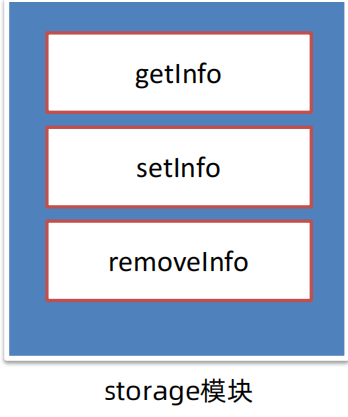

[Vue阶段作业地址 ](https://gitee.com/jepsonpp/vue-homework/blob/master/Vue%E5%9F%BA%E7%A1%80.md)

# Vue 核心技术与实战 day01


Vue 快速上手 

Vue 概念 / 创建实例 / 插值表达式 / 响应式特性 / 开发者工具  

Vue 指令 

v-html / v-show / v-if / v-else / v-on / v-bind / v-for / v-model

综合案例 - 小黑记事本 

列表渲染 / 删除功能 / 添加功能 / 底部统计 / 清空


## Vue快速上手

### Vue 是什么 

 概念：Vue 是一个用于 **构建用户界面** 的 渐进式 框架

​                            基于数据渲染出用户看到的页面


Vue 的两种使用方式： 

① Vue 核心包开发 

场景：局部 模块改造 

② Vue 核心包 & Vue 插件 工程化开发 

场景：整站 开发


Vue是什么？

 Vue 是一个用于 构建用户界面 的 渐进式 框架 

1. 构建用户界面：基于 数据 动态 渲染 页面 

2. 渐进式：循序渐进的学习 

3. 框架：一套完整的项目解决方案，`提升开发效率↑ (理解记忆规则)` 

​                                                                              规则→ 官网

### 创建 Vue 实例，初始化


创建 Vue 实例，初始化渲染的核心步骤：

1. 准备容器 

2. 引包 (官网) - 开发版本 / 生产版本 

3. 创建 Vue 实例 new Vue() 

4. 指定配置项 el data => 渲染数据 

① el 指定挂载点，选择器指定控制的是哪个盒子 

② data 提供数据

### 插值表达式 {{ }}

插值表达式是一种 Vue 的模板语法


**1. 作用:** 利用表达式进行插值，渲染到页面中

表达式：是可以被求值的代码，JS引擎会将其计算出一个结果

**2. 语法：**{{ 表达式 }}

```html
<p>{{nickname.toUpperCase()}}</p>
<p>{{age+'是成年人'}}</p>
<p>{{age>=18? '成年' :'未成年'}}</p>
<p>{{friend.name}}</p>
<p>{{friend.desc}}</p>
```

**3. 注意点：**

（1）使用的数据必须存在 （data）

````html
<p>{{hobby}}</p>
````

（2）支持的是表达式，而非语句，比如：if for ... 

````html
<p>{{if}}</p>
````

（3）不能在标签属性中使用 {{ }} 插值

`````html
<p name="{{nickname}}"></p>
`````

1. 插值表达式的作用是什么？

利用表达式进行插值，将数据渲染页面中

2. 语法格式？

{{ 表达式 }}

3. 插值表达式的注意点：

① 使用的数据要存在 （data）

② 支持的是表达式，而非语句 if ... for

③ 不能在标签属性里面使用

### Vue 核心特性：响应式

我们已经掌握了基础的模板渲染，其实除了基本的模板渲染，Vue背后还做了大量工作。

比如：数据的响应式处理→ 响应式：数据变化，视图自动更新

如何访问 or 修改？data中的数据, 最终会被添加到实例上

① 访问数据： "实例.属性名"

② 修改数据： "实例.属性名" = "值"


数据改变，视图会自动更新

聚焦于数据 → 数据驱动视图

使用 Vue 开发，关注业务的核心逻辑，根据业务修改数据即可

1. 什么是响应式呢？

数据改变，视图自动更新

使用 Vue 开发 → 专注于业务核心逻辑 即可

2. 如何访问或修改数据呢？

data中的数据, 最终会被添加到实例上

① 访问数据： "实例.属性名"

② 修改数据： "实例.属性名" = "值"

### 安装 Vue 开发者工具：装插件调试 Vue 应用

（1）通过谷歌应用商店安装 （国外网站）

（2）极简插件: 下载 → 开发者模式 → 拖拽安装 → 插件详情允许访问文件

https://chrome.zzzmh.cn/index


打开 Vue 运行的页面，调试工具中 Vue 栏，即可查看修改数据，进行调试。


## Vue 指令

Vue 会根据不同的【指令】，针对标签实现不同的【功能】

指令：带有 v- 前缀 的 特殊 标签属性

### v-html

作用：设置元素的 innerHTML

语法：v-html = "表达式 "

1. 什么是 Vue 指令呢？

指令就是带有 v- 前缀 的特殊 属性，不同属性 对应 不同的功能

学习不同指令 → 解决不同业务场景需求

2. 如果需要动态解析标签，可以用哪个指令？语法？

v-html = "表达式 " → 动态设置元素 innerHTML

### **v-show**

1. 作用： 控制元素显示隐藏
2. 语法： v-show = "表达式" 表达式值 true 显示， false 隐藏
3. 原理： 切换 display:none 控制显示隐藏
4. 场景： 频繁切换显示隐藏的场景

### **v-if**

1. 作用： 控制元素显示隐藏（条件渲染）
2. 语法： v-if = "表达式" 表达式值 true 显示， false 隐藏
3. 原理： 基于条件判断，是否 创建 或 移除 元素节点
4. 场景： 要么显示，要么隐藏，不频繁切换的场景

### v-else v-else-if

**1. 作用：** 辅助 v-if 进行判断渲染

**2. 语法：** v-else v-else-if = "表达式"

**3. 注意：** 需要紧挨着 v-if 一起使用

### v-on

**1. 作用：** 注册事件 = 添加监听 + 提供处理逻辑

**2. 语法：**

① v-on:事件名 = "内联语句"

② ==v-on:事件名 = "methods中的函数名"==

**3. 简写：**@事件名


1. 作用： 注册事件 = 添加监听 + 提供处理逻辑
2. 语法：
① v-on:事件名 = "内联语句"
② v-on:事件名 = "methods中的函数名"
3. 简写：@事件名
4. 注意：methods函数内的 ==**this** 指向 Vue 实例==  

### v-on 调用传参 @


### Vue 指令 v-bind :

**1. 作用：** 动态的设置html的标签属性 → src url title /... 

**2. 语法：** v-bind:属性名="表达式"

**3. 注意：** 简写形式 :属性名="表达式"

### 图片切换案例-波仔学习之旅


核心思路分析：

① 数组存储图片路径 → [ 图片1， 图片2， 图片3， ... ]

② 准备下标 index，数组[下标] → v-bind 设置 src 展示图片 → 修改下标切换图片

### Vue 指令 v-for

**1. 作用：** 基于数据循环， 多次渲染整个元素 → 数组、对象、数字... 

``<p v-for="...">我是一个内容</p>``

**2. 遍历数组语法：**

v-for = "(item, index) in 数组"

Ø ==item== 每一项， ==index== 下标

Ø 省略 index: v-for = "==item in 数组=="

### 图书管理案例 - 小黑的书架

**明确需求：**

① 基本渲染 → ==v-for==

② 删除功能 → 用 ==filter== 根据 id 从数组中删除对应项


### v-for 中的 key

**语法：**==key属性 = "唯一标识"==

**作用：**给列表项添加的唯一标识。便于Vue进行列表项的正确排序复用。

```html
<ul>
    <li v-for="(item, index) in booksList" :key="item.id">
        <span>{{ item.name }}</span>
        <span>{{ item.author }}</span>
        <button @click="del(item.id)">删除</button>
    </li>
</ul>
```

key作用：给元素添加的==唯一标识==。

### Vue 指令 v-model

**1. 作用:** 给 ==表单元素== 使用, ==双向数据绑定== → 可以快速 ==获取== 或 ==设置== 表单元素内容

① 数据变化 → 视图自动更新

② ==视图==变化 → ==数据==自动更新

**2. 语法:** v-model = '变量'


### 综合案例 - 小黑记事本

功能需求:

① 列表渲染

② 删除功能

③ 添加功能

④ 底部统计 和 清空

**功能总结：**

① 列表渲染：      

==v-for== ==key== 的设置 {{ }} 插值表达式

② 删除功能

==v-on== 调用传参 ==filter== 过滤 覆盖修改原数组

③ 添加功能

==v-model== 绑定 ==unshift== 修改原数组添加

④ 底部统计 和 清空

数组.length累计长度

覆盖数组清空列表

==v-show== 控制隐藏

# Vue 核心技术与实战day02

## 指令补充

### 指令修饰符

通过 "." 指明一些指令 ==后缀==，不同 ==后缀== 封装了不同的处理操作 → 简化代码

① 按键修饰符

`@keyup.enter` → 键盘回车监听

② v-model修饰符

`v-model.trim `→ 去除首尾空格

`v-model.number` → 转数字

③ 事件修饰符

@事件名.stop → 阻止冒泡

@事件名.prevent → 阻止默认行为

### v-bind 对于样式控制的增强

为了方便开发者进行==样式控制==， Vue 扩展了 ==v-bind== 的语法，可以针对 ==class 类名== 和 ==style 行内样式== 进行控制 。

### v-bind 对于样式控制的增强 - 操作class

语法` :class = "对象/数组"`

① `对象` → 键就是类名，值是布尔值。如果值为` true`，有这个类，否则没有这个类

适用场景：一个类名，来回切换

② `数组 `→ 数组中所有的类，都会添加到盒子上，本质就是一个 `class 列表`

适用场景：批量添加或删除类

### 案例：京东秒杀 tab 导航高亮

核心思路：

1. 基于数据动态渲染 tab                      → ==v-for==
2. 准备下标记录高亮的是哪一个 tab  → ==activeIndex==
3. 基于下标，动态控制 class 类名      → ==v-bind:class==

==所谓切换高亮，其实就是改下标==


### v-bind 对于样式控制的增强 - 操作style

语法 ==:style = "样式对象"==

`<div class="box" :style="{ CSS属性名1: CSS属性值, CSS属性名2: CSS属性值 }"></div>`

适用场景：某个具体属性的动态设置

## computed 计算属性

### 计算属性

**概念：**基于==现有的数据==，计算出来的==新属性==。 ==依赖==的数据变化，==自动==重新计算。

**语法：**

① 声明在 ==computed 配置项==中，一个计算属性对应一个函数

② 使用起来和普通属性一样使用 {{ ==计算属性名== }}

计算属性 → 可以将一段 求值的代码 进行封装

````js
data: {
    list: [
        { id: 1, name: '篮球', num: 1 },
        { id: 2, name: '玩具', num: 2 },
        { id: 3, name: '铅笔', num: 5 },
    ]
},
computed: {
    计算属性名 () {
        基于现有数据，编写求值逻辑
        return 结果
    }
},
````
### computed 计算属性 vs methods 方法

**computed 计算属性：**

**作用：**封装了一段对于==数据==的处理，求得一个==结果==。

**语法：**

① 写在 ==computed== 配置项中

② 作为属性，直接使用 → ==this.计算属性== {{ ==计算属性== }}

**methods 方法：**

**作用：**给实例提供一个==方法==，调用以处理==业务逻辑==。

**语法：**

① 写在 methods 配置项中

② 作为方法，需要调用 → ==this.方法名( )== {{ ==方法名()== }} @事件名="==方法名=="

==**缓存特性**（提升性能）==：

计算属性会对计算出来的==结果缓存==，再次使用直接读取缓存，

依赖项变化了，会==自动==重新计算 → 并==再次缓存==

`计算属性是属性，能访问，应该也能修改了？`

### 完整写法

计算属性默认的简写，只能读取访问，==不能 "修改"==。

如果要 =="修改"== → 需要写计算属性的==完整写法==。

```js
computed: {
    计算属性名 () {
        一段代码逻辑（计算逻辑）
        return 结果
    }
}
computed: {
    计算属性名: {
        get() {
        一段代码逻辑（计算逻辑）
        return 结果
        },
        set(修改的值) {
        一段代码逻辑（修改逻辑）
        }
    }
}
```


### 综合案例 - 成绩案例

需求说明：

1. 渲染功能
2. 删除功能
3. 添加功能

4. 统计总分，求平均分


**业务技术点总结：**

1. 渲染功能（不及格高亮）

==v-if v-else== v-for ==v-bind:class==

2. 删除功能

点击传参 filter过滤覆盖原数组

==.prevent== 阻止默认行为

3. 添加功能

v-model ==v-model修饰符(.trim .number)==

==unshift== 修改数组更新视图

4. 统计总分，求平均分

==计算属性== reduce求和

## watch 侦听器（监视器）

作用：==监视数据变化==，执行一些 业务逻辑 或 异步操作。

语法：

==① 简单写法 → 简单类型数据，直接监视==

```js
data: { 
    words: '苹果',
    obj: {
        words: '苹果'
    }
},
watch: {
    // 该方法会在数据变化时，触发执行
    数据属性名 (newValue, oldValue) {
        一些业务逻辑 或 异步操作。
    },
    '对象.属性名' (newValue, oldValue) {
        一些业务逻辑 或 异步操作。
    }
}
```


② 完整写法 → 添加额外==配置项==

(1) ==deep: true== 对复杂类型深度监视

(2) ==immediate: true== 初始化立刻执行一次handler方法

```js
data: {
    obj: {
        words: '苹果',
        lang: 'italy'
    },
},
watch: {// watch 完整写法
    数据属性名: {
    deep: true, // 深度监视
    handler (newValue) {
        console.log(newValue)
    }
}
}


data: {
    obj: {
        words: '苹果',
        lang: 'italy'
    },
},
watch: {// watch 完整写法
数据属性名: {
    deep: true, // 深度监视
    immediate: true, // 是否立刻执行一次handler
    handler (newValue) {
        console.log(newValue)
    }
 }
}
```


需求：默认文本，==一进入页面，立刻翻译==一次

watch侦听器的语法有几种？

① 简单写法 → 监视简单类型的变化

```js
watch: {
    数据属性名 (newValue, oldValue) {
        一些业务逻辑 或 异步操作。
    },
    '对象.属性名' (newValue, oldValue) {
        一些业务逻辑 或 异步操作。
    }
}
```

② 完整写法 → 添加额外的配置项 (深度监视复杂类型，立刻执行)

```js
watch: {// watch 完整写法
    数据属性名: {
        deep: true, // 深度监视(针对复杂类型)
        immediate: true, // 是否立刻执行一次handler
        handler (newValue) {
            console.log(newValue)
        }
    }
}
```

## 综合案例 - 水果购物车

需求说明：

1. 渲染功能
2. 删除功能
3. 修改个数
4. 全选反选
5. 统计 ==选中的== 总价 和 总数量
6. 持久化到本地


**业务技术点总结：**

1. 渲染功能： ==v-if/v-else v-for :class==
2. 删除功能: ==点击传参== ==filter==过滤覆盖原数组
3. 修改个数：==点击传参== ==find==找对象
4. 全选反选：计算属性==computed== 完整写法 ==get/set==
5. 统计选中的总价和总数量: 计算属性==computed== ==reduce==条件求和
6. 持久化到本地： ==watch==监视，==localStorage==，==JSON.stringify==, ==JSON.parse==

# Vue 核心技术与实战day03

## 生命周期

### Vue 生命周期 和 生命周期的四个阶段

思考：什么时候可以发送==初始化渲染请求==？（越早越好） 什么时候可以开始==操作dom==？（至少dom得渲染出来）

Vue生命周期：一个Vue实例从 ==创建== 到 ==销毁== 的整个过程。

生命周期四个阶段：① 创建 ② 挂载 ③ 更新 ④ 销毁


### Vue 生命周期函数（钩子函数）

Vue生命周期过程中，会==自动运行一些函数==，被称为==【生命周期钩子】==→ 让开发者可以在==【特定阶段】==运行==自己的代码==。

### Vue 生命周期钩子案例 - 新闻列表 & 输入框自动聚焦

==created== 数据准备好了，可以开始发送==初始化渲染请求==。


==mounted== 模板渲染完成，可以开始==操作DOM==了


## 小黑记账清单


功能需求：

1. 基本渲染
2. 添加功能
3. 删除功能
4. 饼图渲染


## 工程化开发入门

### 工程化开发 & 脚手架 Vue CLI

**基本介绍：**

Vue CLI 是 Vue 官方提供的一个==全局命令==工具。

可以帮助我们==快速创建==一个开发 Vue 项目的==标准化基础架子==。【集成了 webpack 配置】

**好处：**

1. 开箱即用，零配置
2. 内置 babel 等工具
3. 标准化

**使用步骤：**

1. 全局安装 (一次) ：`yarn global add @vue/cli `或 `npm i @vue/cli -g`
2. 查看 Vue 版本：`vue --version`
3. 创建项目架子：`vue create project-name`（项目名-不能用中文）
4. 启动项目：` yarn serve` 或 `npm run serve`（找package.json）


### 脚手架目录文件介绍 & 项目运行流程

```js
VUE-DEMO
│─node_modules 第三包文件夹
├─public 放html文件的地方
│ ├─favicon.ico 网站图标
│ └─< index.html index.html 模板文件 ③ >
├─src 源代码目录 → 以后写代码的文件夹
│ └─assets 静态资源目录 → 存放图片、字体等
│ └─components 组件目录 → 存放通用组件
│ └─< App.vue App根组件 → 项目运行看到的内容就在这里编写 ② >
│ └─< main.js 入口文件 → 打包或运行，第一个执行的文件 ① >
└─.gitignore git忽视文件
└─babel.config.js babel配置文件
└─jsconfig.json js配置文件
└─package.json 项目配置文件 → 包含项目名、版本号、scripts、依赖包等
└─README.md 项目说明文档
└─vue.config.js vue-cli配置文件
└─yarn.lock yarn锁文件，由yarn自动生成的，锁定安装版本
```


```js
main.js核心代码
//1. 导入 Vue
import Vue from 'vue'
//2. 导入 App.vue
import App from './App.vue'
//3. 实例化 Vue，将 App.vue 渲染到 index.html 容器中
new Vue({
    render: h => h(App),
}).$mount('#app')
```

### 组件化开发 & 根组件

**① ==组件化==：**一个页面可以拆分成==一个个组件==，每个组件有着自己独立的==结构、样式、行为==。

好处：便于==维护==，利于复用 → 提升==开发效率==。

组件分类：普通组件、根组件。

**② 根组件：**整个应用最上层的组件，包裹所有普通小组件。


#### App.vue 文件（单文件组件）的三个组成部分

**1.** **语法高亮插件：**`Vetur`

**2. 三部分组成：**

◆ template：结构 （有且只能一个根元素）

◆ script: js逻辑

◆ style： 样式 (可支持less，需要装包)

**3. 让组件支持 less**

（1） style标签，lang="less" 开启less功能

（2） 装包:` yarn add less less-loader`


**(1) 组件化：**

页面可拆分成==一个个组件==，每个组件有着独立的==结构、样式、行为==

① 好处：便于==维护==，利于==复用== → 提升==开发效率==。

② 组件分类：普通组件、根组件。

**(2) 根组件：**

整个应用==最上层==的组件，包裹所有普通小组件。

一个根组件App.vue，包含的==三个部分==：

① `template` 结构 (只能有一个根节点)

②` style` 样式 (可以支持less，需要装包 less 和 less-loader )

③ `script` 行为

### 普通组件的注册使用

**组件注册的两种方式：**

#### ==局部注册：只能在注册的组件内使用==

1. ==局部注册：只能在注册的组件内使用==

① 创建 .vue 文件 (三个组成部分)

② 在使用的组件内导入并注册

2. 全局注册：所有组件内都能使用


**使用：**

◆ 当成 html 标签使用 `<组件名></组件名>`

**注意:** 

```js
// 导入需要注册的组件
//import 组件对象 from '.vue文件路径'
 import HmHeader from './components/HmHeader'
export default {
// 局部注册
    components: {
        '组件名': 组件对象,
        HmHeader: HmHeader
    }
}
```


#### ==全局注册：所有组件内都能使用==

① 创建 .vue 文件 (三个组成部分)

② ==main.js== 中进行全局注册

```js
// 导入需要全局注册的组件
import HmButton from './components/HmButton'
// 调用 Vue.component 进行全局注册
// Vue.component('组件名', 组件对象)
Vue.component('HmButton', HmButton)
```

**技巧：**

◆ 一般都用==局部注册==，如果发现确实是通用组件，再定义到全局。

#### 总结

**普通组件的注册使用：**

1. 两种注册方式：

① 局部注册：

(1) 创建.vue组件 (单文件组件)

(2) ==使用的组件==内导入，并局部注册 ==components: { 组件名：组件对象 }==

② 全局注册：

(1) 创建.vue组件 (单文件组件)

(2) ==main.js==内导入，并全局注册 ==Vue.component(组件名, 组件对象)==

2. 使用：

<组件名></组件名>

**技巧：**

一般都用==局部注册==，如果发现确实是==通用组件==，再抽离到全局。


## 综合案例 - 小兔鲜首页 - 组件拆分


页面开发思路：

1. 分析页面，==按模块拆分组件==，搭架子 (==局部或全局注册==)
2. 根据设计图，编写组件 html 结构 css 样式 (已准备好)
3. 拆分封装==通用小组件 (局部或全局注册)==

将来 → 通过 js 动态渲染，实现功能

# Vue 核心技术与实战day04

## **目录**

◆ 组件的三大组成部分 (结构/样式/逻辑)

scoped样式冲突 / data是一个函数

◆ 组件通信

组件通信语法 / 父传子 / 子传父 / 非父子 (扩展)

◆ 综合案例：小黑记事本 (组件版)

拆分组件 / 渲染 / 添加 / 删除 / 统计 / 清空 / 持久化

◆ 进阶语法

v-model原理 / v-model应用于组件 / sync修饰符 / ref 和 $refs / $nextTick

## 组件的三大组成部分 - 注意点说明

`结构<template>`

只能有一个根元素 

`样式<style>`

全局样式(默认)：影响所有组件

局部样式：scoped 下样式，只作用于当前组件

`逻辑<script>`

el 根实例独有, ==data 是一个函数,== 

其他配置项一致

### 组件的样式冲突 scoped

**默认情况**：写在组件中的样式会 ==全局生效== → 因此很容易造成多个组件之间的样式冲突问题。

1. ==全局样式==: 默认组件中的样式会作用到全局
2. ==局部样式==: 可以给组件加上 ==scoped== 属性, ==可以让样式只作用于当前组件==

**scoped原理？**

1. 当前组件内标签都被添加` data-v-hash`值 的属性
2. css选择器都被添加 `[data-v-hash值]` 的属性选择器

最终效果: ==必须是当前组件的元素==, 才会有这个自定义属性, 才会被这个样式作用到


### data 是一个函数

一个组件的 ==data== 选项必须是一个==函数==。→ 保证每个组件实例，维护==独立==的一份数据对象。

每次创建新的组件实例，都会新执行一次 data 函数，得到一个新对象。


组件三大组成部分的注意点：

1. 结构：有且只能一个根元素
2. 样式：默认全局样式，加上 ==scoped== 局部样式
3. 逻辑：==data是一个函数==，保证数据独立。

## 组件通信

### 什么是组件通信

组件通信, 就是指 组件与组件 之间的数据传递。

⚫ 组件的数据是独立的，无法直接访问其他组件的数据。

⚫ 想用其他组件的数据 → 组件通信


**思考：**

1. 组件之间有哪些关系？
2. 对应的组件通信方案有哪几类？

#### 不同的组件关系 和 组件通信方案分类

组件关系分类：

1. 父子关系
2. 非父子关系


#### 组件通信解决方案：

父子关系 props 和 $emit

非父子关系

1. provide & inject
2. eventbus

通用解决方案：Vuex （适合复杂业务场景）

父子通信流程图：

1. 父组件通过 props 将数据传递给子组件
2. 子组件利用 $emit 通知父组件修改更新


### 父 → 子

父组件通过 ==props== 将数据传递给子组件


### 子 → 父

子组件利用 ==$emit== 通知父组件，进行修改更新


1. 两种组件关系分类 和 对应的组件通信方案

==父子关系== ==→  props & $emit==

非父子关系 → provide & inject 或 eventbus

通用方案 → vuex

2. ==父子通信方案的核心流程==

2.1 父传子props：

① 父中给子添加属性传值 ② 子props 接收 ③ 子组件使用

2.2 子传父$emit：

① 子$emit 发送消息 ②父中给子添加消息监听 ③ 父中实现处理函数

什么是 prop

Prop 定义：==组件上== 注册的一些 ==自定义属性==

Prop 作用：向子组件传递数据

特点：

⚫ 可以 传递 ==任意数量== 的prop

⚫ 可以 传递 ==任意类型== 的prop


### props 校验

**思考：**组件的 prop 可以乱传么？

**作用：**为组件的 prop 指定==验证要求==，不符合要求，控制台就会有==错误提示== → 帮助开发者，快速发现错误

**语法：**

==① 类型校验==

② 非空校验

③ 默认值

④ 自定义校验

```js
props: {
	校验的属性名: 类型 // Number String Boolean ...
},
    
    
    
props: {
	校验的属性名: {
        type: 类型, // Number String Boolean ...
		required: true, // 是否必填
		default: 默认值, // 默认值
		validator (value) {
		// 自定义校验逻辑
		return 是否通过校验
		}
	}
},
```

### prop & data、单向数据流

共同点：都可以给组件提供数据。

区别：

⚫ data 的数据是==自己==的 → 随便改

⚫ prop 的数据是==外部==的 → 不能直接改，要遵循 ==单向数据流==

单向数据流：父级 prop 的数据更新，会向下流动，影响子组件。这个数据流动是单向的。

==口诀：谁的数据谁负责==

## 组件通信案例：小黑记事本 - 组件版

需求说明：

① 拆分基础组件

② 渲染待办任务

③ 添加任务

④ 删除任务

⑤ 底部合计 和 清空功能

⑥ 持久化存储


核心步骤：

① 拆分基础组件

新建组件 → 拆分存放结构 → 导入注册使用

② 渲染待办任务

提供数据==(公共父组件)== → ==父传子==传递 list → v-for 渲染

③ 添加任务

收集数据 v-model → 监听事件 → 子传父传递任务 → 父组件 unshift

④ 删除任务

监听删除携带 id → ==子传父==传递 id → 父组件 filter 删除

⑤ 底部合计 和 清空功能

底部合计：==父传子==传递 list → 合计展示

清空功能：监听点击 → ==子传父==通知父组件 → 父组件清空

⑥ 持久化存储：watch监视数据变化，持久化到本地

### 非父子通信 (拓展) - event bus 事件总线

作用：非父子组件之间，进行简易消息传递。(复杂场景 → Vuex)

1. 创建一个都能访问到的事件总线 (空 Vue 实例) → utils/EventBus.js

```js
import Vue from 'vue'
const Bus = new Vue()
export default Bus
```

2. A 组件(接收方)，监听 Bus 实例的事件

```js
created () {
Bus.$on('sendMsg', (msg) => {
this.msg = msg
})
}
```

3. B 组件(发送方)，触发 Bus 实例的事件

```js
Bus.$emit('sendMsg', '这是一个消息')
```


### 非父子通信 (拓展) - provide & inject

provide & inject 作用：==跨层级==共享数据。

1. 父组件 provide 提供数据

```js
export default {
provide () {
	return {
        // 普通类型【非响应式】
        color: this.color, 
        // 复杂类型【响应式】
        userInfo: this.userInfo, 
        }
}
}
```

2. 子/孙组件 inject 取值使用

```js
export default {
    inject: ['color','userInfo'],
    created () {
        console.log(this.color, this.userInfo)
    }
}
```


## 进阶语法

### v-model 原理

**原理：**v-model本质上是一个==语法糖==。例如应用在输入框上，就是 ==value属性== 和 ==input事件== 的合写。

**作用：**提供数据的双向绑定

① 数据变，视图跟着变 ==:value== 

② 视图变，数据跟着变 ==@input==

**注意：**==$event== 用于在模板中，获取事件的形参

```vue
<template>
    <div id="app" >
        <input v-model="msg" type="text">
        <input :value="msg" @input="msg = $event.target.value" type="text">
    </div>
</template>
```

### 表单类组件封装 & v-model 简化代码

1. 表单类组件 ==封装==→ 实现 子组件 和 父组件数据 的==双向绑定==

① ==父传子==：数据 应该是父组件 ==props== 传递 过来的，==拆解 v-model== 绑定数据

② ==子传父==：监听输入，子传父传值给父组件修改

父组件（使用）

```vue
<BaseSelect :cityId="selectId" @事件名="selecteId = $event" />
```

子组件（封装）

```vue
<select :value="cityId" @change="handleChange">...</select>
<script>
props: {
    cityId: String
},
methods: {
    handleChange (e) {
        this.$emit('事件名', e.target.value)
    }
}
</script>
```

2. 父组件` v-model` ==简化代码==，实现 子组件 和 父组件数据 ==双向绑定==

① 子组件中：props 通过 ==value== 接收，事件触发 ==input== 

②父组件中：==v-model==给组件直接绑数据==(:value+@input)==

父组件（使用）

```vue
<BaseSelect v-model="selectId"></BaseSelect>
```
子组件（封装）

```vue
<select :value="value" @change="handleChange">...</select>
<script>
props: {
    value: String
},
methods: {
    handleChange (e) {
        this.$emit('事件名', e.target.value)
    }
}
</script>
```


1. 表单类基础组件封装思路

① ==父传子==：父组件动态传递 ==prop== 数据，拆解v-model，绑定数据

② ==子传父==：监听输入，子传父传值给父组件修改

本质：实现了实现 ==子组件 和 父组件数据 的双向绑定==

2. v-model 简化代码的核心步骤

① 子组件中：props 通过 ==value== 接收，事件触发 ==input== 

② 父组件中： ==v-model== 给组件直接绑数据

3. 小作业：封装输入框组件，利用v-model简化代码

### .sync 修饰符

**作用：**可以实现 ==子组件== 与 ==父组件数据== 的 ==双向绑定==，简化代码

**特点：**prop属性名，可以==自定义==，非固定为 ==value==

**场景：**封装弹框类的基础组件， ==visible属性== true显示 false隐藏

**本质：**就是 ==:属性名== 和 ==@update:属性名== 合写

### ref 和 $refs 

**作用：**利用 ref 和 $refs 可以用于 ==获取 dom 元素==, 或 ==组件实例==

**==特点==：**查找范围 → ==当前组件内 (更精确稳定)==

**① 获取 dom：**

1. 目标标签 – 添加 ref 属性

` <div ref="chartRef">我是渲染图表的容器</div> `

2. 恰当时机, 通过 this.$refs.xxx, 获取目标标签

   ```js
   mounted () {
   	console.log(this.$refs.chartRef)
   },
   // 基于准备好的dom，初始化echarts实例
   const myChart = echarts.init(document.querySelector('.box'));
   ```

   **② 获取组件：**

   1. 目标组件 – 添加 ref 属性

    ```vue
     <BaseForm ref="baseForm"></BaseForm> 
    ```

      
   
   2. 恰当时机, 通过 this.$refs.xxx, 获取目标组件，就可以==调用组件对象里面的方法==
   
   ```vue
   this.$refs.baseForm.组件方法()
   ```
   
   ### Vue异步更新、$nextTick

#### Vue的异步更新机制是什么

简单来说，当Vue的数据发生变化时，它并不会立即更新页面，而是将更新操作放在一个队列中，等到浏览器空闲时再批量执行这些更新操作。这样做的好处是，可以减少浏览器的重绘次数，提高页面的性能。

**需求：编辑标题, 编辑框自动聚焦**

1. 点击编辑，显示编辑框
2. 让编辑框，==立刻获取焦点==

```js
this.isShowEdit = true // 显示输入框
this.$refs.inp.focus() // 获取焦点
```

问题："显示之后"，立刻获取焦点是不能成功的！

==**原因：**Vue 是 异步更新 DOM (提升性能)==

$nextTick：==等 DOM 更新后,== 才会触发执行此方法里的函数体

**语法:** this.$nextTick(函数体) 

```js
this.$nextTick(() => {
​	this.$refs.inp.focus()
})
```

1. Vue是异步更新 DOM 的
2. 想要在 DOM 更新完成之后做某件事，可以使用 $nextTick

```
this.$nextTick(() => {
	// 业务逻辑
})
```

# Vue 核心技术与实战day05

## **目录**

自定义指令

基本语法 (全局&局部注册) / 指令的值 / v-loading 指令封装

 插槽

默认插槽 / 后备内容 / 具名插槽 / 作用域插槽

 综合案例：商品列表

MyTag 组件封装 / MyTable 组件封装

 路由入门

单页应用程序 / 路由概念 / VueRouter 的基本使用 / 组件目录存放问题

## 自定义指令

自定义指令：自己定义的指令, 可以==封装一些 dom 操作==， 扩展额外功能

全局注册 - 语法

```js
Vue.directive('指令名', {
"inserted" (el) {
		// 可以对 el 标签，扩展额外功能
		el.focus()
	}
})
```

局部注册 – 语法


```js
directives: {"指令名": {
    inserted () {
    // 可以对 el 标签，扩展额外功能
        el.focus()
    }
}
}
<input v-指令名 type="text">
使用：
mounted () {
```

需求：当页面加载时，让元素将获得焦点
 ==(autofocus在safari浏览器有兼容性)==
 操作dom:dom元素.focus()

```js
mounted (){
	this.$refs.inp.focus()
}
```

麻烦
使用：

```js
<input v-指令名type="text">
```
   简洁

自定义指令的作用?

封装一些 dom 操作，扩展额外功能，例如获取焦点

自定义指令的使用步骤?

1. 注册 (全局注册 或 局部注册)

在 inserted 钩子函数中，配置指令dom逻辑

2. 标签上 v-指令名 使用

### 指令的值

需求：实现一个 color 指令 - 传入不同的颜色, 给标签设置文字颜色

●语法：在绑定指令时，可以通过“等号”的形式为指令 绑定 ==具体的参数值==

```js
<div v-color="color">我是内容</div>
```

●通过 ==binding.value== 可以拿到指令值，指令值修改会 ==触发 update 函数==。

```vue
directives: {
color: {
    inserted (el, binding) {
        el.style.color = binding.value
    },
	update (el, binding) {	
		el.style.color = binding.value
		}
	}
}
```

1. 通过指令的值相关语法，可以应对更复杂指令封装场景
2. ==指令值的语法：==

==① v-指令名 = "指令值"== ，通过 等号 可以绑定指令的值

② 通过 ==binding.value== 可以拿到指令的值

③ 通过 ==update 钩子==，可以监听指令值的变化，进行dom更新操作

### v-loading 指令封装

场景：实际开发过程中，发送==请求需要时间==，在请求的数据未回来时，页面会处于==空白状态== => ==用户体验不好==

需求：封装一个 v-loading 指令，实现加载中的效果
分析：

1. 本质loading效果就是一个蒙层，盖在了盒子上

2. 数据请求中，开启loading状态，添加蒙层

3. 数据请求完毕，关闭loading状态，移除蒙层


实现：

1. 准备一个loading类，通过伪元素定位，设置宽高，实现蒙层
2. 开启关闭loading状态（添加移除蒙层），本质只需要添加移除类即可
3. 结合自定义指令的语法进行封装复用

```vue
.loading:before {
    content: "";
    position: absolute;
    left: 0;
    top: 0;
    width: 100%;
    height: 100%;
    background: #fff url("./loading.gif")
    no-repeat center;
}
```

1. 通过指令相关语法，封装了指令 v-loading 实现了请求的loading效果
2. 核心思路：

(1) 准备类名 loading，通过伪元素提供遮罩层

(2) 添加或移除类名，实现loading蒙层的添加移除

(3) 利用指令语法，封装 v-loading 通用指令

==inserted== 钩子中，==binding.value== 判断指令的值，设置默认状态

==update== 钩子中，==binding.value== 判断指令的值，==更新类名状态==

## 插槽

### 默认插槽

作用：让组件内部的一些 ==结构== 支持 ==自定义==

需求: 将需要多次显示的对话框, 封装成一个组件

问题：组件的内容部分，==不希望写死==，希望能使用的时候==自定义==。怎么办？


插槽基本语法：

1. 组件内需要定制的结构部分，改用`<slot></slot>`占位
2. 使用组件时, `<MyDialog></MyDialog>`标签内部, 传入结构替换slot

```vue
<template>
    <div class="dialog">
    <div class="dialog-header">
        <h3>友情提示</h3>
        <span class="close">✖ </span>
    </div>
    <div class="dialog-content">
        <slot></slot>
    </div>
        <div class="dialog-footer">
            <button>取消</button>
            <button>确认</button>
        </div>
    </div>
</template>
<MyDialog>
	你确认要退出本系统么？
</MyDialog>
```

场景：当组件内某一部分结构不确定，想要自定义怎么办?

用插槽 slot 占位封装

使用：插槽使用的基本步骤?

1. 先在组件内用 slot 占位
2. 使用组件时, 传入具体标签内容插入

### 后备内容（默认值）

通过插槽完成了内容的定制，传什么显示什么, 但是如果不传，则是空白

能否给插槽设置 ==默认显示内容== 呢？

插槽后备内容：封装组件时，可以为预留的 `<slot>` 插槽提供后备内容（默认内容）。

● 语法: 在 `<slot> `标签内，放置内容, 作为默认显示内容

```vue
<MyDialog></MyDialog>
```

● 效果:

  	●外部使用组件时，不传东西，则slot会显示后备内容

```vue
<MyDialog>我是内容</MyDialog>
```

```vue
<template>
    <div class="dialog">
        <div class="dialog-header">
        <h3>友情提示</h3>
        <span class="close">✖ </span>
    </div>
    <div class="dialog-content">
        <slot>我是后备内容</slot>//默认显示的内容
    </div>
        <div class="dialog-footer">
            <button>取消</button>
            <button>确认</button>
        </div>
    </div>
</template>
```

如何给插槽设置默认显示内容?

​	在slot标签内，写好后备内容

什么时候插槽后备内容会显示?

​	当使用组件并未给我们传入具体标签或内容时

### 具名插槽

需求：一个组件内有多处结构，需要外部传入标签，进行定制

默认插槽：一个的定制位置

具名插槽语法:

1. 多个slot使用name属性区分名字

```vue
<div class="dialog-header">
	<slot name="head"></slot>
</div>
<div class="dialog-content">
	<slot name="content"></slot>
</div>
<div class="dialog-footer">
	<slot name="footer"></slot>
</div>
```

2. template配合v-slot:名字来分发对应标签

```vue
<MyDialog>
	<template v-slot:head>
    	大标题
    </template>
    <template v-slot:content>
    	内容文本
    </template>
    <template v-slot:footer>
   	 	<button>按钮</button>
    </template>
</MyDialog>
```

3. ==v-slot:插槽名== 可以简化成 #插槽名

组件内 有多处不确定的结构 怎么办?

具名插槽

1. slot占位, 给name属性起名字来区分
2. template配合 ==v-slot:插槽名== 分发内容

v-slot:插槽名 可以简化成什么?

==#插槽名==

### 作用域插槽

作用域插槽: 定义 slot 插槽的同时, 是可以==传值==的。给 ==插槽== 上可以 ==绑定数据==，将来 ==使用组件时可以用==。

场景：封装表格组件

1. 父传子，动态渲染表格内容
2. 利用默认插槽，定制操作列
3. 删除或查看都需要用到 ==当前项的 id==，属于 ==组件内部的数据==

通过 ==作用域插槽== 传值绑定，进而使用

```vue
<MyTable :list="list">
	<button>删除</button>
</MyTable>
<MyTable :list="list2">
	<button>查看</button>
</MyTable>
```


基本使用步骤：

1. 给 slot 标签, 以 添加属性的方式传值

```vue
<slot :id="item.id" msg="测试文本"></slot>
```

2. 所有添加的属性, 都会被收集到一个对象中

```vue
{ id: 3, msg: '测试文本' }
```

3. 在template中, 通过 ` #插槽名= "obj" ` 接收，默认插槽名为 default

```vue
<MyTable :list="list">
    <template #default="obj">
    	<button @click="del(obj.id)">删除</button>
	</template>
</MyTable>
```

作用域插槽的作用是什么？

​	可以给插槽上绑定数据，供将来使用组件时使用

作用域插槽使用步骤？

（1）给 slot 标签, 以 添加属性的方式传值

（2）所有属性都会被收集到一个对象中

（3）template中, 通过 ` #插槽名= "obj" ` 接收

## 综合案例 - 商品列表

需求说明：

1. ==my-tag 标签组件封装==

(1) 双击显示输入框，输入框获取焦点

(2) 失去焦点，隐藏输入框

(3) 回显标签信息

(4) 内容修改，回车 → 修改标签信息

2. ==my-table 表格组件封装==

(1) 动态传递表格数据渲染

(2) 表头支持用户自定义

(3) 主体支持用户自定义


### 小结

商品列表的实现封装了几个组件？

​		2个组件，标签组件 和 表格组件

封装用到的核心技术点有哪些？

​	（1）props父传子 $emit子传父 v-model

​	（2）$nextTick 自定义指令

​	（3）插槽：具名插槽，作用域插槽

## 路由入门

### 单页应用程序: SPA - Single Page Application

●单页面应用(SPA): 所有功能在 ==一个html页面== 上实现

● 具体示例: 网易云音乐 https://music.163.com/


| 开发分类 | 实现方式     | 页面性能       | 开发效率 | 用户体验 | 学习成本 | 首屏加载 | SEO  |
| -------- | ------------ | -------------- | -------- | -------- | -------- | -------- | ---- |
| 单页     | 一个html页面 | 按需更新性能高 | 高       | 非常好   | 高       | 慢       | 差   |
| 多页     | 多个html页面 | 整页更新性能低 | 中等     | 一般     | 中等     | 快       | 优   |

单页面应用 

​	系统类网站 / 内部网站 / 文档类网站 /移动端站点 

VS 

多页面应用

​	公司官网 / 电商类网站

1. 什么是单页面应用程序?

​		所有功能在==一个html页面==上实现

2. 单页面应用优缺点?

​		优点：按需更新性能高，开发效率高，用户体验好

​		缺点：学习成本，首屏加载慢，不利于SEO

3. 应用场景？

​		系统类网站 / 内部网站 / 文档类网站 /移动端站点	

单页面应用程序，之所以开发效率高，性能高，用户体验好

最大的原因就是：==页面按需更新==

要按需更新，首先就需要明确：==访问路径== 和 ==组件==的对应关系！

访问路径 和 组件的对应关系如何确定呢？ ==路由==

### 路由的介绍

生活中的路由：设备和ip的==映射==关系


Vue中路由：==路径== 和 ==组件== 的 ==映射== 关系


1. 什么是路由？

​		路由是一种映射关系

2. Vue中的路由是什么?

​		==路径 和 组件 的映射关系==

​		根据路由就能知道不同路径的，应该匹配渲染哪个组件

### VueRouter 的 介绍

目标：认识插件 VueRouter，掌握 VueRouter 的基本使用步骤

作用：==修改==地址栏路径时，==切换显示==匹配的==组件==

说明：Vue 官方的一个路由插件，是一个第三方包

官网：https://v3.router.vuejs.org/zh/

### VueRouter 的 使用 (5 + 2)

5个基础步骤 (固定)

① 下载： 下载 VueRouter 模块到当前工程，版本3.6.5

```shell
yarn add vue-router@3.6.5
```

② 引入

```js
import VueRouter from 'vue-router' 
```

③ 安装注册

```js
Vue.use(VueRouter)
```

④ 创建路由对象

```js
const router = new VueRouter()
```

⑤ 注入，将路由对象注入到new Vue实例中，建立关联

```js
new Vue({
    render: h => h(App),
	router
}).$mount('#app')
```

VueRouter 的 使用 (5 + 2)

2 个核心步骤

① 创建需要的组件 (views目录)，配置路由规则

Find.vue  	 My.vue	 Friend.vue

```js
import Find from './views/Find.vue'
import My from './views/My.vue'
import Friend from './views/Friend.vue'
const router = new VueRouter({
routes: [
    { path: '/find', component: Find },
    { path: '/my', component: My },
    { path: '/friend', component: Friend },
]
})
```

② 配置导航，配置路由出口(路径匹配的组件显示的位置)

```js
<div class="footer_wrap">
    <a href="#/find">发现音乐</a>
    <a href="#/my">我的音乐</a>
	<a href="#/friend">朋友</a>
</div>
<div class="top">
	<router-view></router-view>
</div>
```

1. 如何实现 ==路径改变==，==对应组件== 切换？

Vue 官方插件 VueRouter

2. VueRouter 的使用基本步骤? (5 + 2)

5个基础步骤

​	① 下包 ② 引入 ③ Vue.use 安装注册

​	④ 创建路由对象 ⑤ 注入Vue实例

2个核心步骤

​	① 创建组件，配置规则 (路径组件的==匹配关系== )

​	② 配导航，配置路由出口 router-view (==组件展示的位置==)

### 组件存放目录问题

注意：==.vue文件== 本质无区别。

路由相关的组件，为什么放在 views 目录呢？  ==组件分类==

组件存放目录问题

```js
import Find from './views/Find.vue'
import My from './views/My.vue'
import Friend from './views/Friend.vue'
```

#### 组件分类

组件分类：Vue文件分2类；页面组件&复用组件  	注意：都是==.vue文件（本质无区别）==


分类开来 ==更易维护==

●src/views文件夹

​	==●**页面组件**== - 页面展示 - 配合路由用

● src/components文件夹

​	==● **复用组件**== - 展示数据 - 常用于复用

小练习：以下 .vue 文件，属于什么分类组件？应该放在哪个目录？


1. 组件分类有哪两类？分类的目的？

​		页面组件 和 复用组件，便于维护

2. 放在什么文件夹？作用分别是什么？

​		页面组件 - views文件夹 => 配合路由，页面展示

​		复用组件 - components文件夹 => 封装复用

# Vue 核心技术与实战day06

## 目录

路由进阶

① 路由模块封装

② 声明式导航 & 导航高亮 / 精确匹配&模糊匹配 / 自定义高亮类名

声明式导航传参 ( 查询参数传参 & 动态路由传参 )

③ 路由重定向 / 路由404 / 路由模式

④ 编程式导航 / 编程式导航传参 ( 查询参数传参 & 动态路由传参 )

 面经基础版

一级路由 / 二级路由 / 导航高亮 / 请求渲染 / 路由传参 / 缓存组件

## 路由进阶

### 路由的封装抽离

问题：所有的路由配置都堆在main.js中合适么？

目标：将路由模块抽离出来。 好处：==拆分模块，利于维护==


==绝对路径：@指代src目录，可以用于快速引入组件==

路由模块的封装抽离的好处是什么？

​	==拆分模块，利于维护==

以后如何快速引入组件？

​	基于 ==@ 指代 src 目录==，从 src 目录出发找组件

### 声明式导航 - 导航链接

需求：实现导航高亮效果

vue-router 提供了一个全局组件 router-link (取代 a 标签)

① ==能跳转==，配置 to 属性指定路径(==必须==) 。本质还是 a 标签 ，==to 无需 #==

② ==能高亮==，默认就会提供==高亮类名==，可以直接设置高亮样式


1. router-link是什么?

vue-router提供的全局组件, 用于替换 a 标签

2. router-link怎么用?

> <router-link ==to="/路径值"== > `</router-link>`

必须传入to属性, 指定路由路径值

3. router-link好处?

能跳转，能高亮 (自带激活时的类名)

#### 声明式导航 - 两个类名

说明：我们发现 router-link 自动给当前导航添加了 两个高亮类名

① router-link-active ==模糊匹配 (用的多)==

to="/my" 可以匹配 /my /my/a /my/b .... 

② router-link-exact-active ==精确匹配==

to="/my" 仅可以匹配 /my


小结

router-link 会自动给当前导航添加两个类名，有什么区别呢？

router-link-active 模糊匹配 (用的多)

router-link-exact-active 精确匹配

#### 自定义高亮类名

说明：==router-link 的 两个高亮类名== 太长了，我们希望能定制怎么办？

```js
const router = new VueRouter({
    routes: [...],
    linkActiveClass: "类名1",
	linkExactActiveClass: "类名2"
})
```


小结

如何自定义 router-link 的 ==两个高亮类名==？

linkActiveClass 模糊匹配 类名自定义

linkExactActiveClass 精确匹配 类名自定义

#### 声明式导航 - 跳转传参

目标：在跳转路由时, 进行传值

1. 查询参数传参
2. 动态路由传参


1. ==查询参数传参==

​	① 语法格式如下

​	● to="/path?参数名=值"

② 对应页面组件接收传递过来的值

​	● $route.query.参数名


2. 动态路由传参

① 配置动态路由

```js
const router = new VueRouter({
routes: [
    ...,
    {
    path: '/search/:words',
    component: Search
    }
    ]
})
```

② 配置导航链接

l to="/path==/参数值=="

③ 对应页面组件接收传递过来的值

l $route==.params.参数名==

#### 小结

声明式导航跳转时, 有几种方式传值给路由页面?

① 查询参数传参 (多个参数)

跳转：to="/path==?参数名=值=="

接收：==$route.query.参数名==

② 动态路由传参 (简洁优雅)

路由： /path/==:参数名==

跳转： to="/path==/值=="

接收：==$route.params.参数名==

#### 动态路由参数可选符

**问题：**配了路由 ==path: "/search/:words"== 为什么按下面步骤操作，会未匹配到组件，显示空白？

**原因：** /search/:words 表示，必须要传参数。如果不传参数，也希望匹配，可以加个可选符 =="?"==

```js
const router = new VueRouter({
    routes: [
        { path: '/', redirect: '/home' },
        { path: '/home', component: Home },
        { path: '/search/:words?', component: Search }
    ]
})
```


### Vue路由 - 重定向

**问题：**网页打开， url 默认是 / 路径，未匹配到组件时，会出现空白

**说明：**重定向 → 匹配path后, 强制跳转path路径

**==语法==：** { path: 匹配路径, redirect: 重定向到的路径 },

```js
const router = new VueRouter({
    routes: [
        { path: '/', redirect: '/home'},
        { path: '/home', component: Home },
        { path: '/search/:words', component: Search }
    ]
})
```


### Vue路由 - 404

**作用：**当路径找不到匹配时，给个提示页面

**位置：**配在路由最后

**语法：**path: "*" (任意路径) – 前面不匹配就命中最后这个

```js
import NotFind from '@/views/NotFind'
    const router = new VueRouter({
    routes: [
        { path: '/', redirect: '/home' },
        { path: '/home', component: Home },
        { path: '/search/:words?', component: Search },
        { path: '*', component: NotFind }
    ]
})
```

### Vue路由 - 模式设置

问题: 路由的路径看起来不自然, 有#，能否切成真正路径形式?

● hash路由(默认) 例如: http://localhost:8080/#/home

●history路由(常用) 例如: http://localhost:8080/home (以后上线需要服务器端支持)

```js
const router new VueRouter({
    routes,
	mode:"history
}
```

### 编程式导航

#### 基本跳转

问题：点击按钮跳转如何实现？

编程式导航：用JS代码来进行跳转

两种语法:

① path 路径跳转

② name 命名路由跳转


① ==path 路径跳转 (简易方便)==

```js
this.$router.push('路由路径')
this.$router.push({
    path: '路由路径'
})
```


② name 命名路由跳转 (适合 path 路径长的场景)

```js
this.$router.push({
    name: '路由名'
})
{ name: '路由名', path: '/path/xxx', component: XXX },
```

#### 路由传参

问题：点击搜索按钮，跳转需要传参如何实现？

两种传参方式：查询参数 + 动态路由传参

==两种跳转方式，对于两种传参方式都支持：==

① path 路径跳转传参

② name 命名路由跳转传参


==① path 路径跳转传参 (query 查询参数 传参)==

```js
this.$router.push('/路径?参数名1=参数值1&参数2=参数值2')
this.$router.push({
    path: '/路径',
    query: {
        参数名1: '参数值1',
        参数名2: '参数值2'
    }
})
```


==② name 命名路由跳转传参 (query传参)==

```js
this.$router.push({
    name: '路由名字',
    query: {
        参数名1: '参数值1',
        参数名2: '参数值2'
    }
})
//$route.query.参数名 接收
```


==① path 路径跳转传参 (动态路由传参)==

```js
this.$router.push('/路径/参数值')
    this.$router.push({
    path: '/路径/参数值'
})
```


==② name 命名路由跳转传参 (动态路由传参)==

```js
this.$router.push({
    name: '路由名字',
    params: {
        参数名: '参数值',
    }
})
```


### 小结

编程式导航有几种跳转方式 ?

① 通过路径跳转 (简易方便)

② 通过路由名字跳转 (适合路径名字长的场景)

```js
this.$router.push('路由路径')
this.$router.push({
    path: '路由路径'
})
```

```js
this.$router.push({
name: '路由名'
})
{ name: '路由名', path: '/path/xxx', ... },
```

编程式导航，如何跳转传参 ?

2. name 命名路由跳转

① query传参
```js
this.$router.push({
        name: '路由名字',
        query: {
        参数名1: '参数值1',
        参数名2: '参数值2'
	}
})
```
② 动态路由传参 (需要配动态路由)

```js
this.$router.push({
    name: '路由名字',
    params: {
        参数名: '参数值',
    }
})
```

### 面经基础版

==分析：配路由 + 实现功能==

1. 配路由

① 首页 和 面经详情，两个一级路由

② 首页内嵌四个可切换页面 (==嵌套二级路由==)

2. 实现功能

① 首页请求渲染

② ==跳转传参== 到 详情页，详情页渲染

③ ==组件缓存==，优化性能


#### 组件缓存 keep-alive

问题：从面经 点到 详情页，又点返回，数据重新加载了 → 希望回到原来的位置

原因：路由跳转后，组件被销毁了，返回回来组件又被重建了，所以数据重新被加载了

解决：利用 keep-alive 将组件缓存下来

**1. keep-alive是什么**

keep-alive 是 Vue 的内置组件，当它包裹动态组件时，会缓存不活动的组件实例，而不是销毁它们。

keep-alive 是一个抽象组件：它自身不会渲染成一个 DOM 元素，也不会出现在父组件链中。

**2. keep-alive的优点**

在组件切换过程中 把切换出去的组件保留在内存中，防止重复渲染DOM，

减少加载时间及性能消耗，提高用户体验性。

```js
<template>
    <div class="h5-wrapper">
        <keep-alive>
            <router-view></router-view>
        </keep-alive>
    </div>
</template>
```

问题：缓存了所有被切换的组件

**3.** **keep-alive的****三个属性**

① include ： 组件名数组，只有匹配的组件会被缓存

② exclude ： 组件名数组，任何匹配的组件都不会被缓存

③ max ： 最多可以缓存多少组件实例

**4. keep-alive的使用会触发两个生命周期函数**

activated 当组件==被激活（使用）==的时候触发 → 进入这个页面的时候触发

deactivated 当组件==不被使用==的时候触发 → 离开这个页面的时候触发

**组件缓存后就不会执行组件的created, mounted, destroyed 等钩子了**

所以其提供了==actived== 和 ==deactived==钩子，帮我们实现业务需求。

```js
activated () {
	console.log('actived 激活 → 进入页面');
},
deactivated() {
	console.log('deactived 失活 → 离开页面');
}
```
#### 总结

1. keep-alive是什么

Vue 的内置组件，包裹动态组件时，可以缓存

2. keep-alive的优点

组件切换过程中 把切换出去的组件保留在内存中(提升性能)

3. keep-alive的三个属性 (了解)

==① include ： 组件名数组，只有匹配的组件会被缓存==

② exclude ： 组件名数组，任何匹配的组件都不会被缓存

③ max ： 最多可以缓存多少组件实例

4. keep-alive的使用会触发两个生命周期函数 (了解)

activated 当组件==被激活（使用）==的时候触发 → 进入页面触发

deactivated 当组件==不被使用==的时候触发 → 离开页面触发

1. 项目案例实现的基本步骤分哪两大步?

==① 配路由 ② 实现页面功能==

2. 嵌套路由的关键配置项是什么？

==children==

3. 路由传参两种方式？

① 查询参数传参，==$route.query.参数名 (适合多个参数)==

② 动态路由传参，==$route.params.参数名 (更简洁直观)==

4. 缓存组件可以用哪个内置组件？

==keep-alive==

三个属性： include exclude max

两个钩子： ==activated== ==deactivated==

### 自定义创建项目

目标：基于 VueCli 自定义创建项目架子


### ESlint 代码规范

**目标：认识代码规范**

代码规范：一套写代码的约定规则。例如："赋值符号的左右是否需要空格" "一句结束是否是要加;" ... 

老话说："==没有规矩不成方圆==" → 正规的团队 需要 ==统一==的编码风格

JavaScript Standard Style 规范说明 https://standardjs.com/rules-zhcn.html

下面是这份规则中的一小部分：

l 字符串使用单引号 'abc'

l 无分号 const name = 'zs'

l 关键字后加空格 if (name = 'ls') { ... }

l 函数名后加空格 function name (arg) { ... }

l 坚持使用全等 === 摒弃 ==

... 

**目标：学会解决代码规范错误**

如果你的代码不符合 standard 的要求，ESlint 会跳出来刀子嘴，豆腐心地提示你。

比如：在main.js中随意做一些改动，添加一些分号，空行。


**目标：学会解决代码规范错误**

两种解决方案：

① 手动修正

根据错误提示来一项一项==手动==修改纠正。

如果你不认识命令行中的语法报错是什么意思，根据错误代码去 [ESLint 规则表] 中查找其具体含义。

② 自动修正

基于 vscode 插件 ESLint ==高亮错误==，并==通过配置== ==自动== 帮助我们==修复==错误。

```json
// 当保存的时候，eslint自动帮我们修复错误
"editor.codeActionsOnSave": {
	"source.fixAll": true
},
// 保存代码，不自动格式化
"editor.formatOnSave": false
```

# Vue 核心技术与实战day07

## vuex概述

目标：明确 vuex 是什么，应用场景，优势

**1. 是什么：**

vuex 是一个 vue 的 ==状态管理工具==，状态就是数据。

大白话：vuex 是一个插件，可以帮我们==管理 vue 通用的数据 (多组件共享的数据)==

**2. 场景：**

① 某个状态 在 ==很多个组件== 来使用 (个人信息)

② 多个组件 ==共同维护== 一份数据 (购物车)

**3. 优势：**

① 共同维护一份数据，==数据集中化管理==

② ==响应式变化==

③ 操作简洁 (vuex提供了一些辅助函数)


## 构建 vuex [多组件数据共享] 环境

目标：基于脚手架创建项目，构建 vuex 多组件数据共享环境

效果是三个组件, 共享一份数据:

● 任意一个组件都可以修改数据

● 三个组件的数据是同步的

## 创建一个空仓库

目标：安装 vuex 插件，初始化一个空仓库


## 核心概念 - state 状态

目标：明确如何给仓库 提供 数据，如何 使用 仓库的数据

1. 提供数据：

​	State 提供唯一的公共数据源，所有共享的数据都要统一放到 Store 中的 State 中存储。

在 state 对象中可以添加我们要共享的数据。

```js
// 创建仓库
const store = new Vuex.Store({
// state 状态, 即数据, 类似于vue组件中的data
// 区别：
// 1. data 是组件自己的数据
// 2. state 是所有组件共享的数据
state: {
    count: 101
}
})
```

2. 使用数据：

① 通过 store 直接访问

② 通过辅助函数


==① 通过 store 直接访问==

```cmd
获取 store：
(1) this.$store
(2) import 导入 store
模板中： {{ $store.state.xxx }}
组件逻辑中： this.$store.state.xxx
JS模块中： store.state.xxx
```

==② 通过辅助函数==

mapState是辅助函数，帮助我们把store中的数据==自动==映射到组件的计算属性中
	`import mapState from 'vuex'`

```js
{{ count }}
// 把state中数据，定义在组件内的计算属性中
computed: {
count () {
    return this.$store.state.count
}
},
```


## 核心概念 - mutations

目标：明确 vuex 同样遵循单向数据流，组件中不能直接修改仓库的数据

通过 strict: true 可以开启严格模式


this.$store.state.count++ (==错误写法==)

目标：掌握 mutations 的操作流程，来修改 state 数据。 (state数据的修改只能通过 mutations )

```js
const store = new Vuex.Store({
    state: {
        count: 0
    },
    // 定义mutations
    mutations: {
        // 第一个参数是当前store的state属性
        addCount (state) {
            state.count += 1
        }
	}
})
```

2. 组件中提交调用 mutations

```js
this.$store.commit('addCount')
```

目标：掌握 mutations 传参语法

提交 mutation 是可以传递参数的 `this.$store.commit( 'xxx', 参数 )`

1. 提供 mutation 函数 (带参数 - 提交载荷 payload )

```js
mutations: {
...
addCount (state, n) {
	state.count += n
}
},
```

2. 页面中提交调用 mutation

  ```js
  this.$store.commit('addCount', 10)
  ```

  


Tips: 提交参数只能一个，如果有多个参数，包装成一个对象传递

```js
this.$store.commit('addCount', {
count: 10,
...
})
```

mutations - 练习

目标：减法功能，巩固 mutations 传参语法


mutations - 练习

目标：实时输入，实时更新，巩固 mutations 传参语法

### 辅助函数 - mapMutations

目标：掌握辅助函数 mapMutations，映射方法

mapMutations 和 mapState很像，它是把位于==mutations中的方法==提取了出来，映射到==组件methods==中

```js
mutations: {
subCount (state, n) {
    state.count -= n
},
}
```


## 核心概念 - actions

目标：明确 actions 的基本语法，处理异步操作。

需求: 一秒钟之后, 修改 state 的 count 成 666。

说明：==mutations 必须是同步的 (便于监测数据变化，记录调试)==


```js
mutations: {
    changeCount (state, newCount) {
        state.count = newCount
    }
}
```

1. 提供action 方法

   ```jsx
   actions: {
   setAsyncCount (context, num) {
   // 一秒后, 给一个数, 去修改 num
   setTimeout(() => {
   context.commit('changeCount', num)
   }, 1000)
   }
   }
   ```

   

2. 页面中 dispatch 调用

   ```jsx
   this.$store.dispatch('setAsyncCount', 200)
   ```

### 辅助函数 - mapActions

目标：掌握辅助函数 mapActions，映射方法

mapActions 是把位于 ==actions中的方法==提取了出来，映射到==组件methods==中

```jsx
actions: {
    changeCountAction (context, num) {
        setTimeout(() => {
            context.commit('changeCount', num)
        }, 1000)
    }
}
```

```jsx
import { mapActions } from 'vuex'
methods: {
...mapActions(['changeCountAction'])
}
```

```jsx
methods: {
    changeCountAction (n) {
        this.$store.dispatch('changeCountAction', n)
    },
}
this.changeCountAction(666) 调用
```

## 核心概念 - getters

目标：掌握核心概念 getters 的基本语法 (类似于计算属性)

说明：除了state之外，有时我们还需要从state中==派生出一些状态==，这些状态是依赖state的，此时会用到getters

例如：state中定义了list，为 1-10 的数组，组件中，需要显示所有大于5的数据

```jsx
state: {
    list: [1, 2, 3, 4, 5, 6, 7, 8, 9, 10]
}
```

1. 定义 getters

```jsx
getters: {
// 注意：
// (1) getters函数的第一个参数是 state
// (2) getters函数必须要有返回值
    filterList (state) {
        return state.list.filter(item => item > 5)
    }
}
```

2. 访问getters

① 通过 store 访问 getters

```jsx
{{ $store.getters.filterList }}
```

② 通过辅助函数 mapGetters 映射

```jsx
computed: {
    ...mapGetters(['filterList'])
},
{{ filterList }}
```

## 核心概念 - 模块 module (进阶语法)

目标：掌握核心概念 module 模块的创建

由于 vuex 使用==单一状态树==，应用的所有状态==会集中到一个比较大的对象==。当应用变得非常复杂时，

store 对象就有可能变得相当臃肿。(当项目变得越来越大的时候，Vuex会变得越来越难以维护)


目标：掌握核心概念 module 模块的创建

模块拆分：user模块: store/modules/user.js

```jsx
const state = {
userInfo: {
    name: 'zs',
    age: 18
}
}
const mutations = {}
const actions = {}
const getters = {}
export default {
    state,
    mutations,
    actions,
    getters
}
```

```jsx
import user from './modules/user'
const store = new Vuex.Store({
modules: {
    user
}
})
```


目标：掌握模块中 ==state== 的访问语法

尽管已经分模块了，但其实子模块的状态，还是会挂到根级别的 state 中，属性名就是模块名

使用模块中的数据：

① 直接通过模块名访问 ==$store.state.模块名.xxx==

② 通过 mapState 映射

默认根级别的映射 ==mapState([ 'xxx' ])==

子模块的映射 ==mapState('模块名', ['xxx'])== - 需要开启命名空间

```jsx
export default {
    namespaced: true,
    state,
    mutations,
    actions,
    getters
}
```


目标：掌握模块中 ==getters== 的访问语法

使用模块中 getters 中的数据：

① 直接通过模块名访问 ==$store.getters['模块名/xxx ']==

② 通过 mapGetters 映射

默认根级别的映射 ==mapGetters([ 'xxx' ])==

子模块的映射 ==mapGetters('模块名', ['xxx'])== - 需要开启命名空间

```jsx
export default {
    namespaced: true,
    state,
    mutations,
    actions,
    getters
}
```

目标：掌握模块中 ==action== 的调用语法 (同理 - 直接类比 mutation 即可)

注意：默认模块中的 mutation 和 actions 会被挂载到全局，需要开启命名空间，才会挂载到子模块。

调用子模块中 action ：

① 直接通过 store 调用 ==$store.dispatch('模块名/xxx ', 额外参数)==

② 通过 mapActions 映射

默认根级别的映射 ==mapActions([ 'xxx' ])==

子模块的映射 ==mapActions('模块名', ['xxx'])== - 需要开启命名空间

```jsx
export default {
namespaced: true,
state,
mutations,
actions,
getters
}
```

### src文件夹的意思

> 在前端项目中，src 文件夹通常代表“source”的缩写，意为源代码。以下是关于 src 文件夹在前端项目中常见的一些用途和意义：

源代码目录：src 文件夹通常包含所有的源代码文件，包括HTML、CSS、JavaScript等。这通常是开发者直接编辑和写代码的地方。
分离开发与构建：许多项目使用 src 和 dist（或类似名称）这两个文件夹来区分开发阶段和构建阶段。开发阶段的所有文件都在 src 文件夹中，而构建阶段生成的最终产品（例如压缩后的JavaScript文件、CSS文件等）则放在 dist 文件夹中。
前端资源：除了代码文件外，src 文件夹还可能包含一些前端的资源文件，如图片、图标、视频等。
模块化和组件化：在现代的前端框架和库中，如React、Vue等，src 文件夹可能进一步被分解为多个子目录，代表不同的模块或组件。这样可以帮助开发者更清晰地组织代码，并更容易地进行维护和扩展。
开发服务器：在某些项目中，开发服务器可能会监视 src 文件夹中的变化，当文件被修改时自动重新加载页面或应用，这对于快速开发和调试非常有用。
请注意，不同的项目和团队可能会有不同的目录结构和命名约定，但上述描述提供了一种常见的使用模式。

### dist文件夹的意思

>  在前端项目中，“dist”文件夹是一个重要的部分，通常被用作存放构建后的文件。这个名称是“distribution”的缩写，意为“发布”。在开发过程中，代码和资源文件通常会经过编译、压缩等处理，以优化性能和加载速度。处理后的文件会存放在“dist”文件夹中，这些文件是最终用于部署到服务器上的版本。

具体来说，“dist”文件夹可能包含以下内容：

编译后的代码：原始的源代码会经过编译，转换成浏览器能够直接执行的代码。例如，TypeScript或ES6代码会被编译成普通的JavaScript代码。
压缩后的资源：为了加快页面加载速度，图片、CSS和JavaScript文件通常会经过压缩。这些压缩后的资源会存放在“dist”文件夹中。
静态资源：除了编译和压缩后的文件外，“dist”文件夹还可能包含其他静态资源，如HTML文件、字体文件等。
总的来说，“dist”文件夹是前端项目构建过程中的一个重要环节，它存放了经过优化处理的代码和资源文件，用于最终的发布和部署。

## 综合案例 - 购物车

**目标：**功能分析，创建项目，构建分析基本结构

1. 功能模块分析

① 请求动态渲染购物车，==数据存 vuex==

② 数字框控件 ==修改数据==

③ ==动态计算== 总价和总数量

2. 脚手架新建项目 (注意：勾选vuex)

vue create vue-cart-demo

3. 将原本src内容清空，替换成素材的《vuex-cart-准备代码》并分析


**目标：**构建 cart 购物车模块

说明：既然明确数据要存 vuex，建议分模块存，购物车数据存 cart 模块，将来还会有 user 模块，article 模块...

1. 新建 `store/modules/cart.js`

```jsx
export default {
    namespaced: true,
    state () {
        return {
    	    list: []
        }
    },
}
```


2. 挂载到 vuex 仓库上 `store/index.js`

```jsx
import cart from './modules/cart'
const store = new Vuex.Store({
modules: {
    cart
}
})
export default store
```


**目标：**基于 json-server 工具，准备后端接口服务环境

1. 安装全局工具 json-server （全局工具仅需要安装一次）[官网](https://www.npmjs.com/package/json-server)

`yarn global add json-server `或 `npm i json-server -g`

2. 代码根目录新建一个 db 目录
3. 将资料 index.json 移入 db 目录
4. 进入 db 目录，执行命令，启动后端接口服务

`json-server index.json`

5. 访问接口测试 http://localhost:3000/cart

   推荐：` json-server --watch index.json (可以实时监听 json 文件的修改)`


**目标：**请求获取数据存入 vuex, 映射渲染

```jsx
state: { list: [] },
mutations: {
    updateList (state, payload) {
        state.list = payload
    }
},
actions: {
    async getList (ctx) {
        const res = await axios.get('http://localhost:3000/cart')
        ctx.commit('updateList', res.data)
    }
}
```


**目标：**修改数量功能完成

```jsx
mutations: {
    updateCount (state, payload) {
        const goods = state.list.find((item) => item.id === payload.id)
        goods.count = payload.count
    }
},
actions: {
    async updateCountAsync (ctx, payload) {
        await axios.patch('http://localhost:3000/cart/' + payload.id, {
            count: payload.count
        })
        ctx.commit('updateCount', payload)
    }
},
```


**目标：**底部 getters 统计

1. 提供 getters

```jsx
getters: {
    total (state) {
        return state.list.reduce((sum, item) => sum + item.count, 0)
    },
    totalPrice (state) {
        return state.list.reduce((sum, item) => sum + item.count *
        item.price, 0)
    }
}
```

2. 使用 getters

```jsx
computed: {
...mapGetters('cart', ['total', 'totalPrice'])
}
```

   

# Vue 核心技术与实战day08

## 智慧商城项目

项目演示

目标：查看项目效果，明确功能模块 → 完整的电商购物流程


项目收获

目标：明确做完本项目，能够收获哪些内容


### 创建项目

目标：基于 VueCli 自定义创建项目架子


### 调整初始化目录

**目标：将目录调整成符合企业规范的目录**


1. 删除 多余的文件
2. 修改 路由配置 和 App.vue
3. 新增 两个目录 api / utils

① api 接口模块：发送ajax请求的接口模块

② utils 工具模块：自己封装的一些工具方法模块

### vant 组件库

**目标：认识第三方 Vue组件库 vant-ui**

组件库：第三方 封装 好了很多很多的 组件，整合到一起就是一个组件库。

https://vant-contrib.gitee.io/vant/v2/#/zh-CN/

#### 其他 Vue 组件库

**目标：了解其他 Vue 组件库**

Vue的组件库并不是唯一的，vant-ui 也仅仅只是组件库的一种。

一般会按照不同平台进行分类：

① PC端： element-ui (element-plus)  ant-design-vue

② 移动端：vant-ui  Mint UI (饿了么) Cube UI (滴滴)

#### vant 全部导入 和 按需导入

**目标：明确 全部导入 和 按需导入 的区别**


**目标：阅读文档，掌握** **全部导入** **的基本使用**

官网：[vant-ui][https://vant-contrib.gitee.io/vant/v2/#/zh-CN/]

##### 全部导入：

全部导入：

① 安装 vant-ui

```cmd
yarn add vant@latest-v2
```

② main.js 中注册

```jsx
import Vant from 'vant'
import 'vant/lib/index.css'
// 把vant中所有的组件都导入了
Vue.use(Vant)
```

③ 使用测试

```jsx
<van-button type="primary">主要按钮</van-button>
<van-button type="info">信息按钮</van-button>
```

##### 按需导入：

① 安装 vant-ui (已安装)

```cmd
yarn add vant@latest-v2
```

② 安装插件

```cmd
npm i babel-plugin-import -D
```

③ babel.config.js 中配置

```jsx
module.exports = {
    presets: [
        '@vue/cli-plugin-babel/preset'
    ],
    plugins: [
    ['import', {
            libraryName: 'vant',
            libraryDirectory: 'es',
            style: true
        }, 'vant']
    ]
}
```

④ main.js 按需导入注册

```jsx
import Vue from 'vue';
import { Button } from 'vant';
Vue.use(Button);
```

⑤ 测试使用

```jsx
<van-button type="primary">主要按钮</van-button>
<van-button type="info">信息按钮</van-button>
```

⑥ 提取到 vant-ui.js 中，main.js 导入

```jsx
// 导入按需导入的配置文件
import '@/utils/vant-ui'
```

### 项目中的 vw 适配

**目标：基于 postcss 插件 实现项目 vw 适配**

[官方配置][https://vant-contrib.gitee.io/vant/v2/#/zh-CN/advanced-usage]

① 安装插件

```cmd
yarn add postcss-px-to-viewport@1.1.1 -D
```

② 根目录新建 postcss.config.js 文件，填入配置

```jsx
// postcss.config.js
module.exports = {
    plugins: {
        'postcss-px-to-viewport': {
        // 标准屏宽度
        viewportWidth: 375
    }
}
}
```

### 路由设计配置

**目标：分析项目页面，设计路由，配置一级路由**

但凡是单个页面，独立展示的，都是一级路由

目标：阅读vant组件库文档，实现 **底部导航 tabbar**

tabbar标签页：

① vant-ui.js 按需引入

```jsx
import { Tabbar, TabbarItem } from 'vant'
Vue.use(Tabbar)
Vue.use(TabbarItem)
```

② layout.vue 粘贴官方代码测试

```jsx
<van-tabbar>
    <van-tabbar-item icon="home-o">标签</van-tabbar-item>
    <van-tabbar-item icon="search">标签</van-tabbar-item>
    <van-tabbar-item icon="friends-o">标签</van-tabbar-item>
    <van-tabbar-item icon="setting-o">标签</van-tabbar-item>
</van-tabbar>
```

③ 修改文字、图标、颜色

```jsx
<van-tabbar active-color="#ee0a24" inactive-color="#000">
    <van-tabbar-item icon="wap-home-o">首页</...>
    <van-tabbar-item icon="apps-o">分类页</...>
    <van-tabbar-item icon="shopping-cart-o">购物车</...>
    <van-tabbar-item icon="user-o">我的</...>
</van-tabbar>
```

目标：基于底部导航，完成**二级路由配置**

### 登录页

#### 静态布局

**目标：基于笔记，快速实现登录页静态布局**

1. 准备工作

(1) 新建 `styles/common.less` 重置默认样式

(2) main.js 导入 common.less

(3) 图片素材拷贝到 assets 目录【备用】

2. 登录页静态布局编写

(1) ==头部组件==说明 (NavBar)

(2) 通用样式覆盖

(3) 其他静态结构编写

#### request模块 - axios 封装

**目标：将 axios 请求方法，封装到 request 模块**

使用 axios 来请求后端接口, 一般都会对 axios 进行 一些配置 (比如: 配置基础地址，请求响应拦截器等)

所以项目开发中, 都会对 axios 进行基本的二次封装, 单独封装到一个 request 模块中, 便于维护使用


接口文档地址：

https://apifox.com/apidoc/shared-12ab6b18-adc2-444c-ad11-0e60f5693f66/doc-2221080

基地址：

http://cba.itlike.com/public/index.php?s=/api/

#### 图形验证码功能完成

**目标：基于请求回来的 base64 图片，实现图形验证码功能**

说明：

1. 图形验证码，本质就是==一个请求回来的图片==
2. 用户将来输入图形验证码，用于强制人机交互，可以==抵御机器自动化攻击== (例如：避免批量请求获取短信)

需求：

1. 动态将请求回来的 base64 图片，解析渲染出来
2. 点击验证码图片盒子，要刷新验证码


#### api 接口模块 -封装图片验证码接口

目标：将请求封装成方法，==统一存放到 api 模块==，与页面分离

以前的模式：

1. 页面中充斥着请求代码，可阅读性不高
2. 相同的请求没有复用
3. 请求没有统一管理

#### Toast 轻提示

**目标：阅读文档，掌握 toast 轻提示**

注册安装：

```jsx
import { Toast } from 'vant'
Vue.use(Toast)
```

两种使用方式

① 导入调用 (组件内 或 非组件中均可)

```jsx
import { Toast } from 'vant'
Toast('提示内容')
```

② 通过this直接调用 (必须组件内) 

本质：将方法，注册挂载到了Vue原型上 `Vue.prototype.$toast = xxx`

```jsx
this.$toast('提示内容')
```


#### 短信验证倒计时

**目标：实现短信验证倒计时功能**

步骤分析：

1. 点击按钮，实现 ==倒计时== 效果
2. 倒计时之前的 ==校验处理== (手机号、验证码)
3. ==封装短信验证请求接口==，发送请求添加提示

#### 登录功能

**目标：封装api登录接口，实现登录功能**

步骤分析：

1. 阅读接口文档，封装登录接口
2. 登录前的校验 (手机号，图形验证码，短信验证码)
3. 调用方法，发送请求，成功添加提示并跳转


#### 响应拦截器统一处理错误提示

**目标：通过响应拦截器，统一处理接口的错误提示**

响应拦截器统一处理错误提示

问题：每次请求，都会有可能会错误，就都需要错误提示

说明：响应拦截器是咱们拿到数据的 第一个 数据流转站，可以在里面==统一处理错误==。

只要不是 200, 就给默认提示，抛出错误


#### 登录权证信息存储

**目标：vuex 构建 user 模块存储登录权证 (token & userId)**

补充说明：

1. token 存入 vuex 的好处，易获取，响应式
2. vuex 需要分模块 => user 模块


#### storage存储模块 - vuex 持久化处理

**目标：封装 storage 存储模块，利用本地存储，进行 vuex 持久化处理**

问题1：vuex 刷新会丢失，怎么办？

```jsx
// 将token存入本地
localStorage.setItem('hm_shopping_info', JSON.stringify(xxx))
```

问题2：每次存取操作太长，太麻烦？

```jsx
const INFO_KEY = 'hm_shopping_info'
    // 获取个人信息
    export const getInfo = () => {
    const result = localStorage.getItem(INFO_KEY)
    return result ? JSON.parse(result) : { token: '', userId: '' }
}
// 设置个人信息
export const setInfo = (info) => {
    localStorage.setItem(INFO_KEY, JSON.stringify(info))
}
// 移除个人信息
export const removeInfo = () => {
    localStorage.removeItem(INFO_KEY)
}
```



#### 添加请求 loading 效果

**目标：统一在每次请求后台时，添加 loading 效果**

背景：有时候因为网络原因，一次请求的结果可能需要一段时间后才能回来，

此时，需要给用户 ==添加 loading 提示==。

添加 loading 提示的好处：

1. 节流处理：防止用户在一次请求还没回来之前，多次进行点击，发送无效请求
2. 友好提示：告知用户，目前是在加载中，请耐心等待，用户体验会更好

实操步骤：

1. ==请求拦截器==中，每次请求，==打开 loading==
2. ==响应拦截器==中，每次响应，==关闭 loading==


页面访问拦截

**目标：基于全局前置守卫，进行页面访问拦截处理**

跳转路由

路由导航守卫 - [全局前置守卫](https://v3.router.vuejs.org/zh/guide/advanced/navigation-guards.html#%E5%85%A8%E5%B1%80%E5%89%8D%E7%BD%AE%E5%AE%88%E5%8D%AB)

1. 所有的路由一旦被匹配到，都会先经过全局前置守卫
2. 只有全局前置守卫放行，才会真正解析渲染组件，才能看到页面内容

访问权限页面时，拦截或放行的关键点？ → ==用户是否有登录权证 token==

```jsx
router.beforeEach((to, from, next) => {
    // 1. to 往哪里去， 到哪去的路由信息对象
    // 2. from 从哪里来， 从哪来的路由信息对象
    // 3. next() 是否放行
    // 如果next()调用，就是放行
    // next(路径) 拦截到某个路径页面
})
```


### 首页 

- 静态结构准备 & 动态渲染

**目标：实现首页静态结构，封装接口，完成首页动态渲染**

### 搜索 

####  历史记录管理

**目标：构建搜索页的静态布局，完成历史记录的管理**

需求：

1. 搜索历史基本渲染
2. 点击搜索 (添加历史) 

点击 搜索按钮 或 底下历史记录，都能进行搜索

 ① 若之前 ==没有== 相同搜索关键字，则直接==追加到最前面==

② 若之前 ==已有== 相同搜索关键字，将该==原有关键字移除，再追加==

3. 清空历史：添加清空图标，可以清空历史记录
4. 持久化：搜索历史需要持久化，刷新历史不丢失


#### 搜索列表

 - 静态布局 & 动态渲染

**目标：实现搜索列表页静态结构，封装接口，完成搜索列表页的渲染**


**目标：实现商品详情静态结构，封装接口，完成商品详情页渲染**

### 加入购物车

####  唤起弹层

**目标：点击加入购物车，唤起弹层效果**

#### 封装数字框组件

**目标：封装弹层中的数字框组件**

分析：组件名 CountBox

1. 静态结构，左中右三部分
2. 数字框的数字，应该是外部传递进来的 (==父传子==)
3. 点击 + - 号，可以修改数字 (==子传父==)
4. 使用 ==v-model== 实现封装 (:value 和 @input 的简写)
5. 数字不能减到小于 1
6. 可以直接输入内容，输入完成判断是否合法


#### 判断 token 添加登录提示

**目标：给未登录的用户，添加登录提示**

说明：加入购物车，是一个 ==登录后的用户== 才能进行的操作

所以需要进行鉴权判断，判断用户 token 是否存在

1. 若存在：继续加入购物车操作
2. 不存在：==提示== 用户未登录，引导到登录页，==登录完回跳==


#### 封装接口进行请求

**目标：封装接口，进行加入购物车的请求**

1. api/cart.js 中封装接口
2. 页面中调用接口
3. 遇到问题：接口需要传递 token
4. 解决问题：请求拦截器统一携带 token
5. 小图标定制


### 购物车模块

说明：购物车 ==数据联动关系== 较多，且通常会封装一些 ==小组件==，

所以为了便于维护，一般都会将购物车的数据基于 vuex ==分模块管理==

需求分析：

1. 基本静态结构 (快速实现)
2. 构建 vuex ==cart 模块==，获取数据存储
3. 基于 数据 ==动态渲染== 购物车列表
4. 封装 ==getters== 实现动态统计
5. 全选反选功能
6. 数字框修改数量功能
7. 编辑切换状态，删除功能
8. 空购物车处理


### 订单结算台

说明：所有的结算，本质上就是 ==跳转到 "订单结算台"==，并且，跳转的同时，需要 携带上对应的订单相关参数，

具体需要哪些参数，基于 "订单结算台" 的需求来定。


#### 确认订单信息

**目标：封装通用的订单信息确认接口**

说明：这里的订单信息确认结算，有两种情况

1. 购物车结算
2. 立即购买结算

订单信息确认，可以共用同一个接口(参数不同)
