# 计算机组成原理

## 硬件的发展

### **软件的组成**

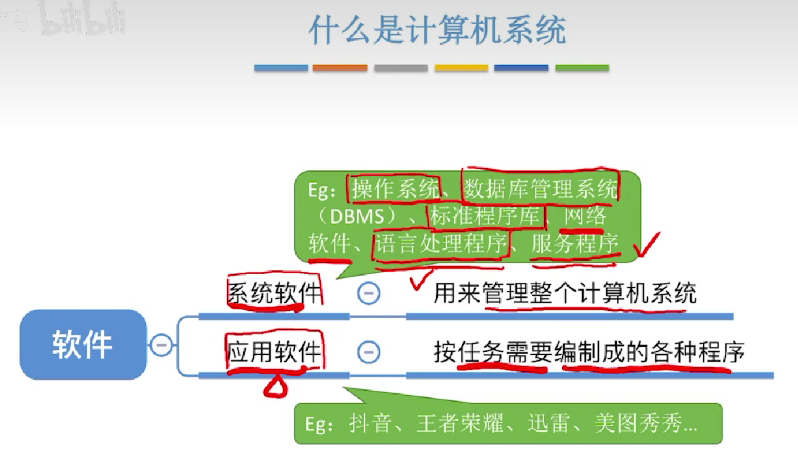

### 第一代:**电子管**

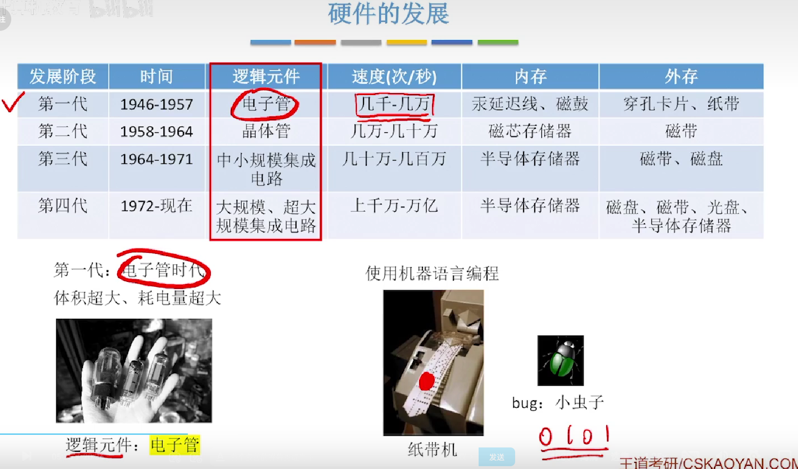

### 第二代:晶体管

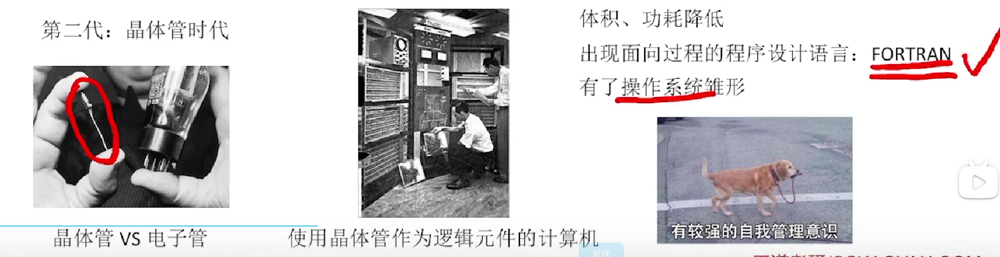

### 第三代:集成电路

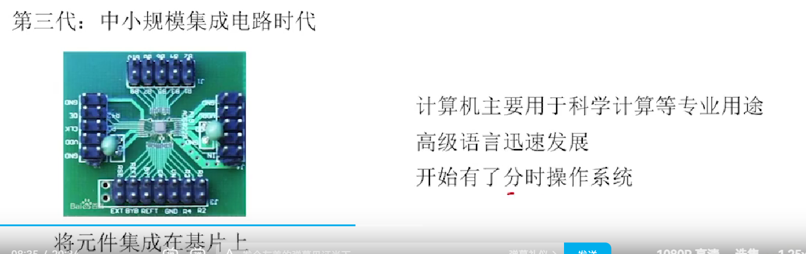

### 第四代:**大规模、超大规模集成电路时代**

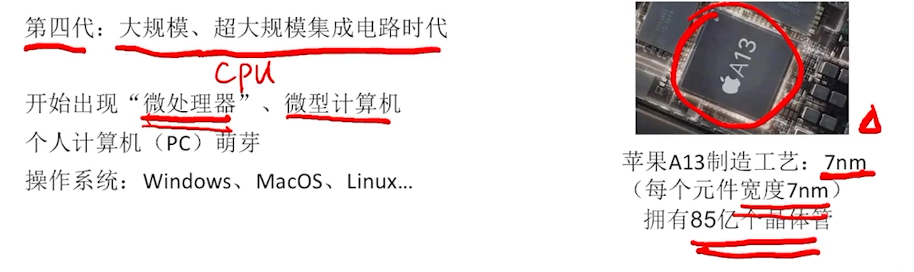

### 发展历史

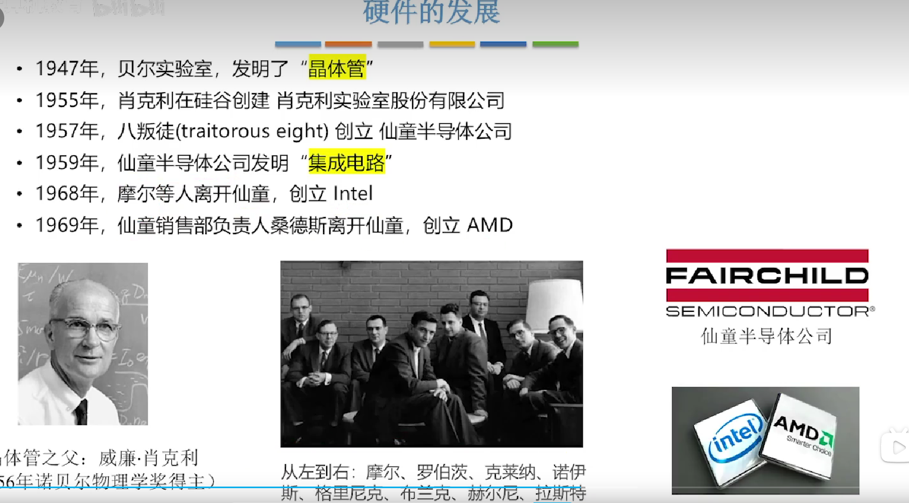

### 摩尔定律

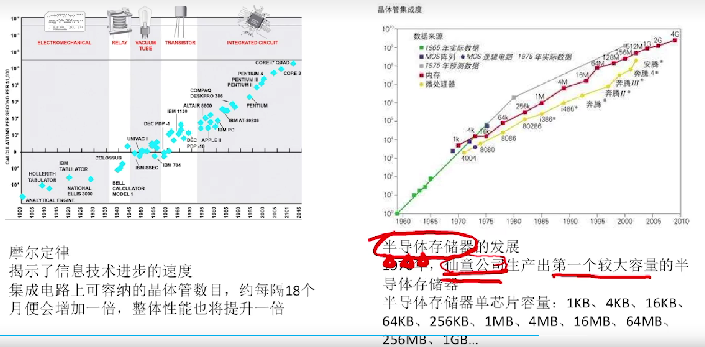

## 软件的发展

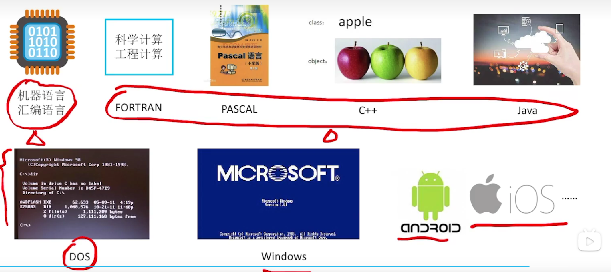

### 发展趋势

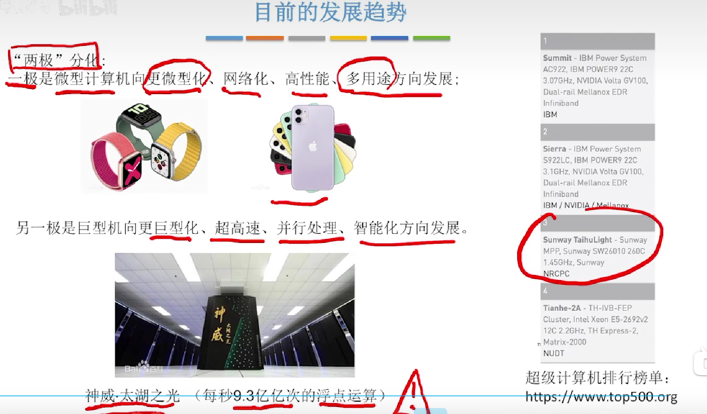

### 小结

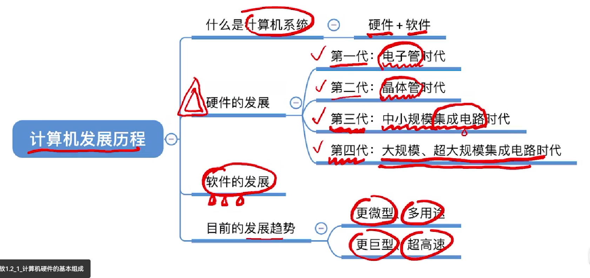

## 计算机硬件的基本组成

### 冯诺依曼机

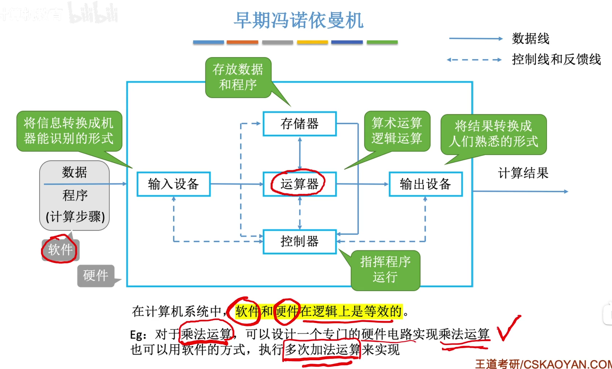

#### 冯诺依曼机的特点

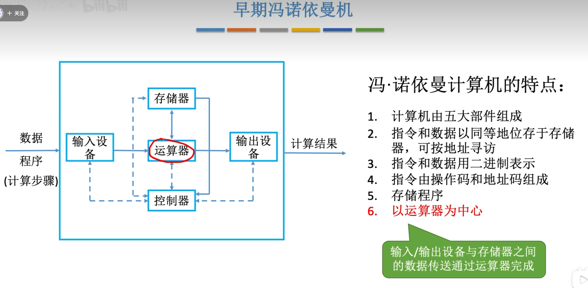

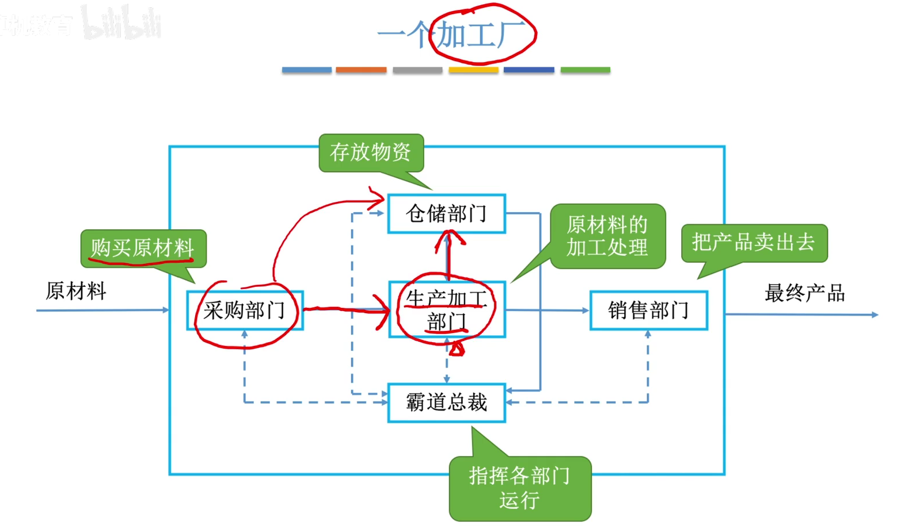

### 现代计算机

**以存储器为中心**

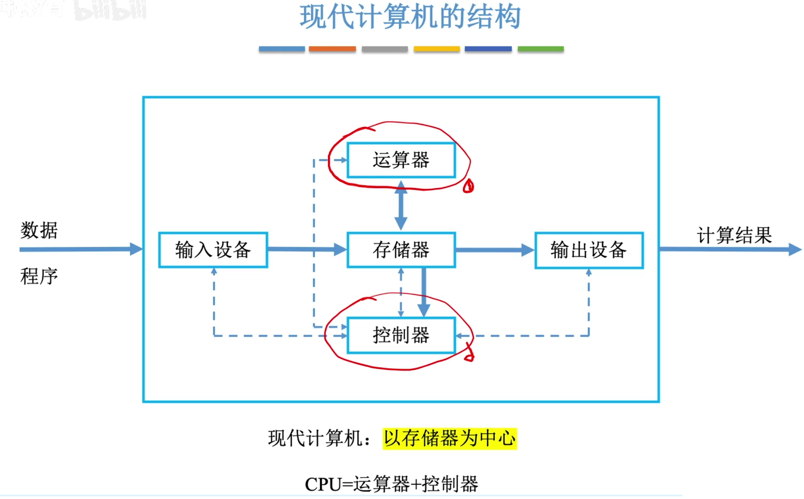

