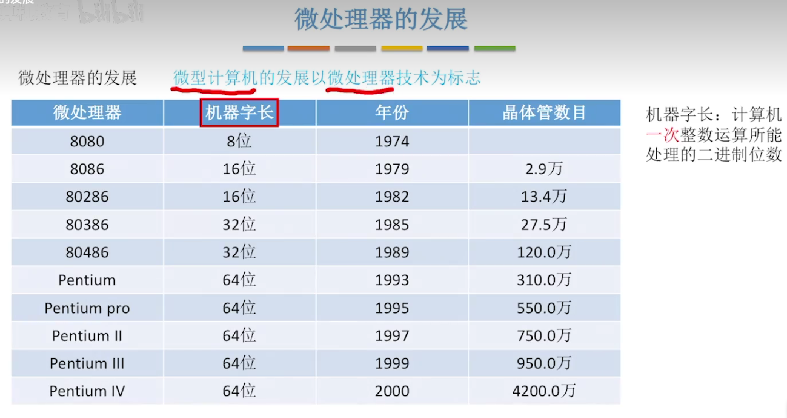
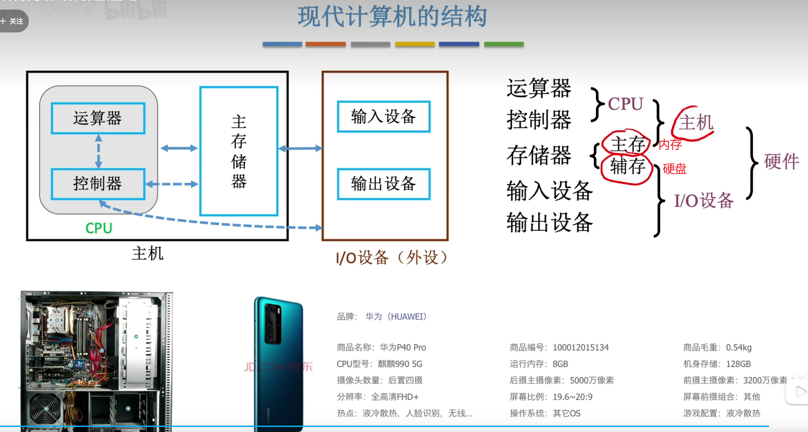

# 计算机组成原理

## 硬件的发展

### **软件的组成**

### 第一代:**电子管**

### 第二代:晶体管

### 第三代:集成电路

### 第四代:**大规模、超大规模集成电路时代**

### 发展历史

### 摩尔定律

## 软件的发展

### 发展趋势

### 小结

## 计算机硬件的基本组成

### 冯诺依曼机

#### 冯诺依曼机的特点

### 现代计算机

**以存储器为中心**

