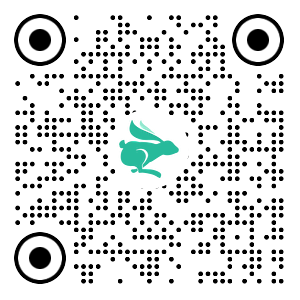

# uni-app 基础阶段

## uni-app 基础

### 创建 uni-app 项目方式

**uni-app 支持两种方式创建项目：**

1. 通过 HBuilderX 创建（需安装 HBuilderX 编辑器）

2. 通过命令行创建（需安装 NodeJS 环境）

### HBuilderX 创建 uni-app 项目

#### 创建步骤

**1.下载安装 HbuilderX 编辑器**


**2.通过 HbuilderX 创建 uni-app vue3 项目**


**3.安装 uni-app vue3 编译器插件**


**4.编译成微信小程序端代码**


**5.开启服务端口**


**小技巧分享：模拟器窗口分离和置顶**


**HBuildeX 和 微信开发者工具 关系**


::: tip 温馨提示
[HBuildeX](https://www.dcloud.io/hbuilderx.html) 和 [uni-app](https://uniapp.dcloud.net.cn/) 都属于 [DCloud](https://dcloud.io) 公司的产品。
:::

### pages.json 和 tabBar 案例

#### 目录结构

我们先来认识 uni-app 项目的目录结构。

```sh {1,4,9,10}
├─pages            业务页面文件存放的目录
│  └─index
│     └─index.vue  index页面
├─static           存放应用引用的本地静态资源的目录(注意：静态资源只能存放于此)
├─unpackage        非工程代码，一般存放运行或发行的编译结果
├─index.html       H5端页面
├─main.js          Vue初始化入口文件
├─App.vue          配置App全局样式、监听应用生命周期
├─pages.json       **配置页面路由、导航栏、tabBar等页面类信息**
├─manifest.json    **配置appid**、应用名称、logo、版本等打包信息
└─uni.scss         uni-app内置的常用样式变量
```

#### 解读 pages.json

用于配置页面路由、导航栏、tabBar 等页面类信息

#### 案例练习

**效果预览**


**参考代码**

```json
{
  // 页面路由
  "pages": [
    {
      "path": "pages/index/index",
      // 页面样式配置
      "style": {
        "navigationBarTitleText": "首页"
      }
    },
    {
      "path": "pages/my/my",
      "style": {
        "navigationBarTitleText": "我的"
      }
    }
  ],
  // 全局样式配置
  "globalStyle": {
    "navigationBarTextStyle": "white",
    "navigationBarTitleText": "uni-app",
    "navigationBarBackgroundColor": "#27BA9B",
    "backgroundColor": "#F8F8F8"
  },
  // tabBar 配置
  "tabBar": {
    "selectedColor": "#27BA9B",
    "list": [
      {
        "pagePath": "pages/index/index",
        "text": "首页",
        "iconPath": "static/tabs/home_default.png",
        "selectedIconPath": "static/tabs/home_selected.png"
      },
      {
        "pagePath": "pages/my/my",
        "text": "我的",
        "iconPath": "static/tabs/user_default.png",
        "selectedIconPath": "static/tabs/user_selected.png"
      }
    ]
  }
}
```

### uni-app 和原生小程序开发区别

#### 开发区别

uni-app 项目每个页面是一个 `.vue` 文件，数据绑定及事件处理同 `Vue.js` 规范：

1. 属性绑定 `src="{ { url }}"` 升级成 `:src="url"`

2. 事件绑定 `bindtap="eventName"` 升级成 `@tap="eventName"`，**支持（）传参**

3. 支持 Vue 常用**指令** `v-for`、`v-if`、`v-show`、`v-model` 等

#### 其他区别补充

1. 调用接口能力，**建议前缀** `wx` 替换为 `uni` ，养成好习惯，**支持多端开发**。
2. `<style>` 页面样式不需要写 `scoped`，小程序是多页面应用，**页面样式自动隔离**。
3. **生命周期分三部分**：应用生命周期(小程序)，页面生命周期(小程序)，组件生命周期(Vue)

#### 案例练习

**主要功能**

1.  滑动轮播图
2.  点击大图预览

**效果预览**


**参考代码**

```vue
<template>
  <swiper class="banner" indicator-dots circular :autoplay="false">
    <swiper-item v-for="item in pictures" :key="item.id">
      <image @tap="onPreviewImage(item.url)" :src="item.url"></image>
    </swiper-item>
  </swiper>
</template>

<script>
export default {
  data() {
    return {
      // 轮播图数据
      pictures: [
        {
          id: '1',
          url: 'https://pcapi-xiaotuxian-front-devtest.itheima.net/miniapp/uploads/goods_preview_1.jpg',
        },
        {
          id: '2',
          url: 'https://pcapi-xiaotuxian-front-devtest.itheima.net/miniapp/uploads/goods_preview_2.jpg',
        },
        {
          id: '3',
          url: 'https://pcapi-xiaotuxian-front-devtest.itheima.net/miniapp/uploads/goods_preview_3.jpg',
        },
        {
          id: '4',
          url: 'https://pcapi-xiaotuxian-front-devtest.itheima.net/miniapp/uploads/goods_preview_4.jpg',
        },
        {
          id: '5',
          url: 'https://pcapi-xiaotuxian-front-devtest.itheima.net/miniapp/uploads/goods_preview_5.jpg',
        },
      ],
    }
  },
  methods: {
    onPreviewImage(url) {
      // 大图预览
      uni.previewImage({
        urls: this.pictures.map((v) => v.url),
        current: url,
      })
    },
  },
}
</script>

<style>
.banner,
.banner image {
  width: 750rpx;
  height: 750rpx;
}
</style>
```

### 命令行创建 uni-app 项目

**优势**

通过命令行创建 uni-app 项目，**不必依赖 HBuilderX**，TypeScript 类型支持友好。

**命令行创建** **uni-app** **项目：**

vue3 + ts 版

::: code-group

```sh [github]
## 通过 npx 从 github 下载
npx degit dcloudio/uni-preset-vue#vite-ts 项目名称
```

```sh [👉国内 gitee]
## 通过 git 从 gitee 克隆下载 (👉备用地址)
git clone -b vite-ts https://gitee.com/dcloud/uni-preset-vue.git
```

:::

创建其他版本可查看：[uni-app 官网](https://uniapp.dcloud.net.cn/quickstart-cli.html)

::: danger 常见问题

- 运行 `npx` 命令下载失败，请尝试换成**手机热点重试**
- 换手机热点依旧失败，请尝试从[国内备用地址下载](https://gitee.com/dcloud/uni-preset-vue/tree/vite-ts/)
- 在 `manifest.json` 文件添加 [小程序 AppID](https://mp.weixin.qq.com/) 用于真机预览
- 运行 `npx` 命令需依赖 NodeJS 环境，[NodeJS 下载地址](https://nodejs.org/zh-cn)
- 运行 `git` 命令需依赖 Git 环境，[Git 下载地址](https://git-scm.com/download/)

:::

#### 编译和运行 uni-app 项目

1. 安装依赖 `pnpm install`
2. 编译成微信小程序 `pnpm dev:mp-weixin`
3. 导入微信开发者工具

::: tip 温馨提示
编译成 H5 端可运行 `pnpm dev:h5` 通过浏览器预览项目。
:::

### 用 VS Code 开发 uni-app 项目

#### 为什么选择 VS Code？

- VS Code 对 **TS 类型支持友好**，前端开发者**主流的编辑器**
- HbuilderX 对 TS 类型支持暂不完善，期待官方完善 👀

#### 用 VS Code 开发配置

- 👉 前置工作：安装 Vue3 插件，[点击查看官方文档](https://cn.vuejs.org/guide/typescript/overview.html#ide-support)
  - 安装 **Vue Language Features (Volar)** ：Vue3 语法提示插件
  - 安装 **TypeScript Vue Plugin (Volar)** ：Vue3+TS 插件
  - **工作区禁用** Vue2 的 Vetur 插件(Vue3 插件和 Vue2 冲突)
  - **工作区禁用** @builtin typescript 插件（禁用后开启 Vue3 的 TS 托管模式）
- 👉 安装 uni-app 开发插件
  - **uni-create-view** ：快速创建 uni-app 页面
  - **uni-helper uni-app** ：代码提示
  - **uniapp 小程序扩展** ：鼠标悬停查文档
- 👉 TS 类型校验
  - 安装 **类型声明文件** `pnpm i -D miniprogram-api-typings @uni-helper/uni-app-types`
  - 配置 `tsconfig.json`
- 👉 JSON 注释问题
  - 设置文件关联，把 `manifest.json` 和 `pages.json` 设置为 `jsonc`

`tsconfig.json` 参考

```json {11,12,14-15,18-22}
// tsconfig.json
{
  "extends": "@vue/tsconfig/tsconfig.json",
  "compilerOptions": {
    "sourceMap": true,
    "baseUrl": ".",
    "paths": {
      "@/*": ["./src/*"]
    },
    "lib": ["esnext", "dom"],
    // 类型声明文件
    "types": [
      "@dcloudio/types", // uni-app API 类型
      "miniprogram-api-typings", // 原生微信小程序类型
      "@uni-helper/uni-app-types" // uni-app 组件类型
    ]
  },
  // vue 编译器类型，校验标签类型
  "vueCompilerOptions": {
    // 原配置 `experimentalRuntimeMode` 现调整为 `nativeTags`
    "nativeTags": ["block", "component", "template", "slot"], // [!code ++]
    "experimentalRuntimeMode": "runtime-uni-app" // [!code --]
  },
  "include": ["src/**/*.ts", "src/**/*.d.ts", "src/**/*.tsx", "src/**/*.vue"]
}
```

**工作区设置参考**

```json
// .vscode/settings.json
{
  // 在保存时格式化文件
  "editor.formatOnSave": true,
  // 文件格式化配置
  "[json]": {
    "editor.defaultFormatter": "esbenp.prettier-vscode"
  },
  // 配置语言的文件关联
  "files.associations": {
    "pages.json": "jsonc", // pages.json 可以写注释
    "manifest.json": "jsonc" // manifest.json 可以写注释
  }
}
```

::: danger 版本升级

- 原依赖 `@types/wechat-miniprogram` 现调整为 [miniprogram-api-typings](https://github.com/wechat-miniprogram/api-typings)。
- 原配置 `experimentalRuntimeMode` 现调整为 `nativeTags`。

:::

这一步处理很关键，否则 TS 项目无法校验组件属性类型。

### 开发工具回顾

选择自己习惯的编辑器开发 uni-app 项目即可。

**HbuilderX 和 微信开发者工具 关系**


**VS Code 和 微信开发者工具 关系**


### 用 VS Code 开发课后练习

使用 `VS Code` 编辑器写代码，实现 tabBar 案例 + 轮播图案例。

::: tip 温馨提示

`VS Code` 可通过快捷键 `Ctrl + i` 唤起代码提示。

:::

# 小兔鲜儿 - 项目阶段

## 小兔鲜儿 - 项目起步

### 效果预览

<table>
  <tr>
    <td>体验小程序端</td>
    <td><a target="_blank" href="https://megasu.gitee.io/uniapp-shop-vue3-ts/">体验 H5 端</a></td>
    <td><a target="_blank" href="https://gitee.com/Megasu/uniapp-shop-vue3-ts/releases/download/v1.0.0/heima-shop.apk">体验 App 端(安卓)</a></td>
  </tr>
  <tr>
    <td></td>
    <td></td>
    <td></td>
  </tr>
</table>


### 资料说明

#### 📀 视频学习

[https://www.bilibili.com/video/BV1Bp4y1379L/](https://www.bilibili.com/video/BV1Bp4y1379L/?share_source=copy_web&vd_source=2ac50d29193927b3c8597537dc4bc81d)

#### 📗 接口文档

[https://www.apifox.cn/apidoc/shared-0e6ee326-d646-41bd-9214-29dbf47648fa/](https://www.apifox.cn/apidoc/shared-0e6ee326-d646-41bd-9214-29dbf47648fa/)

#### ✏️ 在线笔记

[https://megasu.gitee.io/uni-app-shop-note/](https://megasu.gitee.io/uni-app-shop-note/)

#### 📦 项目源码

[https://gitee.com/Megasu/uniapp-shop-vue3-ts/](https://gitee.com/Megasu/uniapp-shop-vue3-ts/)

### 项目架构

#### 项目架构图


### 拉取项目模板代码

项目模板包含：目录结构，项目素材，代码风格。

#### 模板地址

```sh
git clone http://git.itcast.cn/heimaqianduan/erabbit-uni-app-vue3-ts.git heima-shop
```

::: tip 注意事项
小程序真机预览需在 `manifest.json` 中添加微信小程序的 `appid`
:::

### 引入 uni-ui 组件库

#### 操作步骤

安装 [uni-ui 组件库](https://uniapp.dcloud.net.cn/component/uniui/quickstart.html#npm安装)

```sh
pnpm i @dcloudio/uni-ui
```

**配置自动导入组件**

```json
// pages.json
{
  // 组件自动导入
  "easycom": {
    "autoscan": true,
    "custom": {
      // uni-ui 规则如下配置  // [!code ++]
      "^uni-(.*)": "@dcloudio/uni-ui/lib/uni-$1/uni-$1.vue" // [!code ++]
    }
  },
  "pages": [
    // …省略
  ]
}
```

**安装类型声明文件**

```sh
pnpm i -D @uni-helper/uni-ui-types
```

**配置类型声明文件**

```json
// tsconfig.json
{
  "compilerOptions": {
    // ...
    "types": [
      "@dcloudio/types", // uni-app API 类型
      "miniprogram-api-typings", // 原生微信小程序类型
      "@uni-helper/uni-app-types", // uni-app 组件类型
      "@uni-helper/uni-ui-types" // uni-ui 组件类型  // [!code ++]
    ]
  },
  // vue 编译器类型，校验标签类型
  "vueCompilerOptions": {
    "nativeTags": ["block", "component", "template", "slot"]
  }
}
```

### 小程序端 Pinia 持久化

说明：`Pinia` 用法与 `Vue3` 项目完全一致，`uni-app` 项目仅需解决**持久化插件兼容性**问题。

#### 持久化存储插件

安装持久化存储插件： [pinia-plugin-persistedstate](https://prazdevs.github.io/pinia-plugin-persistedstate/zh/guide/config.html#storage)

```sh
pnpm i pinia-plugin-persistedstate
```

插件默认使用 `localStorage` 实现持久化，小程序端不兼容，需要替换持久化 API。

#### 基本用法

::: code-group

```ts {28-31} [stores/modules/member.ts]
import { defineStore } from 'pinia'
import { ref } from 'vue'

// 定义 Store
export const useMemberStore = defineStore(
  'member',
  () => {
    // 会员信息
    const profile = ref<any>()

    // 保存会员信息，登录时使用
    const setProfile = (val: any) => {
      profile.value = val
    }

    // 清理会员信息，退出时使用
    const clearProfile = () => {
      profile.value = undefined
    }

    // 记得 return
    return {
      profile,
      setProfile,
      clearProfile,
    }
  },
  // TODO: 持久化
  {
    persist: true,
  },
)
```

```ts {2,7} [stores/index.ts]
import { createPinia } from 'pinia'
import persist from 'pinia-plugin-persistedstate'

// 创建 pinia 实例
const pinia = createPinia()
// 使用持久化存储插件
pinia.use(persist)

// 默认导出，给 main.ts 使用
export default pinia

// 模块统一导出
export * from './modules/member'
```

```ts {2,8} [main.ts]
import { createSSRApp } from 'vue'
import pinia from './stores'

import App from './App.vue'
export function createApp() {
  const app = createSSRApp(App)

  app.use(pinia)
  return {
    app,
  }
}
```

:::

#### 多端兼容

**网页端持久化 API**

```ts
// 网页端API
localStorage.setItem()
localStorage.getItem()
```

**多端持久化 API**

```ts
// 兼容多端API
uni.setStorageSync()
uni.getStorageSync()
```

**参考代码**

```ts {7-20}
// stores/modules/member.ts
export const useMemberStore = defineStore(
  'member',
  () => {
    //…省略
  },
  {
    // 配置持久化
    persist: {
      // 调整为兼容多端的API
      storage: {
        setItem(key, value) {
          uni.setStorageSync(key, value) // [!code warning]
        },
        getItem(key) {
          return uni.getStorageSync(key) // [!code warning]
        },
      },
    },
  },
)
```

### uni.request 请求封装

#### 请求和上传文件拦截器

**uniapp 拦截器**： [uni.addInterceptor](https://uniapp.dcloud.net.cn/api/interceptor.html)

**接口说明**：[接口文档](https://www.apifox.cn/apidoc/shared-0e6ee326-d646-41bd-9214-29dbf47648fa/doc-1521513)

::: tip 实现需求

1. 拼接基础地址
2. 设置超时时间
3. 添加请求头标识
4. 添加 token
   :::

**参考代码**

```ts
// src/utils/http.ts

// 请求基地址
const baseURL = 'https://pcapi-xiaotuxian-front-devtest.itheima.net'

// 拦截器配置
const httpInterceptor = {
  // 拦截前触发
  invoke(options: UniApp.RequestOptions) {
    // 1. 非 http 开头需拼接地址
    if (!options.url.startsWith('http')) {
      options.url = baseURL + options.url
    }
    // 2. 请求超时
    options.timeout = 10000
    // 3. 添加小程序端请求头标识
    options.header = {
      'source-client': 'miniapp',
      ...options.header,
    }
    // 4. 添加 token 请求头标识
    const memberStore = useMemberStore()
    const token = memberStore.profile?.token
    if (token) {
      options.header.Authorization = token
    }
  },
}

// 拦截 request 请求
uni.addInterceptor('request', httpInterceptor)
// 拦截 uploadFile 文件上传
uni.addInterceptor('uploadFile', httpInterceptor)
```

::: warning 注意事项

微信小程序端，需登录 [微信公众平台](https://mp.weixin.qq.com) 配置合法域名 👇

`https://pcapi-xiaotuxian-front-devtest.itheima.net`

:::

#### 封装 Promise 请求函数

::: tip 实现需求

1. 返回 Promise 对象，用于处理返回值类型
2. 成功 resolve
   1. 提取数据
   2. 添加泛型
3. 失败 reject
   1. 401 错误
   2. 其他错误
   3. 网络错误

:::

**参考代码**

```ts
/**
 * 请求函数
 * @param  UniApp.RequestOptions
 * @returns Promise
 *  1. 返回 Promise 对象，用于处理返回值类型
 *  2. 获取数据成功
 *    2.1 提取核心数据 res.data
 *    2.2 添加类型，支持泛型
 *  3. 获取数据失败
 *    3.1 401错误  -> 清理用户信息，跳转到登录页
 *    3.2 其他错误 -> 根据后端错误信息轻提示
 *    3.3 网络错误 -> 提示用户换网络
 */
type Data<T> = {
  code: string
  msg: string
  result: T
}
// 2.2 添加类型，支持泛型
export const http = <T>(options: UniApp.RequestOptions) => {
  // 1. 返回 Promise 对象
  return new Promise<Data<T>>((resolve, reject) => {
    uni.request({
      ...options,
      // 响应成功
      success(res) {
        // 状态码 2xx，参考 axios 的设计
        if (res.statusCode >= 200 && res.statusCode < 300) {
          // 2.1 提取核心数据 res.data
          resolve(res.data as Data<T>)
        } else if (res.statusCode === 401) {
          // 401错误  -> 清理用户信息，跳转到登录页
          const memberStore = useMemberStore()
          memberStore.clearProfile()
          uni.navigateTo({ url: '/pages/login/login' })
          reject(res)
        } else {
          // 其他错误 -> 根据后端错误信息轻提示
          uni.showToast({
            icon: 'none',
            title: (res.data as Data<T>).msg || '请求错误',
          })
          reject(res)
        }
      },
      // 响应失败
      fail(err) {
        uni.showToast({
          icon: 'none',
          title: '网络错误，换个网络试试',
        })
        reject(err)
      },
    })
  })
}
```

### 【拓展】代码规范

**为什么需要代码规范**

如果没有统一代码风格，团队协作不便于查看代码提交时所做的修改。


#### 统一代码风格

- 安装 `eslint` + `prettier`

```sh
pnpm i -D eslint prettier eslint-plugin-vue @vue/eslint-config-prettier @vue/eslint-config-typescript @rushstack/eslint-patch @vue/tsconfig
```

- 新建 `.eslintrc.cjs` 文件，添加以下 `eslint` 配置

```js
/* eslint-env node */
require('@rushstack/eslint-patch/modern-module-resolution')

module.exports = {
  root: true,
  extends: [
    'plugin:vue/vue3-essential',
    'eslint:recommended',
    '@vue/eslint-config-typescript',
    '@vue/eslint-config-prettier',
  ],
  // 小程序全局变量
  globals: {
    uni: true,
    wx: true,
    WechatMiniprogram: true,
    getCurrentPages: true,
    getApp: true,
    UniApp: true,
    UniHelper: true,
    App: true,
    Page: true,
    Component: true,
    AnyObject: true,
  },
  parserOptions: {
    ecmaVersion: 'latest',
  },
  rules: {
    'prettier/prettier': [
      'warn',
      {
        singleQuote: true,
        semi: false,
        printWidth: 100,
        trailingComma: 'all',
        endOfLine: 'auto',
      },
    ],
    'vue/multi-word-component-names': ['off'],
    'vue/no-setup-props-destructure': ['off'],
    'vue/no-deprecated-html-element-is': ['off'],
    '@typescript-eslint/no-unused-vars': ['off'],
  },
}
```

- 配置 `package.json`

```json
{
  "script": {
    // ... 省略 ...
    "lint": "eslint . --ext .vue,.js,.ts --fix --ignore-path .gitignore"
  }
}
```

- 运行

```sh
pnpm lint
```

::: tip 温馨提示
到此，你已完成 `eslint` + `prettier` 的配置。
:::

#### Git 工作流规范

- 安装并初始化 `husky`

::: code-group

```sh [pnpx]
pnpm dlx husky-init
```

```sh [npx]
npx husky-init
```

:::

- 安装 `lint-staged`

```sh
pnpm i -D lint-staged
```

- 配置 `package.json`

```json
{
  "script": {
    // ... 省略 ...
  },
  "lint-staged": {
    "*.{vue,ts,js}": ["eslint --fix"]
  }
}
```

- 修改 `.husky/pre-commit` 文件

```diff
npm test   // [!code --]
npm run lint-staged     // [!code ++]
```

::: tip 温馨提示
到此，你已完成 `husky` + `lint-staged` 的配置。
:::

## 小兔鲜儿 - 首页模块

涉及知识点：组件通信、组件自动导入、数据渲染、触底分页加载、下拉刷新等。

### 自定义导航栏

**参考效果**：自定义导航栏的样式需要适配不同的机型。


::: tip 操作步骤

1. 准备组件静态结构
2. 修改页面配置，隐藏默认导航栏，修改文字颜色
3. 样式适配 -> 安全区域

:::

**静态结构**

新建业务组件：`src/pages/index/componets/CustomNavbar.vue`

```vue
<script setup lang="ts">
//
</script>

<template>
  <view class="navbar">
    <!-- logo文字 -->
    <view class="logo">
      <image class="logo-image" src="@/static/images/logo.png"></image>
      <text class="logo-text">新鲜 · 亲民 · 快捷</text>
    </view>
    <!-- 搜索条 -->
    <view class="search">
      <text class="icon-search">搜索商品</text>
      <text class="icon-scan"></text>
    </view>
  </view>
</template>

<style lang="scss">
/* 自定义导航条 */
.navbar {
  background-image: url(@/static/images/navigator_bg.png);
  background-size: cover;
  position: relative;
  display: flex;
  flex-direction: column;
  padding-top: 20px;
  .logo {
    display: flex;
    align-items: center;
    height: 64rpx;
    padding-left: 30rpx;
    padding-top: 20rpx;
    .logo-image {
      width: 166rpx;
      height: 39rpx;
    }
    .logo-text {
      flex: 1;
      line-height: 28rpx;
      color: #fff;
      margin: 2rpx 0 0 20rpx;
      padding-left: 20rpx;
      border-left: 1rpx solid #fff;
      font-size: 26rpx;
    }
  }
  .search {
    display: flex;
    align-items: center;
    justify-content: space-between;
    padding: 0 10rpx 0 26rpx;
    height: 64rpx;
    margin: 16rpx 20rpx;
    color: #fff;
    font-size: 28rpx;
    border-radius: 32rpx;
    background-color: rgba(255, 255, 255, 0.5);
  }
  .icon-search {
    &::before {
      margin-right: 10rpx;
    }
  }
  .icon-scan {
    font-size: 30rpx;
    padding: 15rpx;
  }
}
</style>
```

#### 安全区域

不同手机的安全区域不同，适配安全区域能防止页面重要内容被遮挡。

可通过 `uni.getSystemInfoSync()` 获取屏幕边界到安全区的距离。


#### 核心代码参考

自定义导航配置

```json
// src/pages.json
{
  "path": "pages/index/index",
  "style": {
    "navigationStyle": "custom", // 隐藏默认导航
    "navigationBarTextStyle": "white",
    "navigationBarTitleText": "首页"
  }
}
```

组件安全区适配

```vue
<!-- src/pages/index/componets/CustomNavbar.vue -->
<script>
// 获取屏幕边界到安全区域距离
const { safeAreaInsets } = uni.getSystemInfoSync()
</script>

<template>
  <!-- 顶部占位 -->
  <view class="navbar" :style="{ paddingTop: safeAreaInsets?.top + 'px' }">
    <!-- ...省略 -->
  </view>
</template>
```

### 通用轮播组件

**参考效果**

小兔鲜儿项目中总共有两处广告位，分别位于【首页】和【商品分类页】。

轮播图组件需要在首页和分类页使用，需要封装成通用组件。


**静态结构**

首页广告布局为独立的组件 `XtxSwiper` ，位于的 `src/components` 目录中。

该组件定义了 `list` 属性接收外部传入的数据，内部通过小程序内置组件 `swiper` 展示首页广告的数据。

**轮播图组件**

静态结构：`src/components/XtxSwiper.vue`

```vue
<script setup lang="ts">
import { ref } from 'vue'

const activeIndex = ref(0)
</script>

<template>
  <view class="carousel">
    <swiper :circular="true" :autoplay="false" :interval="3000">
      <swiper-item>
        <navigator url="/pages/index/index" hover-class="none" class="navigator">
          <image
            mode="aspectFill"
            class="image"
            src="https://pcapi-xiaotuxian-front-devtest.itheima.net/miniapp/uploads/slider_1.jpg"
          ></image>
        </navigator>
      </swiper-item>
      <swiper-item>
        <navigator url="/pages/index/index" hover-class="none" class="navigator">
          <image
            mode="aspectFill"
            class="image"
            src="https://pcapi-xiaotuxian-front-devtest.itheima.net/miniapp/uploads/slider_2.jpg"
          ></image>
        </navigator>
      </swiper-item>
      <swiper-item>
        <navigator url="/pages/index/index" hover-class="none" class="navigator">
          <image
            mode="aspectFill"
            class="image"
            src="https://pcapi-xiaotuxian-front-devtest.itheima.net/miniapp/uploads/slider_3.jpg"
          ></image>
        </navigator>
      </swiper-item>
    </swiper>
    <!-- 指示点 -->
    <view class="indicator">
      <text
        v-for="(item, index) in 3"
        :key="item"
        class="dot"
        :class="{ active: index === activeIndex }"
      ></text>
    </view>
  </view>
</template>

<style lang="scss">
:host {
  display: block;
  height: 280rpx;
}
/* 轮播图 */
.carousel {
  height: 100%;
  position: relative;
  overflow: hidden;
  transform: translateY(0);
  background-color: #efefef;
  .indicator {
    position: absolute;
    left: 0;
    right: 0;
    bottom: 16rpx;
    display: flex;
    justify-content: center;
    .dot {
      width: 30rpx;
      height: 6rpx;
      margin: 0 8rpx;
      border-radius: 6rpx;
      background-color: rgba(255, 255, 255, 0.4);
    }
    .active {
      background-color: #fff;
    }
  }
  .navigator,
  .image {
    width: 100%;
    height: 100%;
  }
}
</style>
```

**自动导入全局组件**

参考配置

```json
{
  // 组件自动引入规则
  "easycom": {
    // 是否开启自动扫描 @/components/$1/$1.vue 组件
    "autoscan": true,
    // 以正则方式自定义组件匹配规则
    "custom": {
      // uni-ui 规则如下配置
      "^uni-(.*)": "@dcloudio/uni-ui/lib/uni-$1/uni-$1.vue",
      // 以 Xtx 开头的组件，在 components 目录中查找
      "^Xtx(.*)": "@/components/Xtx$1.vue"
    }
  }
}
```

**全局组件类型声明**

Volar 插件说明：[Vue Language Tools](https://github.com/vuejs/language-tools)

```ts
// src/types/components.d.ts
import XtxSwiper from './XtxSwiper.vue’
declare module 'vue' {
  export interface GlobalComponents {
    XtxSwiper: typeof XtxSwiper
  }
}
```

::: danger 版本升级
新版 [Volar](https://github.com/vuejs/language-tools) 把 `declare module '@vue/runtime-core'` 调整为 `declare module 'vue'`
:::

#### 获取数据

**接口调用**

该业务功能对于前端来说比较简单，只需调用后端提供的接口将获得的数据展现，结合运营人员的营销策略跳转到对应的链接地址即可。

接口地址：/home/banner

请求方式：GET

请求参数：

**Query:**

| 字段名           | 必须 | 默认值 | 备注                                                     |
| ---------------- | ---- | ------ | -------------------------------------------------------- |
| distributionSite | 否   | 1      | 活动 banner 位置，1 代表首页，2 代表商品分类页，默认为 1 |

**请求封装**

```ts
// 存放路径: src/services/home.ts
import type { BannerItem } from '@/types/home'

/**
 * 首页-广告区域-小程序
 * @param distributionSite 广告区域展示位置（投放位置 投放位置，1为首页，2为分类商品页） 默认是1
 */
export const getHomeBannerAPI = (distributionSite = 1) => {
  return http<BannerItem[]>({
    method: 'GET',
    url: '/home/banner',
    data: {
      distributionSite,
    },
  })
}
```

**类型声明**

存放路径：`src/types/home.d.ts`

```ts
/** 首页-广告区域数据类型 */
export type BannerItem = {
  /** 跳转链接 */
  hrefUrl: string
  /** id */
  id: string
  /** 图片链接 */
  imgUrl: string
  /** 跳转类型 */
  type: number
}
```

最后，将获得的数据结合模板语法渲染到页面中。

#### 参考代码

轮播图组件：`src\components\XtxSwiper.vue`

```vue
<script setup lang="ts">
import type { BannerItem } from '@/types/home'
import { ref } from 'vue'

const activeIndex = ref(0)

// 当 swiper 下标发生变化时触发
const onChange: UniHelper.SwiperOnChange = (ev) => {
  // ! 非空断言，主观上排除掉空值情况
  activeIndex.value = ev.detail.current
}
// 定义 props 接收
defineProps<{
  list: BannerItem[]
}>()
</script>

<template>
  <view class="carousel">
    <swiper :circular="true" :autoplay="false" :interval="3000" @change="onChange">
      <swiper-item v-for="item in list" :key="item.id">
        <navigator url="/pages/index/index" hover-class="none" class="navigator">
          <image mode="aspectFill" class="image" :src="item.imgUrl"></image>
        </navigator>
      </swiper-item>
    </swiper>
    <!-- 指示点 -->
    <view class="indicator">
      <text
        v-for="(item, index) in list"
        :key="item.id"
        class="dot"
        :class="{ active: index === activeIndex }"
      ></text>
    </view>
  </view>
</template>
```

### 首页分类

**参考效果**


**准备工作**

1. 准备组件，只有首页使用
2. 导入并使用组件
3. 设置首页底色为 `#F7F7F7`

**静态结构**

前台类目布局为独立的组件 `CategoryPanel`属于首页的业务组件，存放到首页的 `components` 目录中。

```vue
<script setup lang="ts">
//
</script>

<template>
  <view class="category">
    <navigator
      class="category-item"
      hover-class="none"
      url="/pages/index/index"
      v-for="item in 10"
      :key="item"
    >
      <image
        class="icon"
        src="https://pcapi-xiaotuxian-front-devtest.itheima.net/miniapp/images/nav_icon_1.png"
      ></image>
      <text class="text">居家</text>
    </navigator>
  </view>
</template>

<style lang="scss">
/* 前台类目 */
.category {
  margin: 20rpx 0 0;
  padding: 10rpx 0;
  display: flex;
  flex-wrap: wrap;
  min-height: 328rpx;

  .category-item {
    width: 150rpx;
    display: flex;
    justify-content: center;
    flex-direction: column;
    align-items: center;
    box-sizing: border-box;

    .icon {
      width: 100rpx;
      height: 100rpx;
    }
    .text {
      font-size: 26rpx;
      color: #666;
    }
  }
}
</style>
```

#### 获取数据

**接口调用**

该业务功能对于前端来说比较简单，只需调用后端提供的接口将获得的数据展现。

接口地址：/home/category/mutli

请求方式：GET

请求参数：无

**请求封装**

```ts
// services/home.ts
/**
 * 首页-前台分类-小程序
 */
export const getHomeCategoryAPI = () => {
  return http<CategoryItem[]>({
    method: 'GET',
    url: '/home/category/mutli',
  })
}
```

**数据类型**

```typescript
/** 首页-前台类目数据类型 */
export type CategoryItem = {
  /** 图标路径 */
  icon: string
  /** id */
  id: string
  /** 分类名称 */
  name: string
}
```

最后，将获得的数据结合模板语法渲染到页面中。

#### 参考代码

`src\pages\index\components\CategoryPanel.vue`

```vue
<script setup lang="ts">
import type { CategoryItem } from '@/types/home'

// 定义 props 接收数据
defineProps<{
  list: CategoryItem[]
}>()
</script>

<template>
  <view class="category">
    <navigator
      class="category-item"
      hover-class="none"
      url="/pages/index/index"
      v-for="item in list"
      :key="item.id"
    >
      <image class="icon" :src="item.icon"></image>
      <text class="text">{{ item.name }}</text>
    </navigator>
  </view>
</template>
```

### 热门推荐

热门推荐功能，后端根据用户的消费习惯等信息向用户推荐的一系列商品，前端负责展示这些商品展示给用户。

**参考效果**


**静态结构**

热门推荐布局为独立的组件 `HotPanel`，属于首页的业务组件，存放到首页的 `components` 目录中。

```vue
<script setup lang="ts">
//
</script>

<template>
  <!-- 推荐专区 -->
  <view class="panel hot">
    <view class="item" v-for="item in 4" :key="item">
      <view class="title">
        <text class="title-text">特惠推荐</text>
        <text class="title-desc">精选全攻略</text>
      </view>
      <navigator hover-class="none" url="/pages/hot/hot" class="cards">
        <image
          class="image"
          mode="aspectFit"
          src="https://pcapi-xiaotuxian-front-devtest.itheima.net/miniapp/uploads/goods_small_1.jpg"
        ></image>
        <image
          class="image"
          mode="aspectFit"
          src="https://pcapi-xiaotuxian-front-devtest.itheima.net/miniapp/uploads/goods_small_2.jpg"
        ></image>
      </navigator>
    </view>
  </view>
</template>

<style lang="scss">
/* 热门推荐 */
.hot {
  display: flex;
  flex-wrap: wrap;
  min-height: 508rpx;
  margin: 20rpx 20rpx 0;
  border-radius: 10rpx;
  background-color: #fff;

  .title {
    display: flex;
    align-items: center;
    padding: 24rpx 24rpx 0;
    font-size: 32rpx;
    color: #262626;
    position: relative;
    .title-desc {
      font-size: 24rpx;
      color: #7f7f7f;
      margin-left: 18rpx;
    }
  }

  .item {
    display: flex;
    flex-direction: column;
    width: 50%;
    height: 254rpx;
    border-right: 1rpx solid #eee;
    border-top: 1rpx solid #eee;
    .title {
      justify-content: start;
    }
    &:nth-child(2n) {
      border-right: 0 none;
    }
    &:nth-child(-n + 2) {
      border-top: 0 none;
    }
    .image {
      width: 150rpx;
      height: 150rpx;
    }
  }
  .cards {
    flex: 1;
    padding: 15rpx 20rpx;
    display: flex;
    justify-content: space-between;
    align-items: center;
  }
}
</style>
```

#### 获取数据

**接口调用**

该业务功能对于前端来说比较简单，只需调用后端提供的接口将获得的数据展现。

接口地址：/home/hot/mutli

请求方式：GET

请求参数：

**Headers:**

| 字段名称      | 是否必须 | 默认值 | 备注                                         |
| ------------- | -------- | ------ | -------------------------------------------- |
| source-client | 是       | 无     | 后端程序区分接口调用者，miniapp 代表小程序端 |

成功响应结果：

| 字段名称 | 数据类型      | 备注                 |
| -------- | ------------- | -------------------- |
| id       | string        | ID                   |
| title    | string        | 推荐标题             |
| type     | number        | 推荐类型             |
| alt      | string        | 推荐说明             |
| pictures | array[string] | 图片集合[ 图片路径 ] |

**类型声明**

```ts
/** 首页-热门推荐数据类型 */
export type HotItem = {
  /** 说明 */
  alt: string
  /** id */
  id: string
  /** 图片集合[ 图片路径 ] */
  pictures: string[]
  /** 跳转地址 */
  target: string
  /** 标题 */
  title: string
  /** 推荐类型 */
  type: string
}
```

**接口封装**

```ts
// services/home.ts
/**
 * 首页-热门推荐-小程序
 */
export const getHomeHotAPI = () => {
  return http<HotItem[]>({
    method: 'GET',
    url: '/home/hot/mutli',
  })
}
```

最后将获得的数据结合模板语法渲染到页面中。

#### 参考代码

`src\pages\index\components\HotPanel.vue`

```vue
<script setup lang="ts">
import type { HotItem } from '@/types/home'

// 定义 props 接收数据
defineProps<{
  list: HotItem[]
}>()
</script>

<template>
  <!-- 推荐专区 -->
  <view class="panel hot">
    <view class="item" v-for="item in list" :key="item.id">
      <view class="title">
        <text class="title-text">{{ item.title }}</text>
        <text class="title-desc">{{ item.alt }}</text>
      </view>
      <navigator hover-class="none" :url="`/pages/hot/hot?type=${item.type}`" class="cards">
        <image
          v-for="src in item.pictures"
          :key="src"
          class="image"
          mode="aspectFit"
          :src="src"
        ></image>
      </navigator>
    </view>
  </view>
</template>
```

### 猜你喜欢(重点难点)

**参考效果**

猜你喜欢功能，后端根据用户的浏览记录等信息向用户随机推荐的一系列商品，前端负责把商品在**多个页面中展示**。


**准备工作**

1. 准备组件 (通用组件，多页面使用)

2. 定义组件类型

3. 准备 `scroll-view` 滚动容器

4. 设置 `page` 和 `scroll-view` 样式

**静态结构**

猜你喜欢是一个通用组件 `XtxGuess`，多个页面会用到该组件，存放到 `src/components` 目录中。

```vue
<script setup lang="ts">
//
</script>

<template>
  <!-- 猜你喜欢 -->
  <view class="caption">
    <text class="text">猜你喜欢</text>
  </view>
  <view class="guess">
    <navigator
      class="guess-item"
      v-for="item in 10"
      :key="item"
      :url="`/pages/goods/goods?id=4007498`"
    >
      <image
        class="image"
        mode="aspectFill"
        src="https://pcapi-xiaotuxian-front-devtest.itheima.net/miniapp/uploads/goods_big_1.jpg"
      ></image>
      <view class="name"> 德国THORE男表 超薄手表男士休闲简约夜光石英防水直径40毫米 </view>
      <view class="price">
        <text class="small">¥</text>
        <text>899.00</text>
      </view>
    </navigator>
  </view>
  <view class="loading-text"> 正在加载... </view>
</template>

<style lang="scss">
:host {
  display: block;
}
/* 分类标题 */
.caption {
  display: flex;
  justify-content: center;
  line-height: 1;
  padding: 36rpx 0 40rpx;
  font-size: 32rpx;
  color: #262626;
  .text {
    display: flex;
    justify-content: center;
    align-items: center;
    padding: 0 28rpx 0 30rpx;

    &::before,
    &::after {
      content: '';
      width: 20rpx;
      height: 20rpx;
      background-image: url(@/static/images/bubble.png);
      background-size: contain;
      margin: 0 10rpx;
    }
  }
}

/* 猜你喜欢 */
.guess {
  display: flex;
  flex-wrap: wrap;
  justify-content: space-between;
  padding: 0 20rpx;
  .guess-item {
    width: 345rpx;
    padding: 24rpx 20rpx 20rpx;
    margin-bottom: 20rpx;
    border-radius: 10rpx;
    overflow: hidden;
    background-color: #fff;
  }
  .image {
    width: 304rpx;
    height: 304rpx;
  }
  .name {
    height: 75rpx;
    margin: 10rpx 0;
    font-size: 26rpx;
    color: #262626;
    overflow: hidden;
    text-overflow: ellipsis;
    display: -webkit-box;
    -webkit-line-clamp: 2;
    -webkit-box-orient: vertical;
  }
  .price {
    line-height: 1;
    padding-top: 4rpx;
    color: #cf4444;
    font-size: 26rpx;
  }
  .small {
    font-size: 80%;
  }
}
// 加载提示文字
.loading-text {
  text-align: center;
  font-size: 28rpx;
  color: #666;
  padding: 20rpx 0;
}
</style>
```

**全局组件类型**

```ts {3,8,12,13}
// types/components.d.ts
import XtxSwiper from '@/components/XtxSwiper.vue'
import XtxGuess from '@/components/XtxGuess.vue'

declare module 'vue' {
  export interface GlobalComponents {
    XtxSwiper: typeof XtxSwiper
    XtxGuess: typeof XtxGuess
  }
}

// 组件实例类型
export type XtxGuessInstance = InstanceType<typeof XtxGuess>
```

#### 获取数据

**接口调用**

该业务功能对于前端来说比较简单，只需调用后端提供的接口将获得的数据展现。

接口地址：/home/goods/guessLike

请求方式：GET

请求参数：

**Query:**

| 字段名称 | 是否必须 | 默认值 | 备注           |
| -------- | -------- | ------ | -------------- |
| page     | 否       | 1      | 分页的页码     |
| pageSize | 否       | 10     | 每页数据的条数 |

**请求封装**

```ts
// src/services/home.ts
/**
 * 猜你喜欢-小程序
 */
export const getHomeGoodsGuessLikeAPI = (data?: PageParams) => {
  return http<PageResult<GuessItem>>({
    method: 'GET',
    url: '/home/goods/guessLike',
    data,
  })
}
```

**类型声明**

通用分页结果类型如下，新建 `src/types/global.d.ts` 文件：

```ts
/** 通用分页结果类型 */
export type PageResult<T> = {
  /** 列表数据 */
  items: T[]
  /** 总条数 */
  counts: number
  /** 当前页数 */
  page: number
  /** 总页数 */
  pages: number
  /** 每页条数 */
  pageSize: number
}
```

猜你喜欢-商品类型如下，存放到 `src/types/home.d.ts` 文件：

```typescript
/** 猜你喜欢-商品类型 */
export type GuessItem = {
  /** 商品描述 */
  desc: string
  /** 商品折扣 */
  discount: number
  /** id */
  id: string
  /** 商品名称 */
  name: string
  /** 商品已下单数量 */
  orderNum: number
  /** 商品图片 */
  picture: string
  /** 商品价格 */
  price: number
}
```

通用分页参数类型如下，存放到 `src/types/global.d.ts` 文件：

```ts
/** 通用分页参数类型 */
export type PageParams = {
  /** 页码：默认值为 1 */
  page?: number
  /** 页大小：默认值为 10 */
  pageSize?: number
}
```

#### 核心业务

1. 子组件内部获取数据
2. 父滚动触底需加载分页
3. 组件通讯，子调父

#### 参考代码

项目首页

```vue {6,9-11,18,21}
// pages/index/index.vue
<script setup lang="ts">
import type { XtxGuessInstance } from '@/types/components'
import { ref } from 'vue'
// 获取猜你喜欢组件实例
const guessRef = ref<XtxGuessInstance>()

// 滚动触底事件
const onScrolltolower = () => {
  guessRef.value?.getMore()
}
</script>

<template>
  <!-- 滚动容器 -->
  <scroll-view scroll-y @scrolltolower="onScrolltolower">
    <!-- 猜你喜欢 -->
    <XtxGuess ref="guessRef" />
  </scroll-view>
</template>
```

猜你喜欢组件

```vue
// src/components/XtxGuess.vue
<script setup lang="ts">
import { getHomeGoodsGuessLikeAPI } from '@/services/home'
import type { PageParams } from '@/types/global'
import type { GuessItem } from '@/types/home'
import { onMounted, ref } from 'vue'

// 分页参数
const pageParams: Required<PageParams> = {
  page: 1,
  pageSize: 10,
}
// 猜你喜欢的列表
const guessList = ref<GuessItem[]>([])
// 已结束标记
const finish = ref(false)
// 获取猜你喜欢数据
const getHomeGoodsGuessLikeData = async () => {
  // 退出分页判断
  if (finish.value === true) {
    return uni.showToast({ icon: 'none', title: '没有更多数据~' })
  }
  const res = await getHomeGoodsGuessLikeAPI(pageParams)
  // 数组追加
  guessList.value.push(...res.result.items)
  // 分页条件
  if (pageParams.page < res.result.pages) {
    // 页码累加
    pageParams.page++
  } else {
    finish.value = true
  }
}
// 重置数据
const resetData = () => {
  pageParams.page = 1
  guessList.value = []
  finish.value = false
}
// 组件挂载完毕
onMounted(() => {
  getHomeGoodsGuessLikeData()
})
// 暴露方法
defineExpose({
  resetData,
  getMore: getHomeGoodsGuessLikeData,
})
</script>

<template>
  <!-- 猜你喜欢 -->
  <view class="caption">
    <text class="text">猜你喜欢</text>
  </view>
  <view class="guess">
    <navigator
      class="guess-item"
      v-for="item in guessList"
      :key="item.id"
      :url="`/pages/goods/goods`"
    >
      <image class="image" mode="aspectFill" :src="item.picture"></image>
      <view class="name"> {{ item.name }} </view>
      <view class="price">
        <text class="small">¥</text>
        <text>{{ item.price }}</text>
      </view>
    </navigator>
  </view>
  <view class="loading-text">
    {{ finish ? '没有更多数据~' : '正在加载...' }}
  </view>
</template>
```

### 下拉刷新

下拉刷新实际上是在用户操作下拉交互时**重新调用接口**，然后将新获取的数据再次渲染到页面中。

**操作步骤**

基于 `scroll-view` 组件实现下拉刷新，需要通过以下方式来实现下拉刷新的功能。

- 配置 `refresher-enabled` 属性，开启下拉刷新交互
- 监听 `@refresherrefresh` 事件，判断用户是否执行了下拉操作
- 配置 `refresher-triggered` 属性，关闭下拉状态

#### 参考代码

猜你喜欢组件定义重置数据的方法

```ts
// src/components/XtxGuess.vue
// 重置数据
const resetData = () => {
  pageParams.page = 1
  guessList.value = []
  finish.value = false
}
// 暴露方法
defineExpose({
  resetData,
})
```

首页触发下拉刷新

```vue
// src/pages/index/index.vue
<script setup lang="ts">
// 下拉刷新状态
const isTriggered = ref(false)
// 自定义下拉刷新被触发
const onRefresherrefresh = async () => {
  // 开启动画
  isTriggered.value = true
  // 重置猜你喜欢组件数据
  guessRef.value?.resetData() // 加载数据
  await Promise.all([getHomeBannerData(), getHomeCategoryData(), getHomeHotData()]) // 关闭动画
  isTriggered.value = false
}
</script>

<!-- 滚动容器 -->
<scroll-view
  refresher-enabled
  @refresherrefresh="onRefresherrefresh"
  :refresher-triggered="isTriggered"
  class="scroll-view"
  scroll-y
>
  …省略
</scroll-view>
```

### 骨架屏

骨架屏是页面的一个空白版本，通常会在页面完全渲染之前，通过一些灰色的区块大致勾勒出轮廓，待数据加载完成后，再替换成真实的内容。

**参考效果**

骨架屏作用是缓解用户等待时的焦虑情绪，属于用户体验优化方案。


**生成骨架屏**

微信开发者工具提供了自动生成骨架屏代码的能力。

使用时需要把自动生成的 `xxx.skeleton.vue` 和 `xxx.skeleton.wxss` 封装成 `vue` 组件。


## 小兔鲜儿 - 推荐模块

主要实现 Tabs 交互、多 Tabs 列表分页加载数据。

### 动态获取数据

**参考效果**

推荐模块的布局结构是相同的，因此我们可以复用相同的页面及交互，只是所展示的数据不同。


**静态结构**

新建热门推荐页面文件，并在 `pages.json` 中添加路由（VS Code 插件自动完成）。

```vue
// /src/pages/hot/hot.vue
<script setup lang="ts">
// 热门推荐页 标题和url
const hotMap = [
  { type: '1', title: '特惠推荐', url: '/hot/preference' },
  { type: '2', title: '爆款推荐', url: '/hot/inVogue' },
  { type: '3', title: '一站买全', url: '/hot/oneStop' },
  { type: '4', title: '新鲜好物', url: '/hot/new' },
]
</script>

<template>
  <view class="viewport">
    <!-- 推荐封面图 -->
    <view class="cover">
      <image
        src="http://yjy-xiaotuxian-dev.oss-cn-beijing.aliyuncs.com/picture/2021-05-20/84abb5b1-8344-49ae-afc1-9cb932f3d593.jpg"
      ></image>
    </view>
    <!-- 推荐选项 -->
    <view class="tabs">
      <text class="text active">抢先尝鲜</text>
      <text class="text">新品预告</text>
    </view>
    <!-- 推荐列表 -->
    <scroll-view scroll-y class="scroll-view">
      <view class="goods">
        <navigator
          hover-class="none"
          class="navigator"
          v-for="goods in 10"
          :key="goods"
          :url="`/pages/goods/goods?id=`"
        >
          <image
            class="thumb"
            src="https://yanxuan-item.nosdn.127.net/5e7864647286c7447eeee7f0025f8c11.png"
          ></image>
          <view class="name ellipsis">不含酒精，使用安心爽肤清洁湿巾</view>
          <view class="price">
            <text class="symbol">¥</text>
            <text class="number">29.90</text>
          </view>
        </navigator>
      </view>
      <view class="loading-text">正在加载...</view>
    </scroll-view>
  </view>
</template>

<style lang="scss">
page {
  height: 100%;
  background-color: #f4f4f4;
}
.viewport {
  display: flex;
  flex-direction: column;
  height: 100%;
  padding: 180rpx 0 0;
  position: relative;
}
.cover {
  width: 750rpx;
  height: 225rpx;
  border-radius: 0 0 40rpx 40rpx;
  overflow: hidden;
  position: absolute;
  left: 0;
  top: 0;
}
.scroll-view {
  flex: 1;
}
.tabs {
  display: flex;
  justify-content: space-evenly;
  height: 100rpx;
  line-height: 90rpx;
  margin: 0 20rpx;
  font-size: 28rpx;
  border-radius: 10rpx;
  box-shadow: 0 4rpx 5rpx rgba(200, 200, 200, 0.3);
  color: #333;
  background-color: #fff;
  position: relative;
  z-index: 9;
  .text {
    margin: 0 20rpx;
    position: relative;
  }
  .active {
    &::after {
      content: '';
      width: 40rpx;
      height: 4rpx;
      transform: translate(-50%);
      background-color: #27ba9b;
      position: absolute;
      left: 50%;
      bottom: 24rpx;
    }
  }
}
.goods {
  display: flex;
  flex-wrap: wrap;
  justify-content: space-between;
  padding: 0 20rpx 20rpx;
  .navigator {
    width: 345rpx;
    padding: 20rpx;
    margin-top: 20rpx;
    border-radius: 10rpx;
    background-color: #fff;
  }
  .thumb {
    width: 305rpx;
    height: 305rpx;
  }
  .name {
    height: 88rpx;
    font-size: 26rpx;
  }
  .price {
    line-height: 1;
    color: #cf4444;
    font-size: 30rpx;
  }
  .symbol {
    font-size: 70%;
  }
  .decimal {
    font-size: 70%;
  }
}

.loading-text {
  text-align: center;
  font-size: 28rpx;
  color: #666;
  padding: 20rpx 0 50rpx;
}
</style>
```

#### 获取页面参数

热门推荐页要根据页面参数区分需要获取的是哪种类型的推荐列表，然后再去调用相应的接口，来获取不同的数据，再渲染到页面当中。

项目首页（传递参数）

```vue
// src/pages/index/components/HotPanel.vue
<navigator :url="`/pages/hot/hot?type=${item.type}`">
  …省略  
</navigator>
```

热门推荐页（获取参数）

```vue
// src/pages/hot/hot.vue
<script setup lang="ts">
// 热门推荐页 标题和url
const hotMap = [
  { type: '1', title: '特惠推荐', url: '/hot/preference' },
  { type: '2', title: '爆款推荐', url: '/hot/inVogue' },
  { type: '3', title: '一站买全', url: '/hot/oneStop' },
  { type: '4', title: '新鲜好物', url: '/hot/new' },
]
// uniapp 获取页面参数
const query = defineProps<{
  type: string
}>()
// console.log(query)
const currHot = hotMap.find((v) => v.type === query.type)
// 动态设置标题
uni.setNavigationBarTitle({ title: currHot!.title })
</script>
```

传递不同的页面参数，动态设置推荐页标题。

#### 获取数据

**地址参数**

不同类型的推荐，需要调用不同的 API 接口：

| type | 推荐类型 | 接口路径        |
| ---- | -------- | --------------- |
| 1    | 特惠推荐 | /hot/preference |
| 2    | 爆款推荐 | /hot/inVogue    |
| 3    | 一站买全 | /hot/oneStop    |
| 4    | 新鲜好物 | /hot/new        |

**接口调用**

调用接口获取推荐商品列表的数据，然后再将这些数据渲染出来。

接口地址：见上表

请求方式：GET

请求参数：

**Query:**

| 字段名称 | 是否必须 | 默认值 | 备注                 |
| -------- | -------- | ------ | -------------------- |
| subType  | 否       | 无     | 推荐列表 Tab 项的 id |
| page     | 否       | 1      | 页码                 |
| pageSize | 否       | 10     | 每页商品数量         |

**请求封装**

经过分析，尽管不同类型推荐的请求 url 不同，但请求参数及响应格式都具有一致性，因此可以将接口的调用进行封装，参考代码如下所示：

```ts
import { http } from '@/utils/http'
import type { PageParams } from '@/types/global'

type HotParams = PageParams & {
  /** Tab 项的 id，默认查询全部 Tab 项的第 1 页数据 */
  subType?: string
}
/**
 * 通用热门推荐类型
 * @param url 请求地址
 * @param data 请求参数
 */
export const getHotRecommendAPI = (url: string, data?: HotParams) => {
  return http<HotResult>({
    method: 'GET',
    url,
    data,
  })
}
```

**类型声明**

电商项目较为常见商品展示，商品的类型是可复用的，封装到 `src/types/global.d.ts` 文件中：

```ts
// src/types/global.d.ts
/** 通用商品类型 */
export type GoodsItem = {
  /** 商品描述 */
  desc: string
  /** 商品折扣 */
  discount: number
  /** id */
  id: string
  /** 商品名称 */
  name: string
  /** 商品已下单数量 */
  orderNum: number
  /** 商品图片 */
  picture: string
  /** 商品价格 */
  price: number
}
```

其实猜你喜欢的商品类型也相同，可复用通用商品类型，封装到 `src/services/home.ts` 文件中：

```ts
// src/services/home.ts
import type { GoodsItem } from '@/types/global'

// GuessItem 和 GoodsItem 类型相同
export type GuessItem = GoodsItem
```

热门推荐类型如下，新建 `src/types/hot.d.ts` 文件：

```ts
import type { PageResult, GoodsItem } from './global'

/** 热门推荐 */
export type HotResult = {
  /** id信息 */
  id: string
  /** 活动图片 */
  bannerPicture: string
  /** 活动标题 */
  title: string
  /** 子类选项 */
  subTypes: SubTypeItem[]
}

/** 热门推荐-子类选项 */
export type SubTypeItem = {
  /** 子类id */
  id: string
  /** 子类标题 */
  title: string
  /** 子类对应的商品集合 */
  goodsItems: PageResult<GoodsItem>
}
```

最后，把获取到的数据结合模板语法渲染到页面中。

### 多 Tabs 分页加载

需要根据当前用户选中的 Tabs 加载对应的列表数据。


#### Tabs 交互基础

当用户点击页面中的 Tab 后，切换展示相应的商品列表，功能相对简单，快速实现即可。

参考代码

```vue {2,3,13,14,25}
<script setup lang="ts">
// 高亮的下标
const activeIndex = ref(0)
</script>

<template>
  <!-- 推荐选项 -->
  <view class="tabs">
    <text
      class="text"
      v-for="(item, index) in subTypes"
      :key="item.id"
      :class="{ active: index === activeIndex }"
      @tap="activeIndex = index"
    >
      {{ item.title }}
    </text>
  </view>
  <!-- 推荐列表 -->
  <scroll-view
    scroll-y
    class="scroll-view"
    v-for="(item, index) in subTypes"
    :key="item.id"
    v-show="activeIndex === index"
  >
    ...省略
  </scroll-view>
</template>
```

#### 选中 Tabs 分页

根据当前用户选中的 Tabs 加载对应的列表数据。

**操作流程**

1. 根据高亮下标，获取对应列表数据
2. 提取列表的分页参数，用于发送请求
3. 滚动触底事件，页码累加，数组追加，退出判断等业务和常规分页基本一致

### 参考代码(总)

热门推荐页

```vue
<script setup lang="ts">
import { getHotRecommendAPI } from '@/services/hot'
import type { SubTypeItem } from '@/types/hot'
import { onLoad } from '@dcloudio/uni-app'
import { ref } from 'vue'

// 热门推荐页 标题和url
const hotMap = [
  { type: '1', title: '特惠推荐', url: '/hot/preference' },
  { type: '2', title: '爆款推荐', url: '/hot/inVogue' },
  { type: '3', title: '一站买全', url: '/hot/oneStop' },
  { type: '4', title: '新鲜好物', url: '/hot/new' },
]

// uniapp 获取页面参数
const query = defineProps<{
  type: string
}>()
// 获取当前推荐信息
const currHot = hotMap.find((v) => v.type === query.type)
// 动态设置标题
uni.setNavigationBarTitle({ title: currHot!.title })

// 推荐封面图
const bannerPicture = ref('')
// 推荐选项
const subTypes = ref<(SubTypeItem & { finish?: boolean })[]>([])
// 高亮的下标
const activeIndex = ref(0)
// 获取热门推荐数据
const getHotRecommendData = async () => {
  const res = await getHotRecommendAPI(currHot!.url, {
    // 技巧：环境变量，开发环境，修改初始页面方便测试分页结束
    page: import.meta.env.DEV ? 30 : 1,
    pageSize: 10,
  })
  // 保存封面
  bannerPicture.value = res.result.bannerPicture
  // 保存列表
  subTypes.value = res.result.subTypes
}

// 页面加载
onLoad(() => {
  getHotRecommendData()
})

// 滚动触底
const onScrolltolower = async () => {
  // 获取当前选项
  const currsubTypes = subTypes.value[activeIndex.value]
  // 分页条件
  if (currsubTypes.goodsItems.page < currsubTypes.goodsItems.pages) {
    // 当前页码累加
    currsubTypes.goodsItems.page++
  } else {
    // 标记已结束
    currsubTypes.finish = true
    // 退出并轻提示
    return uni.showToast({ icon: 'none', title: '没有更多数据了~' })
  }

  // 调用API传参
  const res = await getHotRecommendAPI(currHot!.url, {
    subType: currsubTypes.id,
    page: currsubTypes.goodsItems.page,
    pageSize: currsubTypes.goodsItems.pageSize,
  })
  // 新的列表选项
  const newsubTypes = res.result.subTypes[activeIndex.value]
  // 数组追加
  currsubTypes.goodsItems.items.push(...newsubTypes.goodsItems.items)
}
</script>

<template>
  <view class="viewport">
    <!-- 推荐封面图 -->
    <view class="cover">
      <image :src="bannerPicture"></image>
    </view>
    <!-- 推荐选项 -->
    <view class="tabs">
      <text
        v-for="(item, index) in subTypes"
        :key="item.id"
        class="text"
        :class="{ active: index === activeIndex }"
        @tap="activeIndex = index"
        >{{ item.title }}</text
      >
    </view>
    <!-- 推荐列表 -->
    <scroll-view
      v-for="(item, index) in subTypes"
      :key="item.id"
      v-show="activeIndex === index"
      scroll-y
      class="scroll-view"
      @scrolltolower="onScrolltolower"
    >
      <view class="goods">
        <navigator
          hover-class="none"
          class="navigator"
          v-for="goods in item.goodsItems.items"
          :key="goods.id"
          :url="`/pages/goods/goods?id=${goods.id}`"
        >
          <image class="thumb" :src="goods.picture"></image>
          <view class="name ellipsis">{{ goods.name }}</view>
          <view class="price">
            <text class="symbol">¥</text>
            <text class="number">{{ goods.price }}</text>
          </view>
        </navigator>
      </view>
      <view class="loading-text">
        {{ item.finish ? '没有更多数据了~' : '正在加载...' }}
      </view>
    </scroll-view>
  </view>
</template>
```
## 小兔鲜儿 - 分类模块

用户点击左菜单的一级分类，切换右侧对应的二级分类和商品。

### 准备工作

**参考效果**

商品分类页中的广告位，可复用之前定义的轮播图组件 `XtxSwiper`。


**静态结构**

商品分类页静态结构： `src/pages/category/category.vue`

```vue
<script setup lang="ts">
//
</script>

<template>
  <view class="viewport">
    <!-- 搜索框 -->
    <view class="search">
      <view class="input">
        <text class="icon-search">女靴</text>
      </view>
    </view>
    <!-- 分类 -->
    <view class="categories">
      <!-- 左侧：一级分类 -->
      <scroll-view class="primary" scroll-y>
        <view v-for="(item, index) in 10" :key="item" class="item" :class="{ active: index === 0 }">
          <text class="name"> 居家 </text>
        </view>
      </scroll-view>
      <!-- 右侧：二级分类 -->
      <scroll-view class="secondary" scroll-y>
        <!-- 焦点图 -->
        <XtxSwiper class="banner" :list="[]" />
        <!-- 内容区域 -->
        <view class="panel" v-for="item in 3" :key="item">
          <view class="title">
            <text class="name">宠物用品</text>
            <navigator class="more" hover-class="none">全部</navigator>
          </view>
          <view class="section">
            <navigator
              v-for="goods in 4"
              :key="goods"
              class="goods"
              hover-class="none"
              :url="`/pages/goods/goods?id=`"
            >
              <image
                class="image"
                src="https://yanxuan-item.nosdn.127.net/674ec7a88de58a026304983dd049ea69.jpg"
              ></image>
              <view class="name ellipsis">木天蓼逗猫棍</view>
              <view class="price">
                <text class="symbol">¥</text>
                <text class="number">16.00</text>
              </view>
            </navigator>
          </view>
        </view>
      </scroll-view>
    </view>
  </view>
</template>

<style lang="scss">
page {
  height: 100%;
  overflow: hidden;
}
.viewport {
  height: 100%;
  display: flex;
  flex-direction: column;
}
.search {
  padding: 0 30rpx 20rpx;
  background-color: #fff;
  .input {
    display: flex;
    align-items: center;
    justify-content: space-between;
    height: 64rpx;
    padding-left: 26rpx;
    color: #8b8b8b;
    font-size: 28rpx;
    border-radius: 32rpx;
    background-color: #f3f4f4;
  }
}
.icon-search {
  &::before {
    margin-right: 10rpx;
  }
}
/* 分类 */
.categories {
  flex: 1;
  min-height: 400rpx;
  display: flex;
}
/* 一级分类 */
.primary {
  overflow: hidden;
  width: 180rpx;
  flex: none;
  background-color: #f6f6f6;
  .item {
    display: flex;
    justify-content: center;
    align-items: center;
    height: 96rpx;
    font-size: 26rpx;
    color: #595c63;
    position: relative;
    &::after {
      content: '';
      position: absolute;
      left: 42rpx;
      bottom: 0;
      width: 96rpx;
      border-top: 1rpx solid #e3e4e7;
    }
  }
  .active {
    background-color: #fff;
    &::before {
      content: '';
      position: absolute;
      left: 0;
      top: 0;
      width: 8rpx;
      height: 100%;
      background-color: #27ba9b;
    }
  }
}
.primary .item:last-child::after,
.primary .active::after {
  display: none;
}
/* 二级分类 */
.secondary {
  background-color: #fff;
  .carousel {
    height: 200rpx;
    margin: 0 30rpx 20rpx;
    border-radius: 4rpx;
    overflow: hidden;
  }
  .panel {
    margin: 0 30rpx 0rpx;
  }
  .title {
    height: 60rpx;
    line-height: 60rpx;
    color: #333;
    font-size: 28rpx;
    border-bottom: 1rpx solid #f7f7f8;
    .more {
      float: right;
      padding-left: 20rpx;
      font-size: 24rpx;
      color: #999;
    }
  }
  .more {
    &::after {
      font-family: 'erabbit' !important;
      content: '\e6c2';
    }
  }
  .section {
    width: 100%;
    display: flex;
    flex-wrap: wrap;
    padding: 20rpx 0;
    .goods {
      width: 150rpx;
      margin: 0rpx 30rpx 20rpx 0;
      &:nth-child(3n) {
        margin-right: 0;
      }
      image {
        width: 150rpx;
        height: 150rpx;
      }
      .name {
        padding: 5rpx;
        font-size: 22rpx;
        color: #333;
      }
      .price {
        padding: 5rpx;
        font-size: 18rpx;
        color: #cf4444;
      }
      .number {
        font-size: 24rpx;
        margin-left: 2rpx;
      }
    }
  }
}
</style>
```

#### 渲染轮播图

**接口调用**

渲染轮播图数据业务功能对于前端来说比较简单，只需调用后端提供的接口将获得的数据展现。

注意：传递参数 2 标识获取商品分类页广告。

接口地址：/home/banner

请求方式：GET

请求参数：

**Query:**

| 字段名称         | 是否必须 | 默认值 | 备注                                                     |
| ---------------- | -------- | ------ | -------------------------------------------------------- |
| distributionSite | 否       | 1      | 活动 banner 位置，1 代表首页，2 代表商品分类页，默认为 1 |

### 一级分类

#### 获取数据

该接口同时包含一级分类和二级分类数据，二级分类数据需要先对数据进行处理，再进行渲染。

**接口调用**

接口地址：/category/top

请求方式：GET

请求参数：无

**请求封装**

```ts
// src/services/category.ts
/**
 * 分类列表-小程序
 */
export const getCategoryTopAPI = () => {
  return http<CategoryTopItem[]>({
    method: 'GET',
    url: '/category/top',
  })
}
```

**类型声明**

```ts
// src/types/category.d.ts
import type { GoodsItem } from './global'

/** 一级分类项 */
export type CategoryTopItem = {
  /** 二级分类集合[ 二级分类项 ] */
  children: CategoryChildItem[]
  /** 一级分类id */
  id: string
  /** 一级分类图片集[ 一级分类图片项 ] */
  imageBanners: string[]
  /** 一级分类名称 */
  name: string
  /** 一级分类图片 */
  picture: string
}

/** 二级分类项 */
export type CategoryChildItem = {
  /** 商品集合[ 商品项 ] */
  goods: GoodsItem[]
  /** 二级分类id */
  id: string
  /** 二级分类名称 */
  name: string
  /** 二级分类图片 */
  picture: string
}
```

接下来，先把一级分类数据结合模板语法渲染到页面中。

#### Tab 交互

当用户点击一级分类时，需要高亮显示，即给它添加 `.active` 类名即可。

```vue {8-12,15,19,31-34,36}
<script setup lang="ts">
import { getCategoryTopAPI } from '@/services/category'
import type { CategoryTopItem } from '@/types/category'
import { onLoad } from '@dcloudio/uni-app'
import { ref } from 'vue'

// 获取分类列表数据
const categoryList = ref<CategoryTopItem[]>([])
const getCategoryTopData = async () => {
  const res = await getCategoryTopAPI()
  categoryList.value = res.result
}

// 高亮下标
const activeIndex = ref(0)

// 页面加载
onLoad(() => {
  getCategoryTopData()
})
</script>

<template>
  <view class="viewport">
    <!-- 分类 -->
    <view class="categories">
      <!-- 左侧：一级分类 -->
      <scroll-view class="primary" scroll-y>
        <view
          class="item"
          v-for="(item, index) in categoryList"
          :key="item.id"
          :class="{ active: index === activeIndex }"
          @tap="activeIndex = index"
        >
          {{ item.name }}
        </view>
      </scroll-view>
    </view>
  </view>
</template>
```

### 二级分类

商品二级分类是从属于某个一级分类的，通过 `computed` 配合**高亮下标**提取当前二级分类数据。

#### 参考代码

```vue {7-9}
<script setup lang="ts">
import { computed } from 'vue'

// ...省略

// 提取当前二级分类数据
const subCategoryList = computed(() => {
  return categoryList.value[activeIndex.value]?.children || []
})
</script>

<template>
  <view class="viewport">
      <!-- ...省略 -->
      <!-- 右侧：二级分类 -->
      <scroll-view class="secondary" scroll-y>
        <!-- 焦点图 -->
        <XtxSwiper class="banner" :list="bannerList" />
        <!-- 内容区域 -->
        <view class="panel" v-for="item in subCategoryList" :key="item.id">
          <view class="title">
            <text class="name">{{ item.name }}</text>
            <navigator class="more" hover-class="none">全部</navigator>
          </view>
          <view class="section">
            <navigator
              v-for="goods in item.goods"
              :key="goods.id"
              class="goods"
              hover-class="none"
              :url="`/pages/goods/goods?id=${goods.id}`"
            >
              <image class="image" :src="goods.picture"></image>
              <view class="name ellipsis">{{ goods.name }}</view>
              <view class="price">
                <text class="symbol">¥</text>
                <text class="number">{{ goods.price }}</text>
              </view>
            </navigator>
          </view>
        </view>
      </scroll-view>
    </view>
  </view>
</template>
```

提取当前二级分类数据后，剩下的就是列表渲染。

### 骨架屏

**参考效果**

实现步骤参考首页的骨架屏。


### 代码参考(总)

商品分类页

```vue {26,30,40,94}
<script setup lang="ts">
import { getCategoryTopAPI } from '@/services/category'
import { getHomeBannerAPI } from '@/services/home'
import type { CategoryTopItem } from '@/types/category'
import type { BannerItem } from '@/types/home'
import { onLoad } from '@dcloudio/uni-app'
import { computed, ref } from 'vue'
import PageSkeleton from './components/PageSkeleton.vue'

// 获取轮播图数据
const bannerList = ref<BannerItem[]>([])
const getBannerData = async () => {
  const res = await getHomeBannerAPI(2)
  bannerList.value = res.result
}

// 获取分类列表数据
const categoryList = ref<CategoryTopItem[]>([])
const activeIndex = ref(0)
const getCategoryTopData = async () => {
  const res = await getCategoryTopAPI()
  categoryList.value = res.result
}

// 是否数据加载完毕
const isFinish = ref(false)
// 页面加载
onLoad(async () => {
  await Promise.all([getBannerData(), getCategoryTopData()])
  isFinish.value = true
})

// 提取当前二级分类数据
const subCategoryList = computed(() => {
  return categoryList.value[activeIndex.value]?.children || []
})
</script>

<template>
  <view class="viewport" v-if="isFinish">
    <!-- 搜索框 -->
    <view class="search">
      <view class="input">
        <text class="icon-search">女靴</text>
      </view>
    </view>
    <!-- 分类 -->
    <view class="categories">
      <!-- 左侧：一级分类 -->
      <scroll-view class="primary" scroll-y>
        <view
          v-for="(item, index) in categoryList"
          :key="item.id"
          class="item"
          :class="{ active: index === activeIndex }"
          @tap="activeIndex = index"
        >
          <text class="name">
            {{ item.name }}
          </text>
        </view>
      </scroll-view>
      <!-- 右侧：二级分类 -->
      <scroll-view class="secondary" scroll-y>
        <!-- 焦点图 -->
        <XtxSwiper class="banner" :list="bannerList" />
        <!-- 内容区域 -->
        <view class="panel" v-for="item in subCategoryList" :key="item.id">
          <view class="title">
            <text class="name">{{ item.name }}</text>
            <navigator class="more" hover-class="none">全部</navigator>
          </view>
          <view class="section">
            <navigator
              v-for="goods in item.goods"
              :key="goods.id"
              class="goods"
              hover-class="none"
              :url="`/pages/goods/goods?id=${goods.id}`"
            >
              <image class="image" :src="goods.picture"></image>
              <view class="name ellipsis">{{ goods.name }}</view>
              <view class="price">
                <text class="symbol">¥</text>
                <text class="number">{{ goods.price }}</text>
              </view>
            </navigator>
          </view>
        </view>
      </scroll-view>
    </view>
  </view>
  <!-- 骨架屏 -->
  <PageSkeleton v-else />
</template>
```
## 小兔鲜儿 - 商品详情(登录前)

商品详情页分为两部分讲解：

1. 登录前：展示商品信息，轮播图交互（当前模块）
2. 登录后：加入购物车，立即购买（SKU 模块）

### 准备工作

**参考效果**

用户点击商品列表，跳转到对应的商品详情页。


**静态结构**

新建商品详情页。

```vue
// src/pages/goods/goods.vue
<script setup lang="ts">
// 获取屏幕边界到安全区域距离
const { safeAreaInsets } = uni.getSystemInfoSync()
</script>

<template>
  <scroll-view scroll-y class="viewport">
    <!-- 基本信息 -->
    <view class="goods">
      <!-- 商品主图 -->
      <view class="preview">
        <swiper circular>
          <swiper-item>
            <image
              mode="aspectFill"
              src="https://yanxuan-item.nosdn.127.net/99c83709ca5f9fd5c5bb35d207ad7822.png"
            />
          </swiper-item>
          <swiper-item>
            <image
              mode="aspectFill"
              src="https://yanxuan-item.nosdn.127.net/f9107d47c08f0b99c097e30055c39e1a.png"
            />
          </swiper-item>
          <swiper-item>
            <image
              mode="aspectFill"
              src="https://yanxuan-item.nosdn.127.net/754c56785cc8c39f7414752f62d79872.png"
            />
          </swiper-item>
          <swiper-item>
            <image
              mode="aspectFill"
              src="https://yanxuan-item.nosdn.127.net/ef16f8127610ef56a2a10466d6dae157.jpg"
            />
          </swiper-item>
          <swiper-item>
            <image
              mode="aspectFill"
              src="https://yanxuan-item.nosdn.127.net/1f0c3f5d32b0e804deb9b3d56ea6c3b2.png"
            />
          </swiper-item>
        </swiper>
        <view class="indicator">
          <text class="current">1</text>
          <text class="split">/</text>
          <text class="total">5</text>
        </view>
      </view>

      <!-- 商品简介 -->
      <view class="meta">
        <view class="price">
          <text class="symbol">¥</text>
          <text class="number">29.90</text>
        </view>
        <view class="name ellipsis">云珍·轻软旅行长绒棉方巾 </view>
        <view class="desc"> 轻巧无捻小方巾，旅行便携 </view>
      </view>

      <!-- 操作面板 -->
      <view class="action">
        <view class="item arrow">
          <text class="label">选择</text>
          <text class="text ellipsis"> 请选择商品规格 </text>
        </view>
        <view class="item arrow">
          <text class="label">送至</text>
          <text class="text ellipsis"> 请选择收获地址 </text>
        </view>
        <view class="item arrow">
          <text class="label">服务</text>
          <text class="text ellipsis"> 无忧退 快速退款 免费包邮 </text>
        </view>
      </view>
    </view>

    <!-- 商品详情 -->
    <view class="detail panel">
      <view class="title">
        <text>详情</text>
      </view>
      <view class="content">
        <view class="properties">
          <!-- 属性详情 -->
          <view class="item">
            <text class="label">属性名</text>
            <text class="value">属性值</text>
          </view>
          <view class="item">
            <text class="label">属性名</text>
            <text class="value">属性值</text>
          </view>
        </view>
        <!-- 图片详情 -->
        <image
          mode="widthFix"
          src="https://yanxuan-item.nosdn.127.net/a8d266886d31f6eb0d7333c815769305.jpg"
        ></image>
        <image
          mode="widthFix"
          src="https://yanxuan-item.nosdn.127.net/a9bee1cb53d72e6cdcda210071cbd46a.jpg"
        ></image>
      </view>
    </view>

    <!-- 同类推荐 -->
    <view class="similar panel">
      <view class="title">
        <text>同类推荐</text>
      </view>
      <view class="content">
        <navigator
          v-for="item in 4"
          :key="item"
          class="goods"
          hover-class="none"
          :url="`/pages/goods/goods?id=`"
        >
          <image
            class="image"
            mode="aspectFill"
            src="https://yanxuan-item.nosdn.127.net/e0cea368f41da1587b3b7fc523f169d7.png"
          ></image>
          <view class="name ellipsis">简约山形纹全棉提花毛巾</view>
          <view class="price">
            <text class="symbol">¥</text>
            <text class="number">18.50</text>
          </view>
        </navigator>
      </view>
    </view>
  </scroll-view>

  <!-- 用户操作 -->
  <view class="toolbar" :style="{ paddingBottom: safeAreaInsets?.bottom + 'px' }">
    <view class="icons">
      <button class="icons-button"><text class="icon-heart"></text>收藏</button>
      <button class="icons-button" open-type="contact">
        <text class="icon-handset"></text>客服
      </button>
      <navigator class="icons-button" url="/pages/cart/cart" open-type="switchTab">
        <text class="icon-cart"></text>购物车
      </navigator>
    </view>
    <view class="buttons">
      <view class="addcart"> 加入购物车 </view>
      <view class="buynow"> 立即购买 </view>
    </view>
  </view>
</template>

<style lang="scss">
page {
  height: 100%;
  overflow: hidden;
  display: flex;
  flex-direction: column;
}

.viewport {
  background-color: #f4f4f4;
}

.panel {
  margin-top: 20rpx;
  background-color: #fff;
  .title {
    display: flex;
    justify-content: space-between;
    align-items: center;
    height: 90rpx;
    line-height: 1;
    padding: 30rpx 60rpx 30rpx 6rpx;
    position: relative;
    text {
      padding-left: 10rpx;
      font-size: 28rpx;
      color: #333;
      font-weight: 600;
      border-left: 4rpx solid #27ba9b;
    }
    navigator {
      font-size: 24rpx;
      color: #666;
    }
  }
}

.arrow {
  &::after {
    position: absolute;
    top: 50%;
    right: 30rpx;
    content: '\e6c2';
    color: #ccc;
    font-family: 'erabbit' !important;
    font-size: 32rpx;
    transform: translateY(-50%);
  }
}

/* 商品信息 */
.goods {
  background-color: #fff;
  .preview {
    height: 750rpx;
    position: relative;
    .image {
      width: 750rpx;
      height: 750rpx;
    }
    .indicator {
      height: 40rpx;
      padding: 0 24rpx;
      line-height: 40rpx;
      border-radius: 30rpx;
      color: #fff;
      font-family: Arial, Helvetica, sans-serif;
      background-color: rgba(0, 0, 0, 0.3);
      position: absolute;
      bottom: 30rpx;
      right: 30rpx;
      .current {
        font-size: 26rpx;
      }
      .split {
        font-size: 24rpx;
        margin: 0 1rpx 0 2rpx;
      }
      .total {
        font-size: 24rpx;
      }
    }
  }
  .meta {
    position: relative;
    border-bottom: 1rpx solid #eaeaea;
    .price {
      height: 130rpx;
      padding: 25rpx 30rpx 0;
      color: #fff;
      font-size: 34rpx;
      box-sizing: border-box;
      background-color: #35c8a9;
    }
    .number {
      font-size: 56rpx;
    }
    .brand {
      width: 160rpx;
      height: 80rpx;
      overflow: hidden;
      position: absolute;
      top: 26rpx;
      right: 30rpx;
    }
    .name {
      max-height: 88rpx;
      line-height: 1.4;
      margin: 20rpx;
      font-size: 32rpx;
      color: #333;
    }
    .desc {
      line-height: 1;
      padding: 0 20rpx 30rpx;
      font-size: 24rpx;
      color: #cf4444;
    }
  }
  .action {
    padding-left: 20rpx;
    .item {
      height: 90rpx;
      padding-right: 60rpx;
      border-bottom: 1rpx solid #eaeaea;
      font-size: 26rpx;
      color: #333;
      position: relative;
      display: flex;
      align-items: center;
      &:last-child {
        border-bottom: 0 none;
      }
    }
    .label {
      width: 60rpx;
      color: #898b94;
      margin: 0 16rpx 0 10rpx;
    }
    .text {
      flex: 1;
      -webkit-line-clamp: 1;
    }
  }
}

/* 商品详情 */
.detail {
  padding-left: 20rpx;
  .content {
    margin-left: -20rpx;
    .image {
      width: 100%;
    }
  }
  .properties {
    padding: 0 20rpx;
    margin-bottom: 30rpx;
    .item {
      display: flex;
      line-height: 2;
      padding: 10rpx;
      font-size: 26rpx;
      color: #333;
      border-bottom: 1rpx dashed #ccc;
    }
    .label {
      width: 200rpx;
    }
    .value {
      flex: 1;
    }
  }
}

/* 同类推荐 */
.similar {
  .content {
    padding: 0 20rpx 200rpx;
    background-color: #f4f4f4;
    display: flex;
    flex-wrap: wrap;
    .goods {
      width: 340rpx;
      padding: 24rpx 20rpx 20rpx;
      margin: 20rpx 7rpx;
      border-radius: 10rpx;
      background-color: #fff;
    }
    .image {
      width: 300rpx;
      height: 260rpx;
    }
    .name {
      height: 80rpx;
      margin: 10rpx 0;
      font-size: 26rpx;
      color: #262626;
    }
    .price {
      line-height: 1;
      font-size: 20rpx;
      color: #cf4444;
    }
    .number {
      font-size: 26rpx;
      margin-left: 2rpx;
    }
  }
  navigator {
    &:nth-child(even) {
      margin-right: 0;
    }
  }
}

/* 底部工具栏 */
.toolbar {
  position: fixed;
  left: 0;
  right: 0;
  bottom: 0;
  z-index: 1;
  background-color: #fff;
  height: 100rpx;
  padding: 0 20rpx var(--window-bottom);
  border-top: 1rpx solid #eaeaea;
  display: flex;
  justify-content: space-between;
  align-items: center;
  box-sizing: content-box;
  .buttons {
    display: flex;
    & > view {
      width: 220rpx;
      text-align: center;
      line-height: 72rpx;
      font-size: 26rpx;
      color: #fff;
      border-radius: 72rpx;
    }
    .addcart {
      background-color: #ffa868;
    }
    .buynow,
    .payment {
      background-color: #27ba9b;
      margin-left: 20rpx;
    }
  }
  .icons {
    padding-right: 10rpx;
    display: flex;
    align-items: center;
    flex: 1;
    .icons-button {
      flex: 1;
      text-align: center;
      line-height: 1.4;
      padding: 0;
      margin: 0;
      border-radius: 0;
      font-size: 20rpx;
      color: #333;
      background-color: #fff;
      &::after {
        border: none;
      }
    }
    text {
      display: block;
      font-size: 34rpx;
    }
  }
}
</style>
```

#### 获取数据

**获取页面参数**

根据商品的 id 查询到某个商品的详细信息，如图片、价格、型号等展示给用户。

```ts
// 接收页面参数
const query = defineProps<{
  id: string
}>()
```

**接口调用**

接口信息如下：

接口地址：/goods

请求方式：GET

请求参数：

**Query**

| 字段名称 | 是否必须 | 默认值 | 备注    |
| -------- | -------- | ------ | ------- |
| id       | 是       | 无     | 商品 id |

**请求封装**

```ts
/**
 * 商品详情
 * @param id 商品id
 */
export const getGoodsByIdAPI = (id: string) => {
  return http<GoodsResult>({
    method: 'GET',
    url: '/goods',
    data: { id },
  })
}
```

**类型声明**

```ts
import type { GoodsItem } from './global'

/** 商品信息 */
export type GoodsResult = {
  /** id */
  id: string
  /** 商品名称 */
  name: string
  /** 商品描述 */
  desc: string
  /** 当前价格 */
  price: number
  /** 原价 */
  oldPrice: number
  /** 商品详情: 包含详情属性 + 详情图片 */
  details: Details
  /** 主图图片集合[ 主图图片链接 ] */
  mainPictures: string[]
  /** 同类商品[ 商品信息 ] */
  similarProducts: GoodsItem[]
  /** sku集合[ sku信息 ] */
  skus: SkuItem[]
  /** 可选规格集合备注[ 可选规格信息 ] */
  specs: SpecItem[]
  /** 用户地址列表[ 地址信息 ] */
  userAddresses: AddressItem[]
}

/** 商品详情: 包含详情属性 + 详情图片 */
export type Details = {
  /** 商品属性集合[ 属性信息 ] */
  properties: DetailsPropertyItem[]
  /** 商品详情图片集合[ 图片链接 ] */
  pictures: string[]
}

/** 属性信息 */
export type DetailsPropertyItem = {
  /** 属性名称 */
  name: string
  /** 属性值 */
  value: string
}

/** sku信息 */
export type SkuItem = {
  /** id */
  id: string
  /** 库存 */
  inventory: number
  /** 原价 */
  oldPrice: number
  /** sku图片 */
  picture: string
  /** 当前价格 */
  price: number
  /** sku编码 */
  skuCode: string
  /** 规格集合[ 规格信息 ] */
  specs: SkuSpecItem[]
}

/** 规格信息 */
export type SkuSpecItem = {
  /** 规格名称 */
  name: string
  /** 可选值名称 */
  valueName: string
}

/** 可选规格信息 */
export type SpecItem = {
  /** 规格名称 */
  name: string
  /** 可选值集合[ 可选值信息 ] */
  values: SpecValueItem[]
}

/** 可选值信息 */
export type SpecValueItem = {
  /** 是否可售 */
  available: boolean
  /** 可选值备注 */
  desc: string
  /** 可选值名称 */
  name: string
  /** 可选值图片链接 */
  picture: string
}

/** 地址信息 */
export type AddressItem = {
  /** 收货人姓名 */
  receiver: string
  /** 联系方式 */
  contact: string
  /** 省份编码 */
  provinceCode: string
  /** 城市编码 */
  cityCode: string
  /** 区/县编码 */
  countyCode: string
  /** 详细地址 */
  address: string
  /** 默认地址，1为是，0为否 */
  isDefault: number
  /** 收货地址 id */
  id: string
  /** 省市区 */
  fullLocation: string
}
```

接下来，将获取到的数据结合模板语法渲染到页面中。

### 轮播图交互

**参考效果**

当轮播图滑动切换的时候更新**自定义下标**，当图片被点击的时候**大图预览**。


#### 参考代码

商品详情页轮播图交互

```vue
<script setup lang="ts">
// 轮播图变化时
const currentIndex = ref(0)
const onChange: UniHelper.SwiperOnChange = (ev) => {
  currentIndex.value = ev.detail.current
}

// 点击图片时
const onTapImage = (url: string) => {
  // 大图预览
  uni.previewImage({
    current: url,
    urls: goods.value!.mainPictures,
  })
}
</script>

<template>
  <!-- 商品主图 -->
  <view class="preview">
    <swiper @change="onChange" circular>
      <swiper-item v-for="item in goods?.mainPictures" :key="item">
        <image @tap="onTapImage(item)" mode="aspectFill" :src="item" />
      </swiper-item>
    </swiper>
    <view class="indicator">
      <text class="current">{{ currentIndex + 1 }}</text>
      <text class="split">/</text>
      <text class="total">{{ goods?.mainPictures.length }}</text>
    </view>
  </view>
</template>
```

### 弹出层交互

**参考效果**

`uni-ui` 弹出层组件：[uni-popup](https://uniapp.dcloud.net.cn/component/uniui/uni-popup.html)


**静态结构**

提供 **服务说明** 和 **收获地址** 两个组件的静态结构，实现弹出层交互。

**组件 1：服务说明**

```vue
// ServicePanel.vue
<script setup lang="ts">
//
</script>

<template>
  <view class="service-panel">
    <!-- 关闭按钮 -->
    <text class="close icon-close"></text>
    <!-- 标题 -->
    <view class="title">服务说明</view>
    <!-- 内容 -->
    <view class="content">
      <view class="item">
        <view class="dt">无忧退货</view>
        <view class="dd">
          自收到商品之日起30天内，可在线申请无忧退货服务（食品等特殊商品除外）
        </view>
      </view>
      <view class="item">
        <view class="dt">快速退款</view>
        <view class="dd">
          收到退货包裹并确认无误后，将在48小时内办理退款，
          退款将原路返回，不同银行处理时间不同，预计1-5个工作日到账
        </view>
      </view>
      <view class="item">
        <view class="dt">满88元免邮费</view>
        <view class="dd">
          单笔订单金额(不含运费)满88元可免邮费，不满88元， 单笔订单收取10元邮费
        </view>
      </view>
    </view>
  </view>
</template>

<style lang="scss">
.service-panel {
  padding: 0 30rpx;
  border-radius: 10rpx 10rpx 0 0;
  position: relative;
  background-color: #fff;
}

.title {
  line-height: 1;
  padding: 40rpx 0;
  text-align: center;
  font-size: 32rpx;
  font-weight: normal;
  border-bottom: 1rpx solid #ddd;
  color: #444;
}

.close {
  position: absolute;
  right: 24rpx;
  top: 24rpx;
}

.content {
  padding: 20rpx 20rpx 100rpx 20rpx;

  .item {
    margin-top: 20rpx;
  }

  .dt {
    margin-bottom: 10rpx;
    font-size: 28rpx;
    color: #333;
    font-weight: 500;
    position: relative;

    &::before {
      content: '';
      width: 10rpx;
      height: 10rpx;
      border-radius: 50%;
      background-color: #eaeaea;
      transform: translateY(-50%);
      position: absolute;
      top: 50%;
      left: -20rpx;
    }
  }

  .dd {
    line-height: 1.6;
    font-size: 26rpx;
    color: #999;
  }
}
</style>
```

**组件 2：收获地址组件**

```vue
// AddressPanel.vue
<script setup lang="ts">
//
</script>

<template>
  <view class="address-panel">
    <!-- 关闭按钮 -->
    <text class="close icon-close"></text>
    <!-- 标题 -->
    <view class="title">配送至</view>
    <!-- 内容 -->
    <view class="content">
      <view class="item">
        <view class="user">李明 13824686868</view>
        <view class="address">北京市顺义区后沙峪地区安平北街6号院</view>
        <text class="icon icon-checked"></text>
      </view>
      <view class="item">
        <view class="user">王东 13824686868</view>
        <view class="address">北京市顺义区后沙峪地区安平北街6号院</view>
        <text class="icon icon-ring"></text>
      </view>
      <view class="item">
        <view class="user">张三 13824686868</view>
        <view class="address">北京市朝阳区孙河安平北街6号院</view>
        <text class="icon icon-ring"></text>
      </view>
    </view>
    <view class="footer">
      <view class="button primary"> 新建地址 </view>
      <view v-if="false" class="button primary">确定</view>
    </view>
  </view>
</template>

<style lang="scss">
.address-panel {
  padding: 0 30rpx;
  border-radius: 10rpx 10rpx 0 0;
  position: relative;
  background-color: #fff;
}

.title {
  line-height: 1;
  padding: 40rpx 0;
  text-align: center;
  font-size: 32rpx;
  font-weight: normal;
  border-bottom: 1rpx solid #ddd;
  color: #444;
}

.close {
  position: absolute;
  right: 24rpx;
  top: 24rpx;
}

.content {
  min-height: 300rpx;
  max-height: 540rpx;
  overflow: auto;
  padding: 20rpx;
  .item {
    padding: 30rpx 50rpx 30rpx 60rpx;
    background-size: 40rpx;
    background-repeat: no-repeat;
    background-position: 0 center;
    background-image: url(https://pcapi-xiaotuxian-front-devtest.itheima.net/miniapp/images/locate.png);
    position: relative;
  }
  .icon {
    color: #999;
    font-size: 40rpx;
    transform: translateY(-50%);
    position: absolute;
    top: 50%;
    right: 0;
  }
  .icon-checked {
    color: #27ba9b;
  }
  .icon-ring {
    color: #444;
  }
  .user {
    font-size: 28rpx;
    color: #444;
    font-weight: 500;
  }
  .address {
    font-size: 26rpx;
    color: #666;
  }
}

.footer {
  display: flex;
  justify-content: space-between;
  padding: 20rpx 0 40rpx;
  font-size: 28rpx;
  color: #444;

  .button {
    flex: 1;
    height: 72rpx;
    text-align: center;
    line-height: 72rpx;
    margin: 0 20rpx;
    color: #fff;
    border-radius: 72rpx;
  }

  .primary {
    color: #fff;
    background-color: #27ba9b;
  }

  .secondary {
    background-color: #ffa868;
  }
}
</style>
```

#### 参考代码

商品详情页：通过组件 `ref` 获取弹出层组件实例，调用打开弹出层方法。

```vue {5-9,17,28,32,38-41}
<script setup lang="ts">
import AddressPanel from './components/AddressPanel.vue'
import ServicePanel from './components/ServicePanel.vue'

// uni-ui 弹出层组件 ref
const popup = ref<{
  open: (type?: UniHelper.UniPopupType) => void
  close: () => void
}>()

// 弹出层条件渲染
const popupName = ref<'address' | 'service'>()
const openPopup = (name: typeof popupName.value) => {
  // 修改弹出层名称
  popupName.value = name
  // 打开弹出层
  popup.value?.open()
}
</script>

<template>
  <!-- 操作面板 -->
  <view class="action">
    <view class="item arrow">
      <text class="label">选择</text>
      <text class="text ellipsis"> 请选择商品规格 </text>
    </view>
    <view @tap="openPopup('address')" class="item arrow">
      <text class="label">送至</text>
      <text class="text ellipsis"> 请选择收获地址 </text>
    </view>
    <view @tap="openPopup('service')" class="item arrow">
      <text class="label">服务</text>
      <text class="text ellipsis"> 无忧退 快速退款 免费包邮 </text>
    </view>
  </view>
  <!-- uni-ui 弹出层 -->
  <uni-popup ref="popup" type="bottom" background-color="#fff">
    <AddressPanel v-if="popupName === 'address'" @close="popup?.close()" />
    <ServicePanel v-if="popupName === 'service'" @close="popup?.close()" />
  </uni-popup>
</template>
```

**服务说明** 和 **收获地址** 组件通讯：通过子调父，关闭弹出层。

```vue
<script setup lang="ts">
// 子调父
const emit = defineEmits<{
  (event: 'close'): void
}>()
</script>

<template>
  <view class="service-panel">
    <!-- 关闭按钮 -->
    <text class="close icon-close" @tap="emit('close')"></text>
    ...省略
  </view>
</template>
```

### 骨架屏

**参考效果**

课后练习，大家自主独立完成。


### 参考代码(总)

商品详情页

```vue
<script setup lang="ts">
import { getGoodsByIdAPI } from '@/services/goods'
import type { GoodsResult } from '@/types/goods'
import { onLoad } from '@dcloudio/uni-app'
import { ref } from 'vue'
import AddressPanel from './components/AddressPanel.vue'
import ServicePanel from './components/ServicePanel.vue'

// 获取屏幕边界到安全区域距离
const { safeAreaInsets } = uni.getSystemInfoSync()

// 接收页面参数
const query = defineProps<{
  id: string
}>()

// 获取商品详情信息
const goods = ref<GoodsResult>()
const getGoodsByIdData = async () => {
  const res = await getGoodsByIdAPI(query.id)
  goods.value = res.result
}

// 页面加载
onLoad(() => {
  getGoodsByIdData()
})

// 轮播图变化时
const currentIndex = ref(0)
const onChange: UniHelper.SwiperOnChange = (ev) => {
  currentIndex.value = ev.detail.current
}

// 点击图片时
const onTapImage = (url: string) => {
  // 大图预览
  uni.previewImage({
    current: url,
    urls: goods.value!.mainPictures,
  })
}

// uni-ui 弹出层组件 ref
const popup = ref<{
  open: (type?: UniHelper.UniPopupType) => void
  close: () => void
}>()

// 弹出层条件渲染
const popupName = ref<'address' | 'service'>()
const openPopup = (name: typeof popupName.value) => {
  // 修改弹出层名称
  popupName.value = name
  popup.value?.open()
}
</script>

<template>
  <scroll-view scroll-y class="viewport">
    <!-- 基本信息 -->
    <view class="goods">
      <!-- 商品主图 -->
      <view class="preview">
        <swiper @change="onChange" circular>
          <swiper-item v-for="item in goods?.mainPictures" :key="item">
            <image @tap="onTapImage(item)" mode="aspectFill" :src="item" />
          </swiper-item>
        </swiper>
        <view class="indicator">
          <text class="current">{{ currentIndex + 1 }}</text>
          <text class="split">/</text>
          <text class="total">{{ goods?.mainPictures.length }}</text>
        </view>
      </view>

      <!-- 商品简介 -->
      <view class="meta">
        <view class="price">
          <text class="symbol">¥</text>
          <text class="number">{{ goods?.price }}</text>
        </view>
        <view class="name ellipsis">{{ goods?.name }}</view>
        <view class="desc"> {{ goods?.desc }} </view>
      </view>

      <!-- 操作面板 -->
      <view class="action">
        <view class="item arrow">
          <text class="label">选择</text>
          <text class="text ellipsis"> 请选择商品规格 </text>
        </view>
        <view @tap="openPopup('address')" class="item arrow">
          <text class="label">送至</text>
          <text class="text ellipsis"> 请选择收获地址 </text>
        </view>
        <view @tap="openPopup('service')" class="item arrow">
          <text class="label">服务</text>
          <text class="text ellipsis"> 无忧退 快速退款 免费包邮 </text>
        </view>
      </view>
    </view>

    <!-- 商品详情 -->
    <view class="detail panel">
      <view class="title">
        <text>详情</text>
      </view>
      <view class="content">
        <view class="properties">
          <!-- 属性详情 -->
          <view class="item" v-for="item in goods?.details.properties" :key="item.name">
            <text class="label">{{ item.name }}</text>
            <text class="value">{{ item.value }}</text>
          </view>
        </view>
        <!-- 图片详情 -->
        <image
          v-for="item in goods?.details.pictures"
          :key="item"
          mode="widthFix"
          :src="item"
        ></image>
      </view>
    </view>

    <!-- 同类推荐 -->
    <view class="similar panel">
      <view class="title">
        <text>同类推荐</text>
      </view>
      <view class="content">
        <navigator
          v-for="item in goods?.similarProducts"
          :key="item.id"
          class="goods"
          hover-class="none"
          :url="`/pages/goods/goods?id=${item.id}`"
        >
          <image class="image" mode="aspectFill" :src="item.picture"></image>
          <view class="name ellipsis">{{ item.name }}</view>
          <view class="price">
            <text class="symbol">¥</text>
            <text class="number">{{ item.price }}</text>
          </view>
        </navigator>
      </view>
    </view>
  </scroll-view>

  <!-- 用户操作 -->
  <view class="toolbar" :style="{ paddingBottom: safeAreaInsets?.bottom + 'px' }">
    <view class="icons">
      <button class="icons-button"><text class="icon-heart"></text>收藏</button>
      <button class="icons-button" open-type="contact">
        <text class="icon-handset"></text>客服
      </button>
      <navigator class="icons-button"><text class="icon-cart"></text>购物车</navigator>
    </view>
    <view class="buttons">
      <view class="addcart"> 加入购物车 </view>
      <view class="payment"> 立即购买 </view>
    </view>
  </view>

  <!-- uni-ui 弹出层 -->
  <uni-popup ref="popup" type="bottom" background-color="#fff">
    <AddressPanel v-if="popupName === 'address'" @close="popup?.close()" />
    <ServicePanel v-if="popupName === 'service'" @close="popup?.close()" />
  </uni-popup>
</template>

<style lang="scss">
page {
  height: 100%;
  overflow: hidden;
  display: flex;
  flex-direction: column;
}

.viewport {
  background-color: #f4f4f4;
}

.panel {
  margin-top: 20rpx;
  background-color: #fff;
  .title {
    display: flex;
    justify-content: space-between;
    align-items: center;
    height: 90rpx;
    line-height: 1;
    padding: 30rpx 60rpx 30rpx 6rpx;
    position: relative;
    text {
      padding-left: 10rpx;
      font-size: 28rpx;
      color: #333;
      font-weight: 600;
      border-left: 4rpx solid #27ba9b;
    }
    navigator {
      font-size: 24rpx;
      color: #666;
    }
  }
}

.arrow {
  &::after {
    position: absolute;
    top: 50%;
    right: 30rpx;
    content: '\e6c2';
    color: #ccc;
    font-family: 'erabbit' !important;
    font-size: 32rpx;
    transform: translateY(-50%);
  }
}

/* 商品信息 */
.goods {
  background-color: #fff;
  .preview {
    height: 750rpx;
    position: relative;
    .indicator {
      height: 40rpx;
      padding: 0 24rpx;
      line-height: 40rpx;
      border-radius: 30rpx;
      color: #fff;
      font-family: Arial, Helvetica, sans-serif;
      background-color: rgba(0, 0, 0, 0.3);
      position: absolute;
      bottom: 30rpx;
      right: 30rpx;
      .current {
        font-size: 26rpx;
      }
      .split {
        font-size: 24rpx;
        margin: 0 1rpx 0 2rpx;
      }
      .total {
        font-size: 24rpx;
      }
    }
  }
  .meta {
    position: relative;
    border-bottom: 1rpx solid #eaeaea;
    .price {
      height: 130rpx;
      padding: 25rpx 30rpx 0;
      color: #fff;
      font-size: 34rpx;
      box-sizing: border-box;
      background-color: #35c8a9;
    }
    .number {
      font-size: 56rpx;
    }
    .brand {
      width: 160rpx;
      height: 80rpx;
      overflow: hidden;
      position: absolute;
      top: 26rpx;
      right: 30rpx;
    }
    .name {
      max-height: 88rpx;
      line-height: 1.4;
      margin: 20rpx;
      font-size: 32rpx;
      color: #333;
    }
    .desc {
      line-height: 1;
      padding: 0 20rpx 30rpx;
      font-size: 24rpx;
      color: #cf4444;
    }
  }
  .action {
    padding-left: 20rpx;
    .item {
      height: 90rpx;
      padding-right: 60rpx;
      border-bottom: 1rpx solid #eaeaea;
      font-size: 26rpx;
      color: #333;
      position: relative;
      display: flex;
      align-items: center;
      &:last-child {
        border-bottom: 0 none;
      }
    }
    .label {
      width: 60rpx;
      color: #898b94;
      margin: 0 16rpx 0 10rpx;
    }
    .text {
      flex: 1;
      -webkit-line-clamp: 1;
    }
  }
}

/* 商品详情 */
.detail {
  padding-left: 20rpx;
  .content {
    margin-left: -20rpx;
  }
  .properties {
    padding: 0 20rpx;
    margin-bottom: 30rpx;
    .item {
      display: flex;
      line-height: 2;
      padding: 10rpx;
      font-size: 26rpx;
      color: #333;
      border-bottom: 1rpx dashed #ccc;
    }
    .label {
      width: 200rpx;
    }
    .value {
      flex: 1;
    }
  }
}

/* 同类推荐 */
.similar {
  padding-left: 20rpx;
  .content {
    padding: 0 20rpx 20rpx;
    margin-left: -20rpx;
    background-color: #f4f4f4;
    overflow: hidden;
    navigator {
      width: 345rpx;
      padding: 24rpx 20rpx 20rpx;
      margin: 20rpx 20rpx 0 0;
      border-radius: 10rpx;
      background-color: #fff;
      float: left;
    }
    .image {
      height: 260rpx;
    }
    .name {
      height: 80rpx;
      margin: 10rpx 0;
      font-size: 26rpx;
      color: #262626;
    }
    .price {
      line-height: 1;
      font-size: 20rpx;
      color: #cf4444;
    }
    .number {
      font-size: 26rpx;
      margin-left: 2rpx;
    }
  }
  navigator {
    &:nth-child(even) {
      margin-right: 0;
    }
  }
}

/* 底部工具栏 */
.toolbar {
  background-color: #fff;
  height: 100rpx;
  padding: 0 20rpx;
  border-top: 1rpx solid #eaeaea;
  display: flex;
  justify-content: space-between;
  align-items: center;
  box-sizing: content-box;
  .buttons {
    display: flex;
    & > view {
      width: 220rpx;
      text-align: center;
      line-height: 72rpx;
      font-size: 26rpx;
      color: #fff;
      border-radius: 72rpx;
    }
    .addcart {
      background-color: #ffa868;
    }
    .payment {
      background-color: #27ba9b;
      margin-left: 20rpx;
    }
  }
  .icons {
    padding-right: 10rpx;
    display: flex;
    align-items: center;
    flex: 1;
    .icons-button {
      flex: 1;
      text-align: center;
      line-height: 1.4;
      padding: 0;
      margin: 0;
      border-radius: 0;
      font-size: 20rpx;
      color: #333;
      background-color: #fff;
    }
    text {
      display: block;
      font-size: 34rpx;
    }
  }
}
</style>
```

## 小兔鲜儿 - 微信登录

涉及知识点：微信授权登录，文件上传，Store 状态管理等。

### 微信登录

微信小程序的**开放能力**，允许开发者获取微信用户的基本信息（昵称、性别、手机号码等），开发者常用来实现注册/登录的功能。

#### 登录方式

常见登录/注册方式：

1. 用户名/手机号 + 密码
2. 手机号 + 验证码
3. 授权登录

实际开发过程中常常需要实现以上的一种或多种方式，我们的项目主要实现**授权登录**。

**微信授权登录**

用户在使用小程序时，其实已登录微信，其本质上就是：**微信授权给小程序读取微信用户信息**。


**传统登录方式**

传统登录方式，一般是通过输入密码或者手机验证码实现登录。


温馨提示：接口文档中提供练习使用的登录接口，大家可在课后自行完成。

#### 静态结构

登录页

```vue
// src/pages/login/login.vue

<script setup lang="ts">
//
</script>

<template>
  <view class="viewport">
    <view class="logo">
      <image
        src="https://pcapi-xiaotuxian-front-devtest.itheima.net/miniapp/images/logo_icon.png"
      ></image>
    </view>
    <view class="login">
      <!-- 网页端表单登录 -->
      <!-- <input class="input" type="text" placeholder="请输入用户名/手机号码" /> -->
      <!-- <input class="input" type="text" password placeholder="请输入密码" /> -->
      <!-- <button class="button phone">登录</button> -->

      <!-- 小程序端授权登录 -->
      <button class="button phone">
        <text class="icon icon-phone"></text>
        手机号快捷登录
      </button>
      <view class="extra">
        <view class="caption">
          <text>其他登录方式</text>
        </view>
        <view class="options">
          <!-- 通用模拟登录 -->
          <button>
            <text class="icon icon-phone">模拟快捷登录</text>
          </button>
        </view>
      </view>
      <view class="tips">登录/注册即视为你同意《服务条款》和《小兔鲜儿隐私协议》</view>
    </view>
  </view>
</template>

<style lang="scss">
page {
  height: 100%;
}

.viewport {
  display: flex;
  flex-direction: column;
  height: 100%;
  padding: 20rpx 40rpx;
}

.logo {
  flex: 1;
  text-align: center;
  image {
    width: 220rpx;
    height: 220rpx;
    margin-top: 15vh;
  }
}

.login {
  display: flex;
  flex-direction: column;
  height: 60vh;
  padding: 40rpx 20rpx 20rpx;

  .input {
    width: 100%;
    height: 80rpx;
    font-size: 28rpx;
    border-radius: 72rpx;
    border: 1px solid #ddd;
    padding-left: 30rpx;
    margin-bottom: 20rpx;
  }

  .button {
    display: flex;
    align-items: center;
    justify-content: center;
    width: 100%;
    height: 80rpx;
    font-size: 28rpx;
    border-radius: 72rpx;
    color: #fff;
    .icon {
      font-size: 40rpx;
      margin-right: 6rpx;
    }
  }

  .phone {
    background-color: #28bb9c;
  }

  .wechat {
    background-color: #06c05f;
  }

  .extra {
    flex: 1;
    padding: 70rpx 70rpx 0;
    .caption {
      width: 440rpx;
      line-height: 1;
      border-top: 1rpx solid #ddd;
      font-size: 26rpx;
      color: #999;
      position: relative;
      text {
        transform: translate(-40%);
        background-color: #fff;
        position: absolute;
        top: -12rpx;
        left: 50%;
      }
    }

    .options {
      display: flex;
      justify-content: center;
      align-items: center;
      margin-top: 70rpx;
      button {
        padding: 0;
        background-color: transparent;
      }
    }

    .icon {
      font-size: 24rpx;
      color: #444;
      display: flex;
      flex-direction: column;
      align-items: center;

      &::before {
        display: flex;
        align-items: center;
        justify-content: center;
        width: 80rpx;
        height: 80rpx;
        margin-bottom: 6rpx;
        font-size: 40rpx;
        border: 1rpx solid #444;
        border-radius: 50%;
      }
    }
    .icon-weixin::before {
      border-color: #06c05f;
      color: #06c05f;
    }
  }
}

.tips {
  position: absolute;
  bottom: 80rpx;
  left: 20rpx;
  right: 20rpx;
  font-size: 22rpx;
  color: #999;
  text-align: center;
}
</style>
```

#### 获取登录凭证

前端：调用 [wx.login()](https://developers.weixin.qq.com/miniprogram/dev/api/open-api/login/wx.login.html) 接口获取登录凭证（code）。

后端：通过凭证（code）向微信服务器生成[用户登录态](https://developers.weixin.qq.com/miniprogram/dev/framework/open-ability/login.html)。

```vue {7}
<script setup lang="ts">
import { onLoad } from '@dcloudio/uni-app'

// 获取 code 登录凭证
let code = ''
onLoad(async () => {
  const res = await wx.login()
  code = res.code
})
</script>
```

::: warning 注意

- code 获取**不要**在 getphonenumber 事件回调函数调用，否则可能会出现错误！！！

- 用户登录态，不包含用户昵称、性别、手机号码等信息，作用是用于[后端与微信服务器通讯](https://developers.weixin.qq.com/miniprogram/dev/framework/open-ability/login.html)。

:::

#### 获取手机号码

出于安全限制，小程序【规定】想获取用户的手机号，必须由用户主动【点击按钮】并【允许申请】才可获取加密的手机号信息。

**前端**：提供 `open-type` 按钮，在事件处理函数中获取加密的手机号信息。

**后端**：解密手机号信息，把手机号和用户登录态关联在一起。


**参考代码**

```vue {3-5,11-14}
<script setup lang="ts">
// 获取用户手机号码
const onGetphonenumber: UniHelper.ButtonOnGetphonenumber = (ev) => {
  console.log(ev)
}
</script>

<template>
  <view class="viewport">
    <view class="login">
      <button class="button phone" open-type="getPhoneNumber" @getphonenumber="onGetphonenumber">
        <text class="icon icon-phone"></text>
        手机号快捷登录
      </button>
    </view>
  </view>
</template>
```

::: danger 常见问题

Q：为什么我无法唤起获取手机号的界面？

A：获取手机号功能**目前针对非个人开发者**，所以个人开发者无法唤起获取手机号界面 [详见文档](https://developers.weixin.qq.com/miniprogram/dev/framework/open-ability/getPhoneNumber.html)。

:::

::: tip 温馨提示

- 项目提供了[模拟登录 API ](https://apifox.com/apidoc/shared-0e6ee326-d646-41bd-9214-29dbf47648fa/api-43426851) 用于练习，模拟手机号一键登录，请看后续章节。

:::

#### 微信登录接口(生产环境)

获取手机号功能，**目前针对非个人开发者，且完成了认证的小程序开放**，[详见文档](https://developers.weixin.qq.com/miniprogram/dev/framework/open-ability/getPhoneNumber.html)。

**接口调用**

接口地址：/login/wxMin

请求方式：POST

请求参数：

**Body**

| 字段名称      | 是否必须 | 默认值 | 备注                        |
| ------------- | -------- | ------ | --------------------------- |
| code          | 是       | 无     | wx.login 获取               |
| iv            | 是       | 无     | getphonenumber 事件回调获取 |
| encryptedData | 是       | 无     | getphonenumber 事件回调获取 |

**请求封装**

```ts
// src/services/login.ts

import type { LoginResult } from '@/types/member'
import { http } from '@/utils/http'

type LoginParams = {
  code: string
  encryptedData: string
  iv: string
}
/**
 * 小程序登录
 * @param data 请求参数
 */
export const postLoginWxMinAPI = (data: LoginParams) => {
  return http<LoginResult>({
    method: 'POST',
    url: '/login/wxMin',
    data,
  })
}
```

**类型声明**

```ts
// src/types/member.d.ts

/** 小程序登录 登录用户信息 */
export type LoginResult = {
  /** 用户ID */
  id: number
  /** 头像  */
  avatar: string
  /** 账户名  */
  account: string
  /** 昵称 */
  nickname?: string
  /** 手机号 */
  mobile: string
  /** 登录凭证 */
  token: string
}
```

**参考代码**

小兔鲜儿项目采用常见的 **登录凭证 + 手机号** 实现授权登录。

```vue {10,15-23,29-32}
// src/pages/login/login.vue

<script setup lang="ts">
import { postLoginWxMinAPI } from '@/services/login'
import { onLoad } from '@dcloudio/uni-app'

// 获取 code 登录凭证
let code = ''
onLoad(async () => {
  const res = await wx.login()
  code = res.code
})

// 获取用户手机号码
const onGetphonenumber: UniHelper.ButtonOnGetphonenumber = async (ev) => {
  // 获取参数
  const encryptedData = ev.detail.encryptedData!
  const iv = ev.detail.iv!
  // 登录请求
  await postLoginWxMinAPI({ code, encryptedData, iv })
  // 成功提示
  uni.showToast({ icon: 'none', title: '登录成功' })
}
</script>

<template>
  <view class="viewport">
    <view class="login">
      <button class="button phone" open-type="getPhoneNumber" @getphonenumber="onGetphonenumber">
        <text class="icon icon-phone"></text>
        手机号快捷登录
      </button>
    </view>
  </view>
</template>
```

#### 模拟手机登录(开发环境)

获取手机号功能，**目前针对非个人开发者，且完成了认证的小程序开放**，[详见文档](https://developers.weixin.qq.com/miniprogram/dev/framework/open-ability/getPhoneNumber.html)。

::: tip 温馨提示

为了更好实现登录后续业务，后端提供[内部测试接口](https://apifox.com/apidoc/shared-0e6ee326-d646-41bd-9214-29dbf47648fa/api-43426851)，只需要传手机号即可实现快捷登录。

:::

**请求接口**

接口地址：/login/wxMin/simple

请求方式：POST

请求参数：

**Body**

| 字段名称    | 是否必须 | 默认值 | 备注         |
| ----------- | -------- | ------ | ------------ |
| phoneNumber | 是       | 无     | 模拟的手机号 |

该接口跟微信登录接口返回的数据格式是相同的。

**请求封装**

```ts
/**
 * 小程序登录_内测版
 * @param phoneNumber 模拟手机号码
 */
export const postLoginWxMinSimpleAPI = (phoneNumber: string) => {
  return http<LoginResult>({
    method: 'POST',
    url: '/login/wxMin/simple',
    data: {
      phoneNumber,
    },
  })
}
```

#### 用户信息持久化存储

Pinia 的持久化存储插件在 [项目起步](/rabbit-shop/#pinia-persist) 模块已经搭建完成，现在只需要在用户登录成功后，补充 TS 类型声明并保存用户信息即可。

**参考代码**

Store

```ts {3,12,15}
// src/stores/modules/member.ts

import type { LoginResult } from '@/types/member'
import { defineStore } from 'pinia'
import { ref } from 'vue'

// 定义 Store
export const useMemberStore = defineStore(
  'member',
  () => {
    // 会员信息
    const profile = ref<LoginResult>() // [!code ++]

    // 保存会员信息，登录时使用
    const setProfile = (val: LoginResult) => {
      profile.value = val
    }

    // 清理会员信息，退出时使用
    const clearProfile = () => {
      profile.value = undefined
    }

    // 记得 return
    return { profile, setProfile, clearProfile }
  },
  {
    // 小程序端配置
    persist: {
      storage: {
        getItem(key) {
          return uni.getStorageSync(key)
        },
        setItem(key, value) {
          uni.setStorageSync(key, value)
        },
      },
    },
  },
)
```

登录页

```vue {3,30,31}
<script setup lang="ts">
import { postLoginWxMinAPI, postLoginWxMinSimpleAPI } from '@/services/login'
import { useMemberStore } from '@/stores'
import type { LoginResult } from '@/types/member'
import { onLoad } from '@dcloudio/uni-app'

// 获取 code 登录凭证
let code = ''
onLoad(async () => {
  const res = await wx.login()
  code = res.code
})

// 获取用户手机号码（企业中写法）
const onGetphonenumber: UniHelper.ButtonOnGetphonenumber = async (ev) => {
  const encryptedData = ev.detail.encryptedData!
  const iv = ev.detail.iv!
  const res = await postLoginWxMinAPI({ code, encryptedData, iv })
  loginSuccess(res.result)
}

// 模拟手机号码快捷登录（开发练习）
const onGetphonenumberSimple = async () => {
  const res = await postLoginWxMinSimpleAPI('13123456789')
  loginSuccess(res.result)
}

const loginSuccess = (profile: LoginResult) => {
  // 保存会员信息
  const memberStore = useMemberStore() // [!code ++]
  memberStore.setProfile(profile) // [!code ++]
  // 成功提示
  uni.showToast({ icon: 'success', title: '登录成功' })
  setTimeout(() => {
    // 页面跳转
    uni.switchTab({ url: '/pages/my/my' })
  }, 500)
}
</script>
```

到此，微信登录模块已经完成，接下来进入到用户模块。
## 小兔鲜儿 - 用户模块

在用户登录/注册成功后，展示会员信息，更新会员信息。

### 会员中心页(我的)

主要实现两部分业务：

1. 渲染当前登录会员的昵称和头像，从 Store 中获取。
2. 猜你喜欢分页加载，可封装成**组合式函数**实现复用逻辑。


#### 静态结构

会员中心页，替换掉原本的练习代码。

```vue
// src/pages/my/my.vue

<script setup lang="ts">
// 获取屏幕边界到安全区域距离
const { safeAreaInsets } = uni.getSystemInfoSync()
// 订单选项
const orderTypes = [
  { type: 1, text: '待付款', icon: 'icon-currency' },
  { type: 2, text: '待发货', icon: 'icon-gift' },
  { type: 3, text: '待收货', icon: 'icon-check' },
  { type: 4, text: '待评价', icon: 'icon-comment' },
]
</script>

<template>
  <scroll-view class="viewport" scroll-y enable-back-to-top>
    <!-- 个人资料 -->
    <view class="profile" :style="{ paddingTop: safeAreaInsets!.top + 'px' }">
      <!-- 情况1：已登录 -->
      <view class="overview" v-if="false">
        <navigator url="/pagesMember/profile/profile" hover-class="none">
          <image
            class="avatar"
            mode="aspectFill"
            src="https://pcapi-xiaotuxian-front-devtest.itheima.net/miniapp/uploads/avatar_3.jpg"
          ></image>
        </navigator>
        <view class="meta">
          <view class="nickname"> 黑马程序员 </view>
          <navigator class="extra" url="/pagesMember/profile/profile" hover-class="none">
            <text class="update">更新头像昵称</text>
          </navigator>
        </view>
      </view>
      <!-- 情况2：未登录 -->
      <view class="overview" v-else>
        <navigator url="/pages/login/login" hover-class="none">
          <image
            class="avatar gray"
            mode="aspectFill"
            src="http://yjy-xiaotuxian-dev.oss-cn-beijing.aliyuncs.com/picture/2021-04-06/db628d42-88a7-46e7-abb8-659448c33081.png"
          ></image>
        </navigator>
        <view class="meta">
          <navigator url="/pages/login/login" hover-class="none" class="nickname">
            未登录
          </navigator>
          <view class="extra">
            <text class="tips">点击登录账号</text>
          </view>
        </view>
      </view>
      <navigator class="settings" url="/pagesMember/settings/settings" hover-class="none">
        设置
      </navigator>
    </view>
    <!-- 我的订单 -->
    <view class="orders">
      <view class="title">
        我的订单
        <navigator class="navigator" url="/pagesOrder/list/list?type=0" hover-class="none">
          查看全部订单<text class="icon-right"></text>
        </navigator>
      </view>
      <view class="section">
        <!-- 订单 -->
        <navigator
          v-for="item in orderTypes"
          :key="item.type"
          :class="item.icon"
          :url="`/pagesOrder/list/list?type=${item.type}`"
          class="navigator"
          hover-class="none"
        >
          {{ item.text }}
        </navigator>
        <!-- 客服 -->
        <button class="contact icon-handset" open-type="contact">售后</button>
      </view>
    </view>
    <!-- 猜你喜欢 -->
    <view class="guess">
      <XtxGuess ref="guessRef" />
    </view>
  </scroll-view>
</template>

<style lang="scss">
page {
  height: 100%;
  overflow: hidden;
  background-color: #f7f7f8;
}

.viewport {
  height: 100%;
  background-repeat: no-repeat;
  background-image: url(https://pcapi-xiaotuxian-front-devtest.itheima.net/miniapp/images/center_bg.png);
  background-size: 100% auto;
}

/* 用户信息 */
.profile {
  margin-top: 20rpx;
  position: relative;

  .overview {
    display: flex;
    height: 120rpx;
    padding: 0 36rpx;
    color: #fff;
  }

  .avatar {
    width: 120rpx;
    height: 120rpx;
    border-radius: 50%;
    background-color: #eee;
  }

  .gray {
    filter: grayscale(100%);
  }

  .meta {
    display: flex;
    flex-direction: column;
    justify-content: center;
    align-items: flex-start;
    line-height: 30rpx;
    padding: 16rpx 0;
    margin-left: 20rpx;
  }

  .nickname {
    max-width: 350rpx;
    margin-bottom: 16rpx;
    font-size: 30rpx;

    overflow: hidden;
    text-overflow: ellipsis;
    white-space: nowrap;
  }

  .extra {
    display: flex;
    font-size: 20rpx;
  }

  .tips {
    font-size: 22rpx;
  }

  .update {
    padding: 3rpx 10rpx 1rpx;
    color: rgba(255, 255, 255, 0.8);
    border: 1rpx solid rgba(255, 255, 255, 0.8);
    margin-right: 10rpx;
    border-radius: 30rpx;
  }

  .settings {
    position: absolute;
    bottom: 0;
    right: 40rpx;
    font-size: 30rpx;
    color: #fff;
  }
}

/* 我的订单 */
.orders {
  position: relative;
  z-index: 99;
  padding: 30rpx;
  margin: 50rpx 20rpx 0;
  background-color: #fff;
  border-radius: 10rpx;
  box-shadow: 0 4rpx 6rpx rgba(240, 240, 240, 0.6);

  .title {
    height: 40rpx;
    line-height: 40rpx;
    font-size: 28rpx;
    color: #1e1e1e;

    .navigator {
      font-size: 24rpx;
      color: #939393;
      float: right;
    }
  }

  .section {
    width: 100%;
    display: flex;
    justify-content: space-between;
    padding: 40rpx 20rpx 10rpx;
    .navigator,
    .contact {
      text-align: center;
      font-size: 24rpx;
      color: #333;
      &::before {
        display: block;
        font-size: 60rpx;
        color: #ff9545;
      }
    }
    .contact {
      padding: 0;
      margin: 0;
      border: 0;
      background-color: transparent;
      line-height: inherit;
    }
  }
}

/* 猜你喜欢 */
.guess {
  background-color: #f7f7f8;
  margin-top: 20rpx;
}
</style>
```

#### 参考代码

封装猜你喜欢组合式函数

```ts
// src/composables/index.ts

import type { XtxGuessInstance } from '@/types/components'
import { ref } from 'vue'

/**
 * 猜你喜欢组合式函数
 */
export const useGuessList = () => {
  // 获取猜你喜欢组件实例
  const guessRef = ref<XtxGuessInstance>()

  // 滚动触底事件
  const onScrolltolower = () => {
    guessRef.value?.getMore()
  }

  // 返回 ref 和事件处理函数
  return { guessRef, onScrolltolower }
}
```

会员中心页(我的)：渲染用户头像，昵称，完善猜你喜欢分页加载。

```vue {7,10,14,18,24,32,36}
// src/pages/my/my.vue

<script setup lang="ts">
import { useMemberStore } from '@/stores'

// 获取会员信息
const memberStore = useMemberStore() // [!code ++]

// 猜你喜欢组合式函数
const { guessRef, onScrolltolower } = useGuessList() // [!code ++]
</script>

<template>
  <scroll-view class="viewport" scroll-y enable-back-to-top @scrolltolower="onScrolltolower">
    <!-- 个人资料 -->
    <view class="profile" :style="{ paddingTop: safeAreaInsets!.top + 'px' }">
      <!-- 情况1：已登录 -->
      <view class="overview" v-if="memberStore.profile">
        <navigator url="/pagesMember/profile/profile" hover-class="none">
          <image class="avatar" :src="memberStore.profile.avatar" mode="aspectFill"></image>
        </navigator>
        <view class="meta">
          <view class="nickname">
            {{ memberStore.profile.nickname || memberStore.profile.account }}
          </view>
          <navigator class="extra" url="/pagesMember/profile/profile" hover-class="none">
            <text class="update">更新头像昵称</text>
          </navigator>
        </view>
      </view>
      <!-- 情况2：未登录 -->
      <view class="overview" v-else> ...省略 </view>
    </view>
    <!-- 猜你喜欢 -->
    <view class="guess">
      <XtxGuess ref="guessRef" />
    </view>
  </scroll-view>
</template>
```

### 会员设置页

会员模块的二级页面，按模块处理成分包页面，有以下好处：

1. 按模块管理页面，方便项目维护。
2. 减少主包体积，用到的时候再加载分包，属于**性能优化**解决方案。


::: tip 温馨提示

通过 VS Code 插件 [uni-create-view](https://marketplace.visualstudio.com/items?itemName=mrmaoddxxaa.create-uniapp-view) 可以快速新建分包页面，自动配置分包路由。

:::

#### 分包预下载

当用户进入【我的】页面时，由框架自动预下载【会员模块】的分包，提升进入后续分包页面时的启动速度。

```json {22-27}
// src/pages.json

{
  // ...省略
  // 分包加载规则
  "subPackages": [
    {
      // 子包的根目录
      "root": "pagesMember",
      // 页面路径和窗口表现
      "pages": [
        {
          "path": "settings/settings",
          "style": {
            "navigationBarTitleText": "设置"
          }
        }
      ]
    }
  ],
  // 分包预下载规则
  "preloadRule": {
    "pages/my/my": {
      "network": "all", // [!code ++]
      "packages": ["pagesMember"] // [!code ++]
    }
  }
}
```

#### 静态结构

设置页：`src/pagesMember/settings/settings.vue`

```vue
<script setup lang="ts">
//
</script>

<template>
  <view class="viewport">
    <!-- 列表1 -->
    <view class="list" v-if="true">
      <navigator url="/pagesMember/address/address" hover-class="none" class="item arrow">
        我的收货地址
      </navigator>
    </view>
    <!-- 列表2 -->
    <view class="list">
      <button hover-class="none" class="item arrow" open-type="openSetting">授权管理</button>
      <button hover-class="none" class="item arrow" open-type="feedback">问题反馈</button>
      <button hover-class="none" class="item arrow" open-type="contact">联系我们</button>
    </view>
    <!-- 列表3 -->
    <view class="list">
      <navigator hover-class="none" class="item arrow" url=" ">关于小兔鲜儿</navigator>
    </view>
    <!-- 操作按钮 -->
    <view class="action">
      <view class="button">退出登录</view>
    </view>
  </view>
</template>

<style lang="scss">
page {
  background-color: #f4f4f4;
}

.viewport {
  padding: 20rpx;
}

/* 列表 */
.list {
  padding: 0 20rpx;
  background-color: #fff;
  margin-bottom: 20rpx;
  border-radius: 10rpx;
  .item {
    line-height: 90rpx;
    padding-left: 10rpx;
    font-size: 30rpx;
    color: #333;
    border-top: 1rpx solid #ddd;
    position: relative;
    text-align: left;
    border-radius: 0;
    background-color: #fff;
    &::after {
      width: auto;
      height: auto;
      left: auto;
      border: none;
    }
    &:first-child {
      border: none;
    }
    &::after {
      right: 5rpx;
    }
  }
  .arrow::after {
    content: '\e6c2';
    position: absolute;
    top: 50%;
    color: #ccc;
    font-family: 'erabbit' !important;
    font-size: 32rpx;
    transform: translateY(-50%);
  }
}

/* 操作按钮 */
.action {
  text-align: center;
  line-height: 90rpx;
  margin-top: 40rpx;
  font-size: 32rpx;
  color: #333;
  .button {
    background-color: #fff;
    margin-bottom: 20rpx;
    border-radius: 10rpx;
  }
}
</style>
```

#### 退出登录

设置页需实现以下业务：

1. 退出登录，清理用户信息，返回上一页。
2. 根据登录状态，按需展示页面内容。

**参考效果**


**参考代码**

```vue {6,15,17,27,43}
// src/pagesMember/settings/settings.vue

<script setup lang="ts">
import { useMemberStore } from '@/stores'

const memberStore = useMemberStore()
// 退出登录
const onLogout = () => {
  // 模态弹窗
  uni.showModal({
    content: '是否退出登录？',
    success: (res) => {
      if (res.confirm) {
        // 清理用户信息
        memberStore.clearProfile()
        // 返回上一页
        uni.navigateBack()
      }
    },
  })
}
</script>

<template>
  <view class="viewport">
    <!-- 列表1 -->
    <view class="list" v-if="memberStore.profile">
      <navigator url="./address/address" hover-class="none" class="item arrow">
        我的收货地址
      </navigator>
    </view>
    <!-- 列表2 -->
    <view class="list">
      <button hover-class="none" class="item arrow" open-type="openSetting">授权管理</button>
      <button hover-class="none" class="item arrow" open-type="feedback">问题反馈</button>
      <button hover-class="none" class="item arrow" open-type="contact">联系我们</button>
    </view>
    <!-- 列表3 -->
    <view class="list">
      <navigator hover-class="none" class="item arrow" url=" ">关于小兔鲜儿</navigator>
    </view>
    <!-- 操作按钮 -->
    <view class="action" v-if="memberStore.profile">
      <view @tap="onLogout" class="button">退出登录</view>
    </view>
  </view>
</template>
```

### 会员信息页

用户可以对会员信息进行更新操作，涉及到表单数据提交、图片读取、文件上传等知识点。


#### 静态结构

会员信息页，处理成分包页面：`src/pagesMember/profile/profile.vue`

```vue
<script setup lang="ts">
// 获取屏幕边界到安全区域距离
const { safeAreaInsets } = uni.getSystemInfoSync()
</script>

<template>
  <view class="viewport">
    <!-- 导航栏 -->
    <view class="navbar" :style="{ paddingTop: safeAreaInsets?.top + 'px' }">
      <navigator open-type="navigateBack" class="back icon-left" hover-class="none"></navigator>
      <view class="title">个人信息</view>
    </view>
    <!-- 头像 -->
    <view class="avatar">
      <view class="avatar-content">
        <image class="image" src=" " mode="aspectFill" />
        <text class="text">点击修改头像</text>
      </view>
    </view>
    <!-- 表单 -->
    <view class="form">
      <!-- 表单内容 -->
      <view class="form-content">
        <view class="form-item">
          <text class="label">账号</text>
          <text class="account">账号名</text>
        </view>
        <view class="form-item">
          <text class="label">昵称</text>
          <input class="input" type="text" placeholder="请填写昵称" value="" />
        </view>
        <view class="form-item">
          <text class="label">性别</text>
          <radio-group>
            <label class="radio">
              <radio value="男" color="#27ba9b" :checked="true" />
              男
            </label>
            <label class="radio">
              <radio value="女" color="#27ba9b" :checked="false" />
              女
            </label>
          </radio-group>
        </view>
        <view class="form-item">
          <text class="label">生日</text>
          <picker
            class="picker"
            mode="date"
            start="1900-01-01"
            :end="new Date()"
            value="2000-01-01"
          >
            <view v-if="false">2000-01-01</view>
            <view class="placeholder" v-else>请选择日期</view>
          </picker>
        </view>
        <view class="form-item">
          <text class="label">城市</text>
          <picker class="picker" mode="region" :value="['广东省', '广州市', '天河区']">
            <view v-if="false">广东省广州市天河区</view>
            <view class="placeholder" v-else>请选择城市</view>
          </picker>
        </view>
        <view class="form-item">
          <text class="label">职业</text>
          <input class="input" type="text" placeholder="请填写职业" value="" />
        </view>
      </view>
      <!-- 提交按钮 -->
      <button class="form-button">保 存</button>
    </view>
  </view>
</template>

<style lang="scss">
page {
  background-color: #f4f4f4;
}

.viewport {
  display: flex;
  flex-direction: column;
  height: 100%;
  background-image: url(https://pcapi-xiaotuxian-front-devtest.itheima.net/miniapp/images/order_bg.png);
  background-size: auto 420rpx;
  background-repeat: no-repeat;
}

// 导航栏
.navbar {
  position: relative;

  .title {
    height: 40px;
    display: flex;
    justify-content: center;
    align-items: center;
    font-size: 16px;
    font-weight: 500;
    color: #fff;
  }

  .back {
    position: absolute;
    height: 40px;
    width: 40px;
    left: 0;
    font-size: 20px;
    color: #fff;
    display: flex;
    justify-content: center;
    align-items: center;
  }
}

// 头像
.avatar {
  text-align: center;
  width: 100%;
  height: 260rpx;
  display: flex;
  flex-direction: column;
  justify-content: center;
  align-items: center;

  .image {
    width: 160rpx;
    height: 160rpx;
    border-radius: 50%;
    background-color: #eee;
  }

  .text {
    display: block;
    padding-top: 20rpx;
    line-height: 1;
    font-size: 26rpx;
    color: #fff;
  }
}

// 表单
.form {
  background-color: #f4f4f4;

  &-content {
    margin: 20rpx 20rpx 0;
    padding: 0 20rpx;
    border-radius: 10rpx;
    background-color: #fff;
  }

  &-item {
    display: flex;
    height: 96rpx;
    line-height: 46rpx;
    padding: 25rpx 10rpx;
    background-color: #fff;
    font-size: 28rpx;
    border-bottom: 1rpx solid #ddd;

    &:last-child {
      border: none;
    }

    .label {
      width: 180rpx;
      color: #333;
    }

    .account {
      color: #666;
    }

    .input {
      flex: 1;
      display: block;
      height: 46rpx;
    }

    .radio {
      margin-right: 20rpx;
    }

    .picker {
      flex: 1;
    }
    .placeholder {
      color: #808080;
    }
  }

  &-button {
    height: 80rpx;
    text-align: center;
    line-height: 80rpx;
    margin: 30rpx 20rpx;
    color: #fff;
    border-radius: 80rpx;
    font-size: 30rpx;
    background-color: #27ba9b;
  }
}
</style>
```

#### 获取会员信息

需要登录后才能获取用户个人信息，在 [项目起步](/rabbit-shop/#uni-request-interceptor) 模块已封装请求拦截器，拦截器中自动添加 `token` ，无需再手动添加。

**接口调用**

接口地址：/member/profile

请求方式：GET

登录权限: **是**

请求参数：无

**接口封装**

`src/services/profile.ts`

```ts
import type { ProfileDetail } from '@/types/member'
import { http } from '@/utils/http'

/**
 * 获取个人信息
 */
export const getMemberProfileAPI = () => {
  return http<ProfileDetail>({
    method: 'GET',
    url: '/member/profile',
  })
}
```

**类型声明**

`src/types/member.d.ts`

```ts
/** 个人信息 用户详情信息 */
export type ProfileDetail = {
  /** 用户ID */
  id: number
  /** 头像  */
  avatar: string
  /** 账户名  */
  account: string
  /** 昵称 */
  nickname?: string
  /** 性别 */
  gender?: Gender
  /** 生日 */
  birthday?: string
  /** 省市区 */
  fullLocation?: string
  /** 职业 */
  profession?: string
}
/** 性别 */
export type Gender = '女' | '男'
```

类型声明封装升级（可选），提取用户信息通用部分，再复用类型。

```ts
/** 封装通用信息 */
type BaseProfile = {
  /** 用户ID */
  id: number
  /** 头像  */
  avatar: string
  /** 账户名  */
  account: string
  /** 昵称 */
  nickname?: string
}

/** 小程序登录 登录用户信息 */
export type LoginResult = BaseProfile & {
  /** 用户ID */
  id: number
  /** 头像  */
  avatar: string
  /** 账户名  */
  account: string
  /** 昵称 */
  nickname?: string
  /** 手机号 */
  mobile: string
  /** 登录凭证 */
  token: string
}

/** 个人信息 用户详情信息 */
export type ProfileDetail = BaseProfile & {
  /** 性别 */
  gender?: Gender
  /** 生日 */
  birthday?: string
  /** 省市区 */
  fullLocation?: string
  /** 职业 */
  profession?: string
}
/** 性别 */
export type Gender = '女' | '男'
```

#### 渲染会员信息

会员信息页

```vue {32,42,46,52,56,66,70,76,77,83}
<script setup lang="ts">
import { getMemberProfileAPI } from '@/services/profile'
import type { ProfileDetail } from '@/types/member'
import { onLoad } from '@dcloudio/uni-app'
import { ref } from 'vue'

// 获取屏幕边界到安全区域距离
const { safeAreaInsets } = uni.getSystemInfoSync()

// 获取个人信息
const profile = ref<ProfileDetail>()
const getMemberProfileData = async () => {
  const res = await getMemberProfileAPI()
  profile.value = res.result
}

onLoad(() => {
  getMemberProfileData()
})
</script>

<template>
  <view class="viewport">
    <!-- 导航栏 -->
    <view class="navbar" :style="{ paddingTop: safeAreaInsets?.top + 'px' }">
      <navigator open-type="navigateBack" class="back icon-left" hover-class="none"></navigator>
      <view class="title">个人信息</view>
    </view>
    <!-- 头像 -->
    <view class="avatar">
      <view class="avatar-content">
        <image class="image" :src="profile?.avatar" mode="aspectFill" />
        <text class="text">点击修改头像</text>
      </view>
    </view>
    <!-- 表单 -->
    <view class="form">
      <!-- 表单内容 -->
      <view class="form-content">
        <view class="form-item">
          <text class="label">账号</text>
          <text class="account">{{ profile?.account }}</text>
        </view>
        <view class="form-item">
          <text class="label">昵称</text>
          <input class="input" type="text" placeholder="请填写昵称" :value="profile?.nickname" />
        </view>
        <view class="form-item">
          <text class="label">性别</text>
          <radio-group>
            <label class="radio">
              <radio value="男" color="#27ba9b" :checked="profile?.gender === '男'" />
              男
            </label>
            <label class="radio">
              <radio value="女" color="#27ba9b" :checked="profile?.gender === '女'" />
              女
            </label>
          </radio-group>
        </view>
        <view class="form-item">
          <text class="label">出生日期</text>
          <picker
            class="picker"
            mode="date"
            :value="profile?.birthday"
            start="1900-01-01"
            :end="new Date()"
          >
            <view v-if="profile?.birthday">{{ profile?.birthday }}</view>
            <view class="placeholder" v-else>请选择日期</view>
          </picker>
        </view>
        <view class="form-item">
          <text class="label">城市</text>
          <picker class="picker" :value="profile?.fullLocation?.split(' ')" mode="region">
            <view v-if="profile?.fullLocation">{{ profile.fullLocation }}</view>
            <view class="placeholder" v-else>请选择城市</view>
          </picker>
        </view>
        <view class="form-item">
          <text class="label">职业</text>
          <input class="input" type="text" placeholder="请填写职业" :value="profile?.profession" />
        </view>
      </view>
      <!-- 提交按钮 -->
      <button class="form-button">保 存</button>
    </view>
  </view>
</template>
```

#### 更新会员头像

1. 通过 `uni.chooseMedia()` 读取用户相册的照片或者拍照。

2. 通过 `uni.uploadFile()` 上传用户图片。


**接口信息**

接口地址：/member/profile/avatar

请求方式：POST

登录权限: **是**

请求参数：

**Body**

| 字段名称 | 是否必须 | 默认值 | 备注           |
| -------- | -------- | ------ | -------------- |
| name     | 是       | 无     | 后端数据字段名 |
| filePath | 是       | 无     | 新头像         |

**参考代码**

更新会员头像

```vue
<script setup lang="ts">
// ...省略

// 修改头像
const onAvatarChange = () => {
  // 调用拍照/选择图片
  uni.chooseMedia({
    // 文件个数
    count: 1,
    // 文件类型
    mediaType: ['image'],
    success: (res) => {
      // 本地路径
      const { tempFilePath } = res.tempFiles[0]
      // 文件上传
      uni.uploadFile({
        url: '/member/profile/avatar', // [!code ++]
        name: 'file', // 后端数据字段名  // [!code ++]
        filePath: tempFilePath, // 新头像  // [!code ++]
        success: (res) => {
          // 判断状态码是否上传成功
          if (res.statusCode === 200) {
            // 提取头像
            const { avatar } = JSON.parse(res.data).result
            // 当前页面更新头像
            profile.value!.avatar = avatar // [!code ++]
            // 更新 Store 头像
            memberStore.profile!.avatar = avatar // [!code ++]
            uni.showToast({ icon: 'success', title: '更新成功' })
          } else {
            uni.showToast({ icon: 'error', title: '出现错误' })
          }
        },
      })
    },
  })
}
</script>
```

::: tip 知识回顾

- 网页端上传文件用 `Axios + FormData`

- 小程序端上传文件用 [wx.uploadFile()](https://developers.weixin.qq.com/miniprogram/dev/api/network/upload/wx.uploadFile.html)

- 使用 [uni.uploadFile()](https://uniapp.dcloud.net.cn/api/request/network-file.html#uploadfile) 能自动多端兼容

- 小程序端需配置上传文件[安全域名](https://mp.weixin.qq.com/)

:::

#### 更新表单信息

涉及到 `<input>`、`<radio>`、`<picker>` 表单组件的数据收集。

**接口信息**

接口地址：/member/profile

请求方式：PUT

登录权限: **是**

请求参数：

**Body**

| 字段名称   | 是否必须 | 默认值 | 备注     |
| ---------- | -------- | ------ | -------- |
| nickname   | 是       | 无     | 用户昵称 |
| gender     | 是       | 无     | 用户性别 |
| birthday   | 是       | 无     | 用户生日 |
| profession | 是       | 无     | 用户职业 |

**接口封装**

```ts
/**
 * 修改个人信息
 * @param data 请求体参数
 */
export const putMemberProfileAPI = (data: ProfileParams) => {
  return http<ProfileDetail>({
    method: 'PUT',
    url: '/member/profile',
    data,
  })
}
```

**类型声明**

```ts
/** 个人信息 修改请求体参数 */
export type ProfileParams = Pick<
  ProfileDetail,
  'nickname' | 'gender' | 'birthday' | 'profession'
> & {
  /** 省份编码 */
  provinceCode?: string
  /** 城市编码 */
  cityCode?: string
  /** 区/县编码 */
  countyCode?: string
}
```

**参考代码**

`<input>` 组件使用 `v-model` 收集数据，`<radio-group>` 组件使用 `@change` 事件收集数据。

```vue {5,9-11,26,30,44}
<script setup lang="ts">
import type { Gender, ProfileDetail } from '@/types/member'

// 获取个人信息，修改个人信息需提供初始值   // [!code ++]
const profile = ref({} as ProfileDetail) // [!code ++]
const profile = ref<ProfileDetail>() // [!code --]

// 修改性别
const onGenderChange: UniHelper.RadioGroupOnChange = (ev) => {
  profile.value.gender = ev.detail.value as Gender
}
</script>

<template>
  <view class="viewport">
    <!-- 表单 -->
    <view class="form">
      <!-- 表单内容 -->
      <view class="form-content">
        <view class="form-item">
          <text class="label">账号</text>
          <text class="account">{{ profile.account }}</text>
        </view>
        <view class="form-item">
          <text class="label">昵称</text>
          <input class="input" type="text" placeholder="请填写昵称" v-model="profile.nickname" />
        </view>
        <view class="form-item">
          <text class="label">性别</text>
          <radio-group @change="onGenderChange">
            <label class="radio">
              <radio value="男" color="#27ba9b" :checked="profile.gender === '男'" />
              男
            </label>
            <label class="radio">
              <radio value="女" color="#27ba9b" :checked="profile.gender === '女'" />
              女
            </label>
          </radio-group>
        </view>
        ...省略
        <view class="form-item">
          <text class="label">职业</text>
          <input class="input" type="text" placeholder="请填写职业" v-model="profile.profession" />
        </view>
      </view>
    </view>
  </view>
</template>
```

`<picker>` 组件使用 `@change` 事件收集数据。

```vue {3-5,8-14,26,38}
<script setup lang="ts">
// 修改生日
const onBirthdayChange: UniHelper.DatePickerOnChange = (ev) => {
  profile.value.birthday = ev.detail.value
}

// 修改城市
let fullLocationCode: [string, string, string] = ['', '', '']
const onFullLocationChange: UniHelper.RegionPickerOnChange = (ev) => {
  // 修改前端界面
  profile.value.fullLocation = ev.detail.value.join(' ')
  // 提交后端更新
  fullLocationCode = ev.detail.code!
}
</script>

<template>
  <view class="form-item">
    <text class="label">生日</text>
    <picker
      class="picker"
      mode="date"
      start="1900-01-01"
      :end="new Date()"
      :value="profile.birthday"
      @change="onBirthdayChange"
    >
      <view v-if="profile.birthday">{{ profile.birthday }}</view>
      <view class="placeholder" v-else>请选择日期</view>
    </picker>
  </view>
  <view class="form-item">
    <text class="label">城市</text>
    <picker
      class="picker"
      mode="region"
      :value="profile.fullLocation?.split(' ')"
      @change="onFullLocationChange"
    >
      <view v-if="profile.fullLocation">{{ profile.fullLocation }}</view>
      <view class="placeholder" v-else>请选择城市</view>
    </picker>
  </view>
</template>
```

提交表单，更新会员信息，Store 昵称记得修改，用于会员中心页展示。

```vue {19}
<script setup lang="ts">
import { useMemberStore } from '@/stores'

// 点击保存提交表单
const memberStore = useMemberStore()

// 点击保存提交表单
const onSubmit = async () => {
  const { nickname, gender, birthday, profession } = profile.value
  const res = await putMemberProfileAPI({
    nickname,
    gender,
    birthday,
    profession,
    provinceCode: fullLocationCode[0],
    cityCode: fullLocationCode[1],
    countyCode: fullLocationCode[2],
  })
  // 更新Store昵称
  memberStore.profile!.nickname = res.result.nickname
  uni.showToast({ icon: 'success', title: '保存成功' })
  setTimeout(() => {
    uni.navigateBack()
  }, 400)
}
</script>

<template>
  <!-- 提交按钮 -->
  <button @tap="onSubmit" class="form-button">保 存</button>
</template>
```

## 小兔鲜儿 - 地址模块

- 能够获取不同类型的表单数据
- 能够动态设置导航栏的标题
- 能够使用 uni-ui 组件库的组件
- 能够完成收货地址的增删改查的功能

### 准备工作

#### 静态结构

地址模块共两个页面：地址管理页，地址表单页 ，划分到会员分包中。


##### 地址管理页

`src/pagesMember/address/address.vue`

```vue
<script setup lang="ts">
//
</script>

<template>
  <view class="viewport">
    <!-- 地址列表 -->
    <scroll-view class="scroll-view" scroll-y>
      <view v-if="true" class="address">
        <view class="address-list">
          <!-- 收货地址项 -->
          <view class="item">
            <view class="item-content">
              <view class="user">
                黑马小王子
                <text class="contact">13111111111</text>
                <text v-if="true" class="badge">默认</text>
              </view>
              <view class="locate">广东省 广州市 天河区 黑马程序员</view>
              <navigator
                class="edit"
                hover-class="none"
                :url="`/pagesMember/address-form/address-form?id=1`"
              >
                修改
              </navigator>
            </view>
          </view>
          <!-- 收货地址项 -->
          <view class="item">
            <view class="item-content">
              <view class="user">
                黑马小公主
                <text class="contact">13222222222</text>
                <text v-if="false" class="badge">默认</text>
              </view>
              <view class="locate">北京市 北京市 顺义区 黑马程序员</view>
              <navigator
                class="edit"
                hover-class="none"
                :url="`/pagesMember/address-form/address-form?id=2`"
              >
                修改
              </navigator>
            </view>
          </view>
        </view>
      </view>
      <view v-else class="blank">暂无收货地址</view>
    </scroll-view>
    <!-- 添加按钮 -->
    <view class="add-btn">
      <navigator hover-class="none" url="/pagesMember/address-form/address-form">
        新建地址
      </navigator>
    </view>
  </view>
</template>

<style lang="scss">
page {
  height: 100%;
  overflow: hidden;
}

/* 删除按钮 */
.delete-button {
  display: flex;
  justify-content: center;
  align-items: center;
  width: 50px;
  height: 100%;
  font-size: 28rpx;
  color: #fff;
  border-radius: 0;
  padding: 0;
  background-color: #cf4444;
}

.viewport {
  display: flex;
  flex-direction: column;
  height: 100%;
  background-color: #f4f4f4;

  .scroll-view {
    padding-top: 20rpx;
  }
}

.address {
  padding: 0 20rpx;
  margin: 0 20rpx;
  border-radius: 10rpx;
  background-color: #fff;

  .item-content {
    line-height: 1;
    padding: 40rpx 10rpx 38rpx;
    border-bottom: 1rpx solid #ddd;
    position: relative;

    .edit {
      position: absolute;
      top: 36rpx;
      right: 30rpx;
      padding: 2rpx 0 2rpx 20rpx;
      border-left: 1rpx solid #666;
      font-size: 26rpx;
      color: #666;
      line-height: 1;
    }
  }

  .item:last-child .item-content {
    border: none;
  }

  .user {
    font-size: 28rpx;
    margin-bottom: 20rpx;
    color: #333;

    .contact {
      color: #666;
    }

    .badge {
      display: inline-block;
      padding: 4rpx 10rpx 2rpx 14rpx;
      margin: 2rpx 0 0 10rpx;
      font-size: 26rpx;
      color: #27ba9b;
      border-radius: 6rpx;
      border: 1rpx solid #27ba9b;
    }
  }

  .locate {
    line-height: 1.6;
    font-size: 26rpx;
    color: #333;
  }
}

.blank {
  margin-top: 300rpx;
  text-align: center;
  font-size: 32rpx;
  color: #888;
}

.add-btn {
  height: 80rpx;
  text-align: center;
  line-height: 80rpx;
  margin: 30rpx 20rpx;
  color: #fff;
  border-radius: 80rpx;
  font-size: 30rpx;
  background-color: #27ba9b;
}
</style>
```

##### 地址表单页

`src/pagesMember/address-form/address-form.vue`

```vue
<script setup lang="ts">
import { ref } from 'vue'

// 表单数据
const form = ref({
  receiver: '', // 收货人
  contact: '', // 联系方式
  fullLocation: '', // 省市区(前端展示)
  provinceCode: '', // 省份编码(后端参数)
  cityCode: '', // 城市编码(后端参数)
  countyCode: '', // 区/县编码(后端参数)
  address: '', // 详细地址
  isDefault: 0, // 默认地址，1为是，0为否
})
</script>

<template>
  <view class="content">
    <form>
      <!-- 表单内容 -->
      <view class="form-item">
        <text class="label">收货人</text>
        <input class="input" placeholder="请填写收货人姓名" value="" />
      </view>
      <view class="form-item">
        <text class="label">手机号码</text>
        <input class="input" placeholder="请填写收货人手机号码" value="" />
      </view>
      <view class="form-item">
        <text class="label">所在地区</text>
        <picker class="picker" mode="region" value="">
          <view v-if="false">广东省 广州市 天河区</view>
          <view v-else class="placeholder">请选择省/市/区(县)</view>
        </picker>
      </view>
      <view class="form-item">
        <text class="label">详细地址</text>
        <input class="input" placeholder="街道、楼牌号等信息" value="" />
      </view>
      <view class="form-item">
        <label class="label">设为默认地址</label>
        <switch class="switch" color="#27ba9b" :checked="true" />
      </view>
    </form>
  </view>
  <!-- 提交按钮 -->
  <button class="button">保存并使用</button>
</template>

<style lang="scss">
page {
  background-color: #f4f4f4;
}

.content {
  margin: 20rpx 20rpx 0;
  padding: 0 20rpx;
  border-radius: 10rpx;
  background-color: #fff;

  .form-item,
  .uni-forms-item {
    display: flex;
    align-items: center;
    min-height: 96rpx;
    padding: 25rpx 10rpx 40rpx;
    background-color: #fff;
    font-size: 28rpx;
    border-bottom: 1rpx solid #ddd;
    position: relative;
    margin-bottom: 0;

    // 调整 uni-forms 样式
    .uni-forms-item__content {
      display: flex;
    }

    .uni-forms-item__error {
      margin-left: 200rpx;
    }

    &:last-child {
      border: none;
    }

    .label {
      width: 200rpx;
      color: #333;
    }

    .input {
      flex: 1;
      display: block;
      height: 46rpx;
    }

    .switch {
      position: absolute;
      right: -20rpx;
      transform: scale(0.8);
    }

    .picker {
      flex: 1;
    }

    .placeholder {
      color: #808080;
    }
  }
}

.button {
  height: 80rpx;
  margin: 30rpx 20rpx;
  color: #fff;
  border-radius: 80rpx;
  font-size: 30rpx;
  background-color: #27ba9b;
}
</style>
```

#### 动态设置标题

**新建地址** 和 **修改地址** 复用同一个地址表单页，需要根据页面参数 `id` 动态设置页面标题。

```vue
<script setup lang="ts">
// 获取页面参数
const query = defineProps<{
  id?: string
}>()

// 动态设置标题
uni.setNavigationBarTitle({ title: query.id ? '修改地址' : '新建地址' })
</script>
```

### 新建地址页

新用户没有收货地址，先完成新建地址，新建成功返回地址管理页。

主要功能：前端收集表单的数据，提交表单给后端。


#### 接口封装

**接口调用**

接口地址：/member/address

请求方式：POST

登录权限: **是**

请求参数：

**Body**

| 字段名称     | 是否必须 | 类型   | 备注                           |
| ------------ | -------- | ------ | ------------------------------ |
| receiver     | 是       | string | 收货人姓名                     |
| contact      | 是       | string | 收货人联系方式                 |
| provinceCode | 是       | string | 省对应的 code                  |
| cityCode     | 是       | string | 市对应的 code                  |
| countyCode   | 是       | string | 区/县对应的 code               |
| address      | 是       | string | 收货人详细地址                 |
| isDefault    | 是       | number | 是否设置为默认地址（数值类型） |

**接口封装**

`src/services/address.ts`

```ts
import type { AddressParams } from '@/types/address'
import { http } from '@/utils/http'

/**
 * 添加收货地址
 * @param data 请求参数
 */
export const postMemberAddressAPI = (data: AddressParams) => {
  return http({
    method: 'POST',
    url: '/member/address',
    data,
  })
}
```

**类型声明**

`src/types/address.d.ts`

```ts
/** 添加收货地址: 请求参数 */
export type AddressParams = {
  /** 收货人姓名 */
  receiver: string
  /** 联系方式 */
  contact: string
  /** 省份编码 */
  provinceCode: string
  /** 城市编码 */
  cityCode: string
  /** 区/县编码 */
  countyCode: string
  /** 详细地址 */
  address: string
  /** 默认地址，1为是，0为否 */
  isDefault: number
}
```

#### 参考代码

地址表单页，`input` 组件通过 `v-model` 获取数据，其他表单组件结合 `@change` 事件获取。

```vue {24,33-42,51,55,63,71,79,85}
<script setup lang="ts">
import { postMemberAddressAPI } from '@/services/address'
import { ref } from 'vue'

// 表单数据
const form = ref({
  receiver: '', // 收货人
  contact: '', // 联系方式
  fullLocation: '', // 省市区(前端展示)
  provinceCode: '', // 省份编码(后端参数)
  cityCode: '', // 城市编码(后端参数)
  countyCode: '', // 区/县编码(后端参数)
  address: '', // 详细地址
  isDefault: 0, // 默认地址，1为是，0为否
})

// 收集所在地区
const onRegionChange: UniHelper.RegionPickerOnChange = (ev) => {
  // 省市区(前端展示)
  form.value.fullLocation = ev.detail.value.join(' ')
  // 省市区(后端参数)
  const [provinceCode, cityCode, countyCode] = ev.detail.code!
  // 合并数据
  Object.assign(form.value, { provinceCode, cityCode, countyCode })
}

// 收集是否默认收货地址
const onSwitchChange: UniHelper.SwitchOnChange = (ev) => {
  form.value.isDefault = ev.detail.value ? 1 : 0
}

// 提交表单
const onSubmit = async () => {
  // 新建地址请求
  await postMemberAddressAPI(form.value)
  // 成功提示
  uni.showToast({ icon: 'success', title: '添加成功' })
  // 返回上一页
  setTimeout(() => {
    uni.navigateBack()
  }, 400)
}
</script>

<template>
  <view class="content">
    <form>
      <!-- 表单内容 -->
      <view class="form-item">
        <text class="label">收货人</text>
        <input class="input" placeholder="请填写收货人姓名" v-model="form.receiver" />
      </view>
      <view class="form-item">
        <text class="label">手机号码</text>
        <input class="input" placeholder="请填写收货人手机号码" v-model="form.contact" />
      </view>
      <view class="form-item">
        <text class="label">所在地区</text>
        <picker
          class="picker"
          mode="region"
          :value="form.fullLocation.split(' ')"
          @change="onRegionChange"
        >
          <view v-if="form.fullLocation">{{ form.fullLocation }}</view>
          <view v-else class="placeholder">请选择省/市/区(县)</view>
        </picker>
      </view>
      <view class="form-item">
        <text class="label">详细地址</text>
        <input class="input" placeholder="街道、楼牌号等信息" v-model="form.address" />
      </view>
      <view class="form-item">
        <label class="label">设为默认地址</label>
        <switch
          class="switch"
          color="#27ba9b"
          :checked="form.isDefault === 1"
          @change="onSwitchChange"
        />
      </view>
    </form>
  </view>
  <!-- 提交按钮 -->
  <button @tap="onSubmit" class="button">保存并使用</button>
</template>
```

### 地址管理页

为了能及时看到新建的收货地址，需在 `onShow` 生命周期中获取地址列表数据。


#### 接口调用

接口地址：/member/address

请求方式：GET

登录权限: **是**

请求参数：无

**接口封装**

`src/types/address.ts`

```ts
/**
 * 获取收货地址列表
 */
export const getMemberAddressAPI = () => {
  return http<AddressItem[]>({
    method: 'GET',
    url: '/member/address',
  })
}
```

**类型声明**

`src/types/address.d.ts`

```ts
/** 收货地址项 */
export type AddressItem = {
  /** 收货人姓名 */
  receiver: string
  /** 联系方式 */
  contact: string
  /** 省份编码 */
  provinceCode: string
  /** 城市编码 */
  cityCode: string
  /** 区/县编码 */
  countyCode: string
  /** 详细地址 */
  address: string
  /** 默认地址，1为是，0为否 */
  isDefault: number
  /** 收货地址 id */
  id: string
  /** 省市区 */
  fullLocation: string
}
```

复用地址类型：`src/types/goods.d.ts`

```diff
+ import type { AddressItem } from './global'

- /** 地址信息 */
- export type AddressItem = {
-   receiver: string
-   contact: string
-   provinceCode: string
-   cityCode: string
-   countyCode: string
-   address: string
-   isDefault: number
-   id: string
-   fullLocation: string
- }
```

::: tip 温馨提示

用户登录后再访问**商品详情**，商品详情字段中包含用户收货地址列表，可以**复用收货地址类型**。

:::

#### 参考代码

地址管理页

```vue {14-17}
<script setup lang="ts">
import { getMemberAddressAPI } from '@/services/address'
import type { AddressItem } from '@/types/address'
import { onShow } from '@dcloudio/uni-app'
import { ref } from 'vue'

// 获取收货地址列表数据
const addressList = ref<AddressItem[]>([])
const getMemberAddressData = async () => {
  const res = await getMemberAddressAPI()
  addressList.value = res.result
}

// 初始化调用(页面显示)
onShow(() => {
  getMemberAddressData()
})
</script>

<template>
  <view class="viewport">
    <!-- 地址列表 -->
    <scroll-view class="scroll-view" scroll-y>
      <view v-if="true" class="address">
        <view class="address-list">
          <!-- 收获地址项 -->
          <view class="item" v-for="item in addressList" :key="item.id">
            <view class="item-content">
              <view class="user">
                {{ item.receiver }}
                <text class="contact">{{ item.contact }}</text>
                <text v-if="item.isDefault" class="badge">默认</text>
              </view>
              <view class="locate">{{ item.fullLocation }} {{ item.address }}</view>
              <navigator
                class="edit"
                hover-class="none"
                :url="`/pagesMember/address-form/address-form?id=${item.id}`"
              >
                修改
              </navigator>
            </view>
          </view>
        </view>
      </view>
      <view v-else class="blank">暂无收货地址</view>
    </scroll-view>
    <!-- 添加按钮 -->
    <view class="add-btn">
      <navigator hover-class="none" url="/pagesMember/address-form/address-form">
        新建地址
      </navigator>
    </view>
  </view>
</template>
```

### 修改地址页

通过页面参数 `id` 来区分当前是**修改地址**还是**新建地址**。


#### 数据回显

修改地址之前，需要先实现数据回显，用户再进行有针对性的修改。

**接口详情**

接口地址：/member/address/:id

请求方式：GET

登录权限: **是**

请求参数：

**路径参数**

| 字段名称 | 是否必须 | 默认值 | 备注        |
| -------- | -------- | ------ | ----------- |
| id       | 是       | 无     | 收货地址 ID |

**接口封装**

`src/services/address.ts`

```ts
/**
 * 获取收货地址详情
 * @param id 地址id(路径参数)
 */
export const getMemberAddressByIdAPI = (id: string) => {
  return http<AddressItem>({
    method: 'GET',
    url: `/member/address/${id}`,
  })
}
```

**参考代码**

页面初始化的时候根据 `id` 获取地址详情，把获取的数据合并到表单数据中，用于数据回显。

```vue
<script setup lang="ts">
// 获取收货地址详情数据
const getMemberAddressByIdData = async () => {
  // 有 id 才调用接口
  if (query.id) {
    // 发送请求
    const res = await getMemberAddressByIdAPI(query.id)
    // 把数据合并到表单中
    Object.assign(form.value, res.result)
  }
}

// 页面加载
onLoad(() => {
  getMemberAddressByIdData()
})
</script>
```

#### 更新地址

将用户修改后的地址信息重新发送到服务端进行存储。

**接口详情**

接口地址：/member/address/:id

请求方式：PUT

登录权限: **是**

请求参数：

**路径参数**

| 字段名称 | 是否必须 | 默认值 | 备注        |
| -------- | -------- | ------ | ----------- |
| id       | 是       | 无     | 收货地址 ID |

**Body**

| 字段名称     | 是否必须 | 默认值 | 备注                           |
| ------------ | -------- | ------ | ------------------------------ |
| receiver     | 是       | 无     | 收货人姓名                     |
| contact      | 是       | 无     | 收货人联系方式                 |
| provinceCode | 是       | 无     | 行政省对应的 code              |
| cityCode     | 是       | 无     | 行政市对应的 code              |
| countyCode   | 是       | 无     | 行政区县对应的 code            |
| address      | 是       | 无     | 收货人详细地址                 |
| isDefault    | 是       | 无     | 是否设置为默认地址（数值类型） |

**接口封装**

```ts
/**
 * 修改收货地址
 * @param id 地址id(路径参数)
 * @param data 表单数据(请求体参数)
 */
export const putMemberAddressByIdAPI = (id: string, data: AddressParams) => {
  return http({
    method: 'PUT',
    url: `/member/address/${id}`,
    data,
  })
}
```

**参考代码**

根据是否有地址 id 来判断提交表单到底是新建地址还是更新地址。

```vue {5-11,13}
<script setup lang="ts">
// 提交表单
const onSubmit = async () => {
  // 判断当前页面是否有地址 id
  if (query.id) {
    // 修改地址请求
    await putMemberAddressByIdAPI(query.id, form.value)
  } else {
    // 新建地址请求
    await postMemberAddressAPI(form.value)
  }
  // 成功提示
  uni.showToast({ icon: 'success', title: query.id ? '修改成功' : '添加成功' })
  // 返回上一页
  setTimeout(() => {
    uni.navigateBack()
  }, 400)
}
</script>
```

### 表单校验

通过 `uni-ui` 组件库的 [uni-forms](https://uniapp.dcloud.net.cn/component/uniui/uni-forms.html#%E5%A6%82%E4%BD%95%E4%BD%BF%E7%94%A8) 组件实现表单校验。


#### 操作步骤

1. 定义校验规则
2. 修改表单结构
3. 绑定校验规则
4. 提交时校验表单

#### 参考代码

```vue {3-19,51,53,57,66,78}
<script setup lang="ts">
// 定义校验规则
const rules: UniHelper.UniFormsRules = {
  receiver: {
    rules: [{ required: true, errorMessage: '请输入收货人姓名' }],
  },
  contact: {
    rules: [
      { required: true, errorMessage: '请输入联系方式' },
      { pattern: /^1[3-9]\d{9}$/, errorMessage: '手机号格式不正确' },
    ],
  },
  fullLocation: {
    rules: [{ required: true, errorMessage: '请选择所在地区' }],
  },
  address: {
    rules: [{ required: true, errorMessage: '请选择详细地址' }],
  },
}

// 获取表单组件实例，用于调用表单方法
const formRef = ref<UniHelper.UniFormsInstance>() // [!code ++]

// 提交表单
const onSubmit = async () => {
  try {
    // 表单校验
    await formRef.value?.validate?.() // [!code ++]
    // 校验通过后再发送请求
    if (query.id) {
      // 修改地址请求
      await putMemberAddressByIdAPI(query.id, form.value)
    } else {
      // 新建地址请求
      await postMemberAddressAPI(form.value)
    }
    // 成功提示
    uni.showToast({ icon: 'success', title: query.id ? '修改成功' : '添加成功' })
    // 返回上一页
    setTimeout(() => {
      uni.navigateBack()
    }, 400)
  } catch (error) {
    uni.showToast({ icon: 'error', title: '请填写完整信息' }) // [!code ++]
  }
}
</script>

<template>
  <view class="content">
    <uni-forms :rules="rules" :model="form" ref="formRef">
      <!-- 表单内容 -->
      <uni-forms-item name="receiver" class="form-item">
        <text class="label">收货人</text>
        <input class="input" placeholder="请填写收货人姓名" v-model="form.receiver" />
      </uni-forms-item>
      <uni-forms-item name="contact" class="form-item">
        <text class="label">手机号码</text>
        <input
          class="input"
          placeholder="请填写收货人手机号码"
          :maxlength="11"
          v-model="form.contact"
        />
      </uni-forms-item>
      <uni-forms-item name="fullLocation" class="form-item">
        <text class="label">所在地区</text>
        <picker
          class="picker"
          @change="onRegionChange"
          mode="region"
          :value="form.fullLocation.split(' ')"
        >
          <view v-if="form.fullLocation">{{ form.fullLocation }}</view>
          <view v-else class="placeholder">请选择省/市/区(县)</view>
        </picker>
      </uni-forms-item>
      <uni-forms-item name="address" class="form-item">
        <text class="label">详细地址</text>
        <input class="input" placeholder="街道、楼牌号等信息" v-model="form.address" />
      </uni-forms-item>
      <view class="form-item">
        <label class="label">设为默认地址</label>
        <switch
          class="switch"
          color="#27ba9b"
          @change="onSwitchChange"
          :checked="form.isDefault === 1"
        />
      </view>
    </uni-forms>
  </view>
  <!-- 提交按钮 -->
  <button @tap="onSubmit" class="button">保存并使用</button>
</template>
```

### 删除地址

通过 `uni-ui` 组件库的 [uni-swipe-action](https://uniapp.dcloud.net.cn/component/uniui/uni-swipe-action.html) 组件实现侧滑删除。


#### 侧滑组件用法

```vue {3,5,9}
<template>
  <!-- 滑动操作分区 -->
  <uni-swipe-action>
    <!-- 滑动操作项 -->
    <uni-swipe-action-item>
      <!-- 默认插槽 -->
      <view>内容</view>
      <!-- 右侧插槽 -->
      <template #right>
        <button class="delete-button">删除</button>
      </template>
    </uni-swipe-action-item>
  </uni-swipe-action>
</template>
```

#### 接口封装

**接口详情**

接口地址：/member/address/:id

请求方式：DELETE

登录权限: 是

请求参数：

**路径参数**

| 字段名称 | 是否必须 | 默认值 | 备注 |
| -------- | -------- | ------ | ---- |
| id       | 是       | 无     | ID   |

**接口封装**

```ts
/**
 * 删除收货地址
 * @param id 地址id(路径参数)
 */
export const deleteMemberAddressByIdAPI = (id: string) => {
  return http({
    method: 'DELETE',
    url: `/member/address/${id}`,
  })
}
```

#### 参考代码

侧滑地址列表项，右侧显示删除按钮，删除地址前需二次确认。

```vue {24,26,42-47}
<script setup lang="ts">
// 删除收货地址
const onDeleteAddress = (id: string) => {
  // 二次确认
  uni.showModal({
    content: '删除地址?',
    success: async (res) => {
      if (res.confirm) {
        // 根据id删除收货地址
        await deleteMemberAddressByIdAPI(id)
        // 重新获取收货地址列表
        getMemberAddressData()
      }
    },
  })
}
</script>

<template>
  <view class="viewport">
    <!-- 地址列表 -->
    <scroll-view class="scroll-view" scroll-y>
      <view v-if="addressList.length" class="address">
        <uni-swipe-action class="address-list">
          <!-- 收货地址项 -->
          <uni-swipe-action-item class="item" v-for="item in addressList" :key="item.id">
            <view class="item-content">
              <view class="user">
                {{ item.receiver }}
                <text class="contact">{{ item.contact }}</text>
                <text v-if="item.isDefault" class="badge">默认</text>
              </view>
              <view class="locate">{{ item.fullLocation }} {{ item.address }}</view>
              <navigator
                class="edit"
                hover-class="none"
                :url="`/pagesMember/address-form/address-form?id=${item.id}`"
              >
                修改
              </navigator>
            </view>
            <!-- 右侧插槽 -->
            <template #right>
              <button @tap="onDeleteAddress(item.id)" class="delete-button">删除</button>
            </template>
          </uni-swipe-action-item>
        </uni-swipe-action>
      </view>
      <view v-else class="blank">暂无收货地址</view>
    </scroll-view>
    <!-- 添加按钮 -->
    <view class="add-btn">
      <navigator hover-class="none" url="/pagesMember/address-form/address-form">
        新建地址
      </navigator>
    </view>
  </view>
</template>
```


## 小兔鲜儿 - SKU 模块

学会使用[插件市场](https://ext.dcloud.net.cn/)，下载并使用 `SKU` 组件，实现**商品详情页**规格展示和交互。

### 存货单位（SKU）

**SKU 概念**

存货单位（Stock Keeping Unit），库存管理的最小可用单元，通常称为“单品”。

`SKU` 常见于电商领域，对于前端工程师而言，更多关注 [SKU 算法](https://juejin.cn/post/7002746459456176158) 和 **用户交互体验**。

### 插件市场

[uni-app 插件市场](https://ext.dcloud.net.cn/)，是 uni-app 官方插件生态集中地。

`SKU` 属于电商常见业务，插件市场有现成的 `SKU` 插件，我们下载并在项目中使用。


#### 下载 SKU 插件

经过综合评估，我们选择该[SKU 插件](https://ext.dcloud.net.cn/plugin?id=2848)，请下载插件到本地。

**体验地址**


::: tip 常见问题

Q：如何评估第三方插件的质量？

A：查看插件的**评分、评价、下载量、更新频率以及文档完整性**，以确保插件具有良好的社区口碑、兼容性、性能和维护状况。

:::

#### 使用 SKU 插件

**组件安装到自己项目**

1. 复制 `vk-data-goods-sku-popup` 和 `vk-data-input-number-box` 到项目的根 `components` 目录下。
2. 复制例子代码并运行体验。

**插件文档(部分)**

Props 参数

|   Props   |                     说明                      |  类型   | 默认值 |   可选值    |
| :-------: | :-------------------------------------------: | :-----: | :----: | :---------: |
|  v-model  |  双向绑定，true 为打开组件，false 为关闭组件  | Boolean | false  | true、false |
|   mode    | 模式 1:都显示 2:只显示购物车 3:只显示立即购买 | Number  |   1    |   1、2、3   |
| localdata |              商品信息本地数据源               | Object  |   -    |      -      |

Event 事件名

|  Event   |                    说明                     |            回调参数             |
| :------: | :-----------------------------------------: | :-----------------------------: |
| add-cart | 点击添加到购物车时（需选择完 SKU 才会触发） | selectShop：当前选择的 sku 数据 |
| buy-now  |   点击立即购买时（需选择完 SKU 才会触发）   | selectShop：当前选择的 sku 数据 |
|   open   |                 打开组件时                  |                -                |
|  close   |                 关闭组件时                  |                -                |

::: tip 常见问题

Q：为什么插件使用时无需导入？

A：`pages.json` 的 `easycom` 配置中，默认自动扫描 `xxx/xxx.vue` 格式的组件，**实现自动导入**。

Q：为什么组件代码 Git 提交时报错？

A：插件未采用 `eslint` 校验代码，请在插件源文件中添加 `/* eslint-disable */`，禁用 `eslint`。

:::

在 `vk-data-goods-sku-popup.vue` 和 `vk-data-input-number-box.vue` 组件禁用 `eslint`。

```vue {2}
<script>
/* eslint-disable */
// 省略组件源代码
</script>
```

温馨提示: 插件的作者已合并 [`eslint-disable` PR](https://gitee.com/vk-uni/vk-u-goods-sku-popup/commit/e114364dd7166be5f66f3ee893d8b32efafa417b) ，现在已无需手动添加该注释。

### 插件类型问题

尽管该插件未采用 TS 开发，但作者提供了详细的[插件文档](https://ext.dcloud.net.cn/plugin?id=2848)，我们可以依据文档为插件添加 TS 类型声明文件，从而提高项目数据校验的安全性。

#### 类型声明文件

`vk-data-goods-sku-popup.d.ts`

```ts
import { Component } from '@uni-helper/uni-app-types'

/** SKU 弹出层 */
export type SkuPopup = Component<SkuPopupProps>

/** SKU 弹出层实例 */
export type SkuPopupInstanceType = InstanceType<SkuPopup>

/** SKU 弹出层属性 */
export type SkuPopupProps = {
  /** 双向绑定，true 为打开组件，false 为关闭组件 */
  modelValue: boolean
  /** 商品信息本地数据源 */
  localdata: SkuPopupLocaldata
  /** 按钮模式 1:都显示 2:只显示购物车 3:只显示立即购买 */
  mode?: 1 | 2 | 3
  /** 该商品已抢完时的按钮文字 */
  noStockText?: string
  /** 库存文字 */
  stockText?: string
  /** 点击遮罩是否关闭组件 */
  maskCloseAble?: boolean
  /** 顶部圆角值 */
  borderRadius?: string | number
  /** 最小购买数量 */
  minBuyNum?: number
  /** 最大购买数量 */
  maxBuyNum?: number
  /** 每次点击后的数量 */
  stepBuyNum?: number
  /** 是否只能输入 step 的倍数 */
  stepStrictly?: boolean
  /** 是否隐藏库存的显示 */
  hideStock?: false
  /** 主题风格 */
  theme?: 'default' | 'red-black' | 'black-white' | 'coffee' | 'green'
  /** 默认金额会除以100（即100=1元），若设置为0，则不会除以100（即1=1元） */
  amountType?: 1 | 0
  /** 自定义获取商品信息的函数（已知支付宝不支持，支付宝请改用localdata属性） */
  customAction?: () => void
  /** 是否显示右上角关闭按钮 */
  showClose?: boolean
  /** 关闭按钮的图片地址 */
  closeImage?: string
  /** 价格的字体颜色 */
  priceColor?: string
  /** 立即购买 - 按钮的文字 */
  buyNowText?: string
  /** 立即购买 - 按钮的字体颜色 */
  buyNowColor?: string
  /** 立即购买 - 按钮的背景颜色 */
  buyNowBackgroundColor?: string
  /** 加入购物车 - 按钮的文字 */
  addCartText?: string
  /** 加入购物车 - 按钮的字体颜色 */
  addCartColor?: string
  /** 加入购物车 - 按钮的背景颜色 */
  addCartBackgroundColor?: string
  /** 商品缩略图背景颜色 */
  goodsThumbBackgroundColor?: string
  /** 样式 - 不可点击时,按钮的样式 */
  disableStyle?: object
  /** 样式 - 按钮点击时的样式 */
  activedStyle?: object
  /** 样式 - 按钮常态的样式 */
  btnStyle?: object
  /** 字段名 - 商品表id的字段名 */
  goodsIdName?: string
  /** 字段名 - sku表id的字段名 */
  skuIdName?: string
  /** 字段名 - 商品对应的sku列表的字段名 */
  skuListName?: string
  /** 字段名 - 商品规格名称的字段名 */
  specListName?: string
  /** 字段名 - sku库存的字段名 */
  stockName?: string
  /** 字段名 - sku组合路径的字段名 */
  skuArrName?: string
  /** 字段名 - 商品缩略图字段名(未选择sku时) */
  goodsThumbName?: string
  /** 被选中的值 */
  selectArr?: string[]

  /** 打开弹出层 */
  onOpen: () => void
  /** 关闭弹出层 */
  onClose: () => void
  /** 点击加入购物车时（需选择完SKU才会触发）*/
  onAddCart: (event: SkuPopupEvent) => void
  /** 点击立即购买时（需选择完SKU才会触发）*/
  onBuyNow: (event: SkuPopupEvent) => void
}

/**  商品信息本地数据源 */
export type SkuPopupLocaldata = {
  /** 商品 ID */
  _id: string
  /** 商品名称 */
  name: string
  /** 商品图片 */
  goods_thumb: string
  /** 商品规格列表 */
  spec_list: SkuPopupSpecItem[]
  /** 商品SKU列表 */
  sku_list: SkuPopupSkuItem[]
}

/** 商品规格名称的集合 */
export type SkuPopupSpecItem = {
  /** 规格名称 */
  name: string
  /** 规格集合 */
  list: { name: string }[]
}

/** 商品SKU列表 */
export type SkuPopupSkuItem = {
  /** SKU ID */
  _id: string
  /**  商品 ID */
  goods_id: string
  /** 商品名称 */
  goods_name: string
  /** 商品图片 */
  image: string
  /** SKU 价格 * 100, 注意：需要乘以 100 */
  price: number
  /** SKU 规格组成, 注意：需要与 spec_list 数组顺序对应 */
  sku_name_arr: string[]
  /** SKU 库存 */
  stock: number
}

/** 当前选择的sku数据 */
export type SkuPopupEvent = SkuPopupSkuItem & {
  /** 商品购买数量 */
  buy_num: number
}

/** 全局组件类型声明 */
declare module 'vue' {
  export interface GlobalComponents {
    'vk-data-goods-sku-popup': SkuPopup
  }
}
```

### 核心业务

#### 渲染商品规格

使用以下两个属性：

- `localdata` 绑定商品 `SKU` 数据来源
- `v-model` 双向绑定，显示/隐藏组件

**注意**：后端返回的数据格式和插件所需的格式不一致，我们需要按插件要求进行处理。

```vue {9-24,28,30,35,37}
<script setup lang="ts">
import type { SkuPopupLocaldata } from '@/components/vk-data-goods-sku-popup/vk-data-goods-sku-popup'

// 获取商品详情信息
const goods = ref<GoodsResult>()
const getGoodsByIdData = async () => {
  const res = await getGoodsByIdAPI(query.id)
  goods.value = res.result
  // SKU组件所需格式
  localdata.value = {
    _id: res.result.id,
    name: res.result.name,
    goods_thumb: res.result.mainPictures[0],
    spec_list: res.result.specs.map((v) => ({ name: v.name, list: v.values })),
    sku_list: res.result.skus.map((v) => ({
      _id: v.id,
      goods_id: res.result.id,
      goods_name: res.result.name,
      image: v.picture,
      price: v.price * 100, // 注意：需要乘以 100
      stock: v.inventory,
      sku_name_arr: v.specs.map((vv) => vv.valueName),
    })),
  }
}

// 是否显示SKU组件
const isShowSku = ref(false)
// 商品信息
const localdata = ref({} as SkuPopupLocaldata)
</script>

<template>
  <!-- SKU弹窗组件 -->
  <vk-data-goods-sku-popup v-model="isShowSku" :localdata="localdata" />
  <!-- 弹窗测试 -->
  <button @tap="isShowSku = true">打开 SKU 弹窗</button>
</template>
```

#### 打开弹窗交互

SKU 弹窗的按钮有三种形式。

```vue {23-25,29,31,32}
<script setup lang="ts">
// 按钮模式
enum SkuMode {
  Both = 1,
  Cart = 2,
  Buy = 3,
}
const mode = ref<SkuMode>(SkuMode.Cart)
// 打开SKU弹窗修改按钮模式
const openSkuPopup = (val: SkuMode) => {
  // 显示SKU弹窗
  isShowSku.value = true
  // 修改按钮模式
  mode.value = val
}
</script>

<template>
  <!-- SKU弹窗组件 -->
  <vk-data-goods-sku-popup
    v-model="isShowSku"
    :localdata="localdata"
    :mode="mode"
    add-cart-background-color="#FFA868"
    buy-now-background-color="#27BA9B"
  />

  <!-- 显示两个按钮 -->
  <view @tap="openSkuPopup(SkuMode.Both)" class="item arrow">请选择商品规格</view>
  <!-- 显示一个按钮 -->
  <view @tap="openSkuPopup(SkuMode.Cart)" class="addcart"> 加入购物车 </view>
  <view @tap="openSkuPopup(SkuMode.Buy)" class="payment"> 立即购买 </view>
</template>
```

#### 渲染被选中的值

1. 通过 `ref` 获取组件实例。

2. 通过 `computed` 计算出**被选中的值**，渲染到界面中。

```vue {3,5-7,18-23,29}
<script setup lang="ts">
// SKU组件实例
const skuPopupRef = ref<SkuPopupInstance>()
// 计算被选中的值
const selectArrText = computed(() => {
  return skuPopupRef.value?.selectArr?.join(' ').trim() || '请选择商品规格'
})
</script>

<template>
  <!-- SKU弹窗组件 -->
  <vk-data-goods-sku-popup
    v-model="isShowSku"
    :localdata="localdata"
    :mode="mode"
    add-cart-background-color="#FFA868"
    buy-now-background-color="#27BA9B"
    ref="skuPopupRef"
    :actived-style="{
      color: '#27BA9B',
      borderColor: '#27BA9B',
      backgroundColor: '#E9F8F5',
    }"
  />
  <!-- 操作面板 -->
  <view class="action">
    <view @tap="openSkuPopup(SkuMode.Both)" class="item arrow">
      <text class="label">选择</text>
      <text class="text ellipsis"> {{ selectArrText }} </text>
    </view>
  </view>
</template>
```

至此，已经完成 `SKU` 组件的交互，接下来进入到购物车模块，并实现加入购物车功能。


## 小兔鲜儿 - 购物车模块

完成加入购物车，购物车列表交互，计算结算金额等业务。

### 加入购物车

在商品详情页把 **选中规格后的商品(SKU)** 加入购物车。


#### 接口相关

**接口详情**

接口地址：/member/cart

请求方式：POST

登录权限: **是**

请求参数：

**Body**

| 字段名称 | 是否必须 | 默认值 | 备注         |
| -------- | -------- | ------ | ------------ |
| skuId    | 是       | 无     | 商品库存单位 |
| count    | 是       | 无     | 购买商品数量 |

**接口封装**

`src/services/cart.ts`

```ts
import { http } from '@/utils/http'
/**
 * 加入购物车
 * @param data 请求体参数
 */
export const postMemberCartAPI = (data: { skuId: string; count: number }) => {
  return http({
    method: 'POST',
    url: '/member/cart',
    data,
  })
}
```

#### 参考代码

通过 `SKU` 组件提供的 `add-cart` 事件，获取加入购物车时所需的参数。

```vue {3-7,15}
<script setup lang="ts">
// 加入购物车事件
const onAddCart = async (ev: SkuPopupEvent) => {
  await postMemberCartAPI({ skuId: ev._id, count: ev.buy_num })
  uni.showToast({ title: '添加成功' })
  isShowSku.value = false
}
</script>

<template>
  <!-- SKU弹窗组件 -->
  <vk-data-goods-sku-popup v-model="isShowSku" :localdata="localdata" @add-cart="onAddCart" />
</template>
```

### 购物车列表

购物车列表需要访问后才能登录。


#### 静态结构

`src/pages/cart/cart.vue`

```vue
<script setup lang="ts">
//
</script>

<template>
  <scroll-view scroll-y class="scroll-view">
    <!-- 已登录: 显示购物车 -->
    <template v-if="true">
      <!-- 购物车列表 -->
      <view class="cart-list" v-if="true">
        <!-- 优惠提示 -->
        <view class="tips">
          <text class="label">满减</text>
          <text class="desc">满1件, 即可享受9折优惠</text>
        </view>
        <!-- 滑动操作分区 -->
        <uni-swipe-action>
          <!-- 滑动操作项 -->
          <uni-swipe-action-item v-for="item in 2" :key="item" class="cart-swipe">
            <!-- 商品信息 -->
            <view class="goods">
              <!-- 选中状态 -->
              <text class="checkbox" :class="{ checked: true }"></text>
              <navigator
                :url="`/pages/goods/goods?id=1435025`"
                hover-class="none"
                class="navigator"
              >
                <image
                  mode="aspectFill"
                  class="picture"
                  src="https://yanxuan-item.nosdn.127.net/da7143e0103304f0f3230715003181ee.jpg"
                ></image>
                <view class="meta">
                  <view class="name ellipsis">人手必备，儿童轻薄透气防蚊裤73-140cm</view>
                  <view class="attrsText ellipsis">黄色小象 140cm</view>
                  <view class="price">69.00</view>
                </view>
              </navigator>
              <!-- 商品数量 -->
              <view class="count">
                <text class="text">-</text>
                <input class="input" type="number" value="1" />
                <text class="text">+</text>
              </view>
            </view>
            <!-- 右侧删除按钮 -->
            <template #right>
              <view class="cart-swipe-right">
                <button class="button delete-button">删除</button>
              </view>
            </template>
          </uni-swipe-action-item>
        </uni-swipe-action>
      </view>
      <!-- 购物车空状态 -->
      <view class="cart-blank" v-else>
        <image src="/static/images/blank_cart.png" class="image" />
        <text class="text">购物车还是空的，快来挑选好货吧</text>
        <navigator open-type="switchTab" url="/pages/index/index" hover-class="none">
          <button class="button">去首页看看</button>
        </navigator>
      </view>
      <!-- 吸底工具栏 -->
      <view class="toolbar">
        <text class="all" :class="{ checked: true }">全选</text>
        <text class="text">合计:</text>
        <text class="amount">100</text>
        <view class="button-grounp">
          <view class="button payment-button" :class="{ disabled: true }"> 去结算(10) </view>
        </view>
      </view>
    </template>
    <!-- 未登录: 提示登录 -->
    <view class="login-blank" v-else>
      <text class="text">登录后可查看购物车中的商品</text>
      <navigator url="/pages/login/login" hover-class="none">
        <button class="button">去登录</button>
      </navigator>
    </view>
    <!-- 猜你喜欢 -->
    <XtxGuess ref="guessRef"></XtxGuess>
    <!-- 底部占位空盒子 -->
    <view class="toolbar-height"></view>
  </scroll-view>
</template>

<style lang="scss">
// 根元素
:host {
  height: 100vh;
  display: flex;
  flex-direction: column;
  overflow: hidden;
  background-color: #f7f7f8;
}

// 滚动容器
.scroll-view {
  flex: 1;
}

// 购物车列表
.cart-list {
  padding: 0 20rpx;

  // 优惠提示
  .tips {
    display: flex;
    align-items: center;
    line-height: 1;
    margin: 30rpx 10rpx;
    font-size: 26rpx;
    color: #666;

    .label {
      color: #fff;
      padding: 7rpx 15rpx 5rpx;
      border-radius: 4rpx;
      font-size: 24rpx;
      background-color: #27ba9b;
      margin-right: 10rpx;
    }
  }

  // 购物车商品
  .goods {
    display: flex;
    padding: 20rpx 20rpx 20rpx 80rpx;
    border-radius: 10rpx;
    background-color: #fff;
    position: relative;

    .navigator {
      display: flex;
    }

    .checkbox {
      position: absolute;
      top: 0;
      left: 0;

      display: flex;
      align-items: center;
      justify-content: center;
      width: 80rpx;
      height: 100%;

      &::before {
        content: '\e6cd';
        font-family: 'erabbit' !important;
        font-size: 40rpx;
        color: #444;
      }

      &.checked::before {
        content: '\e6cc';
        color: #27ba9b;
      }
    }

    .picture {
      width: 170rpx;
      height: 170rpx;
    }

    .meta {
      flex: 1;
      display: flex;
      flex-direction: column;
      justify-content: space-between;
      margin-left: 20rpx;
    }

    .name {
      height: 72rpx;
      font-size: 26rpx;
      color: #444;
    }

    .attrsText {
      line-height: 1.8;
      padding: 0 15rpx;
      font-size: 24rpx;
      align-self: flex-start;
      border-radius: 4rpx;
      color: #888;
      background-color: #f7f7f8;
    }

    .price {
      line-height: 1;
      font-size: 26rpx;
      color: #444;
      margin-bottom: 2rpx;
      color: #cf4444;

      &::before {
        content: '￥';
        font-size: 80%;
      }
    }

    // 商品数量
    .count {
      position: absolute;
      bottom: 20rpx;
      right: 5rpx;

      display: flex;
      justify-content: space-between;
      align-items: center;
      width: 220rpx;
      height: 48rpx;

      .text {
        height: 100%;
        padding: 0 20rpx;
        font-size: 32rpx;
        color: #444;
      }

      .input {
        height: 100%;
        text-align: center;
        border-radius: 4rpx;
        font-size: 24rpx;
        color: #444;
        background-color: #f6f6f6;
      }
    }
  }

  .cart-swipe {
    display: block;
    margin: 20rpx 0;
  }

  .cart-swipe-right {
    display: flex;
    height: 100%;

    .button {
      display: flex;
      justify-content: center;
      align-items: center;
      width: 50px;
      padding: 6px;
      line-height: 1.5;
      color: #fff;
      font-size: 26rpx;
      border-radius: 0;
    }

    .delete-button {
      background-color: #cf4444;
    }
  }
}

// 空状态
.cart-blank,
.login-blank {
  display: flex;
  justify-content: center;
  align-items: center;
  flex-direction: column;
  height: 60vh;
  .image {
    width: 400rpx;
    height: 281rpx;
  }
  .text {
    color: #444;
    font-size: 26rpx;
    margin: 20rpx 0;
  }
  .button {
    width: 240rpx !important;
    height: 60rpx;
    line-height: 60rpx;
    margin-top: 20rpx;
    font-size: 26rpx;
    border-radius: 60rpx;
    color: #fff;
    background-color: #27ba9b;
  }
}

// 吸底工具栏
.toolbar {
  position: fixed;
  left: 0;
  right: 0;
  bottom: var(--window-bottom);
  z-index: 1;

  height: 100rpx;
  padding: 0 20rpx;
  display: flex;
  align-items: center;
  border-top: 1rpx solid #ededed;
  border-bottom: 1rpx solid #ededed;
  background-color: #fff;
  box-sizing: content-box;

  .all {
    margin-left: 25rpx;
    font-size: 14px;
    color: #444;
    display: flex;
    align-items: center;
  }

  .all::before {
    font-family: 'erabbit' !important;
    content: '\e6cd';
    font-size: 40rpx;
    margin-right: 8rpx;
  }

  .checked::before {
    content: '\e6cc';
    color: #27ba9b;
  }

  .text {
    margin-right: 8rpx;
    margin-left: 32rpx;
    color: #444;
    font-size: 14px;
  }

  .amount {
    font-size: 20px;
    color: #cf4444;

    .decimal {
      font-size: 12px;
    }

    &::before {
      content: '￥';
      font-size: 12px;
    }
  }

  .button-grounp {
    margin-left: auto;
    display: flex;
    justify-content: space-between;
    text-align: center;
    line-height: 72rpx;
    font-size: 13px;
    color: #fff;

    .button {
      width: 240rpx;
      margin: 0 10rpx;
      border-radius: 72rpx;
    }

    .payment-button {
      background-color: #27ba9b;

      &.disabled {
        opacity: 0.6;
      }
    }
  }
}
// 底部占位空盒子
.toolbar-height {
  height: 100rpx;
}
</style>
```

#### 登录状态

已登录显示购物车列表，否则应引导用户去登录。

```vue {5,11}
<script setup lang="ts">
import { useMemberStore } from '@/stores'

// 获取会员Store
const memberStore = useMemberStore()
</script>

<template>
  <scroll-view scroll-y class="scroll-view">
    <!-- 已登录: 显示购物车 -->
    <template v-if="memberStore.profile">
      <!-- 购物车列表 -->
    </template>
    <!-- 未登录: 提示登录 -->
    <view class="login-blank" v-else>
      <text class="text">登录后可查看购物车中的商品</text>
      <navigator url="/pages/login/login" hover-class="none">
        <button class="button">去登录</button>
      </navigator>
    </view>
  </scroll-view>
</template>
```

#### 列表渲染

调用接口获取当前登录用户购物车中的商品列表。

**接口信息**

接口地址：/member/cart

请求方式：GET

登录权限: **是**

请求参数：无

**接口封装**

`src/services/cart.ts`

```ts
/**
 * 获取购物车列表
 */
export const getMemberCartAPI = () => {
  return http<CartItem[]>({
    method: 'GET',
    url: '/member/cart',
  })
}
```

**类型声明**

`src/services/cart.d.ts`

```ts
/** 购物车类型 */
export type CartItem = {
  /** 商品 ID */
  id: string
  /** SKU ID */
  skuId: string
  /** 商品名称 */
  name: string
  /** 图片 */
  picture: string
  /** 数量 */
  count: number
  /** 加入时价格 */
  price: number
  /** 当前的价格 */
  nowPrice: number
  /** 库存 */
  stock: number
  /** 是否选中 */
  selected: boolean
  /** 属性文字 */
  attrsText: string
  /** 是否为有效商品 */
  isEffective: boolean
}
```

**参考代码**

在页面初始化的时候判断用户是否已登录，已登录获取购物车列表。

```vue {21-23}
<script setup lang="ts">
import { getMemberCartAPI } from '@/services/cart'
import { useMemberStore } from '@/stores'
import type { CartItem } from '@/types/cart'
import { onShow } from '@dcloudio/uni-app'
import { ref } from 'vue'

// 获取会员Store
const memberStore = useMemberStore()

// 获取购物车数据
const cartList = ref<CartItem[]>([])
const getMemberCartData = async () => {
  const res = await getMemberCartAPI()
  cartList.value = res.result
}

// 初始化调用: 页面显示触发
onShow(() => {
  // 用户已登录才允许调用
  if (memberStore.profile) {
    getMemberCartData()
  }
})
</script>
```

温馨提示：自行完成猜你喜欢分页加载。

### 删除购物车

通过侧滑删除购物车的商品，使用 [uni-swipe-action](https://uniapp.dcloud.net.cn/component/uniui/uni-swipe-action.html) 组件实现。

#### 接口相关

**接口详情**

接口地址：/member/cart

请求方式：DELETE

登录权限: **是**

请求参数：

**Body**

| 字段名称 | 是否必须 | 类型     | 备注       |
| -------- | -------- | -------- | ---------- |
| ids      | 是       | string[] | SKUID 集合 |

**接口封装**

```ts
/**
 * 删除/清空购物车单品
 * @param data 请求体参数 ids SKUID 集合
 */
export const deleteMemberCartAPI = (data: { ids: string[] }) => {
  return http({
    method: 'DELETE',
    url: '/member/cart',
    data,
  })
}
```

#### 参考代码

```vue
<script setup lang="ts">
// 点击删除按钮
const onDeleteCart = (skuId: string) => {
  // 弹窗二次确认
  uni.showModal({
    content: '是否删除',
    success: async (res) => {
      if (res.confirm) {
        // 后端删除单品
        await deleteMemberCartAPI({ ids: [skuId] })
        // 重新获取列表
        getMemberCartData()
      }
    },
  })
}
</script>

<template>
  <!-- 右侧删除按钮 -->
  <template #right>
    <view class="cart-swipe-right">
      <button @tap="onDeleteCart(item.skuId)" class="button delete-button">删除</button>
    </view>
  </template>
</template>
```

### 修改商品信息

修改购买数量，修改选中状态。

#### 接口相关

**接口详情**

接口地址：/member/cart/:id

请求方式：PUT

登录权限: **是**

请求参数：

**路径参数**

| 字段名称 | 是否必须 | 默认值 | 备注         |
| -------- | -------- | ------ | ------------ |
| id       | 是       | 无     | 商品的 skuId |

**Body**

| 字段名称 | 是否必须 | 默认值 | 备注     |
| -------- | -------- | ------ | -------- |
| selected | 非必须   |        | 是否选中 |
| count    | 非必须   |        | 数量     |

**接口封装**

```ts
/**
 * 修改购物车单品
 * @param skuId SKUID
 * @param data selected 选中状态 count 商品数量
 */
export const putMemberCartBySkuIdAPI = (
  skuId: string,
  data: { selected?: boolean; count?: number },
) => {
  return http({
    method: 'PUT',
    url: `/member/cart/${skuId}`,
    data,
  })
}
```

#### 修改商品数量

复用 `SKU` 插件中的 **步进器组件** 修改商品数量，补充**类型声明文件**让组件类型更安全。

**声明文件**

```typescript
import { Component } from '@uni-helper/uni-app-types'

/** 步进器 */
export type InputNumberBox = Component<InputNumberBoxProps>

/** 步进器实例 */
export type InputNumberBoxInstance = InstanceType<InputNumberBox>

/** 步进器属性 */
export type InputNumberBoxProps = {
  /** 输入框初始值（默认1） */
  modelValue: number
  /** 用户可输入的最小值（默认0） */
  min: number
  /** 用户可输入的最大值（默认99999） */
  max: number
  /**  步长，每次加或减的值（默认1） */
  step: number
  /** 是否禁用操作，包括输入框，加减按钮 */
  disabled: boolean
  /** 输入框宽度，单位rpx（默认80） */
  inputWidth: string | number
  /**  输入框和按钮的高度，单位rpx（默认50） */
  inputHeight: string | number
  /** 输入框和按钮的背景颜色（默认#F2F3F5） */
  bgColor: string
  /** 步进器标识符 */
  index: string
  /** 输入框内容发生变化时触发 */
  onChange: (event: InputNumberBoxEvent) => void
  /** 输入框失去焦点时触发 */
  onBlur: (event: InputNumberBoxEvent) => void
  /** 点击增加按钮时触发 */
  onPlus: (event: InputNumberBoxEvent) => void
  /** 点击减少按钮时触发 */
  onMinus: (event: InputNumberBoxEvent) => void
}

/** 步进器事件对象 */
export type InputNumberBoxEvent = {
  /** 输入框当前值 */
  value: number
  /** 步进器标识符 */
  index: string
}

/** 全局组件类型声明 */
declare module 'vue' {
  export interface GlobalComponents {
    'vk-data-input-number-box': InputNumberBox
  }
}
```

**参考代码**

```vue {5-7,13-19}
<script setup lang="ts">
import type { InputNumberBoxEvent } from '@/components/vk-data-input-number-box/vk-data-input-number-box'

// 修改商品数量
const onChangeCount = (ev: InputNumberBoxEvent) => {
  putMemberCartBySkuIdAPI(ev.index, { count: ev.value })
}
</script>

<template>
  <!-- 商品数量 -->
  <view class="count">
    <vk-data-input-number-box
      v-model="item.count"
      :min="1"
      :max="item.stock"
      :index="item.skuId"
      @change="onChangeCount"
    />
  </view>
</template>
```

#### 修改商品选中/全选

修改单个商品选中会影响全选状态，修改全选状态同理。

**全选商品**

接口地址：/member/cart/selected

请求方式：PUT

登录权限: **是**

请求参数：

**路径参数**

| 字段名称 | 是否必须 | 默认值 | 备注  |
| -------- | -------- | ------ | ----- |
| id       | 是       | 无     | skuId |

**Body**

| 字段名称 | 是否必须 | 默认值 | 备注     |
| -------- | -------- | ------ | -------- |
| selected | 是       | 无     | 是否全选 |
| ids      | 否       | 无     | 商品集合 |

**接口封装**

```ts
/**
 * 购物车全选/取消全选
 * @param data selected 是否选中
 */
export const putMemberCartSelectedAPI = (data: { selected: boolean }) => {
  return http({
    method: 'PUT',
    url: '/member/cart/selected',
    data,
  })
}
```

**参考代码**

```vue {5,7,11-13,18,20-22,24,32,37}
<script setup lang="ts">
// 修改选中状态-单品修改
const onChangeSelected = (item: CartItem) => {
  // 前端数据更新-是否选中取反
  item.selected = !item.selected
  // 后端数据更新
  putMemberCartBySkuIdAPI(item.skuId, { selected: item.selected })
}

// 计算全选状态
const isSelectedAll = computed(() => {
  return cartList.value.length && cartList.value.every((v) => v.selected)
})

// 修改选中状态-全选修改
const onChangeSelectedAll = () => {
  // 全选状态取反
  const _isSelectedAll = !isSelectedAll.value
  // 前端数据更新
  cartList.value.forEach((item) => {
    item.selected = _isSelectedAll
  })
  // 后端数据更新
  putMemberCartSelectedAPI({ selected: _isSelectedAll })
}
</script>

<template>
  <!-- 商品信息 -->
  <view class="goods">
    <!-- 选中状态 -->
    <text @tap="onChangeSelected(item)" class="checkbox" :class="{ checked: item.selected }">
    </text>
  </view>
  <!-- 吸底工具栏 -->
  <view class="toolbar">
    <text @tap="onChangeSelectedAll" class="all" :class="{ checked: isSelectedAll }">全选</text>
  </view>
</template>
```

### 底部结算信息

#### 计算总钱数(总金额)

计算并展示购物车中选中商品所要支付的总金额，在用户切换商品选中状态和改变购数量后总的金额也要相应的进行重新计算，要实现这个功能我们仍然借助计算属性来实现：

```vue {4,9,16-16,20-29}
<script setup lang="ts">
// 计算选中单品列表
const selectedCartList = computed(() => {
  return cartList.value.filter((v) => v.selected)
})

// 计算选中总件数
const selectedCartListCount = computed(() => {
  return selectedCartList.value.reduce((sum, item) => sum + item.count, 0)
})

// 计算选中总金额
const selectedCartListMoney = computed(() => {
  return selectedCartList.value
    .reduce((sum, item) => sum + item.count * item.nowPrice, 0)
    .toFixed(2)
})

// 结算按钮
const gotoPayment = () => {
  if (selectedCartListCount.value === 0) {
    return uni.showToast({
      icon: 'none',
      title: '请选择商品',
    })
  }
  // 跳转到结算页
  uni.navigateTo({ url: '/pagesOrder/create/create' })
}
</script>
```

### 带返回按钮的购物车

为了解决小程序 [tabBar 页面限制](https://developers.weixin.qq.com/miniprogram/dev/api/route/wx.switchTab.html) 导致无法返回上一页的问题，将购物车业务独立为组件，使其既可从底部 tabBar 访问，又可在商品详情页中**跳转并返回**。

这样就需要 **两个购物车页面** 实现该功能，其中一个页面为 tabBar 页，另一个为普通页。


目录结构如下：

```sh
pages/cart
├── components
│   └── CartMain.vue ...................................... 购物车业务组件
├── cart2.vue ............................................. 普通页
└── cart.vue   ............................................ TabBar页
```

把原本的购物车业务独立封装成组件，在两个购物车页面分别引入即可。

::: tip 温馨提示

- 小程序 [跳转到 tabBar 页面](https://developers.weixin.qq.com/miniprogram/dev/api/route/wx.switchTab.html) 时，会关闭其他所有非 tabBar 页面。
- 小程序的 **tabBar 页没有后退按钮**，可通过 [getCurrentPages()](https://developers.weixin.qq.com/miniprogram/dev/reference/api/getCurrentPages.html) 验证，结果仅有一个页面，意味着历史记录被清空了。
- **有历史记录**的普通页才显示后退按钮。

:::


## 小兔鲜儿 - 订单模块

订单模块页面较多，建议用新的分包文件夹独立管理订单模块页面：填写订单页，支付订单页，订单详情页，订单列表页。

### 填写订单页

小兔鲜儿项目有三种方式可以生成订单信息，分别是：购物车结算、立即购买、再次购买。


#### 静态结构

```vue
<script setup lang="ts">
import { computed, ref } from 'vue'

// 获取屏幕边界到安全区域距离
const { safeAreaInsets } = uni.getSystemInfoSync()
// 订单备注
const buyerMessage = ref('')
// 配送时间
const deliveryList = ref([
  { type: 1, text: '时间不限 (周一至周日)' },
  { type: 2, text: '工作日送 (周一至周五)' },
  { type: 3, text: '周末配送 (周六至周日)' },
])
// 当前配送时间下标
const activeIndex = ref(0)
// 当前配送时间
const activeDelivery = computed(() => deliveryList.value[activeIndex.value])
// 修改配送时间
const onChangeDelivery: UniHelper.SelectorPickerOnChange = (ev) => {
  activeIndex.value = ev.detail.value
}
</script>

<template>
  <scroll-view scroll-y class="viewport">
    <!-- 收货地址 -->
    <navigator
      v-if="false"
      class="shipment"
      hover-class="none"
      url="/pagesMember/address/address?from=order"
    >
      <view class="user"> 张三 13333333333 </view>
      <view class="address"> 广东省 广州市 天河区 黑马程序员3 </view>
      <text class="icon icon-right"></text>
    </navigator>
    <navigator
      v-else
      class="shipment"
      hover-class="none"
      url="/pagesMember/address/address?from=order"
    >
      <view class="address"> 请选择收货地址 </view>
      <text class="icon icon-right"></text>
    </navigator>

    <!-- 商品信息 -->
    <view class="goods">
      <navigator
        v-for="item in 2"
        :key="item"
        :url="`/pages/goods/goods?id=1`"
        class="item"
        hover-class="none"
      >
        <image
          class="picture"
          src="https://yanxuan-item.nosdn.127.net/c07edde1047fa1bd0b795bed136c2bb2.jpg"
        />
        <view class="meta">
          <view class="name ellipsis"> ins风小碎花泡泡袖衬110-160cm </view>
          <view class="attrs">藏青小花 130</view>
          <view class="prices">
            <view class="pay-price symbol">99.00</view>
            <view class="price symbol">99.00</view>
          </view>
          <view class="count">x5</view>
        </view>
      </navigator>
    </view>

    <!-- 配送及支付方式 -->
    <view class="related">
      <view class="item">
        <text class="text">配送时间</text>
        <picker :range="deliveryList" range-key="text" @change="onChangeDelivery">
          <view class="icon-fonts picker">{{ activeDelivery.text }}</view>
        </picker>
      </view>
      <view class="item">
        <text class="text">订单备注</text>
        <input
          class="input"
          :cursor-spacing="30"
          placeholder="选题，建议留言前先与商家沟通确认"
          v-model="buyerMessage"
        />
      </view>
    </view>

    <!-- 支付金额 -->
    <view class="settlement">
      <view class="item">
        <text class="text">商品总价: </text>
        <text class="number symbol">495.00</text>
      </view>
      <view class="item">
        <text class="text">运费: </text>
        <text class="number symbol">5.00</text>
      </view>
    </view>
  </scroll-view>

  <!-- 吸底工具栏 -->
  <view class="toolbar" :style="{ paddingBottom: safeAreaInsets?.bottom + 'px' }">
    <view class="total-pay symbol">
      <text class="number">99.00</text>
    </view>
    <view class="button" :class="{ disabled: true }"> 提交订单 </view>
  </view>
</template>

<style lang="scss">
page {
  display: flex;
  flex-direction: column;
  height: 100%;
  overflow: hidden;
  background-color: #f4f4f4;
}

.symbol::before {
  content: '¥';
  font-size: 80%;
  margin-right: 5rpx;
}

.shipment {
  margin: 20rpx;
  padding: 30rpx 30rpx 30rpx 84rpx;
  font-size: 26rpx;
  border-radius: 10rpx;
  background: url(https://pcapi-xiaotuxian-front-devtest.itheima.net/miniapp/images/locate.png)
    20rpx center / 50rpx no-repeat #fff;
  position: relative;

  .icon {
    font-size: 36rpx;
    color: #333;
    transform: translateY(-50%);
    position: absolute;
    top: 50%;
    right: 20rpx;
  }

  .user {
    color: #333;
    margin-bottom: 5rpx;
  }

  .address {
    color: #666;
  }
}

.goods {
  margin: 20rpx;
  padding: 0 20rpx;
  border-radius: 10rpx;
  background-color: #fff;

  .item {
    display: flex;
    padding: 30rpx 0;
    border-top: 1rpx solid #eee;

    &:first-child {
      border-top: none;
    }

    .picture {
      width: 170rpx;
      height: 170rpx;
      border-radius: 10rpx;
      margin-right: 20rpx;
    }

    .meta {
      flex: 1;
      display: flex;
      flex-direction: column;
      justify-content: center;
      position: relative;
    }

    .name {
      height: 80rpx;
      font-size: 26rpx;
      color: #444;
    }

    .attrs {
      line-height: 1.8;
      padding: 0 15rpx;
      margin-top: 6rpx;
      font-size: 24rpx;
      align-self: flex-start;
      border-radius: 4rpx;
      color: #888;
      background-color: #f7f7f8;
    }

    .prices {
      display: flex;
      align-items: baseline;
      margin-top: 6rpx;
      font-size: 28rpx;

      .pay-price {
        margin-right: 10rpx;
        color: #cf4444;
      }

      .price {
        font-size: 24rpx;
        color: #999;
        text-decoration: line-through;
      }
    }

    .count {
      position: absolute;
      bottom: 0;
      right: 0;
      font-size: 26rpx;
      color: #444;
    }
  }
}

.related {
  margin: 20rpx;
  padding: 0 20rpx;
  border-radius: 10rpx;
  background-color: #fff;

  .item {
    display: flex;
    justify-content: space-between;
    align-items: center;
    min-height: 80rpx;
    font-size: 26rpx;
    color: #333;
  }

  .input {
    flex: 1;
    text-align: right;
    margin: 20rpx 0;
    padding-right: 20rpx;
    font-size: 26rpx;
    color: #999;
  }

  .item .text {
    width: 125rpx;
  }

  .picker {
    color: #666;
  }

  .picker::after {
    content: '\e6c2';
  }
}

/* 结算清单 */
.settlement {
  margin: 20rpx;
  padding: 0 20rpx;
  border-radius: 10rpx;
  background-color: #fff;

  .item {
    display: flex;
    align-items: center;
    justify-content: space-between;
    height: 80rpx;
    font-size: 26rpx;
    color: #333;
  }

  .danger {
    color: #cf4444;
  }
}

/* 吸底工具栏 */
.toolbar {
  position: fixed;
  left: 0;
  right: 0;
  bottom: calc(var(--window-bottom));
  z-index: 1;

  background-color: #fff;
  height: 100rpx;
  padding: 0 20rpx;
  border-top: 1rpx solid #eaeaea;
  display: flex;
  justify-content: space-between;
  align-items: center;
  box-sizing: content-box;

  .total-pay {
    font-size: 40rpx;
    color: #cf4444;

    .decimal {
      font-size: 75%;
    }
  }

  .button {
    width: 220rpx;
    text-align: center;
    line-height: 72rpx;
    font-size: 26rpx;
    color: #fff;
    border-radius: 72rpx;
    background-color: #27ba9b;
  }

  .disabled {
    opacity: 0.6;
  }
}
</style>
```

#### 购物车结算

在购物车点击去结算后，进入填写订单页，用户可以选择订单的收货地址或补充订单信息。

**接口详情**

接口地址：/member/order/pre

请求方式：GET

登录权限: **是**

请求参数：无

**接口封装**

`src/services/order.ts`

```ts
import type { OrderPreResult } from '@/types/order'
import { http } from '@/utils/http'
/**
 * 填写订单-获取预付订单
 */
export const getMemberOrderPreAPI = () => {
  return http<OrderPreResult>({
    method: 'GET',
    url: '/member/order/pre',
  })
}
```

**类型声明**

`src/services/order.d.ts`

```ts
import type { AddressItem } from './address'

/** 获取预付订单 返回信息 */
export type OrderPreResult = {
  /** 商品集合 [ 商品信息 ] */
  goods: OrderPreGoods[]
  /** 结算信息 */
  summary: {
    /** 商品总价 */
    totalPrice: number
    /** 邮费 */
    postFee: number
    /** 应付金额 */
    totalPayPrice: number
  }
  /** 用户地址列表 [ 地址信息 ] */
  userAddresses: AddressItem[]
}

/** 商品信息 */
export type OrderPreGoods = {
  /** 属性文字，例如“颜色:瓷白色 尺寸：8寸” */
  attrsText: string
  /** 数量 */
  count: number
  /** id */
  id: string
  /** 商品名称 */
  name: string
  /** 实付单价 */
  payPrice: string
  /** 图片 */
  picture: string
  /** 原单价 */
  price: string
  /** SKUID */
  skuId: string
  /** 实付价格小计 */
  totalPayPrice: string
  /** 小计总价 */
  totalPrice: string
}
```

将后端返回的预付订单数据，渲染到页面中。

#### 立即购买

从商品详情页的 `SKU` 组件直接点击【立即购买按钮】跳转到填写订单页，需要传递页面参数。

**接口详情**

接口地址：/member/order/pre/now

请求方式：GET

登录权限: **是**

请求参数：

**Query**

| 字段名称  | 是否必须 | 默认值 | 备注        |
| --------- | -------- | ------ | ----------- |
| skuId     | 是       | 无     | 商品库存 ID |
| count     | 是       | 无     | 商品数量    |
| addressId | 否       | 无     | 收货地址 ID |

**接口封装**

```ts
/**
 * 填写订单-获取立即购买订单
 */
export const getMemberOrderPreNowAPI = (data: {
  skuId: string
  count: string
  addressId?: string
}) => {
  return http<OrderPreResult>({
    method: 'GET',
    url: '/member/order/pre/now',
    data,
  })
}
```

##### 页面传参

从商品详情页的【立即购买事件】中收集两个必要参数，跳转填写订单页并**传递页面参数**。

**商品详情页**

```vue {4,14}
<script setup lang="ts">
// 立即购买
const onBuyNow = (ev: SkuPopupEvent) => {
  uni.navigateTo({ url: `/pagesOrder/create/create?skuId=${ev._id}&count=${ev.buy_num}` })
}
</script>

<template>
  <!-- SKU弹窗组件 -->
  <vk-data-goods-sku-popup
    v-model="isShowSku"
    :localdata="localdata"
    @add-cart="onAddCart"
    @buy-now="onBuyNow"
  />
</template>
```

**填写订单页**

```vue {5-8,13-21}
<script setup lang="ts">
import { getMemberOrderPreAPI, getMemberOrderPreNowAPI } from '@/services/order'

// 页面参数
const query = defineProps<{
  skuId?: string
  count?: string
}>()

// 获取订单信息
const orderPre = ref<OrderPreResult>()
const getMemberOrderPreData = async () => {
  // 是否有立即购买参数
  if (query.count && query.skuId) {
    // 调用立即购买 API
    const res = await getMemberOrderPreNowAPI({
      count: query.count,
      skuId: query.skuId,
    })
    orderPre.value = res.result
  } else {
    // 调用预付订单 API
    const res = await getMemberOrderPreAPI()
    orderPre.value = res.result
  }
}
</script>
```

#### 选择收货地址

收货地址在地址管理页面中选择，为了更好管理选中收货地址，创建独立 Store 维护。

**地址 Store**

`src/stores/modules/address.ts`

```ts
import type { AddressItem } from '@/types/address'
import { defineStore } from 'pinia'
import { ref } from 'vue'

export const useAddressStore = defineStore('address', () => {
  const selectedAddress = ref<AddressItem>()

  const changeSelectedAddress = (val: AddressItem) => {
    selectedAddress.value = val
  }

  return { selectedAddress, changeSelectedAddress }
})
```

**地址管理页**

修改选中收货地址，`<navigator>` 组件需要阻止事件冒泡。

`pagesMember/address/address.vue`

```vue {4-8,15,26}
<script setup lang="ts">
// 修改收货地址
const onChangeAddress = (item: AddressItem) => {
  // 修改选中收货地址
  const addressStore = useAddressStore()
  addressStore.changeSelectedAddress(item)
  // 返回上一页
  uni.navigateBack()
}
</script>

<template>
  <!-- 收货地址项 -->
  <uni-swipe-action-item class="item" v-for="item in addressList" :key="item.id">
    <view class="item-content" @tap="onChangeAddress(item)">
      <view class="user">
        {{ item.receiver }}
        <text class="contact">{{ item.contact }}</text>
        <text v-if="item.isDefault" class="badge">默认</text>
      </view>
      <view class="locate">{{ item.fullLocation }} {{ item.address }}</view>
      <navigator
        class="edit"
        hover-class="none"
        :url="`/pagesMember/address-form/address-form?id=${item.id}`"
        @tap.stop="() => {}"
      >
        修改
      </navigator>
    </view>
  </uni-swipe-action-item>
</template>
```

**订单填写页**

```vue {5,7-9,15,20-21}
<script setup lang="ts">
import { useAddressStore } from '@/stores/modules/address'
import { computed } from 'vue'

const addressStore = useAddressStore()
// 收货地址
const selecteAddress = computed(() => {
  return addressStore.selectedAddress || orderPre.value?.userAddresses.find((v) => v.isDefault)
})
</script>

<template>
  <!-- 收货地址 -->
  <navigator
    v-if="selecteAddress"
    class="shipment"
    hover-class="none"
    url="/pagesMember/address/address?from=order"
  >
    <view class="user"> {{ selecteAddress.receiver }} {{ selecteAddress.contact }} </view>
    <view class="address"> {{ selecteAddress.fullLocation }} {{ selecteAddress.address }} </view>
    <text class="icon icon-right"></text>
  </navigator>
</template>
```

#### 提交订单

收集填写订单页的数据，点击页面底部的提交订单按钮，创建一个新的订单。

**接口详情**

接口地址：/member/order

请求方式：POST

登录权限: **是**

请求参数：

**Body**

| 字段名称         | 是否必须 | 默认值 | 备注                             |
| ---------------- | -------- | ------ | -------------------------------- |
| addressId        | 是       | 无     | 收货地址 ID                      |
| goods            | 是       | 无     | 订单商品                         |
| deliveryTimeType | 是       | 无     | 配送时间                         |
| buyerMessage     | 是       | 无     | 买家留言                         |
| payType          | 是       | 无     | 支付方式（小程序中固定在线支付） |
| payChannel       | 是       | 无     | 支付渠道（小程序中固定微信支付） |

**接口封装**

```ts
/**
 * 提交订单
 * @param data 请求参数
 */
export const postMemberOrderAPI = (data: OrderCreateParams) => {
  return http<{ id: string }>({
    method: 'POST',
    url: '/member/order',
    data,
  })
}
```

**类型声明**

```ts
/** 提交订单 请求参数 */
export type OrderCreateParams = {
  /** 所选地址Id */
  addressId: string
  /** 配送时间类型，1为不限，2为工作日，3为双休或假日 */
  deliveryTimeType: number
  /** 订单备注 */
  buyerMessage: string
  /** 商品集合[ 商品信息 ] */
  goods: {
    /** 数量 */
    count: number
    /** skuId */
    skuId: string
  }[]
  /** 支付渠道：支付渠道，1支付宝、2微信--支付方式为在线支付时，传值，为货到付款时，不传值 */
  payChannel: 1 | 2
  /** 支付方式，1为在线支付，2为货到付款 */
  payType: 1 | 2
}

/** 提交订单 返回信息 */
export type OrderCreateResult = {
  /** 订单Id */
  id: string
}
```

**参考代码**

点击提交订单按钮实现创建订单，订单创建成功后，跳转到订单详情并传递订单 id。

```vue
<script setup lang="ts">
// 提交订单
const onOrderSubmit = async () => {
  // 没有收货地址提醒
  if (!selecteAddress.value?.id) {
    return uni.showToast({ icon: 'none', title: '请选择收货地址' })
  }
  // 发送请求
  const res = await postMemberOrderAPI({
    addressId: selecteAddress.value?.id,
    buyerMessage: buyerMessage.value,
    deliveryTimeType: activeDelivery.value.type,
    goods: orderPre.value!.goods.map((v) => ({ count: v.count, skuId: v.skuId })),
    payChannel: 2,
    payType: 1,
  })
  // 关闭当前页面，跳转到订单详情，传递订单id
  uni.redirectTo({ url: `/pagesOrder/detail/detail?id=${res.result.id}` })
}
</script>

<template>
  <view class="button" :class="{ disabled: !selecteAddress?.id }" @tap="onOrderSubmit">
    提交订单
  </view>
</template>
```

订单提交成功后，接下来进入到订单详情页。

### 订单详情页

需要展示**多种订单状态** 并实现不同订单状态对应的业务。

#### 静态结构

已完成通过页面参数获取到订单 id 等基础业务。

```vue
<script setup lang="ts">
import { useGuessList } from '@/composables'
import { ref } from 'vue'

// 获取屏幕边界到安全区域距离
const { safeAreaInsets } = uni.getSystemInfoSync()
// 猜你喜欢
const { guessRef, onScrolltolower } = useGuessList()
// 弹出层组件
const popup = ref<UniHelper.UniPopupInstance>()
// 取消原因列表
const reasonList = ref([
  '商品无货',
  '不想要了',
  '商品信息填错了',
  '地址信息填写错误',
  '商品降价',
  '其它',
])
// 订单取消原因
const reason = ref('')
// 复制内容
const onCopy = (id: string) => {
  // 设置系统剪贴板的内容
  uni.setClipboardData({ data: id })
}
// 获取页面参数
const query = defineProps<{
  id: string
}>()
</script>

<template>
  <!-- 自定义导航栏: 默认透明不可见, scroll-view 滚动到 50 时展示 -->
  <view class="navbar" :style="{ paddingTop: safeAreaInsets?.top + 'px' }">
    <view class="wrap">
      <navigator v-if="true" open-type="navigateBack" class="back icon-left"></navigator>
      <navigator v-else url="/pages/index/index" open-type="switchTab" class="back icon-home">
      </navigator>
      <view class="title">订单详情</view>
    </view>
  </view>
  <scroll-view scroll-y class="viewport" id="scroller" @scrolltolower="onScrolltolower">
    <template v-if="true">
      <!-- 订单状态 -->
      <view class="overview" :style="{ paddingTop: safeAreaInsets!.top + 20 + 'px' }">
        <!-- 待付款状态:展示去支付按钮和倒计时 -->
        <template v-if="true">
          <view class="status icon-clock">等待付款</view>
          <view class="tips">
            <text class="money">应付金额: ¥ 99.00</text>
            <text class="time">支付剩余</text>
            00 时 29 分 59 秒
          </view>
          <view class="button">去支付</view>
        </template>
        <!-- 其他订单状态:展示再次购买按钮 -->
        <template v-else>
          <!-- 订单状态文字 -->
          <view class="status"> 待付款 </view>
          <view class="button-group">
            <navigator
              class="button"
              :url="`/pagesOrder/create/create?orderId=${query.id}`"
              hover-class="none"
            >
              再次购买
            </navigator>
            <!-- 待发货状态：模拟发货,开发期间使用,用于修改订单状态为已发货 -->
            <view v-if="false" class="button"> 模拟发货 </view>
          </view>
        </template>
      </view>
      <!-- 配送状态 -->
      <view class="shipment">
        <!-- 订单物流信息 -->
        <view v-for="item in 1" :key="item" class="item">
          <view class="message">
            您已在广州市天河区黑马程序员完成取件，感谢使用菜鸟驿站，期待再次为您服务。
          </view>
          <view class="date"> 2023-04-14 13:14:20 </view>
        </view>
        <!-- 用户收货地址 -->
        <view class="locate">
          <view class="user"> 张三 13333333333 </view>
          <view class="address"> 广东省 广州市 天河区 黑马程序员 </view>
        </view>
      </view>

      <!-- 商品信息 -->
      <view class="goods">
        <view class="item">
          <navigator
            class="navigator"
            v-for="item in 2"
            :key="item"
            :url="`/pages/goods/goods?id=${item}`"
            hover-class="none"
          >
            <image
              class="cover"
              src="https://yanxuan-item.nosdn.127.net/c07edde1047fa1bd0b795bed136c2bb2.jpg"
            ></image>
            <view class="meta">
              <view class="name ellipsis">ins风小碎花泡泡袖衬110-160cm</view>
              <view class="type">藏青小花， 130</view>
              <view class="price">
                <view class="actual">
                  <text class="symbol">¥</text>
                  <text>99.00</text>
                </view>
              </view>
              <view class="quantity">x1</view>
            </view>
          </navigator>
          <!-- 待评价状态:展示按钮 -->
          <view class="action" v-if="true">
            <view class="button primary">申请售后</view>
            <navigator url="" class="button"> 去评价 </navigator>
          </view>
        </view>
        <!-- 合计 -->
        <view class="total">
          <view class="row">
            <view class="text">商品总价: </view>
            <view class="symbol">99.00</view>
          </view>
          <view class="row">
            <view class="text">运费: </view>
            <view class="symbol">10.00</view>
          </view>
          <view class="row">
            <view class="text">应付金额: </view>
            <view class="symbol primary">109.00</view>
          </view>
        </view>
      </view>

      <!-- 订单信息 -->
      <view class="detail">
        <view class="title">订单信息</view>
        <view class="row">
          <view class="item">
            订单编号: {{ query.id }} <text class="copy" @tap="onCopy(query.id)">复制</text>
          </view>
          <view class="item">下单时间: 2023-04-14 13:14:20</view>
        </view>
      </view>

      <!-- 猜你喜欢 -->
      <XtxGuess ref="guessRef" />

      <!-- 底部操作栏 -->
      <view class="toolbar-height" :style="{ paddingBottom: safeAreaInsets?.bottom + 'px' }"></view>
      <view class="toolbar" :style="{ paddingBottom: safeAreaInsets?.bottom + 'px' }">
        <!-- 待付款状态:展示支付按钮 -->
        <template v-if="true">
          <view class="button primary"> 去支付 </view>
          <view class="button" @tap="popup?.open?.()"> 取消订单 </view>
        </template>
        <!-- 其他订单状态:按需展示按钮 -->
        <template v-else>
          <navigator
            class="button secondary"
            :url="`/pagesOrder/create/create?orderId=${query.id}`"
            hover-class="none"
          >
            再次购买
          </navigator>
          <!-- 待收货状态: 展示确认收货 -->
          <view class="button primary"> 确认收货 </view>
          <!-- 待评价状态: 展示去评价 -->
          <view class="button"> 去评价 </view>
          <!-- 待评价/已完成/已取消 状态: 展示删除订单 -->
          <view class="button delete"> 删除订单 </view>
        </template>
      </view>
    </template>
    <template v-else>
      <!-- 骨架屏组件 -->
      <PageSkeleton />
    </template>
  </scroll-view>
  <!-- 取消订单弹窗 -->
  <uni-popup ref="popup" type="bottom" background-color="#fff">
    <view class="popup-root">
      <view class="title">订单取消</view>
      <view class="description">
        <view class="tips">请选择取消订单的原因：</view>
        <view class="cell" v-for="item in reasonList" :key="item" @tap="reason = item">
          <text class="text">{{ item }}</text>
          <text class="icon" :class="{ checked: item === reason }"></text>
        </view>
      </view>
      <view class="footer">
        <view class="button" @tap="popup?.close?.()">取消</view>
        <view class="button primary">确认</view>
      </view>
    </view>
  </uni-popup>
</template>

<style lang="scss">
page {
  display: flex;
  flex-direction: column;
  height: 100%;
  overflow: hidden;
}

.navbar {
  width: 750rpx;
  color: #000;
  position: fixed;
  top: 0;
  left: 0;
  z-index: 9;
  /* background-color: #f8f8f8; */
  background-color: transparent;

  .wrap {
    position: relative;

    .title {
      height: 44px;
      display: flex;
      justify-content: center;
      align-items: center;
      font-size: 32rpx;
      /* color: #000; */
      color: transparent;
    }

    .back {
      position: absolute;
      left: 0;
      height: 44px;
      width: 44px;
      font-size: 44rpx;
      display: flex;
      align-items: center;
      justify-content: center;
      /* color: #000; */
      color: #fff;
    }
  }
}

.viewport {
  background-color: #f7f7f8;
}

.overview {
  display: flex;
  flex-direction: column;
  align-items: center;

  line-height: 1;
  padding-bottom: 30rpx;
  color: #fff;
  background-image: url(https://pcapi-xiaotuxian-front-devtest.itheima.net/miniapp/images/order_bg.png);
  background-size: cover;

  .status {
    font-size: 36rpx;
  }

  .status::before {
    margin-right: 6rpx;
    font-weight: 500;
  }

  .tips {
    margin: 30rpx 0;
    display: flex;
    font-size: 14px;
    align-items: center;

    .money {
      margin-right: 30rpx;
    }
  }

  .button-group {
    margin-top: 30rpx;
    display: flex;
    justify-content: center;
    align-items: center;
  }

  .button {
    width: 260rpx;
    height: 64rpx;
    margin: 0 10rpx;
    text-align: center;
    line-height: 64rpx;
    font-size: 28rpx;
    color: #27ba9b;
    border-radius: 68rpx;
    background-color: #fff;
  }
}

.shipment {
  line-height: 1.4;
  padding: 0 20rpx;
  margin: 20rpx 20rpx 0;
  border-radius: 10rpx;
  background-color: #fff;

  .locate,
  .item {
    min-height: 120rpx;
    padding: 30rpx 30rpx 25rpx 75rpx;
    background-size: 50rpx;
    background-repeat: no-repeat;
    background-position: 6rpx center;
  }

  .locate {
    background-image: url(https://pcapi-xiaotuxian-front-devtest.itheima.net/miniapp/images/locate.png);

    .user {
      font-size: 26rpx;
      color: #444;
    }

    .address {
      font-size: 24rpx;
      color: #666;
    }
  }

  .item {
    background-image: url(https://pcapi-xiaotuxian-front-devtest.itheima.net/miniapp/images/car.png);
    border-bottom: 1rpx solid #eee;
    position: relative;

    .message {
      font-size: 26rpx;
      color: #444;
    }

    .date {
      font-size: 24rpx;
      color: #666;
    }
  }
}

.goods {
  margin: 20rpx 20rpx 0;
  padding: 0 20rpx;
  border-radius: 10rpx;
  background-color: #fff;

  .item {
    padding: 30rpx 0;
    border-bottom: 1rpx solid #eee;

    .navigator {
      display: flex;
      margin: 20rpx 0;
    }

    .cover {
      width: 170rpx;
      height: 170rpx;
      border-radius: 10rpx;
      margin-right: 20rpx;
    }

    .meta {
      flex: 1;
      display: flex;
      flex-direction: column;
      justify-content: center;
      position: relative;
    }

    .name {
      height: 80rpx;
      font-size: 26rpx;
      color: #444;
    }

    .type {
      line-height: 1.8;
      padding: 0 15rpx;
      margin-top: 6rpx;
      font-size: 24rpx;
      align-self: flex-start;
      border-radius: 4rpx;
      color: #888;
      background-color: #f7f7f8;
    }

    .price {
      display: flex;
      margin-top: 6rpx;
      font-size: 24rpx;
    }

    .symbol {
      font-size: 20rpx;
    }

    .original {
      color: #999;
      text-decoration: line-through;
    }

    .actual {
      margin-left: 10rpx;
      color: #444;
    }

    .text {
      font-size: 22rpx;
    }

    .quantity {
      position: absolute;
      bottom: 0;
      right: 0;
      font-size: 24rpx;
      color: #444;
    }

    .action {
      display: flex;
      flex-direction: row-reverse;
      justify-content: flex-start;
      padding: 30rpx 0 0;

      .button {
        width: 200rpx;
        height: 60rpx;
        text-align: center;
        justify-content: center;
        line-height: 60rpx;
        margin-left: 20rpx;
        border-radius: 60rpx;
        border: 1rpx solid #ccc;
        font-size: 26rpx;
        color: #444;
      }

      .primary {
        color: #27ba9b;
        border-color: #27ba9b;
      }
    }
  }

  .total {
    line-height: 1;
    font-size: 26rpx;
    padding: 20rpx 0;
    color: #666;

    .row {
      display: flex;
      align-items: center;
      justify-content: space-between;
      padding: 10rpx 0;
    }

    .symbol::before {
      content: '¥';
      font-size: 80%;
      margin-right: 3rpx;
    }

    .primary {
      color: #cf4444;
      font-size: 36rpx;
    }
  }
}

.detail {
  line-height: 1;
  padding: 30rpx 20rpx 0;
  margin: 20rpx 20rpx 0;
  font-size: 26rpx;
  color: #666;
  border-radius: 10rpx;
  background-color: #fff;

  .title {
    font-size: 30rpx;
    color: #444;
  }

  .row {
    padding: 20rpx 0;

    .item {
      padding: 10rpx 0;
      display: flex;
      align-items: center;
    }

    .copy {
      border-radius: 20rpx;
      font-size: 20rpx;
      border: 1px solid #ccc;
      padding: 5rpx 10rpx;
      margin-left: 10rpx;
    }
  }
}

.toolbar-height {
  height: 100rpx;
  box-sizing: content-box;
}

.toolbar {
  position: fixed;
  left: 0;
  right: 0;
  bottom: calc(var(--window-bottom));
  z-index: 1;

  height: 100rpx;
  padding: 0 20rpx;
  display: flex;
  align-items: center;
  flex-direction: row-reverse;
  border-top: 1rpx solid #ededed;
  border-bottom: 1rpx solid #ededed;
  background-color: #fff;
  box-sizing: content-box;

  .button {
    display: flex;
    justify-content: center;
    align-items: center;

    width: 200rpx;
    height: 72rpx;
    margin-left: 15rpx;
    font-size: 26rpx;
    border-radius: 72rpx;
    border: 1rpx solid #ccc;
    color: #444;
  }

  .delete {
    order: 4;
  }

  .button {
    order: 3;
  }

  .secondary {
    order: 2;
    color: #27ba9b;
    border-color: #27ba9b;
  }

  .primary {
    order: 1;
    color: #fff;
    background-color: #27ba9b;
  }
}

.popup-root {
  padding: 30rpx 30rpx 0;
  border-radius: 10rpx 10rpx 0 0;
  overflow: hidden;

  .title {
    font-size: 30rpx;
    text-align: center;
    margin-bottom: 30rpx;
  }

  .description {
    font-size: 28rpx;
    padding: 0 20rpx;

    .tips {
      color: #444;
      margin-bottom: 12rpx;
    }

    .cell {
      display: flex;
      justify-content: space-between;
      align-items: center;
      padding: 15rpx 0;
      color: #666;
    }

    .icon::before {
      content: '\e6cd';
      font-family: 'erabbit' !important;
      font-size: 38rpx;
      color: #999;
    }

    .icon.checked::before {
      content: '\e6cc';
      font-size: 38rpx;
      color: #27ba9b;
    }
  }

  .footer {
    display: flex;
    justify-content: space-between;
    padding: 30rpx 0 40rpx;
    font-size: 28rpx;
    color: #444;

    .button {
      flex: 1;
      height: 72rpx;
      text-align: center;
      line-height: 72rpx;
      margin: 0 20rpx;
      color: #444;
      border-radius: 72rpx;
      border: 1rpx solid #ccc;
    }

    .primary {
      color: #fff;
      background-color: #27ba9b;
      border: none;
    }
  }
}
</style>
```

#### 自定义导航栏交互

1. 导航栏左上角按钮：[获取当前页面栈](https://developers.weixin.qq.com/miniprogram/dev/reference/api/getCurrentPages.html)，如果不能返回上一页，按钮变成返回首页。
2. 导航栏动画效果：[滚动驱动的动画](https://developers.weixin.qq.com/miniprogram/dev/framework/view/animation.html#%E6%BB%9A%E5%8A%A8%E9%A9%B1%E5%8A%A8%E7%9A%84%E5%8A%A8%E7%94%BB)，根据滚动位置而不断改变动画的进度。

::: warning 注意事项

滚动驱动的动画目前**仅支持微信小程序端**，暂不支持 H5 端、App 端，多端兼容时添加条件编译。

:::


**参考代码**

```vue {3,5,10-20,43,52}
<script setup lang="ts">
// 获取页面栈
const pages = getCurrentPages()
// 获取当前页面实例，数组最后一项
const pageInstance = pages.at(-1) as any

// 页面渲染完毕，绑定动画效果
onReady(() => {
  // 动画效果,导航栏背景色
  pageInstance.animate(
    '.navbar', // 选择器
    [{ backgroundColor: 'transparent' }, { backgroundColor: '#f8f8f8' }], // 关键帧信息
    1000, // 动画持续时长
    {
      scrollSource: '#scroller', // scroll-view 的选择器
      startScrollOffset: 0, // 开始滚动偏移量
      endScrollOffset: 50, // 停止滚动偏移量
      timeRange: 1000, // 时间长度
    },
  )
  // 动画效果,导航栏标题
  pageInstance.animate('.navbar .title', [{ color: 'transparent' }, { color: '#000' }], 1000, {
    scrollSource: '#scroller',
    timeRange: 1000,
    startScrollOffset: 0,
    endScrollOffset: 50,
  })
  // 动画效果,导航栏返回按钮
  pageInstance.animate('.navbar .back', [{ color: '#fff' }, { color: '#000' }], 1000, {
    scrollSource: '#scroller',
    timeRange: 1000,
    startScrollOffset: 0,
    endScrollOffset: 50,
  })
})
</script>

<template>
  <!-- 自定义导航栏: 默认透明不可见, scroll-view 滚动到 50 时展示 -->
  <view class="navbar" :style="{ paddingTop: safeAreaInsets?.top + 'px' }">
    <view class="wrap">
      <navigator
        v-if="pages.length > 1"
        open-type="navigateBack"
        class="back icon-left"
      ></navigator>
      <navigator v-else url="/pages/index/index" open-type="switchTab" class="back icon-home">
      </navigator>
      <view class="title">订单详情</view>
    </view>
  </view>
  <scroll-view class="viewport" scroll-y enable-back-to-top id="scroller">
    ...滚动容器
  </scroll-view>
</template>
```

::: warning 版本升级

- uni-app 不支持 `animate` 类型。
- 原生微信小程序 支持 [animate 类型](https://github.com/wechat-miniprogram/api-typings/blob/master/types/wx/lib.wx.component.d.ts#L241-L246) 。
- 当前需求可基于 原生微信小程序 的 [Page 实例类型](https://github.com/wechat-miniprogram/api-typings/blob/master/types/wx/lib.wx.page.d.ts#L161) 扩展 uni-app 的 Page 实例，参考代码 👇

```ts {2,3}
// 基于小程序的 Page 实例类型扩展 uni-app 的 Page
type PageInstance = Page.PageInstance & WechatMiniprogram.Page.InstanceMethods<any>
const pageInstance = pages.at(-1) as PageInstance

const pageInstance = pages.at(-1) as any // [!code --]
```

:::

#### 获取订单详情

**请求封装**

```ts
/**
 * 获取订单详情
 * @param id 订单id
 */
export const getMemberOrderByIdAPI = (id: string) => {
  return http<OrderResult>({
    method: 'GET',
    url: `/member/order/${id}`,
  })
}
```

**类型声明**

```ts
/** 订单详情 返回信息 */
export type OrderResult = {
  /** 订单编号 */
  id: string
  /** 订单状态，1为待付款、2为待发货、3为待收货、4为待评价、5为已完成、6为已取消 */
  orderState: number
  /** 倒计时--剩余的秒数 -1 表示已经超时，正数表示倒计时未结束 */
  countdown: number
  /** 商品集合 [ 商品信息 ] */
  skus: OrderSkuItem[]
  /** 收货人 */
  receiverContact: string
  /** 收货人手机 */
  receiverMobile: string
  /** 收货人完整地址 */
  receiverAddress: string
  /** 下单时间 */
  createTime: string
  /** 商品总价 */
  totalMoney: number
  /** 运费 */
  postFee: number
  /** 应付金额 */
  payMoney: number
}

/** 商品信息 */
export type OrderSkuItem = {
  /** sku id */
  id: string
  /** 商品 id */
  spuId: string
  /** 商品名称 */
  name: string
  /** 商品属性文字 */
  attrsText: string
  /** 数量 */
  quantity: number
  /** 购买时单价 */
  curPrice: number
  /** 图片地址 */
  image: string
}
```

#### 订单状态

在订单详情中除了展示订单信息外，还需要根据不同**订单状态**展示不同的内容。

| 订单状态（orderState） | 含义   |
| ---------------------- | ------ |
| 1                      | 待付款 |
| 2                      | 待发货 |
| 3                      | 待收货 |
| 4                      | 待评价 |
| 5                      | 已完成 |
| 6                      | 已取消 |

**订单状态常量**

枚举的作用：通过枚举来替代无意义的**订单状态**数字，提高程序的可读性。

`src/services/constants.ts`

```ts
/** 订单状态枚举 */
export enum OrderState {
  /** 待付款 */
  DaiFuKuan = 1,
  /** 待发货 */
  DaiFaHuo = 2,
  /** 待收货 */
  DaiShouHuo = 3,
  /** 待评价 */
  DaiPingJia = 4,
  /** 已完成 */
  YiWanCheng = 5,
  /** 已取消 */
  YiQuXiao = 6,
}

/** 订单状态列表 */
export const orderStateList = [
  { id: 0, text: '' },
  { id: 1, text: '待付款' },
  { id: 2, text: '待发货' },
  { id: 3, text: '待收货' },
  { id: 4, text: '待评价' },
  { id: 5, text: '已完成' },
  { id: 6, text: '已取消' },
]
```

根据后端返回的数据渲染订单详情。

```vue {2,20,32}
<script setup lang="ts">
import { OrderState, orderStateList } from '@/services/constants'

// 获取订单详情
const order = ref<OrderResult>()
const getMemberOrderByIdData = async () => {
  const res = await getMemberOrderByIdAPI(query.id)
  order.value = res.result
}

onLoad(() => {
  getMemberOrderByIdData()
})
</script>

<template>
  <!-- 订单状态 -->
  <view class="overview">
    <!-- 待付款状态:展示去支付按钮和倒计时 -->
    <template v-if="order.orderState === OrderState.DaiFuKuan">
      <view class="status icon-clock">等待付款</view>
      <view class="tips">
        <text class="money">应付金额: ¥ 99.00</text>
        <text class="time">支付剩余</text>
        00 时 29 分 59 秒
      </view>
      <view class="button">去支付</view>
    </template>
    <!-- 其他订单状态:展示再次购买按钮 -->
    <template v-else>
      <!-- 订单状态文字 -->
      <view class="status"> {{ orderStateList[order.orderState].text }} </view>
      <navigator
        class="button"
        :url="`/pagesOrder/create/create?orderId=${query.id}`"
        hover-class="none"
      >
        再次购买
      </navigator>
      <!-- 待发货状态：模拟发货,开发期间使用,用于修改订单状态为已发货 -->
      <view v-if="false" class="button"> 模拟发货 </view>
    </template>
  </view>
</template>
```

#### 再次购买

现在是第三种生成订单信息，从订单详情页的【再次购买】按钮跳转到填写订单页，需要传递页面参数。

**接口封装**

```ts
/**
 * 填写订单-再次购买
 * @param id 订单id
 */
export const getMemberOrderRepurchaseByIdAPI = (id: string) => {
  return http<OrderPreResult>({
    method: 'GET',
    url: `/member/order/repurchase/${id}`,
  })
}
```

**参考代码**

订单详情页

```vue {5}
<template>
  <navigator
    class="button"
    hover-class="none"
    :url="`/pagesOrder/create/create?orderId=${query.id}`"
  >
    再次购买
  </navigator>
</template>
```

填写订单页

```vue {12,19-23,27}
<script setup lang="ts">
// 页面参数
const query = defineProps<{
  skuId?: string
  count?: string
  orderId?: string // [!code ++]
}>()

// 获取订单信息
const orderPre = ref<OrderPreResult>()
const getMemberOrderPreData = async () => {
  if (query.count && query.skuId) {
    // 立即购买
    const res = await getMemberOrderPreNowAPI({
      count: query.count,
      skuId: query.skuId,
    })
    orderPre.value = res.result
  } else if (query.orderId) {
    // 再次购买
    const res = await getMemberOrderRepurchaseByIdAPI(query.orderId)
    orderPre.value = res.result
  } else {
    // 预付订单
    const res = await getMemberOrderPreAPI()
    orderPre.value = res.result
  }
}
</script>
```

#### 支付倒计时

通过 uni-ui 组件库的 [uni-countdown](https://uniapp.dcloud.net.cn/component/uniui/uni-countdown.html) 实现倒计时。

```vue {3-6,17-24}
<script setup lang="ts">
// 倒计时结束事件
const onTimeup = () => {
  // 修改订单状态为已取消
  order.value!.orderState = OrderState.YiQuXiao
}
</script>

<template>
  <!-- 待付款状态:展示去支付按钮和倒计时 -->
  <template v-if="order.orderState === OrderState.DaiFuKuan">
    <view class="status icon-clock">等待付款</view>
    <view class="tips">
      <text class="money">应付金额: ¥ 99.00</text>
      <text class="time">支付剩余</text>
      <!-- 倒计时组件 -->
      <uni-countdown
        :second="order.countdown"
        color="#fff"
        splitor-color="#fff"
        :show-day="false"
        :show-colon="false"
        @timeup="onTimeup"
      />
    </view>
    <view class="button">去支付</view>
  </template>
</template>
```

#### 订单支付

订单支付其实就是根据订单号查询到支付信息，在小程序中调用微信支付的 API 而已。

##### 微信支付说明

1. 由于微信支付的限制，仅 **appid** 为 `wx26729f20b9efae3a` 的开发者才能调用该接口。此外，开发者还需要微信授权登录。
2. 对于其他开发者，可以使用**模拟支付接口**进行开发测试，调用后，订单状态将自动更新为已支付。

**调用接口**

- 生产环境：调用正式接口，获取微信支付参数 + 发起微信支付
- 开发环境：调用模拟接口，通过模拟支付，修改订单状态为已支付

```ts
import { http } from '@/utils/http'

/**
 * 获取微信支付参数
 * @param data orderId 订单id
 */
export const getPayWxPayMiniPayAPI = (data: { orderId: string }) => {
  return http<WechatMiniprogram.RequestPaymentOption>({
    method: 'GET',
    url: '/pay/wxPay/miniPay',
    data,
  })
}

/**
 * 模拟支付-内测版
 * @param data orderId 订单id
 */
export const getPayMockAPI = (data: { orderId: string }) => {
  return http({
    method: 'GET',
    url: '/pay/mock',
    data,
  })
}
```

##### 参考代码

通过[环境变量](https://cn.vitejs.dev/guide/env-and-mode.html)区分开发环境，调用不同接口。

```vue {7-14}
<script setup lang="ts">
import { getPayMockAPI, getPayWxPayMiniPayAPI } from '@/services/pay'

// 订单支付
const onOrderPay = async () => {
  // 通过环境变量区分开发环境
  if (import.meta.env.DEV) {
    // 开发环境：模拟支付，修改订单状态为已支付
    await getPayMockAPI({ orderId: query.id })
  } else {
    // 生产环境：获取支付参数 + 发起微信支付
    const res = await getPayWxPayMiniPayAPI({ orderId: query.id })
    await wx.requestPayment(res.result)
  }
  // 关闭当前页，再跳转支付结果页
  uni.redirectTo({ url: `/pagesOrder/payment/payment?id=${query.id}` })
}
</script>

<template>
  <view class="button" @tap="onOrderPay">去支付</view>
</template>
```

##### 支付成功页

主要用于展示支付结果。

`src/pagesOrder/payment/payment.vue`

```vue
<script setup lang="ts">
import { useGuessList } from '@/composables'

// 获取页面参数
const query = defineProps<{
  id: string
}>()

// 猜你喜欢
const { guessRef, onScrolltolower } = useGuessList()
</script>

<template>
  <scroll-view class="viewport" scroll-y @scrolltolower="onScrolltolower">
    <!-- 订单状态 -->
    <view class="overview">
      <view class="status icon-checked">支付成功</view>
      <view class="buttons">
        <navigator
          hover-class="none"
          class="button navigator"
          url="/pages/index/index"
          open-type="switchTab"
        >
          返回首页
        </navigator>
        <navigator
          hover-class="none"
          class="button navigator"
          :url="`/pagesOrder/detail/detail?id=${query.id}`"
          open-type="redirect"
        >
          查看订单
        </navigator>
      </view>
    </view>

    <!-- 猜你喜欢 -->
    <XtxGuess ref="guessRef" />
  </scroll-view>
</template>

<style lang="scss">
page {
  display: flex;
  flex-direction: column;
  height: 100%;
  overflow: hidden;
}

.viewport {
  background-color: #f7f7f8;
}

.overview {
  line-height: 1;
  padding: 50rpx 0;
  color: #fff;
  background-color: #27ba9b;

  .status {
    font-size: 36rpx;
    font-weight: 500;
    text-align: center;
  }

  .status::before {
    display: block;
    font-size: 110rpx;
    margin-bottom: 20rpx;
  }

  .buttons {
    height: 60rpx;
    line-height: 60rpx;
    display: flex;
    justify-content: center;
    align-items: center;
    margin-top: 60rpx;
  }

  .button {
    text-align: center;
    margin: 0 10rpx;
    font-size: 28rpx;
    color: #fff;

    &:first-child {
      width: 200rpx;
      border-radius: 64rpx;
      border: 1rpx solid #fff;
    }
  }
}
</style>
```

#### 模拟发货

仅在订单状态为待发货时，可模拟发货，调用后订单状态修改为待收货，包含模拟物流。

**仅在开发期间使用**，项目上线后应该是由商家发货。

**接口封装**

```ts
/**
 * 模拟发货-内测版
 * @description 在DEV环境下使用，仅在订单状态为待发货时，可模拟发货，调用后订单状态修改为待收货，包含模拟物流。
 * @param id 订单id
 */
export const getMemberOrderConsignmentByIdAPI = (id: string) => {
  return http({
    method: 'GET',
    url: `/member/order/consignment/${id}`,
  })
}
```

**参考代码**

```vue
<script setup lang="ts">
// 是否为开发环境
const isDev = import.meta.env.DEV
// 模拟发货
const onOrderSend = async () => {
  if (isDev) {
    await getMemberOrderConsignmentByIdAPI(query.id)
    uni.showToast({ icon: 'success', title: '模拟发货完成' })
    // 主动更新订单状态
    order.value!.orderState = OrderState.DaiShouHuo
  }
}
</script>

<template>
  <!-- 待发货状态：模拟发货,开发期间使用,用于修改订单状态为已发货 -->
  <view v-if="isDev && order.orderState == OrderState.DaiFaHuo" @tap="onOrderSend" class="button">
    模拟发货
  </view>
</template>
```

#### 确认收货

点击确认收货时需二次确认，提示文案：**为保障您的权益，请收到货并确认无误后，再确认收货**

**接口封装**

```ts
/**
 * 确认收货
 * @description 仅在订单状态为待收货时，可确认收货。
 * @param id 订单id
 */
export const putMemberOrderReceiptByIdAPI = (id: string) => {
  return http<OrderResult>({
    method: 'PUT',
    url: `/member/order/${id}/receipt`,
  })
}
```

**参考代码**

```vue
<script setup lang="ts">
// 确认收货
const onOrderConfirm = () => {
  // 二次确认弹窗
  uni.showModal({
    content: '为保障您的权益，请收到货并确认无误后，再确认收货',
    success: async (success) => {
      if (success.confirm) {
        const res = await putMemberOrderReceiptByIdAPI(query.id)
        // 更新订单状态
        order.value = res.result
      }
    },
  })
}
</script>

<template>
  <!-- 待收货状态: 展示确认收货按钮 -->
  <view v-if="order.orderState === OrderState.DaiShouHuo" @tap="onOrderConfirm" class="button">
    确认收货
  </view>
</template>
```

#### 订单物流

仅在订单状态为**待收货，待评价，已完成**时，可获取物流信息。

**请求封装**

```ts
/**
 * 获取订单物流
 * @description 仅在订单状态为待收货，待评价，已完成时，可获取物流信息。
 * @param id 订单id
 */
export const getMemberOrderLogisticsByIdAPI = (id: string) => {
  return http<OrderLogisticResult>({
    method: 'GET',
    url: `/member/order/${id}/logistics`,
  })
}

/** 物流信息 返回值类型 */
export type OrderLogisticResult = {
  /** 快递公司 */
  company: {
    /** 公司名称 */
    name: string
    /** 快递编号 */
    number: string
    /** 联系电话 */
    tel: string
  }
  /** 商品件数 */
  count: number
  /** 物流日志 */
  list: LogisticItem[]
}

/** 物流日志 */
export type LogisticItem = {
  /** 信息ID */
  id: string
  /** 信息文字 */
  text: string
  /** 时间 */
  time: string
}
```

#### 删除订单

仅在订单状态为**待评价，已完成，已取消**时，可删除订单。

**接口封装**

```ts
/**
 * 删除订单
 * @description 仅在订单状态为待评价，已完成，已取消时，可删除订单。
 * @param data ids 订单集合
 */
export const deleteMemberOrderAPI = (data: { ids: string[] }) => {
  return http({
    method: 'DELETE',
    url: `/member/order`,
    data,
  })
}
```

#### 取消订单

仅在订单状态为**待付款**时，可取消订单。

**接口封装**

```ts
/**
 * 取消订单
 * @description 仅在订单状态为待付款时，可取消订单。
 * @param id 订单id
 * @param data cancelReason 取消理由
 */
export const getMemberOrderCancelByIdAPI = (id: string, data: { cancelReason: string }) => {
  return http<OrderResult>({
    method: 'PUT',
    url: `/member/order/${id}/cancel`,
    data,
  })
}
```

### 订单列表页

根据订单的不同状态展示订单列表，并实现多 Tabs 分页加载。


#### 静态结构

```vue
<script setup lang="ts">
import { ref } from 'vue'

// 获取屏幕边界到安全区域距离
const { safeAreaInsets } = uni.getSystemInfoSync()
// tabs 数据
const orderTabs = ref([
  { orderState: 0, title: '全部' },
  { orderState: 1, title: '待付款' },
  { orderState: 2, title: '待发货' },
  { orderState: 3, title: '待收货' },
  { orderState: 4, title: '待评价' },
])
</script>

<template>
  <view class="viewport">
    <!-- tabs -->
    <view class="tabs">
      <text class="item" v-for="item in 5" :key="item"> 待付款 </text>
      <!-- 游标 -->
      <view class="cursor" :style="{ left: 0 * 20 + '%' }"></view>
    </view>
    <!-- 滑动容器 -->
    <swiper class="swiper">
      <!-- 滑动项 -->
      <swiper-item v-for="item in 5" :key="item">
        <!-- 订单列表 -->
        <scroll-view scroll-y class="orders">
          <view class="card" v-for="item in 2" :key="item">
            <!-- 订单信息 -->
            <view class="status">
              <text class="date">2023-04-14 13:14:20</text>
              <!-- 订单状态文字 -->
              <text>待付款</text>
              <!-- 待评价/已完成/已取消 状态: 展示删除订单 -->
              <text class="icon-delete"></text>
            </view>
            <!-- 商品信息，点击商品跳转到订单详情，不是商品详情 -->
            <navigator
              v-for="sku in 2"
              :key="sku"
              class="goods"
              :url="`/pagesOrder/detail/detail?id=1`"
              hover-class="none"
            >
              <view class="cover">
                <image
                  mode="aspectFit"
                  src="https://yanxuan-item.nosdn.127.net/c07edde1047fa1bd0b795bed136c2bb2.jpg"
                ></image>
              </view>
              <view class="meta">
                <view class="name ellipsis">ins风小碎花泡泡袖衬110-160cm</view>
                <view class="type">藏青小花 130</view>
              </view>
            </navigator>
            <!-- 支付信息 -->
            <view class="payment">
              <text class="quantity">共5件商品</text>
              <text>实付</text>
              <text class="amount"> <text class="symbol">¥</text>99</text>
            </view>
            <!-- 订单操作按钮 -->
            <view class="action">
              <!-- 待付款状态：显示去支付按钮 -->
              <template v-if="true">
                <view class="button primary">去支付</view>
              </template>
              <template v-else>
                <navigator
                  class="button secondary"
                  :url="`/pagesOrder/create/create?orderId=id`"
                  hover-class="none"
                >
                  再次购买
                </navigator>
                <!-- 待收货状态: 展示确认收货 -->
                <view v-if="false" class="button primary">确认收货</view>
              </template>
            </view>
          </view>
          <!-- 底部提示文字 -->
          <view class="loading-text" :style="{ paddingBottom: safeAreaInsets?.bottom + 'px' }">
            {{ true ? '没有更多数据~' : '正在加载...' }}
          </view>
        </scroll-view>
      </swiper-item>
    </swiper>
  </view>
</template>

<style lang="scss">
page {
  height: 100%;
  overflow: hidden;
}

.viewport {
  height: 100%;
  display: flex;
  flex-direction: column;
  background-color: #fff;
}

// tabs
.tabs {
  display: flex;
  justify-content: space-around;
  line-height: 60rpx;
  margin: 0 10rpx;
  background-color: #fff;
  box-shadow: 0 4rpx 6rpx rgba(240, 240, 240, 0.6);
  position: relative;
  z-index: 9;

  .item {
    flex: 1;
    text-align: center;
    padding: 20rpx;
    font-size: 28rpx;
    color: #262626;
  }

  .cursor {
    position: absolute;
    left: 0;
    bottom: 0;
    width: 20%;
    height: 6rpx;
    padding: 0 50rpx;
    background-color: #27ba9b;
    /* 过渡效果 */
    transition: all 0.4s;
  }
}

// swiper
.swiper {
  background-color: #f7f7f8;
}

// 订单列表
.orders {
  .card {
    min-height: 100rpx;
    padding: 20rpx;
    margin: 20rpx 20rpx 0;
    border-radius: 10rpx;
    background-color: #fff;

    &:last-child {
      padding-bottom: 40rpx;
    }
  }

  .status {
    display: flex;
    align-items: center;
    justify-content: space-between;
    font-size: 28rpx;
    color: #999;
    margin-bottom: 15rpx;

    .date {
      color: #666;
      flex: 1;
    }

    .primary {
      color: #ff9240;
    }

    .icon-delete {
      line-height: 1;
      margin-left: 10rpx;
      padding-left: 10rpx;
      border-left: 1rpx solid #e3e3e3;
    }
  }

  .goods {
    display: flex;
    margin-bottom: 20rpx;

    .cover {
      width: 170rpx;
      height: 170rpx;
      margin-right: 20rpx;
      border-radius: 10rpx;
      overflow: hidden;
      position: relative;
    }

    .quantity {
      position: absolute;
      bottom: 0;
      right: 0;
      line-height: 1;
      padding: 6rpx 4rpx 6rpx 8rpx;
      font-size: 24rpx;
      color: #fff;
      border-radius: 10rpx 0 0 0;
      background-color: rgba(0, 0, 0, 0.6);
    }

    .meta {
      flex: 1;
      display: flex;
      flex-direction: column;
      justify-content: center;
    }

    .name {
      height: 80rpx;
      font-size: 26rpx;
      color: #444;
    }

    .type {
      line-height: 1.8;
      padding: 0 15rpx;
      margin-top: 10rpx;
      font-size: 24rpx;
      align-self: flex-start;
      border-radius: 4rpx;
      color: #888;
      background-color: #f7f7f8;
    }

    .more {
      flex: 1;
      display: flex;
      align-items: center;
      justify-content: center;
      font-size: 22rpx;
      color: #333;
    }
  }

  .payment {
    display: flex;
    justify-content: flex-end;
    align-items: center;
    line-height: 1;
    padding: 20rpx 0;
    text-align: right;
    color: #999;
    font-size: 28rpx;
    border-bottom: 1rpx solid #eee;

    .quantity {
      font-size: 24rpx;
      margin-right: 16rpx;
    }

    .amount {
      color: #444;
      margin-left: 6rpx;
    }

    .symbol {
      font-size: 20rpx;
    }
  }

  .action {
    display: flex;
    justify-content: flex-end;
    align-items: center;
    padding-top: 20rpx;

    .button {
      width: 180rpx;
      height: 60rpx;
      display: flex;
      justify-content: center;
      align-items: center;
      margin-left: 20rpx;
      border-radius: 60rpx;
      border: 1rpx solid #ccc;
      font-size: 26rpx;
      color: #444;
    }

    .secondary {
      color: #27ba9b;
      border-color: #27ba9b;
    }

    .primary {
      color: #fff;
      background-color: #27ba9b;
    }
  }

  .loading-text {
    text-align: center;
    font-size: 28rpx;
    color: #666;
    padding: 20rpx 0;
  }
}
</style>
```

#### Tabs 滑动切换

订单列表的 Tabs 支持滑动切换，从【我的】进入订单列表，能高亮对应的下标。

```vue {12-14,17,28,33,36}
<script setup lang="ts">
// tabs 数据
const orderTabs = ref([
  { orderState: 0, title: '全部' },
  { orderState: 1, title: '待付款' },
  { orderState: 2, title: '待发货' },
  { orderState: 3, title: '待收货' },
  { orderState: 4, title: '待评价' },
])

// 获取页面参数
const query = defineProps<{
  type: string
}>()

// 高亮下标
const activeIndex = ref(orderTabs.value.findIndex((v) => v.orderState === Number(query.type)))
</script>

<template>
  <view class="viewport">
    <!-- tabs -->
    <view class="tabs">
      <text
        class="item"
        v-for="(item, index) in orderTabs"
        :key="item.title"
        @tap="activeIndex = index"
      >
        {{ item.title }}
      </text>
      <!-- 游标 -->
      <view class="cursor" :style="{ left: activeIndex * 20 + '%' }"></view>
    </view>
    <!-- 滑动容器 -->
    <swiper class="swiper" :current="activeIndex" @change="activeIndex = $event.detail.current">
      <!-- 滑动项 -->
      <swiper-item v-for="item in orderTabs" :key="item.title">
        <!-- 订单列表 -->
        <scroll-view scroll-y class="orders">...省略</scroll-view>
      </swiper-item>
    </swiper>
  </view>
</template>
```

#### 获取订单列表

当前页面是**多 Tabs 列表**的情况，每个 Tabs 都是独立的列表，并支持分页加载。

**接口信息**

接口地址：/member/order

请求方式：GET

**Query 参数：**

| 字段名称   | 是否必须 | 默认值 | 备注     |
| ---------- | -------- | ------ | -------- |
| page       | 可选     | 1      | 页码     |
| pageSize   | 可选     | 10     | 页容量   |
| orderState | 可选     | 0      | 订单状态 |

**接口封装**

```ts
/**
 * 获取订单列表
 * @param data orderState 订单状态
 */
export const getMemberOrderAPI = (data: OrderListParams) => {
  return http<OrderListResult>({
    method: 'GET',
    url: `/member/order`,
    data,
  })
}

import type { PageParams } from '@/types/global'
/** 订单列表参数 */
export type OrderListParams = PageParams & { orderState: number }

/** 订单列表 */
export type OrderListResult = {
  /** 总记录数 */
  counts: number
  /** 数据集合    [ 订单信息 ] */
  items: OrderItem[]
  /** 当前页码 */
  page: number
  /** 总页数 */
  pages: number
  /** 页尺寸 */
  pageSize: number
}

/** 订单列表项 */
export type OrderItem = OrderResult & {
  /** 总件数 */
  totalNum: number
}
```

#### 订单列表渲染

为了更好维护**多 Tabs 列表**，把列表抽离成业务组件，在组件内部独立维护列表数据，包括分页，下拉刷新等业务。

**参考代码**

订单列表页，把订单状态传递给列表组件（父传子）。

```vue {3,12}
<script setup lang="ts">
// 导入列表组件
import OrderList from './components/OrderList.vue'
</script>

<template>
  <!-- 滑动容器 -->
  <swiper class="swiper" :current="activeIndex" @change="activeIndex = $event.detail.current">
    <!-- 滑动项 -->
    <swiper-item v-for="item in orderTabs" :key="item.title">
      <!-- 订单列表 -->
      <OrderList :order-state="item.orderState" />
    </swiper-item>
  </swiper>
</template>
```

列表组件

```vue
<script setup lang="ts">
import { OrderState } from '@/services/constants'
import { orderStateList } from '@/services/constants'
import { getMemberOrderAPI } from '@/services/order'
import type { OrderItem } from '@/types/order'
import type { OrderListParams } from '@/types/order'
import { onMounted, ref } from 'vue'

// 获取屏幕边界到安全区域距离
const { safeAreaInsets } = uni.getSystemInfoSync()

// 定义 porps
const props = defineProps<{
  orderState: number
}>()

// 请求参数
const queryParams: OrderListParams = {
  page: 1,
  pageSize: 5,
  orderState: props.orderState,
}

// 获取订单列表
const orderList = ref<OrderItem[]>([])
const getMemberOrderData = async () => {
  const res = await getMemberOrderAPI(queryParams)
  orderList.value = res.result.items
}

onMounted(() => {
  getMemberOrderData()
})
</script>

<template>
  <scroll-view scroll-y class="orders">
    <view class="card" v-for="order in orderList" :key="order.id">
      <!-- 订单信息 -->
      <view class="status">
        <text class="date">{{ order.createTime }}</text>
        <!-- 订单状态文字 -->
        <text>{{ orderStateList[order.orderState].text }}</text>
        <!-- 待评价/已完成/已取消 状态: 展示删除订单 -->
        <text v-if="order.orderState >= OrderState.DaiPingJia" class="icon-delete"></text>
      </view>
      <!-- 商品信息，点击商品跳转到订单详情，不是商品详情 -->
      <navigator
        v-for="item in order.skus"
        :key="item.id"
        class="goods"
        :url="`/pagesOrder/detail/detail?id=${order.id}`"
        hover-class="none"
      >
        <view class="cover">
          <image mode="aspectFit" :src="item.image"></image>
        </view>
        <view class="meta">
          <view class="name ellipsis">{{ item.name }}</view>
          <view class="type">{{ item.attrsText }}</view>
        </view>
      </navigator>
      <!-- 支付信息 -->
      <view class="payment">
        <text class="quantity">共{{ order.totalNum }}件商品</text>
        <text>实付</text>
        <text class="amount"> <text class="symbol">¥</text>{{ order.payMoney }}</text>
      </view>
      <!-- 订单操作按钮 -->
      <view class="action">
        <!-- 待付款状态：显示去支付按钮 -->
        <template v-if="order.orderState === OrderState.DaiFuKuan">
          <view class="button primary">去支付</view>
        </template>
        <template v-else>
          <navigator
            class="button secondary"
            :url="`/pagesOrder/create/create?orderId=id`"
            hover-class="none"
          >
            再次购买
          </navigator>
          <!-- 待收货状态: 展示确认收货 -->
          <view v-if="order.orderState === OrderState.DaiShouHuo" class="button primary"
            >确认收货</view
          >
        </template>
      </view>
    </view>
    <!-- 底部提示文字 -->
    <view class="loading-text" :style="{ paddingBottom: safeAreaInsets?.bottom + 'px' }">
      {{ true ? '没有更多数据~' : '正在加载...' }}
    </view>
  </scroll-view>
</template>
```

#### 分页加载

分页加载的逻辑在之前我们已经学习过，本节就不再重复讲义的内容了，下拉刷新业务同理。

#### 订单支付

订单支付功能之前我们已经学习过，也不再重复。

确认收货，删除订单等按钮的业务同理。


## 小兔鲜儿 - 项目打包

### 微信小程序端

把当前 uni-app 项目打包成微信小程序端，并发布上线。

#### 核心步骤

1. 运行打包命令 `pnpm build:mp-weixin`
2. 预览和测试，微信开发者工具导入生成的 `/dist/build/mp-weixin` 目录
3. 上传小程序代码
4. 提交审核和发布

#### 步骤图示

项目打包上线需要使用到多个工具，注意工具之间的职责。

```sh
VSCode ----> 微信开发者工具 ----> 微信公众平台
```

了解：开发者也可独立使用 [miniprogram-ci](https://developers.weixin.qq.com/miniprogram/dev/devtools/ci.html) 进行小程序代码的上传等操作。

::: tip 举一反三

打包成其他小程序端的步骤类似，只是更换了 **打包命令** 和 **开发者工具** 。

:::

### 条件编译

::: tip 常见问题

Q：按照 uni-app 规范开发可保证多平台兼容，但每个平台有自己的一些特性，该如何处理？

A：通过 [条件编译](https://uniapp.dcloud.net.cn/tutorial/platform.html#preprocessor)，让代码按条件编译到指定平台。

:::


**网页端不支持微信平台授权登录等功能**，可通过 [条件编译](https://uniapp.dcloud.net.cn/tutorial/platform.html#preprocessor)，实现不同端渲染不同的登录界面。

#### 条件编译语法

通过特殊注释，以 **`#ifdef`** 或 **`#ifndef`** 加 **平台名称** 开头，以 **`#endif`** 结尾。

多平台编译：**`#ifdef H5 || MP-WEIXIN`** 表示在 **H5 端 或 微信小程序端** 代码。

条件编译支持: 支持 .vue, .ts, .js, .scss, .css, pages.json 等文件。

```vue {3,6,11,15,21,23}
<script setup lang="ts">
// 微信平台特有API，需要条件编译
// #ifdef MP-WEIXIN
wx.login()
wx.requestPayment()
// #endif
</script>

<template>
  <!-- 微信开发能力按钮，需要条件编译 -->
  <!-- #ifdef MP-WEIXIN -->
  <button open-type="openSetting">授权管理</button>
  <button open-type="feedback">问题反馈</button>
  <button open-type="contact">联系我们</button>
  <!-- #endif -->
</template>

<style>
/* 如果出现样式兼容，也可添加条件编译 */
page {
  /* #ifdef H5 */
  background-color: pink;
  /* #endif */
}
</style>
```

::: tip 开发技巧

可通过搜索 `wx.` 和 `open-type` 等平台关键词，快速查找需要**小程序端**需添加编译模式的代码。

:::

### 打包为 H5 端

把当前 uni-app 项目打包成网页(H5)端，并配置路由基础路径。

#### 核心步骤

1. 运行打包命令 `pnpm build:h5`
2. 预览和测试，使用浏览器打开 `/dist/build/h5` 目录下的 `index.html` 文件
3. 由运维部署到服务器

#### 路由基础路径

默认的路由基础路径为 `/` 根路径，部分网站并不是部署到根路径，需要按运维要求调整。

```json
// manifest.json
{
  /* 网页端特有配置 */
  "h5": {
    "router": {
      // 基础路径：./ 为相对路径
      "base": "./"
    }
  } /* 小程序特有相关 */,
  "mp-weixin": {
    // …省略
  },
  "vueVersion": "3"
}
```

### 打包为 APP 端

[App 端](https://uniapp.dcloud.net.cn/tutorial/run/run-app.html) 的打包，预览、测试、发行，使用 `HBuilderX` 工具。
